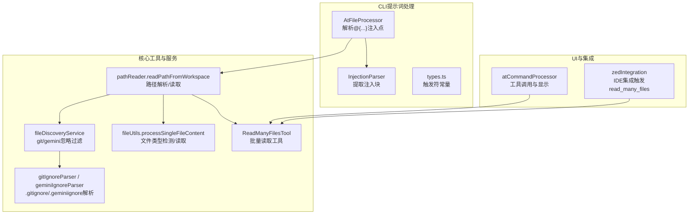
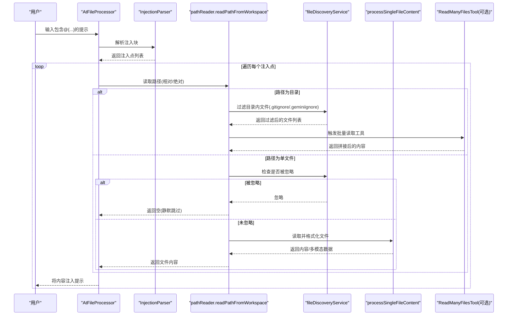
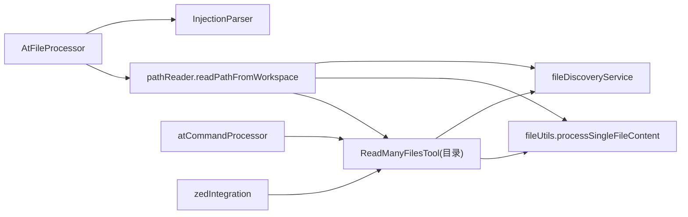

# At命令 (@)

<cite>
**本文引用的文件**
- [packages/cli/src/services/prompt-processors/atFileProcessor.ts](file://packages/cli/src/services/prompt-processors/atFileProcessor.ts)
- [packages/cli/src/services/prompt-processors/injectionParser.ts](file://packages/cli/src/services/prompt-processors/injectionParser.ts)
- [packages/cli/src/services/prompt-processors/types.ts](file://packages/cli/src/services/prompt-processors/types.ts)
- [packages/core/src/utils/pathReader.ts](file://packages/core/src/utils/pathReader.ts)
- [packages/core/src/utils/fileUtils.ts](file://packages/core/src/utils/fileUtils.ts)
- [packages/core/src/tools/read-many-files.ts](file://packages/core/src/tools/read-many-files.ts)
- [packages/core/src/services/fileDiscoveryService.ts](file://packages/core/src/services/fileDiscoveryService.ts)
- [packages/core/src/utils/gitIgnoreParser.ts](file://packages/core/src/utils/gitIgnoreParser.ts)
- [packages/core/src/utils/geminiIgnoreParser.ts](file://packages/core/src/utils/geminiIgnoreParser.ts)
- [packages/core/src/utils/filesearch/ignore.test.ts](file://packages/core/src/utils/filesearch/ignore.test.ts)
- [packages/core/src/services/fileDiscoveryService.test.ts](file://packages/core/src/services/fileDiscoveryService.test.ts)
- [packages/cli/src/ui/hooks/atCommandProcessor.ts](file://packages/cli/src/ui/hooks/atCommandProcessor.ts)
- [packages/cli/src/zed-integration/zedIntegration.ts](file://packages/cli/src/zed-integration/zed-integration.ts)
- [docs/cli/gemini-ignore.md](file://docs/cli/gemini-ignore.md)
- [integration-tests/read_many_files.test.ts](file://integration-tests/read_many_files.test.ts)
</cite>

## 目录
1. [简介](#简介)
2. [项目结构](#项目结构)
3. [核心组件](#核心组件)
4. [架构总览](#架构总览)
5. [详细组件分析](#详细组件分析)
6. [依赖关系分析](#依赖关系分析)
7. [性能考量](#性能考量)
8. [故障排查指南](#故障排查指南)
9. [结论](#结论)
10. [附录：使用场景与最佳实践](#附录使用场景与最佳实践)

## 简介
At命令（@）用于在提示词中以“@<路径>”语法将本地文件或目录的内容注入到AI提示中。该机制通过两层处理器协作完成：
- 提示词预处理阶段：解析“@{...}”注入点，定位路径并读取内容。
- 工具执行阶段：当路径指向目录时，系统会调用“read_many_files”工具进行批量读取；当路径指向单个文件时，直接按文件类型处理并注入到提示中。

本文件将深入解释其内部机制，包括路径解析、内容读取、git-aware过滤逻辑、与“.gitignore/.geminiignore”的交互、错误处理策略、性能考量（尤其是大文件处理），以及在上下文管理中的作用与对token消耗的影响。

## 项目结构
围绕At命令的关键模块分布如下：
- CLI侧提示词处理器：负责解析“@{...}”，调用工作区读取器，将文件/目录内容注入提示。
- 核心工具与服务：提供路径解析、文件发现与过滤、文件类型检测与内容读取、批量读取工具等能力。
- UI与集成：在交互式界面与IDE集成中，将工具调用结果以历史项形式展示，并在错误时回退为占位符。

图表来源
- [packages/cli/src/services/prompt-processors/atFileProcessor.ts](file://packages/cli/src/services/prompt-processors/atFileProcessor.ts#L1-L99)
- [packages/cli/src/services/prompt-processors/injectionParser.ts](file://packages/cli/src/services/prompt-processors/injectionParser.ts#L1-L89)
- [packages/cli/src/services/prompt-processors/types.ts](file://packages/cli/src/services/prompt-processors/types.ts#L39-L55)
- [packages/core/src/utils/pathReader.ts](file://packages/core/src/utils/pathReader.ts#L22-L117)
- [packages/core/src/services/fileDiscoveryService.ts](file://packages/core/src/services/fileDiscoveryService.ts#L47-L100)
- [packages/core/src/utils/fileUtils.ts](file://packages/core/src/utils/fileUtils.ts#L345-L518)
- [packages/core/src/tools/read-many-files.ts](file://packages/core/src/tools/read-many-files.ts#L1-L120)
- [packages/core/src/utils/gitIgnoreParser.ts](file://packages/core/src/utils/gitIgnoreParser.ts#L1-L52)
- [packages/cli/src/ui/hooks/atCommandProcessor.ts](file://packages/cli/src/ui/hooks/atCommandProcessor.ts#L523-L617)
- [packages/cli/src/zed-integration/zedIntegration.ts](file://packages/cli/src/zed-integration/zedIntegration.ts#L566-L583)

章节来源
- [packages/cli/src/services/prompt-processors/atFileProcessor.ts](file://packages/cli/src/services/prompt-processors/atFileProcessor.ts#L1-L99)
- [packages/core/src/utils/pathReader.ts](file://packages/core/src/utils/pathReader.ts#L22-L117)

## 核心组件
- AtFileProcessor：解析提示中的“@{...}”注入点，调用工作区读取器读取文件/目录内容，将文本或多模态内容注入提示；若路径被忽略则静默跳过，否则在UI中输出信息或错误。
- InjectionParser：通用注入块解析器，支持嵌套大括号计数，严格校验闭合，抛出明确的语法错误。
- pathReader.readPathFromWorkspace：解析相对/绝对路径，定位首个存在的文件或目录；目录读取时递归列出文件并通过文件发现服务应用git/gemini忽略规则；单文件读取时先检查忽略再处理。
- fileDiscoveryService：统一的文件过滤接口，支持分别或联合尊重.gitignore与.geminiignore。
- fileUtils.processSingleFileContent：按文件类型（文本/图片/PDF/音频/视频/二进制/SVG）读取与格式化，含大小限制、行数截断、BOM处理等。
- ReadManyFilesTool：批量读取工具，支持glob模式、默认排除、忽略规则、安全边界检查、并发处理与汇总展示。
- UI钩子与IDE集成：在交互式界面中记录工具调用历史，在IDE中根据资源链接触发read_many_files。

章节来源
- [packages/cli/src/services/prompt-processors/atFileProcessor.ts](file://packages/cli/src/services/prompt-processors/atFileProcessor.ts#L1-L99)
- [packages/cli/src/services/prompt-processors/injectionParser.ts](file://packages/cli/src/services/prompt-processors/injectionParser.ts#L1-L89)
- [packages/core/src/utils/pathReader.ts](file://packages/core/src/utils/pathReader.ts#L22-L117)
- [packages/core/src/services/fileDiscoveryService.ts](file://packages/core/src/services/fileDiscoveryService.ts#L47-L100)
- [packages/core/src/utils/fileUtils.ts](file://packages/core/src/utils/fileUtils.ts#L345-L518)
- [packages/core/src/tools/read-many-files.ts](file://packages/core/src/tools/read-many-files.ts#L1-L120)
- [packages/cli/src/ui/hooks/atCommandProcessor.ts](file://packages/cli/src/ui/hooks/atCommandProcessor.ts#L523-L617)
- [packages/cli/src/zed-integration/zedIntegration.ts](file://packages/cli/src/zed-integration/zedIntegration.ts#L566-L583)

## 架构总览
下图展示了从用户输入到模型提示的端到端流程，重点标注了At命令的注入点、路径解析、过滤与读取步骤。

图表来源
- [packages/cli/src/services/prompt-processors/atFileProcessor.ts](file://packages/cli/src/services/prompt-processors/atFileProcessor.ts#L1-L99)
- [packages/cli/src/services/prompt-processors/injectionParser.ts](file://packages/cli/src/services/prompt-processors/injectionParser.ts#L1-L89)
- [packages/core/src/utils/pathReader.ts](file://packages/core/src/utils/pathReader.ts#L22-L117)
- [packages/core/src/services/fileDiscoveryService.ts](file://packages/core/src/services/fileDiscoveryService.ts#L47-L100)
- [packages/core/src/utils/fileUtils.ts](file://packages/core/src/utils/fileUtils.ts#L345-L518)
- [packages/core/src/tools/read-many-files.ts](file://packages/core/src/tools/read-many-files.ts#L149-L210)

## 详细组件分析

### 组件A：AtFileProcessor（提示词注入处理器）
- 功能要点
  - 解析提示中的“@{...}”注入点，支持嵌套大括号。
  - 对每个注入点调用工作区读取器，返回文本片段或多模态内容。
  - 若文件被忽略（由.gitignore或.geminiignore），在UI中输出信息但不报错；若读取失败，保留原始占位符并在UI中输出错误。
- 错误处理
  - 未闭合注入块：抛出明确的语法错误。
  - 路径不存在：抛出错误，UI显示失败信息并保留占位符。
  - 路径在工作区外：抛出错误，UI显示失败信息并保留占位符。
- 性能影响
  - 单文件注入仅读取目标文件；目录注入会触发批量读取工具，可能引入较多token。

章节来源
- [packages/cli/src/services/prompt-processors/atFileProcessor.ts](file://packages/cli/src/services/prompt-processors/atFileProcessor.ts#L1-L99)
- [packages/cli/src/services/prompt-processors/injectionParser.ts](file://packages/cli/src/services/prompt-processors/injectionParser.ts#L1-L89)

### 组件B：InjectionParser（注入块解析器）
- 功能要点
  - 基于大括号计数法提取注入块，支持嵌套。
  - 对未闭合注入块抛出明确错误，包含起始索引与上下文信息。
- 复杂度
  - 时间复杂度O(n)，空间复杂度O(k)（k为注入块数量）。

章节来源
- [packages/cli/src/services/prompt-processors/injectionParser.ts](file://packages/cli/src/services/prompt-processors/injectionParser.ts#L1-L89)
- [packages/cli/src/services/prompt-processors/types.ts](file://packages/cli/src/services/prompt-processors/types.ts#L39-L55)

### 组件C：pathReader.readPathFromWorkspace（路径解析与读取）
- 功能要点
  - 绝对路径：校验是否在工作区范围内。
  - 相对路径：按工作区目录优先级逐一尝试，找到第一个存在的路径。
  - 目录：递归列出文件，应用过滤规则，逐个读取并拼接；单文件：先检查忽略再读取。
- 安全性
  - 严格的工作区边界检查，防止越界访问。
- 过滤逻辑
  - 目录读取时使用glob递归扫描，随后通过文件发现服务应用.gitignore与.geminiignore规则。

章节来源
- [packages/core/src/utils/pathReader.ts](file://packages/core/src/utils/pathReader.ts#L22-L117)
- [packages/core/src/services/fileDiscoveryService.ts](file://packages/core/src/services/fileDiscoveryService.ts#L47-L100)

### 组件D：fileDiscoveryService（文件发现与过滤）
- 功能要点
  - 支持分别或联合尊重.gitignore与.geminiignore。
  - 提供过滤报告（忽略数量）与单文件忽略判断。
- 与.gitignore/.geminiignore的关系
  - 当同时启用时，联合过滤；单独关闭任一开关可绕过对应忽略规则。

章节来源
- [packages/core/src/services/fileDiscoveryService.ts](file://packages/core/src/services/fileDiscoveryService.ts#L47-L100)
- [packages/core/src/utils/gitIgnoreParser.ts](file://packages/core/src/utils/gitIgnoreParser.ts#L1-L52)
- [packages/core/src/utils/geminiIgnoreParser.ts](file://packages/core/src/utils/geminiIgnoreParser.ts#L1-L52)

### 组件E：processSingleFileContent（文件读取与格式化）
- 功能要点
  - 文件类型检测：文本、图片、PDF、音频、视频、二进制、SVG。
  - 文本：BOM感知读取、行数截断、行长限制、范围截断标记。
  - 大小限制：超过阈值（例如20MB）的文件拒绝读取。
  - 多模态：图片/PDF/音频以base64内联数据形式返回。
- 性能与token影响
  - 截断与范围选择减少token占用；二进制文件默认跳过，避免无意义token膨胀。

章节来源
- [packages/core/src/utils/fileUtils.ts](file://packages/core/src/utils/fileUtils.ts#L345-L518)

### 组件F：ReadManyFilesTool（批量读取工具）
- 功能要点
  - 支持glob模式、默认排除、忽略规则、安全边界检查、并发处理与汇总展示。
  - 对非文本资产（图像/PDF/音频）仅当显式请求时才读取。
- UI与历史记录
  - 在交互式界面中生成工具组历史项，包含成功/失败信息与摘要。

章节来源
- [packages/core/src/tools/read-many-files.ts](file://packages/core/src/tools/read-many-files.ts#L149-L210)
- [packages/cli/src/ui/hooks/atCommandProcessor.ts](file://packages/cli/src/ui/hooks/atCommandProcessor.ts#L523-L617)

### 组件G：IDE集成与资源链接
- 功能要点
  - IDE侧收到目录资源链接时，直接构建并调用read_many_files工具，确保批量读取一致行为。
- 与At命令的一致性
  - 两者共享相同的过滤与读取逻辑，保证跨环境一致性。

章节来源
- [packages/cli/src/zed-integration/zedIntegration.ts](file://packages/cli/src/zed-integration/zedIntegration.ts#L566-L583)

## 依赖关系分析
- AtFileProcessor依赖InjectionParser与pathReader，间接依赖fileDiscoveryService与fileUtils。
- pathReader依赖fileDiscoveryService与fileUtils，以及glob与fs。
- ReadManyFilesTool依赖fileDiscoveryService、fileUtils、glob与配置。
- UI钩子与IDE集成依赖工具注册表与ReadManyFilesTool。

图表来源
- [packages/cli/src/services/prompt-processors/atFileProcessor.ts](file://packages/cli/src/services/prompt-processors/atFileProcessor.ts#L1-L99)
- [packages/cli/src/services/prompt-processors/injectionParser.ts](file://packages/cli/src/services/prompt-processors/injectionParser.ts#L1-L89)
- [packages/core/src/utils/pathReader.ts](file://packages/core/src/utils/pathReader.ts#L22-L117)
- [packages/core/src/services/fileDiscoveryService.ts](file://packages/core/src/services/fileDiscoveryService.ts#L47-L100)
- [packages/core/src/utils/fileUtils.ts](file://packages/core/src/utils/fileUtils.ts#L345-L518)
- [packages/core/src/tools/read-many-files.ts](file://packages/core/src/tools/read-many-files.ts#L149-L210)
- [packages/cli/src/ui/hooks/atCommandProcessor.ts](file://packages/cli/src/ui/hooks/atCommandProcessor.ts#L523-L617)
- [packages/cli/src/zed-integration/zedIntegration.ts](file://packages/cli/src/zed-integration/zedIntegration.ts#L566-L583)

## 性能考量
- 大文件处理
  - 文本文件：默认最大行数与行长限制，超出则截断并提示；建议使用范围参数或更精确的路径缩小范围。
  - 图像/PDF/音频：默认不自动读取，除非显式包含扩展名或文件名；避免不必要的token膨胀。
  - 目录读取：glob递归扫描可能产生大量文件，建议配合.gitignore/.geminiignore与显式glob模式限制范围。
- token消耗
  - 批量读取会显著增加token；建议仅注入必要文件，或使用更细粒度的路径。
  - 截断与范围选择有助于控制上下文长度。
- 并发与I/O
  - 批量读取采用并发处理，注意磁盘与网络带宽；在大仓库中建议分批或限定glob模式。

[本节为通用指导，无需具体文件来源]

## 故障排查指南
- 语法错误（未闭合注入块）
  - 现象：解析阶段抛出错误，提示“未闭合注入”。
  - 排查：检查“@{...}”是否成对闭合，避免在内容中出现不平衡的大括号。
- 路径不存在或不在工作区内
  - 现象：读取阶段抛出错误，UI显示失败并保留占位符。
  - 排查：确认路径是否存在于工作区目录，相对路径是否正确；绝对路径需在允许的工作区范围内。
- 文件被忽略
  - 现象：目录注入时UI提示被忽略；单文件注入时静默跳过。
  - 排查：检查.gitignore与.geminiignore规则，必要时调整忽略规则或使用显式路径。
- 权限不足
  - 现象：读取失败，返回错误信息。
  - 排查：检查文件权限与所在目录权限，确保运行环境具备读取权限。
- 大文件超限
  - 现象：超过大小限制的文件被拒绝读取。
  - 排查：使用更小的文件或分批读取；对图像/PDF/音频等非文本资产，仅在显式包含时读取。

章节来源
- [packages/cli/src/services/prompt-processors/atFileProcessor.ts](file://packages/cli/src/services/prompt-processors/atFileProcessor.ts#L1-L99)
- [packages/core/src/utils/fileUtils.ts](file://packages/core/src/utils/fileUtils.ts#L345-L518)
- [packages/core/src/utils/filesearch/ignore.test.ts](file://packages/core/src/utils/filesearch/ignore.test.ts#L68-L160)
- [packages/core/src/services/fileDiscoveryService.test.ts](file://packages/core/src/services/fileDiscoveryService.test.ts#L253-L290)

## 结论
At命令通过“@{...}”语法将本地文件/目录内容安全地注入到提示中，结合git-aware过滤与文件类型处理，既保证了上下文的有效性，又控制了token消耗。对于目录注入，系统会调用批量读取工具，确保一致的行为与可观测的历史记录。合理使用忽略规则与glob模式，可在保证上下文完整性的同时优化性能与安全性。

[本节为总结，无需具体文件来源]

## 附录：使用场景与最佳实践

### 使用场景
- 引用单个文件：@{src/main.ts}
- 引用整个目录：@{docs/}
- 引用特定文件模式：@{src/**/*.ts}

### 最佳实践
- 明确忽略规则：在项目根创建.geminiignore，避免无意注入敏感或大型文件。
- 控制上下文规模：优先使用更精确的glob模式与相对路径，避免一次性注入过多文件。
- 处理大文件：对图像/PDF/音频等非文本资产，仅在显式包含时读取；对文本文件使用范围参数或分段读取。
- 错误回退：当注入失败时，保留占位符便于后续修正；在UI中查看历史项了解失败原因。

### 与.gitignore/.geminiignore的交互
- 默认情况下，两者共同生效；可通过工具参数关闭任一忽略规则。
- .geminiignore支持否定模式（!）以解除.gitignore的忽略，实现更灵活的覆盖。

章节来源
- [docs/cli/gemini-ignore.md](file://docs/cli/gemini-ignore.md#L1-L72)
- [packages/core/src/utils/filesearch/ignore.test.ts](file://packages/core/src/utils/filesearch/ignore.test.ts#L68-L160)
- [packages/core/src/services/fileDiscoveryService.test.ts](file://packages/core/src/services/fileDiscoveryService.test.ts#L253-L290)

### 与read_many_files工具的关联
- 目录注入与批量读取工具共享同一过滤与读取逻辑，确保跨环境一致性。
- 集成测试验证了工具调用与输出行为。

章节来源
- [packages/core/src/tools/read-many-files.ts](file://packages/core/src/tools/read-many-files.ts#L149-L210)
- [integration-tests/read_many_files.test.ts](file://integration-tests/read_many_files.test.ts#L1-L50)