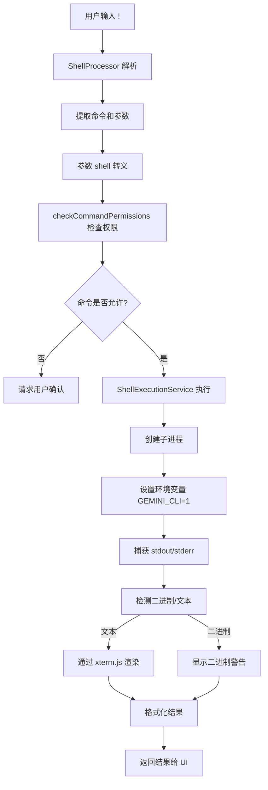
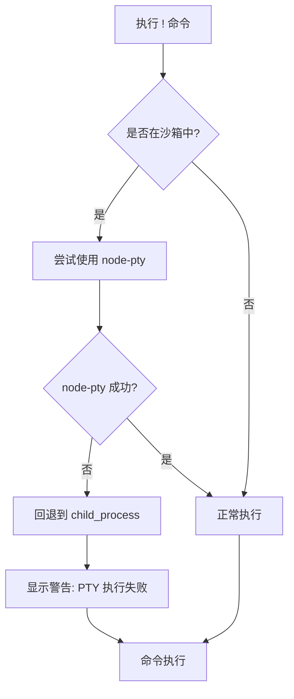
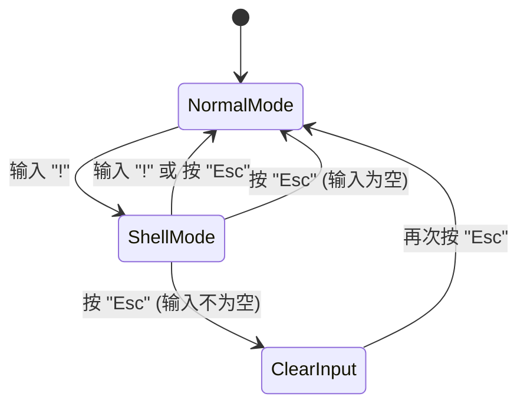

# Shell命令 (!)

<cite>
**本文档引用的文件**
- [shellProcessor.ts](file://packages/cli/src/services/prompt-processors/shellProcessor.ts)
- [shellProcessor.test.ts](file://packages/cli/src/services/prompt-processors/shellProcessor.test.ts)
- [shell.ts](file://packages/core/src/tools/shell.ts)
- [shell.test.ts](file://packages/core/src/tools/shell.test.ts)
- [shellExecutionService.ts](file://packages/core/src/services/shellExecutionService.ts)
- [shellExecutionService.test.ts](file://packages/core/src/services/shellExecutionService.test.ts)
- [shell-utils.ts](file://packages/core/src/utils/shell-utils.ts)
- [shellCommandProcessor.ts](file://packages/cli/src/ui/hooks/shellCommandProcessor.ts)
- [commands.md](file://docs/cli/commands.md)
- [shell-mode.md](file://docs/cli/shell-mode.md)
</cite>

## 目录
1. [简介](#简介)
2. [命令用法](#命令用法)
3. [执行流程](#执行流程)
4. [跨平台注意事项](#跨平台注意事项)
5. [安全与沙箱模式](#安全与沙箱模式)
6. [Shell模式下的用户界面](#shell模式下的用户界面)
7. [故障排除](#故障排除)
8. [结论](#结论)

## 简介

`!` 命令是 Gemini CLI 中一个强大的功能，它允许用户直接与系统 shell 交互。该命令有两种主要用法：一是执行单条 shell 命令（`!<command>`），二是切换到交互式的 Shell 模式（`!`）。此功能通过 `shellProcessor` 解析输入，调用底层的 `shell` 工具来执行子进程，并处理其输入输出。在执行过程中，会设置 `GEMINI_CLI=1` 环境变量，以便被调用的脚本或工具能够识别其运行环境。

**Section sources**
- [commands.md](file://docs/cli/commands.md#L323-L354)

## 命令用法

### 单条命令执行 (`!<command>`)

使用 `!<command>` 语法可以执行单条 shell 命令。命令执行后，控制权会立即返回给 Gemini CLI。

```bash
!ls -la
!git status
```

### 切换 Shell 模式 (`!`)

输入单独的 `!` 可以切换到 Shell 模式。在此模式下，用户输入的每一行都会被当作 shell 命令直接执行，直到用户再次输入 `!` 或按 `Esc` 键退出该模式。

```bash
!
# 现在处于 Shell 模式
pwd
echo "Hello from shell mode"
# 输入 ! 或 Esc 退出
!
```

**Section sources**
- [commands.md](file://docs/cli/commands.md#L323-L347)

## 执行流程

`!` 命令的执行流程涉及多个核心组件的协作。

### 1. 输入解析与预处理

当用户输入以 `!` 开头的内容时，`ShellProcessor` 负责解析该输入。它会识别 `!{...}` 语法中的命令，并处理其中的参数注入（如 `{{args}}`）。在执行前，参数会被适当地进行 shell 转义，以防止注入攻击。

### 2. 权限检查与确认

在执行命令前，系统会进行严格的安全检查。`checkCommandPermissions` 函数会解析命令，提取出根命令（root command），并根据配置的 `coreTools`（允许列表）和 `excludeTools`（拒绝列表）来判断该命令是否被允许执行。如果命令未被明确允许，系统会要求用户进行确认。

### 3. 命令执行

命令的执行由 `ShellExecutionService` 统一管理。该服务会根据系统平台选择合适的执行方式：
- **Linux/macOS**: 使用 `bash -c <command>`。
- **Windows**: 使用 `powershell.exe -NoProfile -Command <command>`。

执行时，会创建一个子进程，并通过 `node-pty`（首选）或 `child_process`（备用）来管理。子进程的环境变量会被清理，但会保留必要的变量（如 `PATH`），并设置 `GEMINI_CLI=1`。

### 4. 输出处理

执行过程中，`ShellExecutionService` 会实时捕获子进程的输出（stdout 和 stderr）。输出流会被分析以检测是否为二进制数据。如果是文本，它会通过 `xterm.js` 进行渲染，以保留 ANSI 颜色和格式。最终的输出结果会包含命令本身、工作目录、输出内容、退出码等详细信息，并返回给上层组件。



**Diagram sources**
- [shellProcessor.ts](file://packages/cli/src/services/prompt-processors/shellProcessor.ts#L54-L215)
- [shell.ts](file://packages/core/src/tools/shell.ts#L132-L378)
- [shellExecutionService.ts](file://packages/core/src/services/shellExecutionService.ts#L221-L800)

**Section sources**
- [shellProcessor.ts](file://packages/cli/src/services/prompt-processors/shellProcessor.ts#L54-L215)
- [shell.ts](file://packages/core/src/tools/shell.ts#L132-L378)
- [shellExecutionService.ts](file://packages/core/src/services/shellExecutionService.ts#L221-L800)

## 跨平台注意事项

`!` 命令在不同操作系统上的行为略有差异，主要体现在 shell 的选择和命令语法上。

### Linux/macOS

- **默认 shell**: `bash`
- **执行方式**: `bash -c <command>`
- **后台进程**: 使用 `&` 符号启动后台进程。
- **环境变量**: 使用 `$VAR` 语法。

### Windows

- **默认 shell**: `powershell.exe`
- **执行方式**: `powershell.exe -NoProfile -Command <command>`
- **后台进程**: 使用 `Start-Process -NoNewWindow` 或 `Start-Job`。
- **环境变量**: 使用 `$env:VAR` 语法。

**Section sources**
- [shell.ts](file://packages/core/src/tools/shell.ts#L391-L410)
- [shell-utils.ts](file://packages/core/src/utils/shell-utils.ts#L424-L451)

## 安全与沙箱模式

由于 `!` 命令直接执行系统命令，因此存在潜在的安全风险。Gemini CLI 通过多种机制来限制其权限。

### 权限控制

- **允许列表 (Allowlist)**: 可以通过 `--allowed-tools` 标志或配置文件来指定允许执行的命令。例如，`--allowed-tools=run_shell_command(git)` 只允许执行 `git` 命令。
- **拒绝列表 (Blocklist)**: 可以通过 `excludeTools` 配置项来全局禁用某些命令或工具。
- **YOLO 模式**: 使用 `--yolo` 标志可以跳过所有确认步骤，但这会显著增加安全风险。

### 沙箱模式

沙箱模式通过限制 CLI 的权限来增强安全性。在沙箱模式下，CLI 可能无法访问某些系统资源或执行某些操作。例如，`node-pty` 的执行可能会因沙箱限制而失败，此时系统会自动回退到 `child_process`。



**Diagram sources**
- [shellExecutionService.ts](file://packages/core/src/services/shellExecutionService.ts#L229-L245)
- [shell.ts](file://packages/core/src/tools/shell.ts#L96-L108)

**Section sources**
- [shellExecutionService.ts](file://packages/core/src/services/shellExecutionService.ts#L229-L245)
- [shell.ts](file://packages/core/src/tools/shell.ts#L96-L108)
- [sandbox.md](file://docs/cli/sandbox.md)

## Shell模式下的用户界面

当用户进入 Shell 模式时，UI 会发生显著变化以提供清晰的视觉反馈。

### 状态管理

- **指示器**: UI 会显示一个 "shell mode enabled (esc to disable)" 的指示器，提醒用户当前处于 Shell 模式。
- **焦点管理**: 用户可以使用 `Ctrl+F` 在 Shell 输入框和主输入框之间切换焦点。
- **历史记录**: Shell 模式拥有独立的命令历史记录，可以使用上下箭头键进行导航。

### 退出机制

用户可以通过以下方式退出 Shell 模式：
1. 再次输入 `!`。
2. 按 `Esc` 键。
3. 如果输入为空，第一次按 `Esc` 会显示提示，第二次按 `Esc` 会清空输入并退出。



**Diagram sources**
- [ShellModeIndicator.tsx](file://packages/cli/src/ui/components/ShellModeIndicator.tsx)
- [InputPrompt.tsx](file://packages/cli/src/ui/components/InputPrompt.tsx#L475-L738)
- [shellCommandProcessor.ts](file://packages/cli/src/ui/hooks/shellCommandProcessor.ts)

**Section sources**
- [ShellModeIndicator.tsx](file://packages/cli/src/ui/components/ShellModeIndicator.tsx)
- [InputPrompt.tsx](file://packages/cli/src/ui/components/InputPrompt.tsx#L475-L738)
- [shellCommandProcessor.ts](file://packages/cli/src/ui/hooks/shellCommandProcessor.ts)

## 故障排除

### 命令执行失败

- **原因**: 命令可能因权限不足、语法错误或不在允许列表中而失败。
- **解决方法**: 检查命令语法，确保命令被允许执行，或使用 `--yolo` 模式（不推荐用于生产环境）。

### 输出乱码

- **原因**: 输出可能包含无法正确解码的字符，或为二进制数据。
- **解决方法**: 系统会自动检测二进制输出并显示 `[Binary output detected. Halting stream...]`。对于文本乱码，检查终端的字符编码设置。

### PTY 执行失败

- **原因**: 在沙箱环境中，`node-pty` 可能因权限问题无法启动。
- **解决方法**: 系统会自动回退到 `child_process`，并显示警告信息。这通常不会影响命令的最终执行结果，但可能会影响输出的格式化。

**Section sources**
- [shellExecutionService.ts](file://packages/core/src/services/shellExecutionService.ts#L777-L783)
- [shellProcessor.test.ts](file://packages/cli/src/services/prompt-processors/shellProcessor.test.ts#L477-L491)

## 结论

`!` 命令为 Gemini CLI 提供了强大的系统级交互能力。通过深入理解其执行流程、安全机制和用户界面变化，用户可以更安全、高效地利用这一功能。始终注意在生产环境中谨慎使用，尤其是在涉及敏感操作时，应充分利用允许列表和确认机制来降低风险。