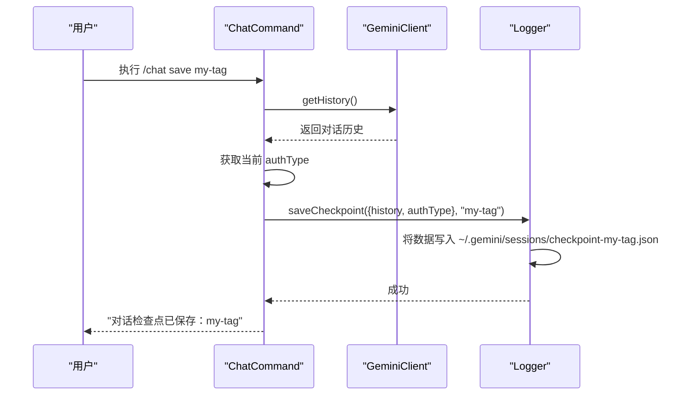
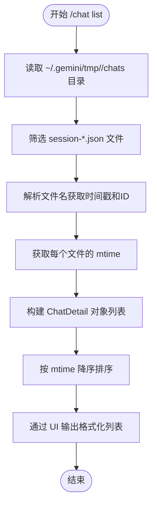
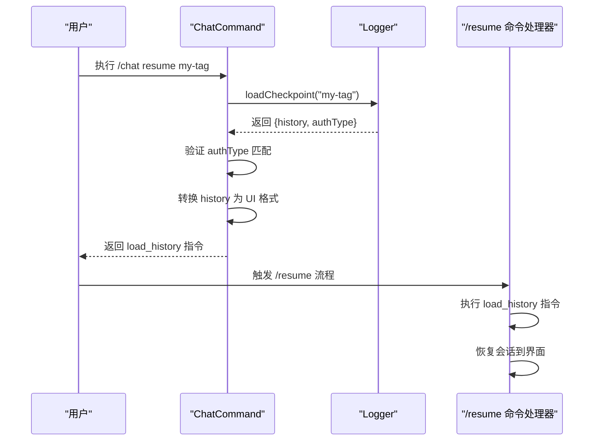
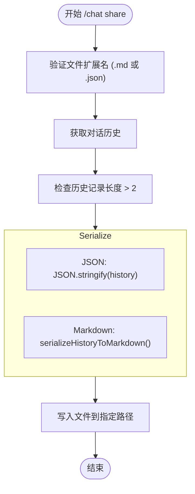

# /chat 命令

<cite>
**本文档中引用的文件**   
- [chatCommand.ts](file://packages/cli/src/ui/commands/chatCommand.ts)
- [chatRecordingService.ts](file://packages/core/src/services/chatRecordingService.ts)
- [sessionSummaryService.ts](file://packages/core/src/services/sessionSummaryService.ts)
- [sessionUtils.ts](file://packages/cli/src/utils/sessionUtils.ts)
</cite>

## 目录
1. [简介](#简介)
2. [核心子命令](#核心子命令)
3. [/chat save 机制](#chat-save-机制)
4. [/chat list 机制](#chat-list-机制)
5. [/chat resume 机制](#chat-resume-机制)
6. [/chat delete 机制](#chat-delete-机制)
7. [/chat share 机制](#chat-share-机制)
8. [会话文件结构与存储](#会话文件结构与存储)
9. [错误处理](#错误处理)

## 简介
`/chat` 命令是 Gemini CLI 中用于管理对话历史的核心功能。它提供了一套子命令，允许用户保存、列出、恢复、删除和分享他们的对话会话。这些会话被持久化存储在用户的本地文件系统中，并可通过标签进行管理。该命令与会话记录和摘要服务紧密集成，以提供丰富的会话元数据和管理功能。

## 核心子命令
`/chat` 命令包含以下五个核心子命令，用于全面的会话管理：

- **/chat save <tag>**: 将当前对话保存为一个带有指定标签的检查点。
- **/chat list**: 列出所有已保存的会话检查点。
- **/chat resume <tag>**: 从指定标签的检查点恢复一个会话。
- **/chat delete <tag>**: 删除指定标签的会话检查点。
- **/chat share <file.md|file.json>**: 将当前对话导出为 Markdown 或 JSON 文件进行分享。

**Section sources**
- [chatCommand.ts](file://packages/cli/src/ui/commands/chatCommand.ts#L382-L394)

## /chat save 机制
`/chat save` 命令触发会话摘要服务以生成元数据并将其持久化到磁盘。

当用户执行 `/chat save <tag>` 时，系统会执行以下流程：
1.  **验证会话内容**：首先检查当前对话历史记录的长度。如果历史记录少于或等于2条消息（通常包含系统上下文），则认为会话为空，不会进行保存。
2.  **获取认证信息**：从配置服务中获取当前的认证类型（`authType`）。
3.  **获取对话历史**：从 `GeminiClient` 中提取完整的对话历史记录。
4.  **调用日志服务**：将包含 `history` 和 `authType` 的检查点对象以及用户提供的 `tag` 传递给 `logger.saveCheckpoint` 方法。
5.  **持久化存储**：`logger` 服务负责将检查点数据（一个包含 `history` 和 `authType` 的 JSON 对象）序列化并写入到 `~/.gemini/sessions` 目录下的一个文件中，文件名基于标签生成。

此机制确保了会话的完整状态（包括消息和认证上下文）被安全地保存。

**Diagram sources **
- [chatCommand.ts](file://packages/cli/src/ui/commands/chatCommand.ts#L124-L137)
- [logger.ts](file://packages/core/src/core/logger.ts#L323-L337)

## /chat list 机制
`/chat list` 命令负责读取会话目录并以格式化的方式输出可用的会话列表。

其工作流程如下：
1.  **确定存储路径**：通过配置服务获取项目的临时目录（`getProjectTempDir`），会话文件存储在该目录下的 `chats` 子目录中。
2.  **读取目录**：使用 `fs.readdir` 读取 `chats` 目录中的所有文件。
3.  **过滤和解析**：筛选出以 `session-` 开头并以 `.json` 结尾的文件。对于每个文件，解析其文件名以提取会话的创建时间戳和会话ID。
4.  **获取文件元数据**：使用 `fs.stat` 获取每个会话文件的最后修改时间（`mtime`）。
5.  **构建会话信息**：为每个有效的会话文件创建一个 `ChatDetail` 对象，其中包含会话的名称（从标签解码而来）和最后修改时间。
6.  **排序和输出**：将会话列表按最后修改时间降序排序，并通过 UI 服务以列表形式展示给用户。

这个过程确保了用户能够看到一个清晰、有序的会话列表。

**Diagram sources **
- [chatCommand.ts](file://packages/cli/src/ui/commands/chatCommand.ts#L30-L66)
- [chatCommand.ts](file://packages/cli/src/ui/commands/chatCommand.ts#L75-L82)

## /chat resume 机制
`/chat resume` 命令与 `/resume` 命令协同工作，用于恢复一个已保存的会话。

其执行流程为：
1.  **加载检查点**：调用 `logger.loadCheckpoint(tag)` 根据提供的标签从磁盘加载检查点数据。
2.  **验证会话存在**：如果加载的对话历史为空，则返回错误，提示未找到该标签的检查点。
3.  **认证类型检查**：比较检查点中保存的 `authType` 与当前会话的 `authType`。如果两者不匹配，会阻止恢复操作，以防止因认证方式不同而导致的潜在问题。
4.  **转换历史记录**：将从检查点加载的原始 `Content[]` 格式的历史记录，转换为 UI 组件可以理解的 `HistoryItemWithoutId[]` 格式。
5.  **返回恢复指令**：返回一个包含转换后历史记录的 `load_history` 指令，该指令被上层命令处理器（如 `/resume`）捕获并执行，从而将整个会话历史加载到当前界面中。

这种设计实现了命令间的解耦，`/chat resume` 负责数据加载和验证，而 `/resume` 负责最终的界面状态恢复。

**Diagram sources **
- [chatCommand.ts](file://packages/cli/src/ui/commands/chatCommand.ts#L171-L230)
- [chatCommand.ts](file://packages/cli/src/ui/commands/chatCommand.ts#L184-L195)

## /chat delete 机制
`/chat delete` 命令用于删除指定标签的会话检查点。

其实现逻辑如下：
1.  **初始化日志服务**：确保 `logger` 服务已正确初始化。
2.  **调用删除方法**：执行 `logger.deleteCheckpoint(tag)`。
3.  **文件系统操作**：`logger` 服务根据标签确定对应的文件路径，并使用 `fs.unlink` 从文件系统中删除该文件。
4.  **返回结果**：根据删除操作的成功与否，返回相应的成功或错误信息给用户。

该机制提供了一种直接且安全的会话清理方式。

**Section sources**
- [chatCommand.ts](file://packages/cli/src/ui/commands/chatCommand.ts#L255-L271)

## /chat share 机制
`/chat share` 命令将当前对话导出为可共享的 Markdown 或 JSON 文件。

其技术细节包括：
1.  **文件格式验证**：检查用户提供的文件路径是否以 `.md` 或 `.json` 结尾，仅支持这两种格式。
2.  **获取对话历史**：与 `save` 命令类似，从 `GeminiClient` 获取完整的对话历史。
3.  **内容序列化**：
    - **JSON 格式**：直接使用 `JSON.stringify(history, null, 2)` 将历史记录序列化为格式化的 JSON 字符串。
    - **Markdown 格式**：调用 `serializeHistoryToMarkdown` 函数，将每条消息转换为带有角色标识（如 `## USER 🧑‍💻`）的 Markdown 标题，并将工具调用和响应渲染为代码块。
4.  **数据脱敏与加密**：根据现有代码分析，`/chat share` 命令本身不执行额外的数据脱敏或加密。它直接导出原始对话内容。任何敏感数据的处理都依赖于上层应用逻辑或用户手动操作。文件以明文形式写入指定路径。
5.  **文件写入**：使用 `fsPromises.writeFile` 将序列化后的内容写入用户指定的文件路径。

**Diagram sources **
- [chatCommand.ts](file://packages/cli/src/ui/commands/chatCommand.ts#L320-L363)

## 会话文件结构与存储
会话文件以 JSON 格式持久化存储，其结构和存储路径遵循特定约定。

### 存储路径
会话文件的存储路径为 `~/.gemini/sessions`。在代码实现中，这对应于项目临时目录下的 `chats` 子目录，完整路径为 `~/.gemini/tmp/<project_hash>/chats/`。

### 会话文件结构
会话文件（`session-*.json`）的 JSON 结构定义在 `ConversationRecord` 接口中，主要包含以下字段：
- **sessionId** (`string`): 会话的唯一 UUID。
- **projectHash** (`string`): 项目根目录的哈希值，用于隔离不同项目的会话。
- **startTime** (`string`): 会话开始的 ISO 时间戳。
- **lastUpdated** (`string`): 会话最后更新的 ISO 时间戳。
- **messages** (`MessageRecord[]`): 消息记录数组。
- **summary** (`string`, 可选): 会话的 AI 生成摘要。

### 消息记录结构
`messages` 数组中的每个 `MessageRecord` 对象包含：
- **id** (`string`): 消息的唯一 UUID。
- **timestamp** (`string`): 消息创建的 ISO 时间戳。
- **content** (`PartListUnion`): 消息内容，可以是文本、函数调用或函数响应。
- **type** (`string`): 消息类型，如 `'user'`, `'gemini'`, `'info'`, `'error'` 等。
- **(gemini 消息特有)**:
    - `toolCalls` (`ToolCallRecord[]`): 该消息中包含的工具调用记录。
    - `thoughts` (`ThoughtSummary[]`): 助手的思考过程摘要。
    - `tokens` (`TokensSummary`): 该消息的令牌使用统计。
    - `model` (`string`): 生成此消息的模型名称。

### 项目作用域会话命名约定
会话文件采用统一的命名约定：`session-<timestamp>-<sessionId前8位>.json`。
- **`<timestamp>`**: 会话创建时间的 ISO 格式时间戳（精确到分钟，冒号被替换为连字符）。
- **`<sessionId前8位>`**: 会话唯一 ID 的前8个字符，用于确保文件名的唯一性。

这种命名方式既保证了时间顺序的可读性，又通过会话ID避免了冲突。

**Section sources**
- [chatRecordingService.ts](file://packages/core/src/services/chatRecordingService.ts#L83-L90)
- [chatRecordingService.ts](file://packages/core/src/services/chatRecordingService.ts#L156-L159)
- [sessionUtils.ts](file://packages/cli/src/utils/sessionUtils.ts#L207-L208)

## 错误处理
`/chat` 命令的各个子命令都实现了完善的错误处理机制，以应对各种异常情况。

### 通用错误处理
- **缺少参数**：所有需要参数的子命令（如 `save`, `resume`, `delete`）都会检查 `args` 是否为空。如果为空，会返回一个明确的错误信息，提示正确的用法（例如 "Missing tag. Usage: /chat save <tag>"）。
- **服务未初始化**：在执行任何文件操作前，会调用 `logger.initialize()` 确保日志服务已准备好。

### /chat save 错误处理
- **会话为空**：如果对话历史记录长度小于等于2（仅包含系统消息），会返回信息 "No conversation found to save."。
- **文件已存在**：如果使用相同标签的检查点已存在，系统会提示用户确认是否覆盖，防止意外覆盖。

### /chat resume 错误处理
- **检查点不存在**：如果指定标签的检查点文件不存在，会返回信息 "No saved checkpoint found with tag: <tag>."。
- **认证类型不匹配**：如果检查点的 `authType` 与当前会话不匹配，会返回错误 "Cannot resume chat. It was saved with a different authentication method..."。

### /chat delete 错误处理
- **检查点不存在**：如果指定标签的检查点文件不存在，会返回错误 "Error: No checkpoint found with tag '<tag>'."。

### /chat share 错误处理
- **无效文件格式**：如果文件扩展名不是 `.md` 或 `.json`，会返回错误 "Invalid file format. Only .md and .json are supported."。
- **会话为空**：与 `save` 命令类似，如果会话为空，则无法分享。
- **文件写入失败**：在 `try-catch` 块中捕获文件写入异常，并将具体的错误信息返回给用户，例如 "Error sharing conversation: [具体错误消息]"。

这些错误处理逻辑确保了命令的健壮性，并为用户提供了清晰的反馈。

**Section sources**
- [chatCommand.ts](file://packages/cli/src/ui/commands/chatCommand.ts#L93-L99)
- [chatCommand.ts](file://packages/cli/src/ui/commands/chatCommand.ts#L133-L145)
- [chatCommand.ts](file://packages/cli/src/ui/commands/chatCommand.ts#L176-L181)
- [chatCommand.ts](file://packages/cli/src/ui/commands/chatCommand.ts#L364-L377)