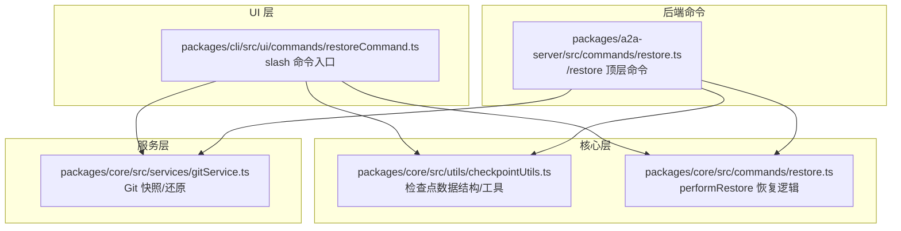
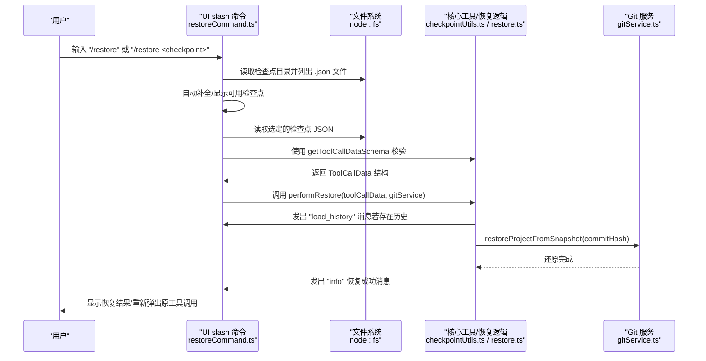
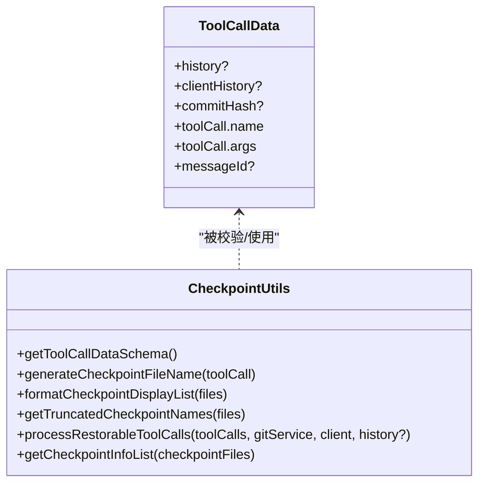
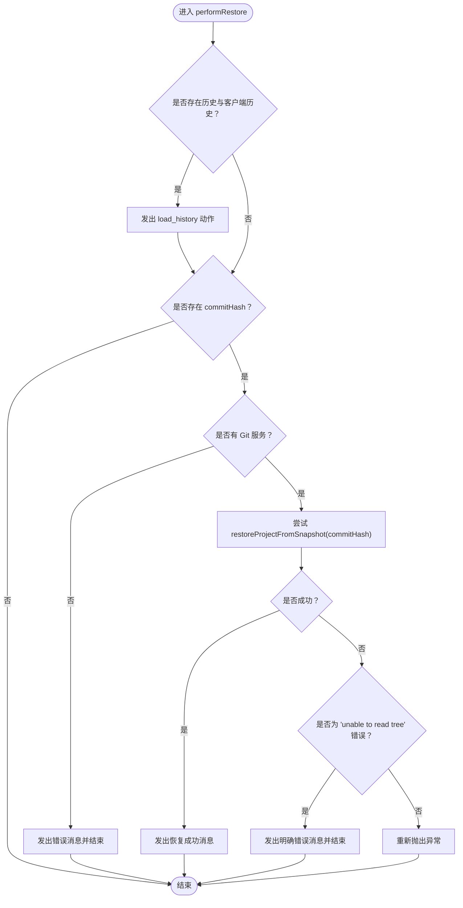
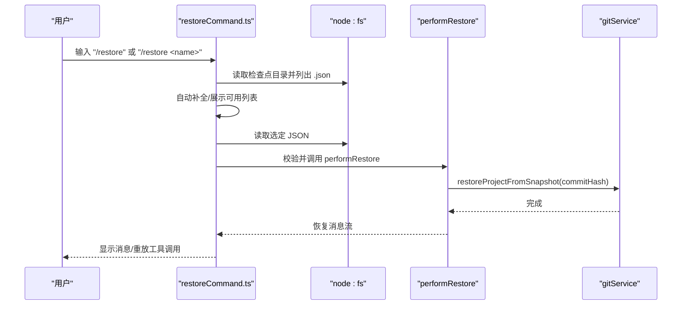
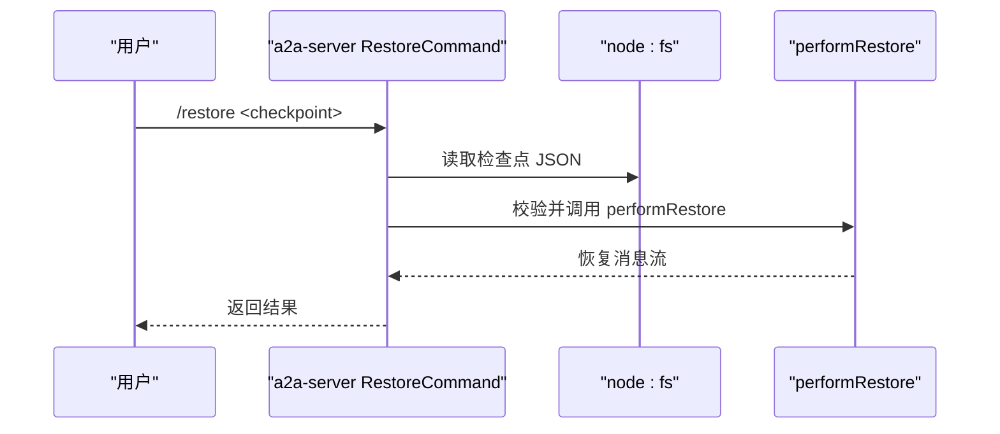
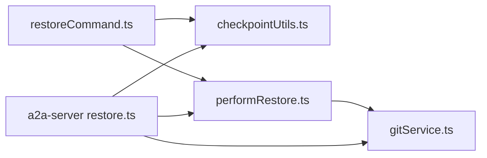

# /restore 命令

<cite>
**本文引用的文件**
- [packages/a2a-server/src/commands/restore.ts](file://packages/a2a-server/src/commands/restore.ts)
- [packages/a2a-server/src/commands/restore.test.ts](file://packages/a2a-server/src/commands/restore.test.ts)
- [packages/cli/src/ui/commands/restoreCommand.ts](file://packages/cli/src/ui/commands/restoreCommand.ts)
- [packages/cli/src/ui/commands/restoreCommand.test.ts](file://packages/cli/src/ui/commands/restoreCommand.test.ts)
- [packages/core/src/commands/restore.ts](file://packages/core/src/commands/restore.ts)
- [packages/core/src/commands/restore.test.ts](file://packages/core/src/commands/restore.test.ts)
- [packages/core/src/utils/checkpointUtils.ts](file://packages/core/src/utils/checkpointUtils.ts)
- [packages/core/src/utils/checkpointUtils.test.ts](file://packages/core/src/utils/checkpointUtils.test.ts)
- [packages/core/src/services/gitService.ts](file://packages/core/src/services/gitService.ts)
- [docs/cli/checkpointing.md](file://docs/cli/checkpointing.md)
</cite>

## 目录
1. [简介](#简介)
2. [项目结构](#项目结构)
3. [核心组件](#核心组件)
4. [架构总览](#架构总览)
5. [详细组件分析](#详细组件分析)
6. [依赖关系分析](#依赖关系分析)
7. [性能考量](#性能考量)
8. [故障排查指南](#故障排查指南)
9. [结论](#结论)
10. [附录](#附录)

## 简介
本文件全面文档化 /restore 命令，重点说明其检查点与文件恢复机制。内容涵盖：
- 如何通过 checkpointUtils 识别自会话开始以来被 AI 修改过的文件，并与原始版本进行对比
- /restore 执行时的用户交互流程（列出可用检查点、选择性恢复）
- 检查点数据的存储位置与格式
- 与文件系统工具（Git）的集成方式，确保恢复操作的原子性与安全性
- 使用场景示例（如回滚不成功的代码重构）

## 项目结构
/restore 命令在不同层实现：
- UI 层：CLI 中的 slash 命令入口，负责交互与自动补全
- 核心层：通用的恢复逻辑与检查点数据结构定义
- 服务层：Git 服务封装，提供快照创建与项目还原能力
- 文档：官方 checkpointing 文档说明了检查点的来源、存储与使用方式

图表来源
- [packages/cli/src/ui/commands/restoreCommand.ts](file://packages/cli/src/ui/commands/restoreCommand.ts#L1-L175)
- [packages/core/src/utils/checkpointUtils.ts](file://packages/core/src/utils/checkpointUtils.ts#L1-L183)
- [packages/core/src/commands/restore.ts](file://packages/core/src/commands/restore.ts#L1-L58)
- [packages/core/src/services/gitService.ts](file://packages/core/src/services/gitService.ts#L92-L137)
- [packages/a2a-server/src/commands/restore.ts](file://packages/a2a-server/src/commands/restore.ts#L1-L156)

章节来源
- [packages/cli/src/ui/commands/restoreCommand.ts](file://packages/cli/src/ui/commands/restoreCommand.ts#L1-L175)
- [packages/core/src/utils/checkpointUtils.ts](file://packages/core/src/utils/checkpointUtils.ts#L1-L183)
- [packages/core/src/commands/restore.ts](file://packages/core/src/commands/restore.ts#L1-L58)
- [packages/core/src/services/gitService.ts](file://packages/core/src/services/gitService.ts#L92-L137)
- [packages/a2a-server/src/commands/restore.ts](file://packages/a2a-server/src/commands/restore.ts#L1-L156)

## 核心组件
- 检查点数据结构与校验
  - ToolCallData 接口定义了历史、客户端历史、提交哈希、工具调用信息等字段
  - getToolCallDataSchema 提供 Zod 校验器，确保 JSON 文件结构正确
- 恢复执行器 performRestore
  - 若存在历史与客户端历史，先发出加载历史消息
  - 若存在 commitHash，则通过 Git 服务还原项目到快照状态
- UI slash 命令
  - 自动补全列出可用检查点
  - 交互式展示可恢复列表，按需读取并验证 JSON
  - 将恢复动作流渲染为 UI 消息或重新触发原工具调用
- 后端 /restore 命令
  - 解析参数，定位检查点文件，读取并校验 JSON
  - 调用 performRestore 并返回结果流

章节来源
- [packages/core/src/utils/checkpointUtils.ts](file://packages/core/src/utils/checkpointUtils.ts#L1-L183)
- [packages/core/src/commands/restore.ts](file://packages/core/src/commands/restore.ts#L1-L58)
- [packages/cli/src/ui/commands/restoreCommand.ts](file://packages/cli/src/ui/commands/restoreCommand.ts#L1-L175)
- [packages/a2a-server/src/commands/restore.ts](file://packages/a2a-server/src/commands/restore.ts#L1-L156)

## 架构总览
下面的序列图展示了从用户输入到恢复完成的完整流程，包括 UI 与后端两种入口。

图表来源
- [packages/cli/src/ui/commands/restoreCommand.ts](file://packages/cli/src/ui/commands/restoreCommand.ts#L35-L138)
- [packages/core/src/utils/checkpointUtils.ts](file://packages/core/src/utils/checkpointUtils.ts#L1-L183)
- [packages/core/src/commands/restore.ts](file://packages/core/src/commands/restore.ts#L1-L58)
- [packages/core/src/services/gitService.ts](file://packages/core/src/services/gitService.ts#L131-L137)

章节来源
- [packages/cli/src/ui/commands/restoreCommand.ts](file://packages/cli/src/ui/commands/restoreCommand.ts#L35-L138)
- [packages/core/src/commands/restore.ts](file://packages/core/src/commands/restore.ts#L1-L58)
- [packages/core/src/services/gitService.ts](file://packages/core/src/services/gitService.ts#L131-L137)

## 详细组件分析

### 组件一：检查点数据结构与校验
- ToolCallData 字段
  - history：会话历史片段（可选）
  - clientHistory：客户端侧对话历史（可选）
  - commitHash：关联的 Git 提交哈希（可选）
  - toolCall：包含 name 与 args 的工具调用信息
  - messageId：用于标识对应的消息（可选）
- 校验器 getToolCallDataSchema
  - 对 history、clientHistory、commitHash、toolCall、messageId 进行严格校验
  - 支持传入自定义 historyItemSchema，以适配不同历史项结构
- 工具函数
  - generateCheckpointFileName：基于时间戳、文件名与工具名生成检查点文件名
  - formatCheckpointDisplayList/getTruncatedCheckpointNames：用于 UI 列表展示
  - processRestorableToolCalls：在工具调用前创建快照与检查点 JSON
  - getCheckpointInfoList：解析目录中的 JSON 文件，提取可恢复信息

图表来源
- [packages/core/src/utils/checkpointUtils.ts](file://packages/core/src/utils/checkpointUtils.ts#L1-L183)

章节来源
- [packages/core/src/utils/checkpointUtils.ts](file://packages/core/src/utils/checkpointUtils.ts#L1-L183)
- [packages/core/src/utils/checkpointUtils.test.ts](file://packages/core/src/utils/checkpointUtils.test.ts#L1-L306)

### 组件二：恢复执行器 performRestore
- 行为
  - 若存在 history 与 clientHistory，先发出 "load_history" 动作，以便 UI 重载历史
  - 若存在 commitHash：
    - 若无 Git 服务，发出错误消息并终止
    - 调用 gitService.restoreProjectFromSnapshot(commitHash)，完成项目还原
    - 成功后发出 "info" 恢复消息；若遇到特定错误（无法读取树），发出明确错误提示
- 错误处理
  - 对于 "unable to read tree" 的错误进行特殊分支处理
  - 其他异常直接抛出，由上层捕获

图表来源
- [packages/core/src/commands/restore.ts](file://packages/core/src/commands/restore.ts#L1-L58)
- [packages/core/src/commands/restore.test.ts](file://packages/core/src/commands/restore.test.ts#L1-L169)
- [packages/core/src/services/gitService.ts](file://packages/core/src/services/gitService.ts#L131-L137)

章节来源
- [packages/core/src/commands/restore.ts](file://packages/core/src/commands/restore.ts#L1-L58)
- [packages/core/src/commands/restore.test.ts](file://packages/core/src/commands/restore.test.ts#L1-L169)
- [packages/core/src/services/gitService.ts](file://packages/core/src/services/gitService.ts#L131-L137)

### 组件三：UI slash 命令交互
- 自动补全
  - 读取检查点目录，过滤 .json 文件，返回截断后的名称列表
- 交互流程
  - 无参数：列出可用检查点
  - 有参数：校验文件存在性与 JSON 结构，调用 performRestore
  - 渲染恢复过程中的消息，必要时重载历史与客户端历史
  - 最终返回原工具调用，允许用户再次执行或调整

图表来源
- [packages/cli/src/ui/commands/restoreCommand.ts](file://packages/cli/src/ui/commands/restoreCommand.ts#L35-L138)
- [packages/core/src/commands/restore.ts](file://packages/core/src/commands/restore.ts#L1-L58)
- [packages/core/src/services/gitService.ts](file://packages/core/src/services/gitService.ts#L131-L137)

章节来源
- [packages/cli/src/ui/commands/restoreCommand.ts](file://packages/cli/src/ui/commands/restoreCommand.ts#L35-L138)
- [packages/cli/src/ui/commands/restoreCommand.test.ts](file://packages/cli/src/ui/commands/restoreCommand.test.ts#L1-L260)

### 组件四：后端 /restore 命令
- 参数处理
  - 若未提供检查点名称，返回错误提示
  - 自动补齐 .json 后缀
- 文件读取与校验
  - 读取检查点 JSON，使用 getToolCallDataSchema 校验
  - 处理文件不存在、JSON 非法、校验失败等情况
- 执行恢复
  - 调用 performRestore，聚合结果流并返回

图表来源
- [packages/a2a-server/src/commands/restore.ts](file://packages/a2a-server/src/commands/restore.ts#L21-L110)
- [packages/a2a-server/src/commands/restore.test.ts](file://packages/a2a-server/src/commands/restore.test.ts#L1-L138)
- [packages/core/src/commands/restore.ts](file://packages/core/src/commands/restore.ts#L1-L58)

章节来源
- [packages/a2a-server/src/commands/restore.ts](file://packages/a2a-server/src/commands/restore.ts#L21-L110)
- [packages/a2a-server/src/commands/restore.test.ts](file://packages/a2a-server/src/commands/restore.test.ts#L1-L138)

## 依赖关系分析
- UI 与核心
  - UI 依赖 checkpointUtils 的校验器与展示工具
  - UI 依赖 performRestore 作为统一恢复执行器
- 核心与服务
  - performRestore 依赖 GitService 的 restoreProjectFromSnapshot
  - GitService 通过 shadow Git 仓库实现隔离快照与还原
- 文档与实现
  - 官方文档明确了检查点的存储位置与命名规则，与实现一致

图表来源
- [packages/cli/src/ui/commands/restoreCommand.ts](file://packages/cli/src/ui/commands/restoreCommand.ts#L1-L175)
- [packages/core/src/utils/checkpointUtils.ts](file://packages/core/src/utils/checkpointUtils.ts#L1-L183)
- [packages/core/src/commands/restore.ts](file://packages/core/src/commands/restore.ts#L1-L58)
- [packages/core/src/services/gitService.ts](file://packages/core/src/services/gitService.ts#L92-L137)
- [packages/a2a-server/src/commands/restore.ts](file://packages/a2a-server/src/commands/restore.ts#L1-L156)

章节来源
- [packages/cli/src/ui/commands/restoreCommand.ts](file://packages/cli/src/ui/commands/restoreCommand.ts#L1-L175)
- [packages/core/src/utils/checkpointUtils.ts](file://packages/core/src/utils/checkpointUtils.ts#L1-L183)
- [packages/core/src/commands/restore.ts](file://packages/core/src/commands/restore.ts#L1-L58)
- [packages/core/src/services/gitService.ts](file://packages/core/src/services/gitService.ts#L92-L137)
- [packages/a2a-server/src/commands/restore.ts](file://packages/a2a-server/src/commands/restore.ts#L1-L156)

## 性能考量
- 恢复过程为异步流式输出，避免一次性阻塞 UI
- 检查点 JSON 体积通常较小，读取与解析开销低
- Git 还原在本地执行，受磁盘与文件数量影响；建议保持项目规模合理
- 自动补全仅列出 .json 文件，减少 IO 开销

## 故障排查指南
- 无法确定 .gemini 目录路径
  - 现象：返回错误消息
  - 处理：确认配置与工作区路径
- 无可用检查点
  - 现象：提示“未找到可恢复的工具调用”
  - 处理：确认已启用 checkpointing 并执行过可恢复的工具调用
- 指定检查点文件不存在
  - 现象：提示“文件未找到”
  - 处理：核对文件名与扩展名
- 检查点 JSON 非法或损坏
  - 现象：提示“检查点文件无效或已损坏”
  - 处理：删除或修复对应 JSON 文件
- Git 服务不可用
  - 现象：提示“未检测到 Git 服务，请确保处于 Git 仓库中”
  - 处理：初始化 Git 仓库或安装 Git
- 提交哈希缺失或不可读
  - 现象：提示“关联的提交哈希在你的 Git 仓库中找不到”
  - 处理：检查仓库状态，避免重置或垃圾回收导致的历史丢失

章节来源
- [packages/cli/src/ui/commands/restoreCommand.ts](file://packages/cli/src/ui/commands/restoreCommand.ts#L35-L138)
- [packages/a2a-server/src/commands/restore.ts](file://packages/a2a-server/src/commands/restore.ts#L21-L110)
- [packages/core/src/commands/restore.ts](file://packages/core/src/commands/restore.ts#L1-L58)

## 结论
/restore 命令通过严格的检查点数据校验与 Git 隔离快照，实现了安全、可控且可逆的文件与会话恢复。UI 与后端命令共享同一套恢复逻辑，保证行为一致性。用户可通过列出与选择检查点，快速回滚到工具调用前的状态，适用于回滚不成功的代码重构等场景。

## 附录

### 使用场景示例
- 回滚不成功的代码重构
  - 步骤：执行工具调用后发现变更不符合预期，使用 /restore 选择对应检查点，恢复项目与历史，重新执行或调整工具调用
- 恢复误删文件
  - 步骤：在工具调用前已创建快照，使用 /restore 还原到快照状态，恢复被删除的文件

章节来源
- [docs/cli/checkpointing.md](file://docs/cli/checkpointing.md#L1-L95)

### 检查点数据存储位置与格式
- 存储位置
  - 项目临时目录下的检查点 JSON 文件：通常位于 ~/.gemini/tmp/<project_hash>/checkpoints
- 文件命名
  - 采用“时间戳-文件名-工具名”的命名规则，便于识别
- JSON 内容
  - 包含工具调用信息、会话历史、客户端历史、提交哈希与消息 ID 等字段

章节来源
- [docs/cli/checkpointing.md](file://docs/cli/checkpointing.md#L32-L40)
- [packages/core/src/utils/checkpointUtils.ts](file://packages/core/src/utils/checkpointUtils.ts#L48-L66)
- [packages/core/src/utils/checkpointUtils.test.ts](file://packages/core/src/utils/checkpointUtils.test.ts#L65-L95)