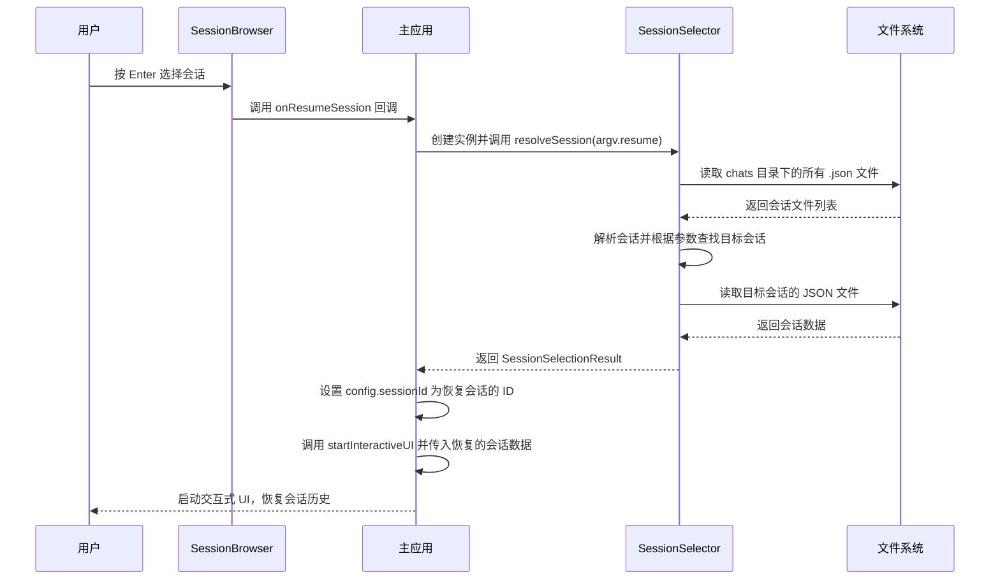

# /resume 命令

<cite>
**本文档引用的文件**   
- [resumeCommand.ts](file://packages/cli/src/ui/commands/resumeCommand.ts)
- [SessionBrowser.tsx](file://packages/cli/src/ui/components/SessionBrowser.tsx)
- [sessionUtils.ts](file://packages/cli/src/utils/sessionUtils.ts)
- [config.ts](file://packages/cli/src/config/config.ts)
- [gemini.tsx](file://packages/cli/src/gemini.tsx)
</cite>

## 目录
1. [简介](#简介)
2. [交互式会话选择界面](#交互式会话选择界面)
3. [会话恢复流程](#会话恢复流程)
4. [SessionBrowser UI 元素](#sessionbrowser-ui-元素)
5. [配置选项](#配置选项)

## 简介
`/resume` 命令是 Gemini CLI 的核心功能之一，允许用户浏览和恢复之前自动保存的对话会话。该命令通过一个交互式的终端界面 `SessionBrowser` 实现，为用户提供了一个直观的方式来管理其对话历史。当用户启动 CLI 并希望继续一个之前的会话时，`/resume` 命令会实例化 `SessionBrowser` 组件，加载所有可用的会话，并提供基于键盘的导航。用户可以选择一个会话，CLI 将加载该会话的快照、恢复上下文并重建完整的对话历史。

**Section sources**
- [resumeCommand.ts](file://packages/cli/src/ui/commands/resumeCommand.ts#L1-L27)

## 交互式会话选择界面
`/resume` 命令的核心是 `SessionBrowser` 组件，它提供了一个全屏的交互式界面，用于浏览和选择会话。当命令被触发时，它会返回一个 `OpenDialogActionReturn` 对象，指示主应用程序打开一个名为 `sessionBrowser` 的对话框。`SessionBrowser` 组件利用 React 和 Ink 库在终端中渲染一个动态的用户界面。

该组件的实现基于一系列自定义的 React Hook，这些 Hook 将复杂的逻辑与 UI 渲染分离。`useSessionBrowserState` Hook 负责管理组件的中心化状态，包括会话列表、用户选择、搜索查询和排序顺序。`useLoadSessions` Hook 在组件挂载时异步加载所有会话文件，并在用户进入搜索模式时加载完整的会话内容以支持全文搜索。`useMoveSelection` 和 `useCycleSortOrder` Hook 分别处理导航和排序逻辑。最后，`useSessionBrowserInput` Hook 是整个交互的核心，它监听用户的键盘输入，并根据当前模式（导航模式或搜索模式）执行相应的操作。

```mermaid
flowchart TD
A[/resume 命令] --> B[返回 OpenDialogActionReturn]
B --> C[主应用打开 sessionBrowser 对话框]
C --> D[实例化 SessionBrowser 组件]
D --> E[调用 useSessionBrowserState]
D --> F[调用 useLoadSessions]
D --> G[调用 useMoveSelection]
D --> H[调用 useCycleSortOrder]
D --> I[调用 useSessionBrowserInput]
E --> J[管理中心化状态]
F --> K[异步加载会话数据]
G --> L[处理上下导航]
H --> M[处理排序循环]
I --> N[监听键盘输入并分发操作]
```

**Diagram sources**
- [resumeCommand.ts](file://packages/cli/src/ui/commands/resumeCommand.ts#L14-L26)
- [SessionBrowser.tsx](file://packages/cli/src/ui/components/SessionBrowser.tsx#L567-L880)

**Section sources**
- [resumeCommand.ts](file://packages/cli/src/ui/commands/resumeCommand.ts#L14-L26)
- [SessionBrowser.tsx](file://packages/cli/src/ui/components/SessionBrowser.tsx#L567-L880)

## 会话恢复流程
当用户在 `SessionBrowser` 中选择一个会话并按 Enter 键后，会触发一个复杂的恢复流程。这个流程始于 `SessionBrowser` 组件的 `onResumeSession` 回调，该回调由其父组件提供。在主应用逻辑中，`/resume` 命令的处理流程与 `--resume` 命令行参数的处理流程是统一的。

首先，`gemini.tsx` 文件中的主函数会解析命令行参数。如果检测到 `argv.resume` 存在，它会创建一个 `SessionSelector` 实例。`SessionSelector` 类是会话管理的核心，它利用 `config` 对象中的项目临时目录来定位存储会话的 `chats` 文件夹。`resolveSession` 方法会根据用户提供的参数（如 "latest"、会话索引或 UUID）来查找并解析目标会话。一旦找到会话，`selectSession` 方法会读取对应的 JSON 文件，将其解析为 `ConversationRecord` 对象，并返回包含会话路径、数据和显示信息的 `SessionSelectionResult`。

最后，主函数将恢复的会话数据传递给 `startInteractiveUI` 函数。该函数会将恢复会话的 `sessionId` 设置到当前的 `config` 对象中，确保后续的交互记录到同一个会话文件中，从而实现上下文的无缝恢复。



**Diagram sources**
- [gemini.tsx](file://packages/cli/src/gemini.tsx#L583-L599)
- [sessionUtils.ts](file://packages/cli/src/utils/sessionUtils.ts#L412-L441)
- [config.ts](file://packages/cli/src/config/config.ts#L67-L68)

**Section sources**
- [gemini.tsx](file://packages/cli/src/gemini.tsx#L583-L599)
- [sessionUtils.ts](file://packages/cli/src/utils/sessionUtils.ts#L412-L441)
- [config.ts](file://packages/cli/src/config/config.ts#L67-L68)

## SessionBrowser UI 元素
`SessionBrowser` 组件提供了丰富的 UI 元素，使用户能够高效地浏览和管理会话。

**会话预览**：每个会话在列表中都以一行的形式显示。行的前缀（`❯` 或空格）表示当前选中的会话。会话的 **显示名称**（`displayName`）通常是对话中的第一条用户消息，经过清理和截断以适应终端宽度。如果会话是当前活动的会话，会显示 `(current)` 标签。

**时间戳显示**：每个会话条目都包含一个 **年龄**（Age）字段，该字段使用 `formatRelativeTime` 函数将 `lastUpdated` 时间戳转换为人类可读的相对时间，如 "2 hours ago" 或 "1d"。这使得用户可以快速判断会话的新旧程度。

**项目标识**：列表中还包含其他关键的项目标识。**索引**（Index）字段显示会话在列表中的位置（如 `#1`），这是用户通过 `--resume` 命令行参数选择会话的依据。**消息数**（Msgs）字段显示该会话中包含的总消息数量，帮助用户评估会话的长度和复杂性。

**搜索与过滤**：用户可以通过按 `/` 键进入搜索模式。在搜索模式下，输入的查询会实时过滤会话列表。匹配不仅发生在会话标题和 ID 上，还会深入到会话的完整内容中。当找到匹配时，UI 会显示一个 **匹配片段**（Match Snippet），突出显示匹配的文本，并用 "You:" 或 "Gemini:" 前缀标明消息的发送者。

```mermaid
flowchart TD
A[SessionBrowser UI] --> B[会话预览]
A --> C[时间戳显示]
A --> D[项目标识]
A --> E[搜索与过滤]
B --> B1[选中状态前缀]
B --> B2[显示名称 (displayName)]
B --> B3[当前会话标签 (current)]
C --> C1[相对时间 (e.g., 2h ago)]
C --> C2[使用 formatRelativeTime 函数]
D --> D1[索引 (Index, #N)]
D --> D2[消息数 (Message Count)]
D --> D3[会话 ID (UUID)]
E --> E1[按 / 进入搜索模式]
E --> E2[实时过滤会话列表]
E --> E3[显示匹配片段]
E --> E4[突出显示匹配文本]
```

**Diagram sources**
- [SessionBrowser.tsx](file://packages/cli/src/ui/components/SessionBrowser.tsx#L420-L528)
- [sessionUtils.ts](file://packages/cli/src/utils/sessionUtils.ts#L155-L187)

**Section sources**
- [SessionBrowser.tsx](file://packages/cli/src/ui/components/SessionBrowser.tsx#L420-L528)
- [sessionUtils.ts](file://packages/cli/src/utils/sessionUtils.ts#L155-L187)

## 配置选项
虽然 `SessionBrowser` 组件本身没有直接的配置选项，但其行为受到 CLI 整体配置的影响。`SessionSelector` 类在加载会话时，会使用 `config.storage.getProjectTempDir()` 来确定会话文件的存储位置。此外，`SessionSelector` 在 `listSessions` 方法中会对会话进行排序，其默认排序依据是会话的 `startTime`（开始时间），按升序排列，这确保了会话索引的稳定性。

用户可以通过 `--resume` 命令行参数来指定要恢复的会话，该参数可以接受 "latest"（最新会话）、会话的 UUID 或列表中的索引号。`config.ts` 文件中的 `parseArguments` 函数负责解析此参数，并通过一个 `coerce` 函数将无值的 `--resume` 转换为 `RESUME_LATEST` 常量。目前，`SessionBrowser` 的每页显示会话数量（`SESSIONS_PER_PAGE`）在代码中被硬编码为 20，且没有提供配置选项来更改此值或默认的排序方式。

**Section sources**
- [sessionUtils.ts](file://packages/cli/src/utils/sessionUtils.ts#L354-L360)
- [config.ts](file://packages/cli/src/config/config.ts#L187-L198)
- [SessionBrowser.tsx](file://packages/cli/src/ui/components/SessionBrowser.tsx#L107)