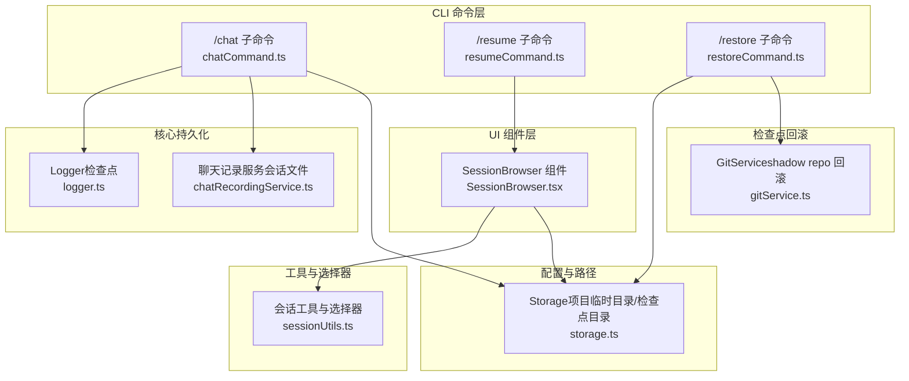
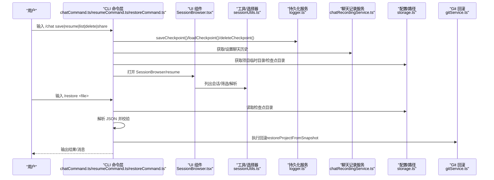
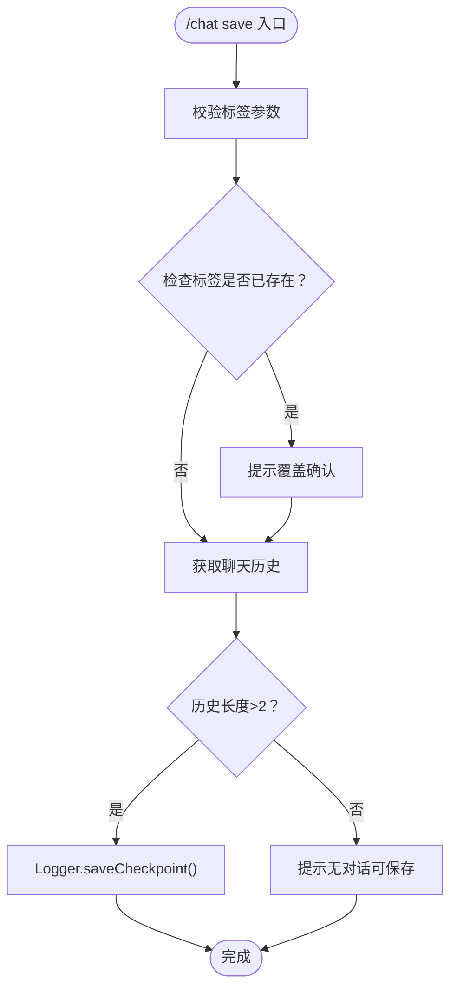
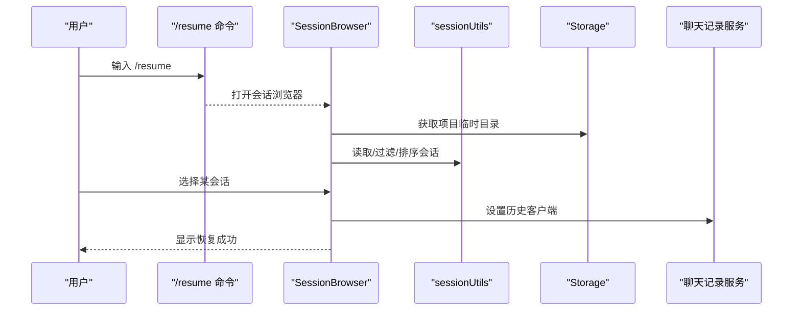
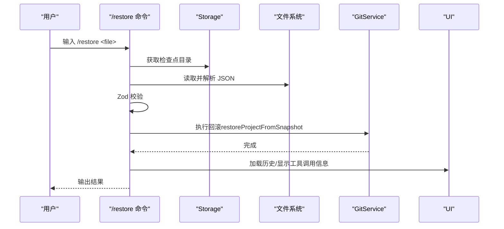
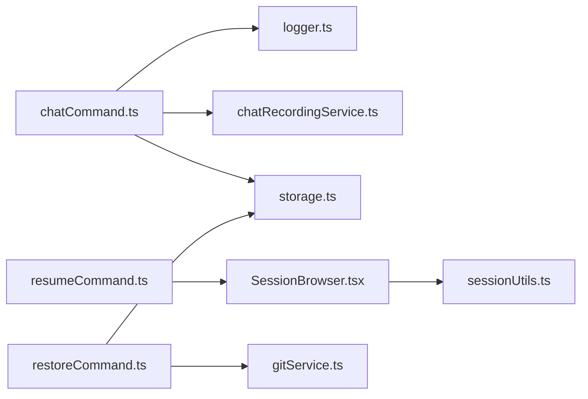

# 会话管理命令

<cite>
**本文引用的文件**
- [packages/cli/src/ui/commands/chatCommand.ts](file://packages/cli/src/ui/commands/chatCommand.ts)
- [packages/cli/src/ui/commands/resumeCommand.ts](file://packages/cli/src/ui/commands/resumeCommand.ts)
- [packages/cli/src/ui/commands/restoreCommand.ts](file://packages/cli/src/ui/commands/restoreCommand.ts)
- [packages/cli/src/ui/components/SessionBrowser.tsx](file://packages/cli/src/ui/components/SessionBrowser.tsx)
- [packages/cli/src/utils/sessionUtils.ts](file://packages/cli/src/utils/sessionUtils.ts)
- [packages/core/src/core/logger.ts](file://packages/core/src/core/logger.ts)
- [packages/core/src/config/storage.ts](file://packages/core/src/config/storage.ts)
- [packages/core/src/services/gitService.ts](file://packages/core/src/services/gitService.ts)
- [packages/core/src/services/chatRecordingService.ts](file://packages/core/src/services/chatRecordingService.ts)
- [docs/cli/session-management.md](file://docs/cli/session-management.md)
</cite>

## 目录
1. [简介](#简介)
2. [项目结构](#项目结构)
3. [核心组件](#核心组件)
4. [架构总览](#架构总览)
5. [详细组件分析](#详细组件分析)
6. [依赖关系分析](#依赖关系分析)
7. [性能考量](#性能考量)
8. [故障排查指南](#故障排查指南)
9. [结论](#结论)
10. [附录](#附录)

## 简介
本文件围绕 CLI 中的会话管理命令进行深入文档化，重点覆盖：
- /chat 子命令族：save、resume（含交互式会话浏览器）、list、delete、share
- /resume 命令：通过 SessionBrowser 提供交互式会话选择
- /restore 命令：基于检查点机制回滚文件变更
并解释它们与核心 session 模块、persistence 服务及 Git 检查点系统的集成关系。同时给出从保存会话到恢复与分享的完整使用流程，并说明会话数据的存储位置、项目作用域限制以及自动保存策略。

## 项目结构
围绕会话管理的关键文件分布如下：
- CLI 命令层：/chat、/resume、/restore 的命令定义与动作处理
- UI 组件层：SessionBrowser 交互式会话浏览
- 工具与选择器：会话列表、筛选、解析与展示
- 核心持久化：Logger（检查点）与 ChatRecordingService（会话记录）
- 配置与路径：Storage（项目临时目录、检查点目录等）
- 检查点回滚：GitService（基于 shadow repo 的文件回滚）

图表来源
- [packages/cli/src/ui/commands/chatCommand.ts](file://packages/cli/src/ui/commands/chatCommand.ts#L1-L395)
- [packages/cli/src/ui/commands/resumeCommand.ts](file://packages/cli/src/ui/commands/resumeCommand.ts#L1-L27)
- [packages/cli/src/ui/commands/restoreCommand.ts](file://packages/cli/src/ui/commands/restoreCommand.ts#L1-L175)
- [packages/cli/src/ui/components/SessionBrowser.tsx](file://packages/cli/src/ui/components/SessionBrowser.tsx#L1-L934)
- [packages/cli/src/utils/sessionUtils.ts](file://packages/cli/src/utils/sessionUtils.ts#L1-L474)
- [packages/core/src/core/logger.ts](file://packages/core/src/core/logger.ts#L300-L469)
- [packages/core/src/config/storage.ts](file://packages/core/src/config/storage.ts#L1-L142)
- [packages/core/src/services/gitService.ts](file://packages/core/src/services/gitService.ts#L1-L137)
- [packages/core/src/services/chatRecordingService.ts](file://packages/core/src/services/chatRecordingService.ts#L137-L461)

章节来源
- [packages/cli/src/ui/commands/chatCommand.ts](file://packages/cli/src/ui/commands/chatCommand.ts#L1-L395)
- [packages/cli/src/ui/commands/resumeCommand.ts](file://packages/cli/src/ui/commands/resumeCommand.ts#L1-L27)
- [packages/cli/src/ui/commands/restoreCommand.ts](file://packages/cli/src/ui/commands/restoreCommand.ts#L1-L175)
- [packages/cli/src/ui/components/SessionBrowser.tsx](file://packages/cli/src/ui/components/SessionBrowser.tsx#L1-L934)
- [packages/cli/src/utils/sessionUtils.ts](file://packages/cli/src/utils/sessionUtils.ts#L1-L474)
- [packages/core/src/core/logger.ts](file://packages/core/src/core/logger.ts#L300-L469)
- [packages/core/src/config/storage.ts](file://packages/core/src/config/storage.ts#L1-L142)
- [packages/core/src/services/gitService.ts](file://packages/core/src/services/gitService.ts#L1-L137)
- [packages/core/src/services/chatRecordingService.ts](file://packages/core/src/services/chatRecordingService.ts#L137-L461)

## 核心组件
- /chat 主命令及其子命令
  - list：列出当前项目下的会话检查点
  - save：将当前对话历史保存为检查点
  - resume：从检查点恢复对话（支持标签补全）
  - delete：删除指定检查点
  - share：导出当前对话为 JSON 或 Markdown 文件
- /resume 主命令
  - 打开 SessionBrowser 进行交互式会话选择
- /restore 主命令
  - 读取项目临时目录中的检查点 JSON，校验格式后执行回滚操作
  - 通过 GitService 将工作区回滚到对应提交状态

章节来源
- [packages/cli/src/ui/commands/chatCommand.ts](file://packages/cli/src/ui/commands/chatCommand.ts#L1-L395)
- [packages/cli/src/ui/commands/resumeCommand.ts](file://packages/cli/src/ui/commands/resumeCommand.ts#L1-L27)
- [packages/cli/src/ui/commands/restoreCommand.ts](file://packages/cli/src/ui/commands/restoreCommand.ts#L1-L175)

## 架构总览
会话管理命令与核心模块的交互关系如下：

图表来源
- [packages/cli/src/ui/commands/chatCommand.ts](file://packages/cli/src/ui/commands/chatCommand.ts#L1-L395)
- [packages/cli/src/ui/commands/resumeCommand.ts](file://packages/cli/src/ui/commands/resumeCommand.ts#L1-L27)
- [packages/cli/src/ui/commands/restoreCommand.ts](file://packages/cli/src/ui/commands/restoreCommand.ts#L1-L175)
- [packages/cli/src/ui/components/SessionBrowser.tsx](file://packages/cli/src/ui/components/SessionBrowser.tsx#L1-L934)
- [packages/cli/src/utils/sessionUtils.ts](file://packages/cli/src/utils/sessionUtils.ts#L1-L474)
- [packages/core/src/core/logger.ts](file://packages/core/src/core/logger.ts#L300-L469)
- [packages/core/src/config/storage.ts](file://packages/core/src/config/storage.ts#L1-L142)
- [packages/core/src/services/gitService.ts](file://packages/core/src/services/gitService.ts#L1-L137)
- [packages/core/src/services/chatRecordingService.ts](file://packages/core/src/services/chatRecordingService.ts#L137-L461)

## 详细组件分析

### /chat 命令族
- list：读取项目临时目录下以“checkpoint-”前缀命名的 JSON 文件，解析时间戳并排序，返回可显示的会话清单。
- save：校验参数与历史长度，初始化 Logger，调用 saveCheckpoint 写入检查点；若同名标签已存在，触发确认覆盖流程。
- resume：校验参数，初始化 Logger，加载检查点；若认证方式不匹配则拒绝恢复；将历史转换为 UI 历史与客户端历史，返回“加载历史”的动作。
- delete：校验参数，初始化 Logger，调用 deleteCheckpoint 删除指定标签的检查点。
- share：解析输出文件路径与扩展名，读取当前聊天历史，序列化为 JSON 或 Markdown 并写入文件。

图表来源
- [packages/cli/src/ui/commands/chatCommand.ts](file://packages/cli/src/ui/commands/chatCommand.ts#L86-L152)

章节来源
- [packages/cli/src/ui/commands/chatCommand.ts](file://packages/cli/src/ui/commands/chatCommand.ts#L1-L395)

### /resume 命令与 SessionBrowser
- /resume 命令直接打开“会话浏览器”对话框，交由 UI 层处理交互。
- SessionBrowser 负责：
  - 加载会话列表（来自项目临时目录 chats 下的会话文件）
  - 支持搜索、排序、删除、快速跳转等交互
  - 选中会话后回调恢复逻辑（在命令层转换为加载历史的动作）

图表来源
- [packages/cli/src/ui/commands/resumeCommand.ts](file://packages/cli/src/ui/commands/resumeCommand.ts#L1-L27)
- [packages/cli/src/ui/components/SessionBrowser.tsx](file://packages/cli/src/ui/components/SessionBrowser.tsx#L1-L934)
- [packages/cli/src/utils/sessionUtils.ts](file://packages/cli/src/utils/sessionUtils.ts#L1-L474)
- [packages/core/src/config/storage.ts](file://packages/core/src/config/storage.ts#L1-L142)
- [packages/core/src/services/chatRecordingService.ts](file://packages/core/src/services/chatRecordingService.ts#L137-L461)

章节来源
- [packages/cli/src/ui/commands/resumeCommand.ts](file://packages/cli/src/ui/commands/resumeCommand.ts#L1-L27)
- [packages/cli/src/ui/components/SessionBrowser.tsx](file://packages/cli/src/ui/components/SessionBrowser.tsx#L1-L934)
- [packages/cli/src/utils/sessionUtils.ts](file://packages/cli/src/utils/sessionUtils.ts#L1-L474)

### /restore 命令与检查点回滚
- /restore 仅在启用检查点功能时可用。
- 读取项目临时目录下的检查点 JSON 文件，使用 Zod Schema 校验结构合法性。
- 通过 GitService 的 performRestore 流程，将工作区回滚到检查点对应的提交状态，同时更新 UI 历史与客户端历史。

图表来源
- [packages/cli/src/ui/commands/restoreCommand.ts](file://packages/cli/src/ui/commands/restoreCommand.ts#L1-L175)
- [packages/core/src/services/gitService.ts](file://packages/core/src/services/gitService.ts#L1-L137)
- [packages/core/src/config/storage.ts](file://packages/core/src/config/storage.ts#L1-L142)

章节来源
- [packages/cli/src/ui/commands/restoreCommand.ts](file://packages/cli/src/ui/commands/restoreCommand.ts#L1-L175)
- [packages/core/src/services/gitService.ts](file://packages/core/src/services/gitService.ts#L1-L137)

## 依赖关系分析
- 命令层依赖：
  - Logger：检查点的保存、加载、删除与存在性检查
  - ChatRecordingService：获取/设置聊天历史
  - Storage：计算项目临时目录、检查点目录、历史目录
  - GitService：回滚文件变更
  - SessionBrowser：交互式会话选择
  - sessionUtils：会话列表、搜索、解析
- 数据流：
  - /chat save：从 ChatRecordingService 读取历史 -> Logger 写入检查点
  - /chat resume：Logger 读取检查点 -> 转换为 UI 历史 + 客户端历史
  - /restore：读取检查点 JSON -> Git 回滚 -> 更新 UI 历史

图表来源
- [packages/cli/src/ui/commands/chatCommand.ts](file://packages/cli/src/ui/commands/chatCommand.ts#L1-L395)
- [packages/cli/src/ui/commands/resumeCommand.ts](file://packages/cli/src/ui/commands/resumeCommand.ts#L1-L27)
- [packages/cli/src/ui/commands/restoreCommand.ts](file://packages/cli/src/ui/commands/restoreCommand.ts#L1-L175)
- [packages/cli/src/ui/components/SessionBrowser.tsx](file://packages/cli/src/ui/components/SessionBrowser.tsx#L1-L934)
- [packages/cli/src/utils/sessionUtils.ts](file://packages/cli/src/utils/sessionUtils.ts#L1-L474)
- [packages/core/src/core/logger.ts](file://packages/core/src/core/logger.ts#L300-L469)
- [packages/core/src/config/storage.ts](file://packages/core/src/config/storage.ts#L1-L142)
- [packages/core/src/services/gitService.ts](file://packages/core/src/services/gitService.ts#L1-L137)
- [packages/core/src/services/chatRecordingService.ts](file://packages/core/src/services/chatRecordingService.ts#L137-L461)

章节来源
- [packages/cli/src/ui/commands/chatCommand.ts](file://packages/cli/src/ui/commands/chatCommand.ts#L1-L395)
- [packages/cli/src/ui/commands/resumeCommand.ts](file://packages/cli/src/ui/commands/resumeCommand.ts#L1-L27)
- [packages/cli/src/ui/commands/restoreCommand.ts](file://packages/cli/src/ui/commands/restoreCommand.ts#L1-L175)
- [packages/cli/src/ui/components/SessionBrowser.tsx](file://packages/cli/src/ui/components/SessionBrowser.tsx#L1-L934)
- [packages/cli/src/utils/sessionUtils.ts](file://packages/cli/src/utils/sessionUtils.ts#L1-L474)
- [packages/core/src/core/logger.ts](file://packages/core/src/core/logger.ts#L300-L469)
- [packages/core/src/config/storage.ts](file://packages/core/src/config/storage.ts#L1-L142)
- [packages/core/src/services/gitService.ts](file://packages/core/src/services/gitService.ts#L1-L137)
- [packages/core/src/services/chatRecordingService.ts](file://packages/core/src/services/chatRecordingService.ts#L137-L461)

## 性能考量
- 会话列表读取：/chat list 与 SessionBrowser 均从磁盘读取 JSON 文件，建议避免频繁刷新；SessionBrowser 支持按时间排序与搜索，减少渲染压力。
- 检查点读写：Logger 在初始化后进行文件读写，注意磁盘 I/O；建议在批量操作时合并 UI 更新。
- Git 回滚：/restore 会触发 Git 操作，可能较慢；建议在大型仓库或大量文件变更时谨慎使用。
- 自动保存策略：聊天记录服务会在有消息时写入会话文件，避免空文件写入；检查点保存需满足最小历史长度要求。

[本节为通用指导，无需特定文件来源]

## 故障排查指南
- 无法保存检查点
  - 确认 Logger 已初始化且项目临时目录存在
  - 检查历史长度是否大于阈值
  - 参考：[packages/cli/src/ui/commands/chatCommand.ts](file://packages/cli/src/ui/commands/chatCommand.ts#L86-L152)，[packages/core/src/core/logger.ts](file://packages/core/src/core/logger.ts#L300-L469)
- 恢复失败或认证方式不匹配
  - 检查当前认证方式与检查点保存时的认证方式是否一致
  - 参考：[packages/cli/src/ui/commands/chatCommand.ts](file://packages/cli/src/ui/commands/chatCommand.ts#L154-L238)
- 会话列表为空
  - 确认项目临时目录下存在以“checkpoint-”前缀的 JSON 文件
  - 参考：[packages/cli/src/ui/commands/chatCommand.ts](file://packages/cli/src/ui/commands/chatCommand.ts#L30-L67)，[packages/cli/src/utils/sessionUtils.ts](file://packages/cli/src/utils/sessionUtils.ts#L195-L343)
- /restore 文件不存在或格式错误
  - 确认检查点目录存在且文件扩展名为 .json
  - 使用 Zod Schema 校验失败时，检查 JSON 结构
  - 参考：[packages/cli/src/ui/commands/restoreCommand.ts](file://packages/cli/src/ui/commands/restoreCommand.ts#L1-L175)
- Git 不可用导致回滚失败
  - 确保系统安装了 Git，或禁用检查点功能
  - 参考：[packages/core/src/services/gitService.ts](file://packages/core/src/services/gitService.ts#L1-L137)

章节来源
- [packages/cli/src/ui/commands/chatCommand.ts](file://packages/cli/src/ui/commands/chatCommand.ts#L1-L395)
- [packages/cli/src/ui/commands/restoreCommand.ts](file://packages/cli/src/ui/commands/restoreCommand.ts#L1-L175)
- [packages/core/src/core/logger.ts](file://packages/core/src/core/logger.ts#L300-L469)
- [packages/core/src/services/gitService.ts](file://packages/core/src/services/gitService.ts#L1-L137)

## 结论
- /chat 命令族提供了完整的会话生命周期管理：保存、列出、恢复、删除与分享。
- /resume 通过 SessionBrowser 提供直观的交互体验，结合 sessionUtils 实现高效筛选与展示。
- /restore 借助检查点 JSON 与 Git 回滚能力，实现对文件变更的可控回退。
- 会话数据采用项目作用域隔离（基于项目根路径哈希），确保不同项目间互不影响。
- 自动保存策略由聊天记录服务与检查点保存共同保障，兼顾性能与可靠性。

[本节为总结，无需特定文件来源]

## 附录

### 使用流程示例（从保存到恢复与分享）
- 保存会话
  - 在对话中输入：/chat save <标签>
  - 若标签已存在，系统会提示确认覆盖
  - 成功后可在项目临时目录的检查点目录看到对应 JSON 文件
  - 参考：[packages/cli/src/ui/commands/chatCommand.ts](file://packages/cli/src/ui/commands/chatCommand.ts#L86-L152)，[packages/core/src/core/logger.ts](file://packages/core/src/core/logger.ts#L300-L469)
- 列出会话
  - 输入：/chat list
  - 查看当前项目下所有可用的检查点
  - 参考：[packages/cli/src/ui/commands/chatCommand.ts](file://packages/cli/src/ui/commands/chatCommand.ts#L69-L84)
- 恢复会话
  - 方式一：/chat resume <标签>（支持标签补全）
  - 方式二：/resume 打开会话浏览器，选择目标会话
  - 参考：[packages/cli/src/ui/commands/chatCommand.ts](file://packages/cli/src/ui/commands/chatCommand.ts#L154-L238)，[packages/cli/src/ui/commands/resumeCommand.ts](file://packages/cli/src/ui/commands/resumeCommand.ts#L1-L27)，[packages/cli/src/ui/components/SessionBrowser.tsx](file://packages/cli/src/ui/components/SessionBrowser.tsx#L1-L934)
- 分享会话
  - 输入：/chat share <文件路径>（支持 .json 或 .md）
  - 参考：[packages/cli/src/ui/commands/chatCommand.ts](file://packages/cli/src/ui/commands/chatCommand.ts#L313-L394)
- 回滚文件变更
  - 启用检查点功能后，输入：/restore <文件名>
  - 系统将回滚工作区至该检查点对应的提交状态
  - 参考：[packages/cli/src/ui/commands/restoreCommand.ts](file://packages/cli/src/ui/commands/restoreCommand.ts#L1-L175)，[packages/core/src/services/gitService.ts](file://packages/core/src/services/gitService.ts#L1-L137)

章节来源
- [packages/cli/src/ui/commands/chatCommand.ts](file://packages/cli/src/ui/commands/chatCommand.ts#L1-L395)
- [packages/cli/src/ui/commands/resumeCommand.ts](file://packages/cli/src/ui/commands/resumeCommand.ts#L1-L27)
- [packages/cli/src/ui/commands/restoreCommand.ts](file://packages/cli/src/ui/commands/restoreCommand.ts#L1-L175)
- [packages/cli/src/ui/components/SessionBrowser.tsx](file://packages/cli/src/ui/components/SessionBrowser.tsx#L1-L934)
- [packages/core/src/core/logger.ts](file://packages/core/src/core/logger.ts#L300-L469)
- [packages/core/src/services/gitService.ts](file://packages/core/src/services/gitService.ts#L1-L137)

### 会话数据存储位置与项目作用域
- 项目临时目录：由 Storage 计算，基于项目根路径哈希生成唯一子目录，确保多项目隔离
- 检查点目录：位于项目临时目录下的“checkpoints”
- 会话记录目录：位于项目临时目录下的“chats”
- 参考：
  - [packages/core/src/config/storage.ts](file://packages/core/src/config/storage.ts#L1-L142)
  - [packages/core/src/services/chatRecordingService.ts](file://packages/core/src/services/chatRecordingService.ts#L137-L461)

章节来源
- [packages/core/src/config/storage.ts](file://packages/core/src/config/storage.ts#L1-L142)
- [packages/core/src/services/chatRecordingService.ts](file://packages/core/src/services/chatRecordingService.ts#L137-L461)

### 自动保存策略
- 聊天记录服务在有消息时写入会话文件，避免空文件写入
- 检查点保存需满足最小历史长度要求，防止空对话被保存
- 参考：
  - [packages/core/src/services/chatRecordingService.ts](file://packages/core/src/services/chatRecordingService.ts#L137-L461)
  - [packages/cli/src/ui/commands/chatCommand.ts](file://packages/cli/src/ui/commands/chatCommand.ts#L86-L152)

章节来源
- [packages/core/src/services/chatRecordingService.ts](file://packages/core/src/services/chatRecordingService.ts#L137-L461)
- [packages/cli/src/ui/commands/chatCommand.ts](file://packages/cli/src/ui/commands/chatCommand.ts#L86-L152)