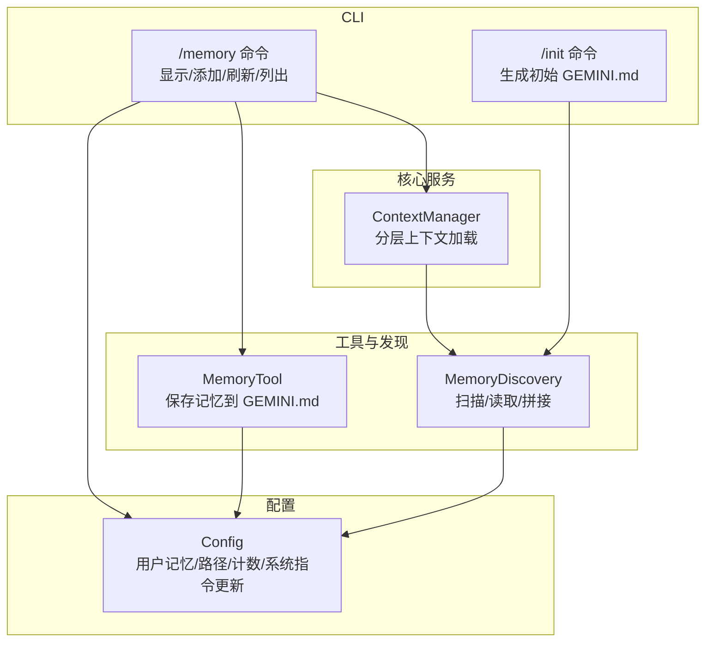
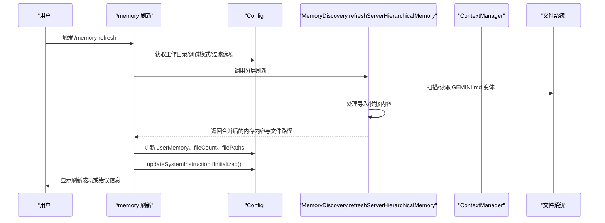
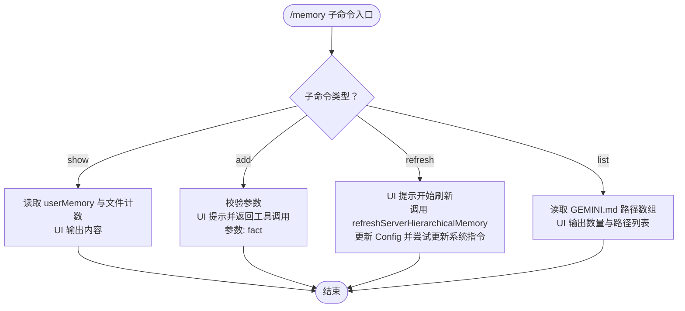
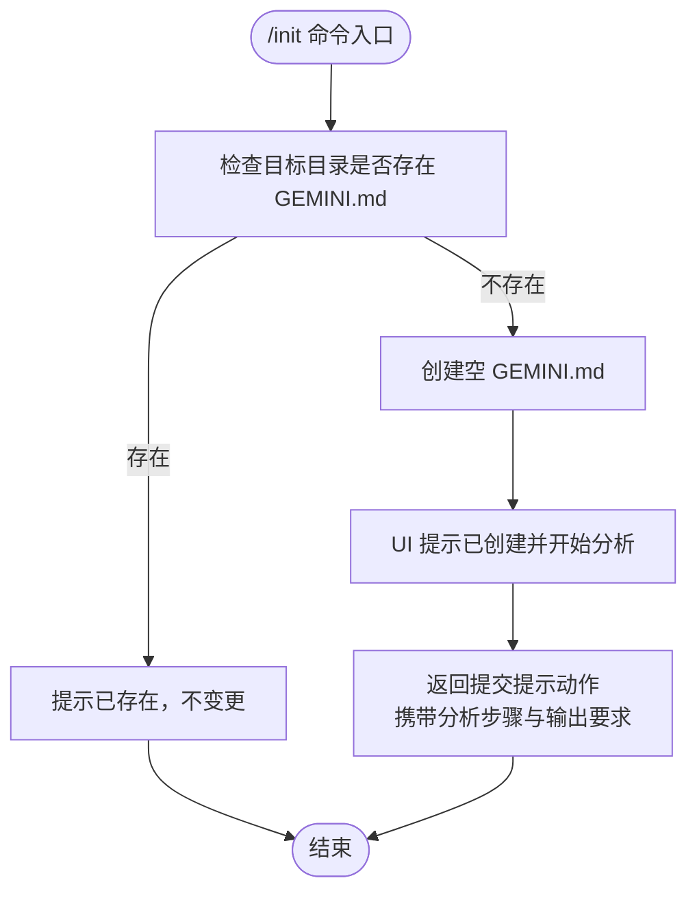
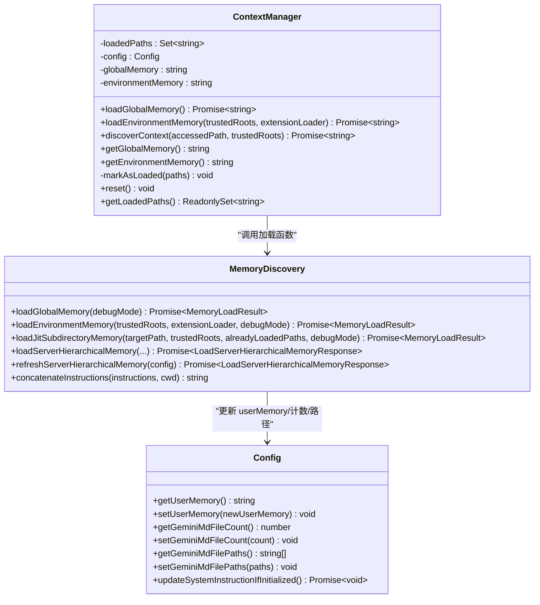
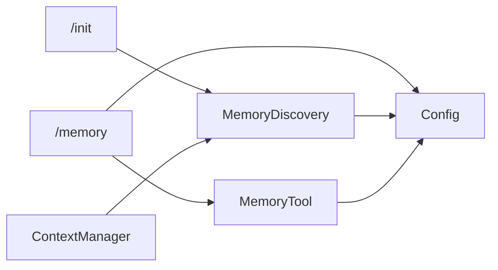

# 内存与配置命令

<cite>
**本文引用的文件**
- [packages/cli/src/ui/commands/memoryCommand.ts](file://packages/cli/src/ui/commands/memoryCommand.ts)
- [packages/cli/src/ui/commands/initCommand.ts](file://packages/cli/src/ui/commands/initCommand.ts)
- [packages/core/src/utils/memoryDiscovery.ts](file://packages/core/src/utils/memoryDiscovery.ts)
- [packages/core/src/services/contextManager.ts](file://packages/core/src/services/contextManager.ts)
- [packages/core/src/tools/memoryTool.ts](file://packages/core/src/tools/memoryTool.ts)
- [packages/core/src/config/config.ts](file://packages/core/src/config/config.ts)
- [packages/cli/src/ui/commands/memoryCommand.test.ts](file://packages/cli/src/ui/commands/memoryCommand.test.ts)
- [packages/cli/src/ui/commands/initCommand.test.ts](file://packages/cli/src/ui/commands/initCommand.test.ts)
- [packages/core/src/utils/memoryDiscovery.test.ts](file://packages/core/src/utils/memoryDiscovery.test.ts)
- [GEMINI.md](file://GEMINI.md)
</cite>

## 目录
1. [简介](#简介)
2. [项目结构](#项目结构)
3. [核心组件](#核心组件)
4. [架构总览](#架构总览)
5. [详细组件分析](#详细组件分析)
6. [依赖关系分析](#依赖关系分析)
7. [性能考量](#性能考量)
8. [故障排查指南](#故障排查指南)
9. [结论](#结论)
10. [附录：最佳实践与模板](#附录最佳实践与模板)

## 简介
本文件面向“内存与配置命令”的综合使用与实现，重点覆盖以下内容：
- /memory 命令族：add、show、refresh、list 的行为与交互，以及与分层内存上下文（Tier 1/2/3）和 contextManager 的关系。
- /init 命令：如何分析项目并生成初始的 GEMINI.md 文件，包含启发式规则与模板要点。
- GEMINI.md 文件的最佳实践与示例，帮助用户在不同类型的项目中高效建立可维护的上下文。
- 这些命令如何影响 AI 的指令上下文，以及在项目初始化与上下文管理中的关键作用。

## 项目结构
围绕“内存与配置命令”，涉及的核心模块分布如下：
- CLI 层：/memory 与 /init 命令定义与 UI 行为
- 核心服务层：contextManager 负责分层加载与拼接上下文
- 工具层：memoryTool 提供记忆持久化能力
- 发现与加载层：memoryDiscovery 负责扫描、读取与处理 GEMINI.md 及其导入
- 配置层：Config 暴露用户记忆、路径与计数等状态，并触发系统指令更新

图表来源
- [packages/cli/src/ui/commands/memoryCommand.ts](file://packages/cli/src/ui/commands/memoryCommand.ts#L1-L145)
- [packages/cli/src/ui/commands/initCommand.ts](file://packages/cli/src/ui/commands/initCommand.ts#L1-L94)
- [packages/core/src/services/contextManager.ts](file://packages/core/src/services/contextManager.ts#L1-L112)
- [packages/core/src/utils/memoryDiscovery.ts](file://packages/core/src/utils/memoryDiscovery.ts#L1-L648)
- [packages/core/src/tools/memoryTool.ts](file://packages/core/src/tools/memoryTool.ts#L1-L400)
- [packages/core/src/config/config.ts](file://packages/core/src/config/config.ts#L1000-L1200)

章节来源
- [packages/cli/src/ui/commands/memoryCommand.ts](file://packages/cli/src/ui/commands/memoryCommand.ts#L1-L145)
- [packages/cli/src/ui/commands/initCommand.ts](file://packages/cli/src/ui/commands/initCommand.ts#L1-L94)
- [packages/core/src/services/contextManager.ts](file://packages/core/src/services/contextManager.ts#L1-L112)
- [packages/core/src/utils/memoryDiscovery.ts](file://packages/core/src/utils/memoryDiscovery.ts#L1-L648)
- [packages/core/src/tools/memoryTool.ts](file://packages/core/src/tools/memoryTool.ts#L1-L400)
- [packages/core/src/config/config.ts](file://packages/core/src/config/config.ts#L1000-L1200)

## 核心组件
- /memory 命令族
  - show：从 Config 获取当前用户记忆与文件计数，输出到 UI。
  - add：校验参数后返回“工具调用”动作，交由 MemoryTool 将事实写入全局 GEMINI.md。
  - refresh：调用 refreshServerHierarchicalMemory，重新加载分层上下文，更新 Config 中的用户记忆、文件计数与路径列表，并尝试更新系统指令。
  - list：列出当前使用的 GEMINI.md 路径集合。
- /init 命令
  - 若目标目录已有 GEMINI.md，则提示不变更；否则创建空文件并提交分析提示词，引导生成完整内容。
- 分层内存上下文（Tier 1/2/3）
  - Tier 1 全局：扫描用户主目录下的 GEMINI.md 变体，作为全局上下文。
  - Tier 2 环境：基于受信任根向上遍历，结合扩展上下文文件，形成环境级上下文。
  - Tier 3 JIT：按访问路径向上查找，仅加载未加载过的子目录上下文，避免重复。
- MemoryTool
  - 将“事实”以列表形式追加到全局 GEMINI.md 的特定段落，支持确认差异与外部编辑器修改回写。
- Config
  - 维护 userMemory、geminiMdFileCount、geminiMdFilePaths，并在刷新后更新系统指令。

章节来源
- [packages/cli/src/ui/commands/memoryCommand.ts](file://packages/cli/src/ui/commands/memoryCommand.ts#L1-L145)
- [packages/cli/src/ui/commands/initCommand.ts](file://packages/cli/src/ui/commands/initCommand.ts#L1-L94)
- [packages/core/src/utils/memoryDiscovery.ts](file://packages/core/src/utils/memoryDiscovery.ts#L1-L648)
- [packages/core/src/tools/memoryTool.ts](file://packages/core/src/tools/memoryTool.ts#L1-L400)
- [packages/core/src/config/config.ts](file://packages/core/src/config/config.ts#L1000-L1200)

## 架构总览
下面的序列图展示了 /memory refresh 的端到端流程，以及与 contextManager、memoryDiscovery 和 Config 的交互。

图表来源
- [packages/cli/src/ui/commands/memoryCommand.ts](file://packages/cli/src/ui/commands/memoryCommand.ts#L73-L118)
- [packages/core/src/utils/memoryDiscovery.ts](file://packages/core/src/utils/memoryDiscovery.ts#L552-L582)
- [packages/core/src/config/config.ts](file://packages/core/src/config/config.ts#L1132-L1140)

章节来源
- [packages/cli/src/ui/commands/memoryCommand.ts](file://packages/cli/src/ui/commands/memoryCommand.ts#L73-L118)
- [packages/core/src/utils/memoryDiscovery.ts](file://packages/core/src/utils/memoryDiscovery.ts#L552-L582)
- [packages/core/src/config/config.ts](file://packages/core/src/config/config.ts#L1132-L1140)

## 详细组件分析

### /memory 命令族
- show
  - 从 Config 读取 userMemory 与 geminiMdFileCount，若为空则提示“内存为空”，否则以分隔块形式展示。
- add
  - 参数校验失败时返回错误消息；通过 UI 提示后返回“工具调用”动作，参数为 fact，交由 MemoryTool 执行。
- refresh
  - UI 提示开始刷新；若存在 Config，则调用 refreshServerHierarchicalMemory，接收合并内容与文件数；根据结果更新 Config 并尝试更新系统指令；异常时捕获并反馈错误。
- list
  - 从 Config 读取当前使用的 GEMINI.md 路径数组，输出数量与路径列表；若为空则提示无文件。

图表来源
- [packages/cli/src/ui/commands/memoryCommand.ts](file://packages/cli/src/ui/commands/memoryCommand.ts#L1-L145)

章节来源
- [packages/cli/src/ui/commands/memoryCommand.ts](file://packages/cli/src/ui/commands/memoryCommand.ts#L1-L145)
- [packages/cli/src/ui/commands/memoryCommand.test.ts](file://packages/cli/src/ui/commands/memoryCommand.test.ts#L1-L324)

### /init 命令
- 行为
  - 若目标目录已存在 GEMINI.md，直接提示不变更。
  - 否则创建空文件，UI 提示“已创建空 GEMINI.md，正在分析项目以填充内容”，并返回“提交提示”动作，携带生成模板所需的分析步骤与输出要求。
- 启发式规则与模板要点
  - 初始探索：列出文件与目录，优先读取 README 类文件。
  - 迭代深挖：最多读取若干重要文件（如配置、源码、文档），边读边调整后续选择。
  - 识别项目类型：代码项目关注包管理器/构建脚本/源码目录；非代码项目聚焦用途、关键文件与使用方式。
  - 输出规范：生成完整且格式良好的 Markdown，作为后续上下文。

图表来源
- [packages/cli/src/ui/commands/initCommand.ts](file://packages/cli/src/ui/commands/initCommand.ts#L1-L94)

章节来源
- [packages/cli/src/ui/commands/initCommand.ts](file://packages/cli/src/ui/commands/initCommand.ts#L1-L94)
- [packages/cli/src/ui/commands/initCommand.test.ts](file://packages/cli/src/ui/commands/initCommand.test.ts#L1-L87)

### 分层内存上下文与 contextManager
- Tier 1 全局：扫描用户主目录下 GEMINI.md 变体，读取并拼接为全局上下文。
- Tier 2 环境：对受信任根执行向上遍历，收集各层级的 GEMINI.md；同时合并扩展提供的上下文文件。
- Tier 3 JIT：当访问某路径时，找到最深的受信任根并向上遍历，仅加载尚未加载过的子目录上下文。
- ContextManager
  - 维护已加载路径集合，分别缓存全局与环境上下文，提供重置与查询接口。
- MemoryDiscovery.refreshServerHierarchicalMemory
  - 综合扫描结果与 MCP 指令，更新 Config 的 userMemory、fileCount、filePaths，并发出内存变更事件。

图表来源
- [packages/core/src/services/contextManager.ts](file://packages/core/src/services/contextManager.ts#L1-L112)
- [packages/core/src/utils/memoryDiscovery.ts](file://packages/core/src/utils/memoryDiscovery.ts#L1-L648)
- [packages/core/src/config/config.ts](file://packages/core/src/config/config.ts#L1000-L1200)

章节来源
- [packages/core/src/services/contextManager.ts](file://packages/core/src/services/contextManager.ts#L1-L112)
- [packages/core/src/utils/memoryDiscovery.ts](file://packages/core/src/utils/memoryDiscovery.ts#L1-L648)
- [packages/core/src/config/config.ts](file://packages/core/src/config/config.ts#L1000-L1200)

### MemoryTool：记忆持久化
- 功能
  - 将“事实”以列表形式追加到全局 GEMINI.md 的固定段落；若段落不存在则自动创建。
  - 支持差异预览与“永远允许”白名单；支持外部编辑器修改后回写。
- 关键点
  - 默认文件名可配置（支持单个或多个变体）。
  - 计算新内容时去除多余前缀与换行，确保格式整洁。
  - 执行失败时返回结构化错误，便于 UI 展示。

章节来源
- [packages/core/src/tools/memoryTool.ts](file://packages/core/src/tools/memoryTool.ts#L1-L400)

## 依赖关系分析
- /memory 与 Config
  - show/list 直接读取 userMemory、fileCount、filePaths。
  - refresh 通过 refreshServerHierarchicalMemory 更新上述状态，并触发系统指令更新。
- /memory 与 MemoryTool
  - add 通过返回工具调用，交由 MemoryTool 写入全局 GEMINI.md。
- /init 与 MemoryDiscovery
  - /init 创建空 GEMINI.md 后，提交提示词用于生成内容；生成完成后由 MemoryDiscovery 的刷新流程将其纳入上下文。
- MemoryDiscovery 与 Config
  - refreshServerHierarchicalMemory 会读取 Config 的工作目录、信任根、过滤选项、导入格式与最大搜索深度等，最终将合并结果写回 Config。

图表来源
- [packages/cli/src/ui/commands/memoryCommand.ts](file://packages/cli/src/ui/commands/memoryCommand.ts#L1-L145)
- [packages/cli/src/ui/commands/initCommand.ts](file://packages/cli/src/ui/commands/initCommand.ts#L1-L94)
- [packages/core/src/utils/memoryDiscovery.ts](file://packages/core/src/utils/memoryDiscovery.ts#L552-L582)
- [packages/core/src/tools/memoryTool.ts](file://packages/core/src/tools/memoryTool.ts#L1-L400)
- [packages/core/src/config/config.ts](file://packages/core/src/config/config.ts#L1000-L1200)

章节来源
- [packages/cli/src/ui/commands/memoryCommand.ts](file://packages/cli/src/ui/commands/memoryCommand.ts#L1-L145)
- [packages/cli/src/ui/commands/initCommand.ts](file://packages/cli/src/ui/commands/initCommand.ts#L1-L94)
- [packages/core/src/utils/memoryDiscovery.ts](file://packages/core/src/utils/memoryDiscovery.ts#L552-L582)
- [packages/core/src/tools/memoryTool.ts](file://packages/core/src/tools/memoryTool.ts#L1-L400)
- [packages/core/src/config/config.ts](file://packages/core/src/config/config.ts#L1000-L1200)

## 性能考量
- 并发控制
  - 文件扫描与读取采用批量并发（批量大小限制），避免 EMFILE 错误，提升大仓库扫描效率。
- 路径去重与增量
  - 对扫描结果进行去重；JIT 上游遍历仅加载未加载过的路径，减少重复 IO。
- 导入处理
  - 在读取过程中处理导入，避免一次性加载过多内容导致内存峰值过高。
- 刷新策略
  - refreshServerHierarchicalMemory 合并 MCP 指令与上下文，统一写入 Config，减少多次读写。

章节来源
- [packages/core/src/utils/memoryDiscovery.ts](file://packages/core/src/utils/memoryDiscovery.ts#L1-L648)

## 故障排查指南
- /memory refresh 报错
  - 检查 Config 是否可用；确认工作目录、信任根与过滤选项配置正确。
  - 查看日志与 UI 错误提示，定位具体文件读取失败原因。
- /memory add 无效
  - 确认参数非空；查看 MemoryTool 的差异预览与确认流程是否被取消。
- /init 未生成内容
  - 确认提交的提示词已被执行；检查生成后是否触发了 refresh 流程，使新内容进入上下文。
- GEMINI.md 未生效
  - 手动运行 /memory refresh，确保 Config 的 userMemory 已更新；必要时重启会话以应用系统指令更新。

章节来源
- [packages/cli/src/ui/commands/memoryCommand.test.ts](file://packages/cli/src/ui/commands/memoryCommand.test.ts#L1-L324)
- [packages/cli/src/ui/commands/initCommand.test.ts](file://packages/cli/src/ui/commands/initCommand.test.ts#L1-L87)
- [packages/core/src/utils/memoryDiscovery.test.ts](file://packages/core/src/utils/memoryDiscovery.test.ts#L833-L905)

## 结论
- /memory 命令族提供了对用户记忆的可视化与持久化能力，配合分层上下文加载，能够动态地将全局、环境与 JIT 上下文整合进 AI 的指令上下文中。
- /init 命令通过启发式规则与模板驱动，帮助用户快速建立高质量的 GEMINI.md，为后续上下文管理奠定基础。
- 通过 Config 的集中状态管理与系统指令更新机制，这些命令在项目初始化与日常上下文维护中发挥关键作用。

## 附录：最佳实践与模板

### GEMINI.md 最佳实践
- 结构清晰
  - 使用标题层级组织“项目概述、构建与运行、开发约定、关键文件与用途”等板块。
- 内容精炼
  - 仅保留与当前任务高度相关的信息；避免冗长复制粘贴。
- 可维护性
  - 使用相对路径与简短描述；定期回顾与更新。
- 示例参考
  - 可参考仓库根目录的 GEMINI.md 作为模板与风格参考。

章节来源
- [GEMINI.md](file://GEMINI.md#L1-L401)

### /init 启发式规则与模板要点
- 初始探索：列出文件与目录，优先读取 README。
- 迭代深挖：最多读取若干重要文件，边读边决策。
- 识别项目类型：代码项目关注包管理器/构建脚本/源码目录；非代码项目聚焦用途与关键文件。
- 输出规范：生成完整且格式良好的 Markdown，作为上下文。

章节来源
- [packages/cli/src/ui/commands/initCommand.ts](file://packages/cli/src/ui/commands/initCommand.ts#L1-L94)