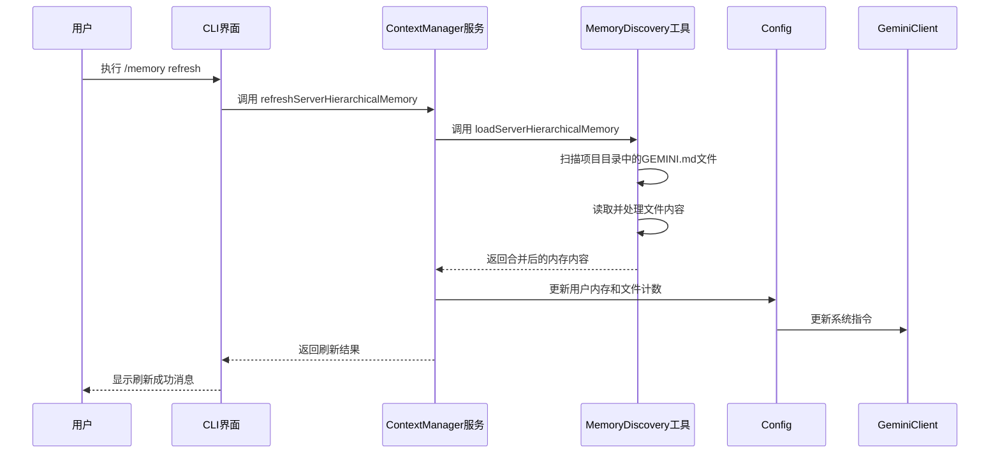
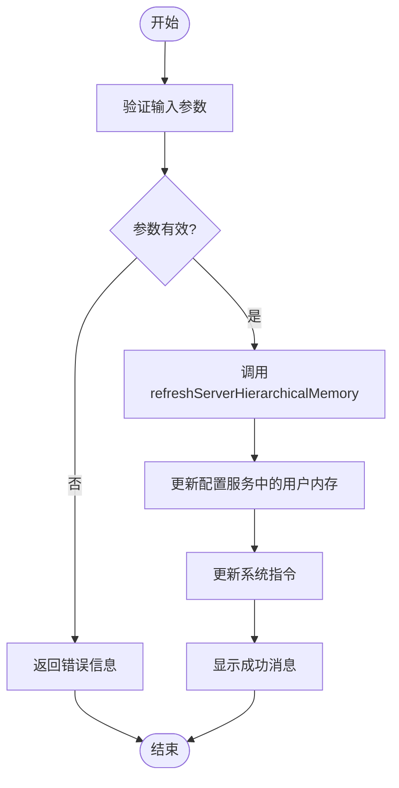

# 内存管理命令

<cite>
**本文档引用的文件**
- [memoryCommand.ts](file://packages/cli/src/ui/commands/memoryCommand.ts)
- [contextManager.ts](file://packages/core/src/services/contextManager.ts)
- [memoryDiscovery.ts](file://packages/core/src/utils/memoryDiscovery.ts)
- [memoryTool.ts](file://packages/core/src/tools/memoryTool.ts)
- [config.ts](file://packages/core/src/config/config.ts)
- [GEMINI.md](file://GEMINI.md)
</cite>

## 目录
1. [简介](#简介)
2. [核心命令详解](#核心命令详解)
3. [与contextManager服务的交互](#与contextmanager服务的交互)
4. [实现逻辑分析](#实现逻辑分析)
5. [使用示例](#使用示例)
6. [常见问题解答](#常见问题解答)

## 简介
内存管理命令是Gemini CLI的核心功能之一，允许用户通过`/memory`命令族动态地向AI会话中添加、显示和刷新由`GEMINI.md`文件构成的上下文。这些命令通过与`contextManager`服务交互，实现了对用户记忆的持久化管理和实时更新。本文档将详细解释`/memory add`、`/memory show`、`/memory refresh`和`/memory list`命令的实现逻辑、使用方法以及常见问题的解决方案。

**Section sources**
- [memoryCommand.ts](file://packages/cli/src/ui/commands/memoryCommand.ts#L1-L145)

## 核心命令详解

### /memory add 命令
`/memory add`命令用于将指定的文本内容添加到用户的长期记忆中。该命令会触发`save_memory`工具，将信息保存到全局的`GEMINI.md`文件中。用户需要提供要记住的文本作为参数。

**Section sources**
- [memoryCommand.ts](file://packages/cli/src/ui/commands/memoryCommand.ts#L45-L71)

### /memory show 命令
`/memory show`命令用于显示当前会话中加载的内存内容。它会从配置服务中获取当前的用户内存，并将其格式化后展示给用户。如果内存为空，会显示相应的提示信息。

**Section sources**
- [memoryCommand.ts](file://packages/cli/src/ui/commands/memoryCommand.ts#L22-L43)

### /memory refresh 命令
`/memory refresh`命令用于强制重新加载内存内容。它会调用`refreshServerHierarchicalMemory`函数，从源文件中重新读取`GEMINI.md`文件的内容，并更新当前会话的上下文。此操作会触发系统指令的更新，确保AI能够获取最新的记忆信息。

**Section sources**
- [memoryCommand.ts](file://packages/cli/src/ui/commands/memoryCommand.ts#L74-L118)

### /memory list 命令
`/memory list`命令用于列出当前正在使用的`GEMINI.md`文件的路径。它会从配置服务中获取所有已加载的`GEMINI.md`文件的路径，并以列表形式展示给用户。

**Section sources**
- [memoryCommand.ts](file://packages/cli/src/ui/commands/memoryCommand.ts#L121-L144)

## 与contextManager服务的交互
内存管理命令通过`contextManager`服务与`GEMINI.md`文件进行交互。`contextManager`负责加载和管理不同层级的内存内容，包括全局内存、环境内存和即时（JIT）内存。当执行`/memory refresh`命令时，`contextManager`会重新扫描项目目录，发现并加载所有`GEMINI.md`文件，然后将它们的内容合并成一个统一的上下文字符串。



**Diagram sources**
- [contextManager.ts](file://packages/core/src/services/contextManager.ts#L16-L112)
- [memoryDiscovery.ts](file://packages/core/src/utils/memoryDiscovery.ts#L475-L550)

## 实现逻辑分析
内存管理命令的实现逻辑主要集中在`memoryCommand.ts`文件中。每个子命令都有一个`action`函数，负责处理用户的输入并执行相应的操作。例如，`/memory add`命令的`action`函数会验证参数的有效性，然后返回一个工具调用，触发`save_memory`工具的执行。`/memory refresh`命令的`action`函数则会调用`refreshServerHierarchicalMemory`函数，该函数会重新加载所有`GEMINI.md`文件的内容，并更新配置服务中的用户内存。



**Diagram sources**
- [memoryCommand.ts](file://packages/cli/src/ui/commands/memoryCommand.ts#L78-L118)
- [config.ts](file://packages/core/src/config/config.ts#L1135-L1140)

## 使用示例

### 添加内存
要将一条信息添加到内存中，可以使用以下命令：
```
/memory add 我的项目名称是gemini-cli
```
这会将“我的项目名称是gemini-cli”这条信息保存到全局的`GEMINI.md`文件中。

### 显示内存
要查看当前的内存内容，可以使用以下命令：
```
/memory show
```
这会显示当前加载的内存内容摘要。

### 刷新内存
要强制重新加载内存内容，可以使用以下命令：
```
/memory refresh
```
这会从源文件中重新读取`GEMINI.md`文件的内容，并更新当前会话的上下文。

### 列出内存文件
要查看当前正在使用的`GEMINI.md`文件的路径，可以使用以下命令：
```
/memory list
```
这会列出所有已加载的`GEMINI.md`文件的路径。

**Section sources**
- [memoryCommand.ts](file://packages/cli/src/ui/commands/memoryCommand.ts#L1-L145)
- [GEMINI.md](file://GEMINI.md#L1-L401)

## 常见问题解答

### 上下文未更新
如果执行`/memory refresh`后上下文没有更新，可能是因为`GEMINI.md`文件的路径不正确或文件权限不足。请检查文件路径是否正确，并确保文件具有读取权限。

### 文件未找到
如果系统提示文件未找到，可能是因为`GEMINI.md`文件不存在于预期的目录中。请确认文件是否存在于项目根目录或用户主目录下的`.gemini`文件夹中。

**Section sources**
- [memoryCommand.ts](file://packages/cli/src/ui/commands/memoryCommand.ts#L108-L117)
- [memoryDiscovery.ts](file://packages/core/src/utils/memoryDiscovery.ts#L332-L366)