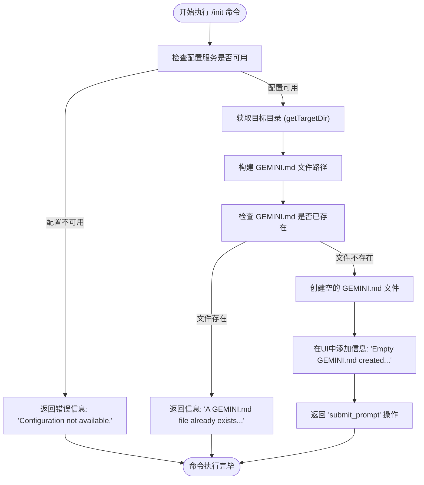

# 项目初始化命令

<cite>
**本文档中引用的文件**   
- [initCommand.ts](file://packages/cli/src/ui/commands/initCommand.ts)
- [initCommand.test.ts](file://packages/cli/src/ui/commands/initCommand.test.ts)
- [config.ts](file://packages/core/src/config/config.ts)
- [memoryTool.ts](file://packages/core/src/tools/memoryTool.ts)
</cite>

## 目录
1. [简介](#简介)
2. [核心功能与工作流程](#核心功能与工作流程)
3. [实现细节分析](#实现细节分析)
4. [GEMINI.md 模板与内容生成](#gemini.md-模板与内容生成)
5. [预期输出与最佳实践](#预期输出与最佳实践)

## 简介
`/init` 命令是 `gemini-cli` 工具中的一个内置核心命令，其主要功能是为项目进行初始化设置。该命令通过扫描项目根目录，自动分析代码库的结构（例如检测 `.git` 目录、`package.json`、`README.md` 等关键文件），并基于这些信息自动生成一个初始的 `GEMINI.md` 文件。这个 `GEMINI.md` 文件作为 AI 代理的初始指令集和上下文来源，为后续的交互提供了项目专属的背景知识。本文档将深入解析 `/init` 命令的实现机制，包括其文件发现逻辑、启发式规则以及 `GEMINI.md` 模板的填充过程。

**Section sources**
- [initCommand.ts](file://packages/cli/src/ui/commands/initCommand.ts#L15-L93)

## 核心功能与工作流程
`/init` 命令的核心工作流程可以分为三个主要阶段：环境检查、文件创建与分析触发。

1.  **环境与配置检查**：命令首先会检查 `CommandContext` 中的 `services.config` 是否可用。如果配置对象为空，命令会立即返回一个错误信息“Configuration not available.”，并终止执行。这是确保命令在有效上下文中运行的第一道安全检查。

2.  **目标目录与文件路径确定**：通过调用 `context.services.config.getTargetDir()` 方法，命令获取到当前操作的目标目录。随后，它使用 `path.join()` 将此目录与文件名 `'GEMINI.md'` 结合，生成 `GEMINI.md` 文件的完整路径。

3.  **存在性检查与文件创建**：命令使用 `fs.existsSync()` 检查目标路径下是否已存在 `GEMINI.md` 文件。如果文件已存在，命令会返回一条信息性消息“A GEMINI.md file already exists in this directory. No changes were made.”，以避免覆盖用户已有的内容。如果文件不存在，命令会立即使用 `fs.writeFileSync()` 创建一个空的 `GEMINI.md` 文件，并通过 `context.ui.addItem()` 向用户界面添加一条信息，告知用户“Empty GEMINI.md created. Now analyzing the project to populate it.”。

4.  **触发分析流程**：完成文件创建后，命令的最终动作是返回一个 `submit_prompt` 类型的响应。该响应的 `content` 字段包含一个精心设计的提示词（prompt），这个提示词详细指导 AI 代理如何分析当前项目，并最终将分析结果写入刚刚创建的 `GEMINI.md` 文件中。

**Section sources**
- [initCommand.ts](file://packages/cli/src/ui/commands/initCommand.ts#L24-L92)
- [config.ts](file://packages/core/src/config/config.ts#L914-L925)

## 实现细节分析
`/init` 命令的实现依赖于 `gemini-cli` 的核心服务和配置系统。其关键实现细节如下：

-   **命令定义**：`/init` 命令被定义为一个 `SlashCommand` 对象，其 `kind` 属性为 `CommandKind.BUILT_IN`，表明它是一个内置命令。`autoExecute: true` 的设置意味着当用户在命令行中输入 `/init` 并按回车键时，命令会立即自动执行，而无需额外的确认步骤。

-   **配置服务依赖**：命令通过 `context.services.config` 访问配置服务。`getTargetDir()` 方法是 `Config` 类的一个实例方法，它返回在初始化配置时通过 `ConfigParameters` 传入的 `targetDir` 参数，并确保该路径是经过 `path.resolve()` 处理的绝对路径。这保证了命令操作的目录是明确且唯一的。

-   **异步操作与返回类型**：命令的 `action` 是一个异步函数，返回一个 `Promise<SlashCommandActionReturn>`。`SlashCommandActionReturn` 是一个联合类型，可以是多种操作结果，如消息、打开对话框或提交提示。在 `/init` 命令中，它主要返回 `message` 类型（用于错误和信息）和 `submit_prompt` 类型（用于触发后续分析）。

-   **文件名可配置性**：虽然 `/init` 命令在创建文件时硬编码使用了 `'GEMINI.md'`，但底层系统支持文件名的自定义。`memoryTool.ts` 文件中定义了 `DEFAULT_CONTEXT_FILENAME = 'GEMINI.md'` 和 `setGeminiMdFilename()` 函数，允许通过配置更改上下文文件的名称。这表明 `GEMINI.md` 是一个约定俗成的默认值，系统具备灵活性。

**Diagram sources **
- [initCommand.ts](file://packages/cli/src/ui/commands/initCommand.ts#L24-L92)
- [config.ts](file://packages/core/src/config/config.ts#L914-L925)

## GEMINI.md 模板与内容生成
`/init` 命令本身并不直接生成 `GEMINI.md` 文件的内容，而是通过提交一个结构化的提示词（prompt）来指导 AI 代理完成这项任务。这个提示词定义了 AI 代理分析项目和生成内容的完整流程。

### 分析流程
提示词中明确指出了 AI 代理应遵循的三步分析法：
1.  **初始探索**：首先列出项目中的文件和目录以获得整体结构概览，并优先读取 `README.md` 或 `README.txt` 等文件，因为这些文件通常包含项目最重要的介绍信息。
2.  **迭代深入**：基于初步发现，选择最多10个最重要的文件（如配置文件、主源码文件）进行深入阅读。这个过程是迭代的，AI 代理可以根据新发现的信息动态调整其探索路径。
3.  **识别项目类型**：通过检测特定的文件来判断项目类型。例如，如果发现 `package.json`、`go.mod`、`src` 目录等，则判定为“代码项目”；否则，可能是一个文档、笔记或其他非代码项目。

### 内容生成规则
根据识别出的项目类型，提示词为 `GEMINI.md` 文件的内容生成提供了不同的模板：

-   **对于代码项目**：
    -   **项目概述**：要求 AI 代理撰写一个关于项目目的、主要技术和架构的清晰摘要。
    -   **构建与运行**：要求推断并记录构建、运行和测试项目的关键命令（例如，从 `package.json` 的 `scripts` 字段或 `Makefile` 中提取）。
    -   **开发规范**：要求描述从代码库中推断出的编码风格、测试实践或贡献指南。

-   **对于非代码项目**：
    -   **目录概述**：描述该目录的用途和所包含的信息类型。
    -   **关键文件**：列出最重要的文件并简要说明其内容。
    -   **使用方法**：解释如何使用该目录中的内容。

最后，提示词强调，AI 代理必须将完整的、格式良好的 Markdown 内容写入 `GEMINI.md` 文件。

**Section sources**
- [initCommand.ts](file://packages/cli/src/ui/commands/initCommand.ts#L57-L90)

## 预期输出与最佳实践
### 预期输出
成功执行 `/init` 命令后，用户可以预期以下输出：
1.  在项目根目录下生成一个名为 `GEMINI.md` 的空文件。
2.  在命令行界面中看到一条信息：“Empty GEMINI.md created. Now analyzing the project to populate it.”。
3.  随后，AI 代理将开始分析流程，其分析过程和最终写入 `GEMINI.md` 的内容将作为后续交互的一部分呈现给用户。

### 最佳实践
-   **在项目根目录运行**：为了确保 `/init` 命令能正确扫描整个项目结构，应在项目的根目录下执行此命令。
-   **利用生成的文件**：生成的 `GEMINI.md` 文件是一个起点。开发者应根据项目的具体需求对其进行审查和定制，添加更详细的说明或修正 AI 代理可能遗漏的信息。
-   **理解其作用**：`GEMINI.md` 文件是 AI 代理的“记忆”和“指令手册”。一个精心维护的 `GEMINI.md` 文件能显著提升 AI 代理在项目中的表现和准确性。

**Section sources**
- [initCommand.ts](file://packages/cli/src/ui/commands/initCommand.ts#L44-L49)