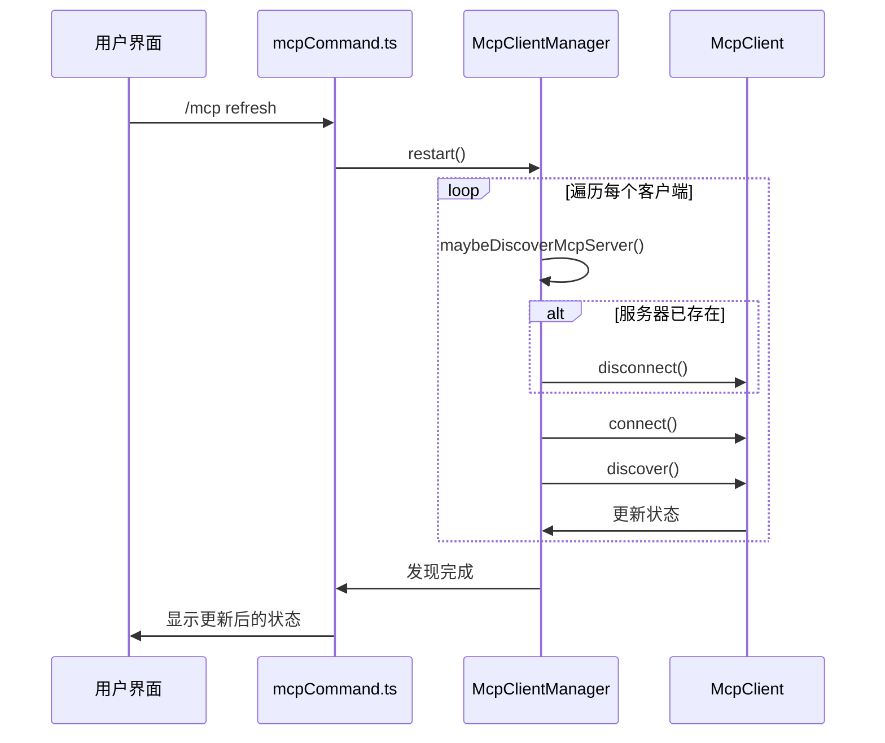
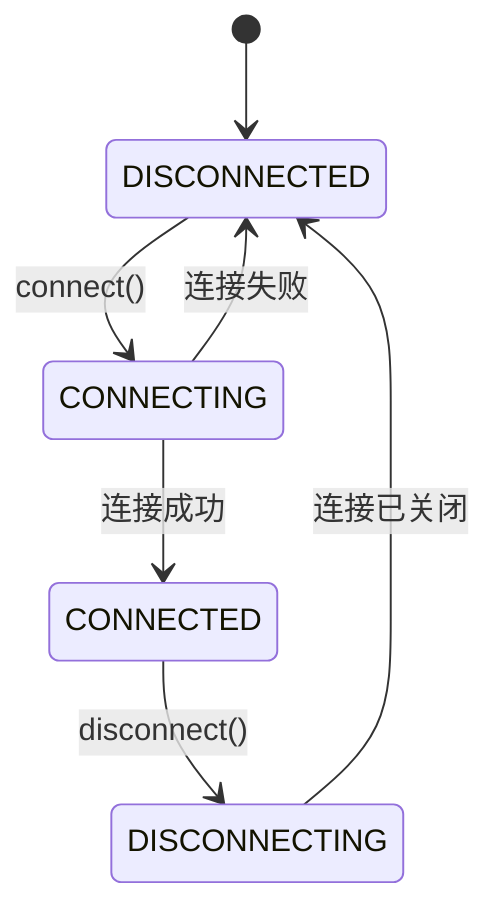
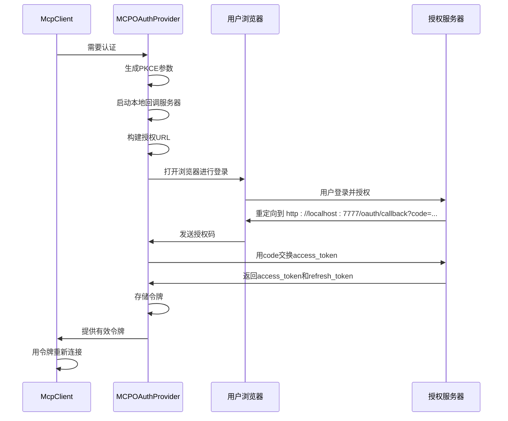

# MCP服务器管理

<cite>
**本文档中引用的文件**
- [mcpCommand.ts](file://packages/cli/src/ui/commands/mcpCommand.ts)
- [mcp-client-manager.ts](file://packages/core/src/tools/mcp-client-manager.ts)
- [mcp-client.ts](file://packages/core/src/tools/mcp-client.ts)
- [mcp-tool.ts](file://packages/core/src/tools/mcp-tool.ts)
- [oauth-provider.ts](file://packages/core/src/mcp/oauth-provider.ts)
- [oauth-token-storage.ts](file://packages/core/src/mcp/oauth-token-storage.ts)
- [oauth-utils.ts](file://packages/core/src/mcp/oauth-utils.ts)
- [config.ts](file://packages/core/src/config/config.ts)
- [mcp-server.md](file://docs/tools/mcp-server.md)
</cite>

## 目录
1. [介绍](#介绍)
2. [MCP命令与子命令](#mcp命令与子命令)
3. [MCP客户端管理](#mcp客户端管理)
4. [工具发现与生命周期](#工具发现与生命周期)
5. [OAuth认证集成](#oauth认证集成)
6. [配置示例](#配置示例)
7. [通信协议与错误处理](#通信协议与错误处理)
8. [与核心工具调度系统的集成](#与核心工具调度系统的集成)

## 介绍
本文档旨在提供MCP（Model Context Protocol）服务器管理的权威指南。MCP服务器作为Gemini CLI与外部系统之间的桥梁，能够将自定义工具和资源动态地暴露给AI模型，从而极大地扩展其功能。本文档将深入解析`/mcp`命令及其子命令的实现机制，详细说明MCP客户端的生命周期管理、工具发现流程以及OAuth认证的集成方式。

## MCP命令与子命令
`/mcp`命令是管理MCP服务器的核心入口，它提供了一系列子命令来查询和操作已配置的服务器。

### mcpCommand.ts 与子命令交互
`mcpCommand.ts`文件定义了`/mcp`命令的用户界面（UI）实现。它通过`SlashCommand`接口注册了多个内置子命令，这些子命令在用户界面中可直接调用。

**核心子命令分析**
- **`list` (ls, nodesc, nodescription)**: 列出所有已配置的MCP服务器及其工具。此命令是`/mcp`的默认行为。
- **`desc` (description)**: 与`list`类似，但会额外显示工具的描述信息。
- **`schema`**: 在`desc`的基础上，进一步显示工具的输入参数JSON Schema。
- **`auth`**: 用于对需要OAuth认证的MCP服务器进行身份验证。
- **`refresh`**: 重启所有MCP服务器，以重新发现工具和资源。

`mcpCommand.ts`中的`listAction`函数是这些子命令的核心。它通过`config`服务获取`ToolRegistry`、`PromptRegistry`等核心组件，然后收集所有已连接服务器的状态、工具、提示词和资源信息，并将它们格式化为一个`HistoryItemMcpStatus`对象，最终通过`context.ui.addItem()`显示在用户界面上。

**Section sources**
- [mcpCommand.ts](file://packages/cli/src/ui/commands/mcpCommand.ts#L184-L292)

## MCP客户端管理
MCP客户端的管理由`mcp-client-manager.ts`中的`McpClientManager`类负责。它是整个MCP系统的大脑，负责协调所有MCP客户端的生命周期。

### McpClientManager 核心职责
`McpClientManager`的主要职责包括：
1.  **生命周期管理**: 通过`startConfiguredMcpServers()`和`stop()`方法，统一启动和停止所有配置的MCP服务器。
2.  **发现流程协调**: 管理全局的发现状态（`MCPDiscoveryState`），确保发现过程有序进行。
3.  **配置过滤**: 根据`allowedMcpServers`和`blockedMcpServers`列表，决定是否允许某个服务器连接。
4.  **事件分发**: 通过`eventEmitter`向其他系统组件（如UI）广播客户端状态更新。

### 与 mcpCommand.ts 的交互
`mcpCommand.ts`中的`refresh`子命令会直接调用`McpClientManager`的`restart()`方法。`restart()`方法会遍历所有已连接的客户端，并调用`maybeDiscoverMcpServer()`来重新连接和发现工具。在`maybeDiscoverMcpServer()`方法中，如果检测到服务器需要认证（通过`mcpServerRequiresOAuth`映射），它会触发OAuth认证流程。



**Diagram sources**
- [mcp-client-manager.ts](file://packages/core/src/tools/mcp-client-manager.ts#L279-L305)
- [mcpCommand.ts](file://packages/cli/src/ui/commands/mcpCommand.ts#L321-L367)

**Section sources**
- [mcp-client-manager.ts](file://packages/core/src/tools/mcp-client-manager.ts#L28-L357)

## 工具发现与生命周期
工具发现是MCP系统的核心功能，它使得AI模型能够动态地了解并使用外部工具。

### 发现流程
完整的发现流程始于`McpClientManager.startConfiguredMcpServers()`，该方法会为每个配置的服务器调用`maybeDiscoverMcpServer()`。此方法会创建一个`McpClient`实例，并依次执行`connect()`和`discover()`。

`discover()`方法是关键，它会并行调用`discoverTools()`、`discoverPrompts()`和`discoverResources()`。这些方法通过MCP协议的`tools/list`、`prompts/list`和`resources/list`端点获取服务器提供的功能。

### 生命周期管理
MCP客户端的生命周期由`McpClient`类的状态机管理，其状态通过`MCPServerStatus`枚举定义：
- **`DISCONNECTED`**: 初始或断开连接状态。
- **`CONNECTING`**: 正在建立连接。
- **`CONNECTED`**: 连接成功，可以进行交互。
- **`DISCONNECTING`**: 正在关闭连接。

当服务器支持动态更新（通过`serverCapabilities`声明）时，`McpClient`会注册通知处理器。例如，当收到`ToolListChangedNotification`时，会触发`refreshTools()`方法，该方法实现了**合并模式（Coalescing Pattern）**，可以处理短时间内多次通知，避免对服务器造成过多请求。



**Diagram sources**
- [mcp-client.ts](file://packages/core/src/tools/mcp-client.ts#L74-L83)
- [mcp-client.ts](file://packages/core/src/tools/mcp-client.ts#L380-L385)

**Section sources**
- [mcp-client.ts](file://packages/core/src/tools/mcp-client.ts#L103-L446)

## OAuth认证集成
对于需要身份验证的远程MCP服务器，系统集成了OAuth 2.0认证流程。

### 自动发现与认证
系统支持两种OAuth配置方式：手动配置和自动发现。当服务器返回401 Unauthorized响应时，`mcp-client.ts`会解析`WWW-Authenticate`头，提取`resource_metadata` URI。然后，`OAuthUtils`类会利用此URI自动发现授权服务器的元数据（如`authorization_endpoint`和`token_endpoint`）。

### 认证流程
`oauth-provider.ts`中的`MCPOAuthProvider`类负责执行完整的OAuth授权码流程（PKCE）：
1.  **启动回调服务器**: 在本地启动一个HTTP服务器（默认端口7777）来接收OAuth回调。
2.  **构建授权URL**: 生成包含`code_challenge`和`state`参数的授权URL。
3.  **打开浏览器**: 使用`openBrowserSecurely`安全地打开浏览器，引导用户登录。
4.  **交换令牌**: 用户授权后，浏览器重定向到本地回调服务器，获取`code`，并用其交换`access_token`。
5.  **存储令牌**: `MCPOAuthTokenStorage`将令牌安全地存储在`~/.gemini/mcp-oauth-tokens.json`文件中。

### 令牌管理
`MCPOAuthTokenStorage`实现了令牌的持久化存储和刷新。`getStoredOAuthToken()`函数会检查令牌是否过期（预留5分钟缓冲时间），如果过期且存在`refresh_token`，则会自动发起刷新请求。



**Diagram sources**
- [oauth-provider.ts](file://packages/core/src/mcp/oauth-provider.ts#L709-L722)
- [oauth-token-storage.ts](file://packages/core/src/mcp/oauth-token-storage.ts#L126-L148)

**Section sources**
- [oauth-provider.ts](file://packages/core/src/mcp/oauth-provider.ts#L99-L800)
- [oauth-token-storage.ts](file://packages/core/src/mcp/oauth-token-storage.ts#L26-L234)
- [oauth-utils.ts](file://packages/core/src/mcp/oauth-utils.ts#L46-L390)

## 配置示例
以下是一个完整的`mcp-servers`配置示例，展示了如何将一个远程工具动态地暴露给AI模型。

```json
{
  "mcp": {
    "allowed": ["my-remote-tools"]
  },
  "mcpServers": {
    "my-remote-tools": {
      "httpUrl": "https://api.example.com/v1/mcp",
      "headers": {
        "User-Agent": "Gemini-CLI/1.0"
      },
      "timeout": 30000,
      "trust": false,
      "oauth": {
        "enabled": true,
        "scopes": ["read:data", "write:results"]
      }
    },
    "local-python-tools": {
      "command": "python",
      "args": ["-m", "my_mcp_server", "--port", "8080"],
      "cwd": "./mcp-servers/python",
      "env": {
        "API_KEY": "$MY_API_TOKEN"
      },
      "includeTools": ["safe_tool", "data_processor"]
    }
  }
}
```

**配置说明**
- **`mcp.allowed`**: 确保只有`my-remote-tools`服务器会被连接。
- **`httpUrl`**: 指定远程MCP服务器的HTTP流式传输端点。
- **`headers`**: 添加自定义HTTP头。
- **`oauth.enabled`**: 启用OAuth认证，系统将自动发现配置并引导用户完成认证。
- **`includeTools`**: 对本地服务器进行工具过滤，只暴露安全的工具。

**Section sources**
- [config.ts](file://packages/core/src/config/config.ts#L181-L200)
- [mcp-server.md](file://docs/tools/mcp-server.md#L134-L470)

## 通信协议与错误处理
MCP客户端与服务器之间的通信遵循Model Context Protocol规范。

### 通信协议
系统支持三种传输方式：
- **Stdio**: 通过`StdioClientTransport`与子进程通信。
- **SSE (Server-Sent Events)**: 通过`SSEClientTransport`连接到SSE端点。
- **Streamable HTTP**: 通过`StreamableHTTPClientTransport`进行HTTP流式通信。

`mcp-client.ts`中的`connectToMcpServer()`函数根据配置的`command`、`url`或`httpUrl`属性，自动选择合适的传输方式。

### 错误处理机制
系统实现了分层的错误处理：
1.  **连接错误**: 在`connect()`方法中捕获，将状态设为`DISCONNECTED`。
2.  **发现错误**: 在`discover()`方法中捕获，会记录错误但不会中断其他服务器的发现。
3.  **工具调用错误**: 在`DiscoveredMCPTool`的`execute()`方法中，通过`isMCPToolError()`检查响应，将MCP协议定义的错误转换为`ToolError`。
4.  **认证错误**: 通过`isAuthenticationError()`函数识别401/403错误，并触发OAuth流程。

**Section sources**
- [mcp-client.ts](file://packages/core/src/tools/mcp-client.ts#L127-L161)
- [mcp-tool.ts](file://packages/core/src/tools/mcp-tool.ts#L127-L144)

## 与核心工具调度系统的集成
MCP工具最终需要集成到Gemini的核心工具调度系统中。

### 工具注册
`mcp-client-manager.ts`在发现工具后，会通过`ToolRegistry.registerTool()`将`DiscoveredMCPTool`实例注册到全局工具注册表中。`McpClientManager`在`maybeDiscoverMcpServer()`的最后，会调用`geminiClient.setTools()`来通知核心系统更新可用工具列表。

### 冲突解决
当多个服务器提供同名工具时，系统采用“先到先得”策略。第一个注册的工具获得原始名称，后续同名工具会被自动加上`serverName__`前缀，确保名称唯一。

### 确认机制
`DiscoveredMCPTool`继承自`BaseToolInvocation`，实现了`getConfirmationDetails()`方法。该方法根据服务器的`trust`属性和内部的`allowlist`决定是否需要用户确认，从而将MCP工具无缝地集成到核心的工具调用确认流程中。

**Section sources**
- [mcp-client-manager.ts](file://packages/core/src/tools/mcp-client-manager.ts#L198-L200)
- [mcp-tool.ts](file://packages/core/src/tools/mcp-tool.ts#L89-L122)