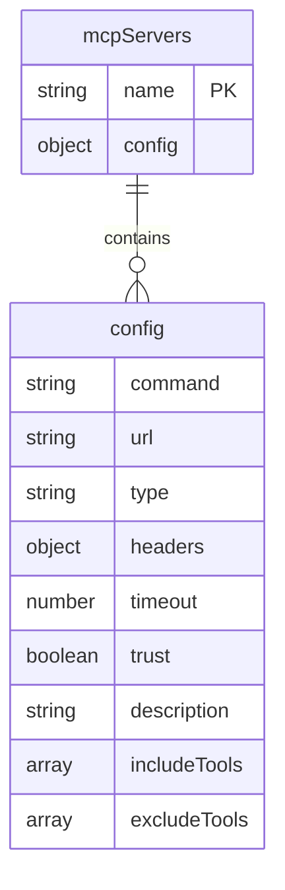
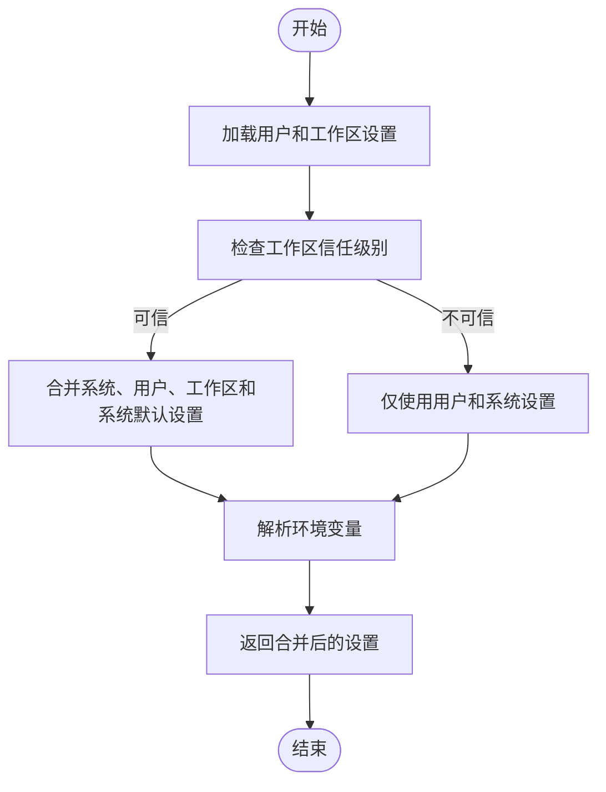
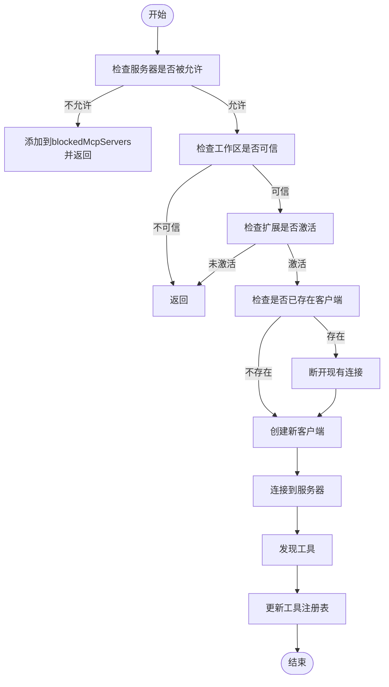
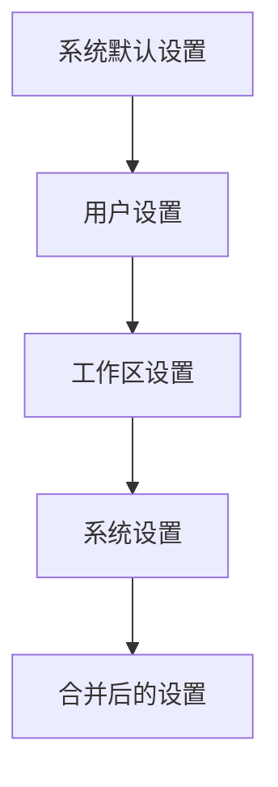
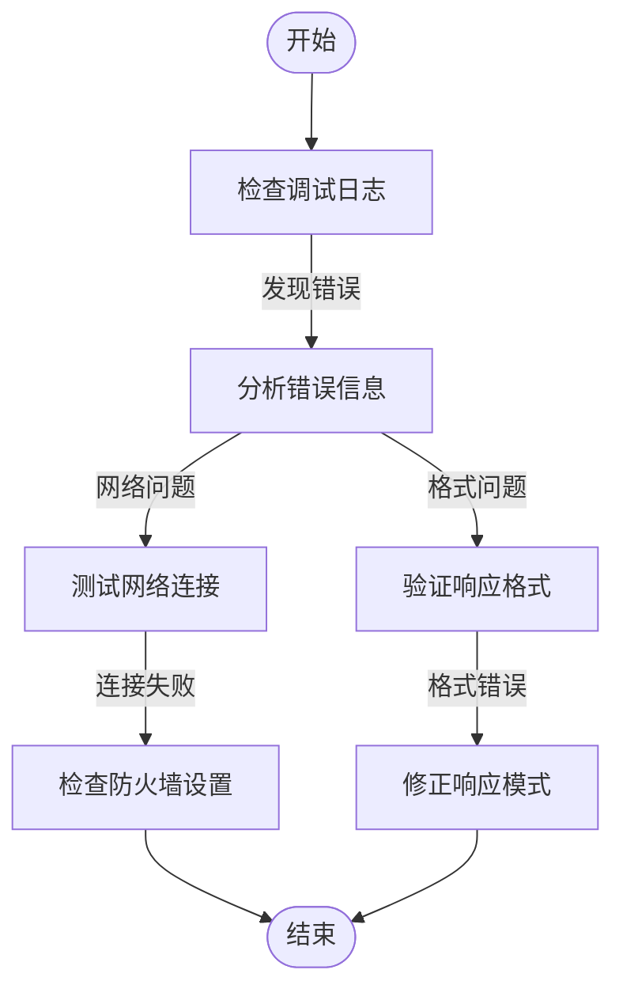
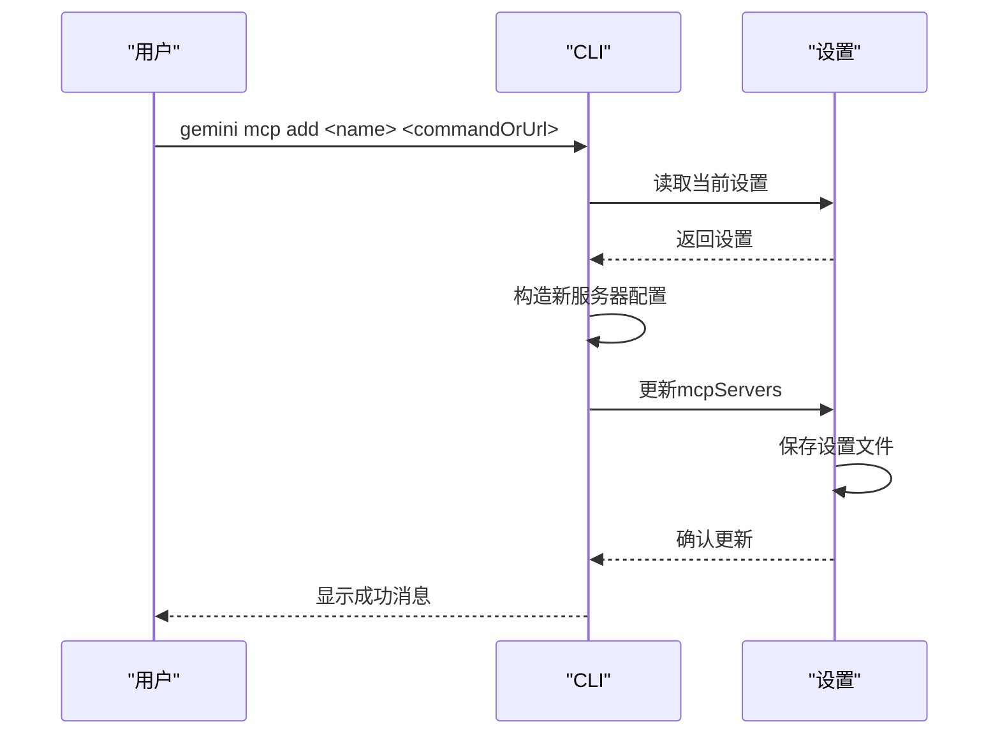
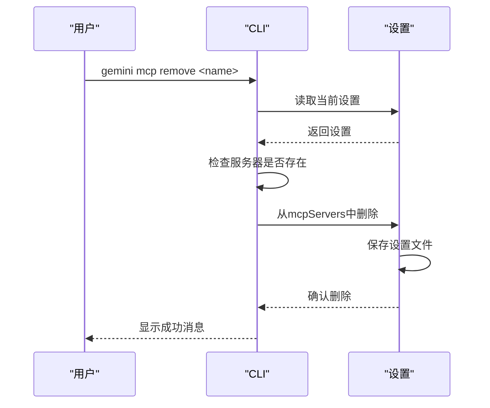

# MCP服务器配置

<cite>
**本文档引用的文件**
- [mcp-client-manager.ts](file://packages/core/src/tools/mcp-client-manager.ts)
- [add.ts](file://packages/cli/src/commands/mcp/add.ts)
- [remove.ts](file://packages/cli/src/commands/mcp/remove.ts)
- [mcp.ts](file://packages/cli/src/commands/mcp.ts)
- [config.ts](file://packages/core/src/config/config.ts)
- [settings.ts](file://packages/cli/src/config/settings.ts)
- [settingsSchema.ts](file://packages/cli/src/config/settingsSchema.ts)
</cite>

## 目录
1. [简介](#简介)
2. [配置文件结构](#配置文件结构)
3. [核心组件分析](#核心组件分析)
4. [配置加载与验证逻辑](#配置加载与验证逻辑)
5. [多服务器配置示例](#多服务器配置示例)
6. [配置合并与覆盖规则](#配置合并与覆盖规则)
7. [配置错误诊断](#配置错误诊断)
8. [CLI动态管理](#clidynamic-management)
9. [结论](#结论)

## 简介
本文档详细介绍了MCP（Model Context Protocol）服务器的配置方法，重点阐述了如何在`settings.json`文件中定义`mcpServers`配置项。文档深入解析了配置加载与验证的核心逻辑，说明了服务器URL、别名、工具前缀等参数的作用，并提供了多服务器配置的YAML/JSON示例。同时，文档还解释了配置的合并与覆盖规则，以及如何通过CLI命令动态管理服务器列表。

## 配置文件结构
MCP服务器的配置主要通过`settings.json`文件进行管理，该文件位于用户或项目目录中。配置的核心是`mcpServers`对象，它是一个键值对集合，其中键是服务器的唯一名称，值是服务器的详细配置。



**图表来源**
- [settingsSchema.ts](file://packages/cli/src/config/settingsSchema.ts#L142-L155)

**本节来源**
- [settingsSchema.ts](file://packages/cli/src/config/settingsSchema.ts#L140-L800)

## 核心组件分析
MCP服务器配置的核心组件包括配置管理器、客户端管理器和命令处理器。这些组件协同工作，确保服务器配置的正确加载、验证和执行。

### MCP客户端管理器
`McpClientManager`类负责管理多个MCP客户端的生命周期，包括启动、停止和发现工具。它通过`maybeDiscoverMcpServer`方法来处理服务器的发现和连接。

```mermaid
classDiagram
class McpClientManager {
+clients : Map<string, McpClient>
+toolRegistry : ToolRegistry
+cliConfig : Config
+discoveryPromise : Promise<void>
+discoveryState : MCPDiscoveryState
+eventEmitter : EventEmitter
+blockedMcpServers : Array<{name : string, extensionName : string}>
+getClient(serverName : string) : McpClient | undefined
+stopExtension(extension : GeminiCLIExtension) : Promise<void>
+startExtension(extension : GeminiCLIExtension) : Promise<void>
+isAllowedMcpServer(name : string) : boolean
+disconnectClient(name : string) : Promise<void>
+maybeDiscoverMcpServer(name : string, config : MCPServerConfig) : Promise<void> | void
+startConfiguredMcpServers() : Promise<void>
+restart() : Promise<void>
+restartServer(name : string) : Promise<void>
+stop() : Promise<void>
+getDiscoveryState() : MCPDiscoveryState
+getMcpServers() : Record<string, MCPServerConfig>
+getMcpInstructions() : string
}
class McpClient {
+serverName : string
+serverConfig : MCPServerConfig
+toolRegistry : ToolRegistry
+promptRegistry : PromptRegistry
+resourceRegistry : ResourceRegistry
+workspaceContext : WorkspaceContext
+cliConfig : Config
+debugMode : boolean
+onToolsUpdated : (signal? : AbortSignal) => Promise<void>
+connect() : Promise<void>
+discover(cliConfig : Config) : Promise<void>
+disconnect() : Promise<void>
}
McpClientManager --> McpClient : "manages"
```

**图表来源**
- [mcp-client-manager.ts](file://packages/core/src/tools/mcp-client-manager.ts#L28-L357)

**本节来源**
- [mcp-client-manager.ts](file://packages/core/src/tools/mcp-client-manager.ts#L1-L358)

## 配置加载与验证逻辑
配置加载与验证逻辑是MCP服务器配置的核心部分，确保了配置的正确性和安全性。

### 配置加载流程
配置加载流程从`loadSettings`函数开始，该函数读取用户和工作区的设置，并根据信任级别合并配置。



**图表来源**
- [settings.ts](file://packages/cli/src/config/settings.ts#L596-L789)

**本节来源**
- [settings.ts](file://packages/cli/src/config/settings.ts#L1-L845)

### 配置验证逻辑
配置验证逻辑主要在`maybeDiscoverMcpServer`方法中实现，该方法检查服务器是否被允许、工作区是否可信以及扩展是否激活。



**图表来源**
- [mcp-client-manager.ts](file://packages/core/src/tools/mcp-client-manager.ts#L136-L247)

**本节来源**
- [mcp-client-manager.ts](file://packages/core/src/tools/mcp-client-manager.ts#L136-L357)

## 多服务器配置示例
以下是一些常见的多服务器配置示例，展示了如何在`settings.json`文件中定义多个MCP服务器。

### JSON配置示例
```json
{
  "mcpServers": {
    "local-python": {
      "command": "python",
      "args": ["-m", "my_mcp_server"],
      "env": {
        "PYTHONPATH": "/path/to/modules"
      },
      "timeout": 30000,
      "trust": true,
      "description": "本地Python MCP服务器",
      "includeTools": ["read_file", "write_file"]
    },
    "remote-sse": {
      "url": "https://example.com/mcp-sse",
      "type": "sse",
      "headers": {
        "Authorization": "Bearer abc123",
        "X-Api-Key": "xyz789"
      },
      "timeout": 15000,
      "description": "远程SSE MCP服务器",
      "excludeTools": ["execute_command"]
    },
    "http-server": {
      "url": "https://api.example.com/mcp",
      "type": "http",
      "headers": {
        "Content-Type": "application/json"
      },
      "timeout": 20000,
      "description": "HTTP流式MCP服务器"
    }
  }
}
```

### YAML配置示例
```yaml
mcpServers:
  local-python:
    command: python
    args:
      - -m
      - my_mcp_server
    env:
      PYTHONPATH: /path/to/modules
    timeout: 30000
    trust: true
    description: 本地Python MCP服务器
    includeTools:
      - read_file
      - write_file
  remote-sse:
    url: https://example.com/mcp-sse
    type: sse
    headers:
      Authorization: Bearer abc123
      X-Api-Key: xyz789
    timeout: 15000
    description: 远程SSE MCP服务器
    excludeTools:
      - execute_command
  http-server:
    url: https://api.example.com/mcp
    type: http
    headers:
      Content-Type: application/json
    timeout: 20000
    description: HTTP流式MCP服务器
```

**本节来源**
- [config.ts](file://packages/core/src/config/config.ts#L181-L217)

## 配置合并与覆盖规则
配置合并与覆盖规则决定了不同作用域的配置如何相互影响。系统设置了最高优先级，其次是用户设置、工作区设置，最后是系统默认设置。

### 配置合并流程


**图表来源**
- [settings.ts](file://packages/cli/src/config/settings.ts#L418-L431)

**本节来源**
- [settings.ts](file://packages/cli/src/config/settings.ts#L409-L432)

### 覆盖规则
- **系统设置**：具有最高优先级，可以覆盖所有其他设置。
- **用户设置**：可以覆盖系统默认设置。
- **工作区设置**：仅在工作区可信时生效，可以覆盖用户设置。
- **系统默认设置**：提供最低优先级的默认值。

## 配置错误诊断
配置错误可能导致服务器无法正常连接或工具无法正确发现。以下是一些常见的配置错误类型及其诊断方法。

### 常见配置错误
- **无效URL**：服务器URL格式不正确或无法访问。
- **网络超时**：服务器响应时间过长，超过配置的超时时间。
- **响应格式错误**：服务器返回的数据格式不符合预期。

### 诊断方法
- **检查日志**：查看调试日志中的错误信息。
- **使用`list`命令**：通过`gemini mcp list`命令检查服务器状态。
- **手动测试**：使用curl或其他工具手动测试服务器端点。



**图表来源**
- [list.ts](file://packages/cli/src/commands/mcp/list.ts#L71-L108)

**本节来源**
- [list.ts](file://packages/cli/src/commands/mcp/list.ts#L1-L108)

## CLI动态管理
通过CLI命令可以动态地添加、删除和列出MCP服务器，提供了灵活的配置管理方式。

### 添加服务器
使用`gemini mcp add`命令可以添加新的MCP服务器。



**图表来源**
- [add.ts](file://packages/cli/src/commands/mcp/add.ts#L117-L138)

**本节来源**
- [add.ts](file://packages/cli/src/commands/mcp/add.ts#L1-L239)

### 删除服务器
使用`gemini mcp remove`命令可以删除现有的MCP服务器。



**图表来源**
- [remove.ts](file://packages/cli/src/commands/mcp/remove.ts#L32-L34)

**本节来源**
- [remove.ts](file://packages/cli/src/commands/mcp/remove.ts#L1-L64)

## 结论
本文档详细介绍了MCP服务器的配置方法，涵盖了配置文件结构、核心组件分析、配置加载与验证逻辑、多服务器配置示例、配置合并与覆盖规则、配置错误诊断以及CLI动态管理。通过这些内容，用户可以更好地理解和使用MCP服务器配置，确保系统的稳定和安全运行。