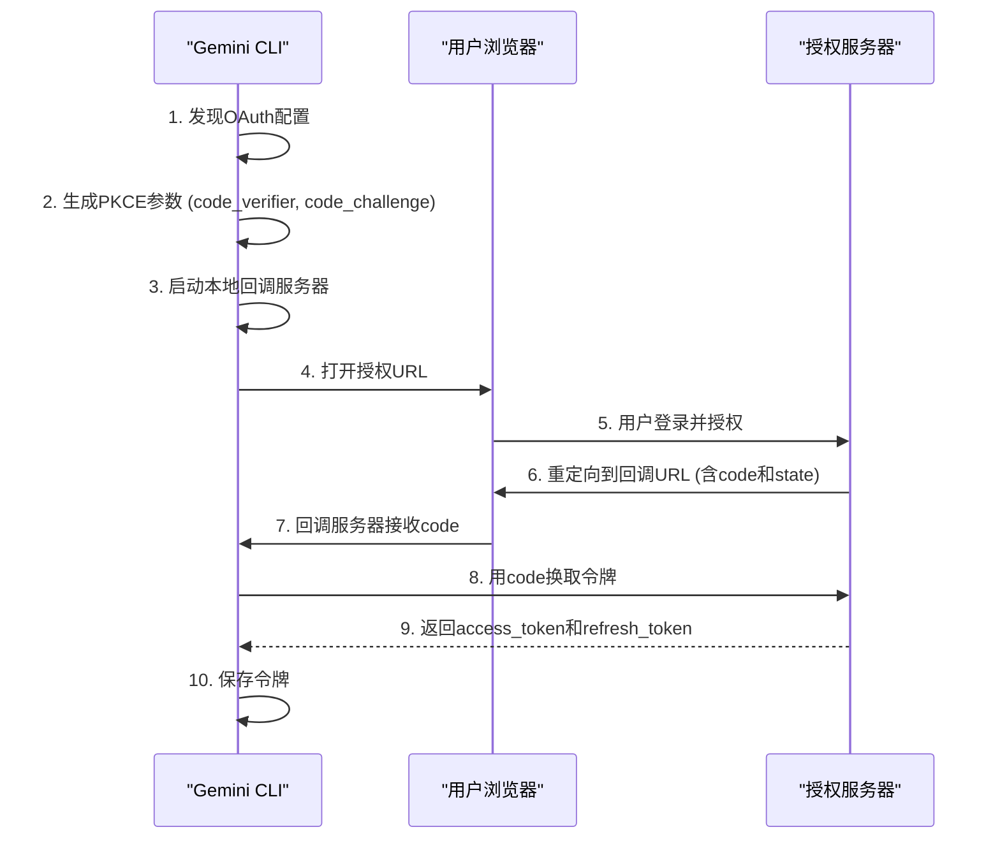
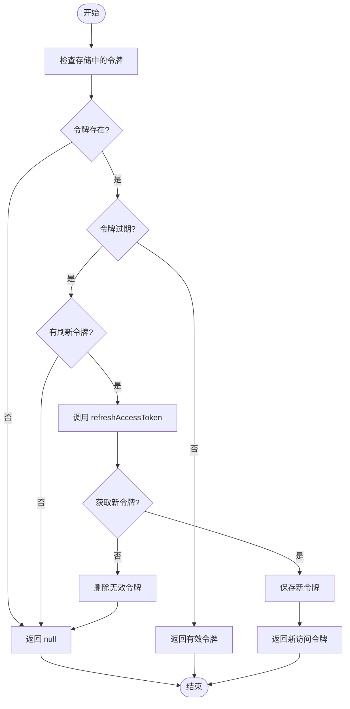

# MCP认证机制

<cite>
**本文档中引用的文件**   
- [oauth-provider.ts](file://packages/core/src/mcp/oauth-provider.ts)
- [google-auth-provider.ts](file://packages/core/src/mcp/google-auth-provider.ts)
- [oauth-token-storage.ts](file://packages/core/src/mcp/oauth-token-storage.ts)
- [keychain-token-storage.ts](file://packages/core/src/mcp/token-storage/keychain-token-storage.ts)
- [file-token-storage.ts](file://packages/core/src/mcp/token-storage/file-token-storage.ts)
- [authentication.md](file://docs/cli/authentication.md)
</cite>

## 目录
1. [MCP认证机制概述](#mcp认证机制概述)
2. [OAuth 2.0授权码流程](#oauth-20授权码流程)
3. [令牌获取与刷新机制](#令牌获取与刷新机制)
4. [令牌安全存储](#令牌安全存储)
5. `/mcp auth` 命令使用示例
6. [认证失败处理](#认证失败处理)

## MCP认证机制概述

MCP（Model Context Protocol）认证机制是Gemini CLI与MCP服务器安全通信的核心组件。该系统主要基于OAuth 2.0协议实现，通过`MCPOAuthProvider`类处理完整的授权码流程，并利用`MCPOAuthTokenStorage`类安全地持久化访问令牌和刷新令牌。对于Google服务，系统还提供了专用的`GoogleCredentialProvider`来利用Google Application Default Credentials (ADC)。

认证流程始于用户尝试连接到需要身份验证的MCP服务器。系统会自动检测服务器的认证需求，并通过标准的OAuth 2.0授权码流程（Authorization Code Flow）与PKCE（Proof Key for Code Exchange）扩展来获取访问令牌。整个过程包括动态发现OAuth配置、启动本地回调服务器、打开浏览器进行用户授权、处理回调以及最终的令牌交换。

**Section sources**
- [oauth-provider.ts](file://packages/core/src/mcp/oauth-provider.ts#L1-L1026)
- [google-auth-provider.ts](file://packages/core/src/mcp/google-auth-provider.ts#L1-L158)

## OAuth 2.0授权码流程

MCP的OAuth 2.0授权码流程遵循RFC 6749标准，并集成了PKCE以增强安全性。流程的起点是`MCPOAuthProvider.authenticate`方法，该方法负责协调整个认证过程。

流程的第一步是配置发现。如果MCP服务器的配置中未提供`authorizationUrl`，系统会尝试通过标准的`.well-known`端点（如`/.well-known/oauth-protected-resource`）或`WWW-Authenticate`响应头来自动发现OAuth服务器的元数据。这一发现过程由`OAuthUtils`类中的`discoverOAuthConfig`和`discoverOAuthFromWWWAuthenticate`方法实现。

发现成功后，系统会生成PKCE参数，包括`codeVerifier`、`codeChallenge`和`state`。`codeVerifier`是一个高熵的随机字符串，`codeChallenge`是其SHA-256哈希值，用于防止授权码拦截攻击。`state`参数则用于防止跨站请求伪造（CSRF）攻击。

紧接着，系统会启动一个本地HTTP服务器来监听OAuth回调。这个服务器在`startCallbackServer`方法中创建，通常监听`localhost`上的一个随机端口。服务器会验证回调请求中的`state`参数以确保其与之前生成的值匹配，并提取授权码`code`。

最后，系统构建授权URL，将`clientId`、`redirect_uri`、`scope`、`code_challenge`等参数作为查询参数附加到`authorizationUrl`上。然后，系统会自动打开用户的默认浏览器，引导用户完成登录和授权。用户授权后，授权服务器会将浏览器重定向到本地回调服务器，从而完成流程。



**Diagram sources **
- [oauth-provider.ts](file://packages/core/src/mcp/oauth-provider.ts#L246-L393)
- [oauth-provider.ts](file://packages/core/src/mcp/oauth-provider.ts#L792-L878)

## 令牌获取与刷新机制

令牌的获取与刷新是`MCPOAuthProvider`类的核心功能，由`exchangeCodeForToken`和`refreshAccessToken`两个关键方法实现。

当从回调服务器获取到授权码`code`后，`exchangeCodeForToken`方法会向授权服务器的`tokenUrl`发起一个POST请求。该请求的主体是`application/x-www-form-urlencoded`格式，包含`grant_type=authorization_code`、`code`、`redirect_uri`、`client_id`和`code_verifier`等参数。如果配置了`clientSecret`，它也会被包含在请求中。成功响应后，服务器会返回一个包含`access_token`、`refresh_token`（可选）和`expires_in`（可选）的JSON对象。

为了处理令牌过期，系统实现了自动刷新机制。`getValidToken`方法是获取有效访问令牌的入口点。它首先从存储中检索已保存的令牌。如果令牌存在且未过期，则直接返回。如果令牌已过期但存在`refresh_token`，系统会调用`refreshAccessToken`方法。该方法会向`tokenUrl`发起另一个POST请求，其中`grant_type=refresh_token`，并附上`refresh_token`和`client_id`。新的令牌响应会被解析并保存，以替换旧的令牌。

整个机制设计为对用户透明。当用户执行需要认证的操作时，系统会自动调用`getValidToken`，确保始终使用有效的访问令牌，必要时会静默地刷新令牌。



**Diagram sources **
- [oauth-provider.ts](file://packages/core/src/mcp/oauth-provider.ts#L462-L577)
- [oauth-provider.ts](file://packages/core/src/mcp/oauth-provider.ts#L587-L698)
- [oauth-provider.ts](file://packages/core/src/mcp/oauth-provider.ts#L954-L1024)

## 令牌安全存储

MCP系统通过一个分层的令牌存储架构来安全地持久化敏感的认证信息。核心是`MCPOAuthTokenStorage`类，它根据环境配置决定使用`HybridTokenStorage`还是传统的文件存储。

`HybridTokenStorage`是首选的存储策略，它结合了`keychain-token-storage`和`file-token-storage`的优点。在macOS上，它优先使用系统的钥匙串（Keychain）来存储令牌，利用操作系统的安全机制提供最高级别的保护。`KeychainTokenStorage`类通过`keytar`模块与钥匙串服务交互，将每个MCP服务器的凭证作为服务（service）和账户（account）的组合进行存储。

如果钥匙串不可用或系统不是macOS，`HybridTokenStorage`会回退到`FileTokenStorage`。`FileTokenStorage`将令牌加密后存储在用户主目录下的一个隐藏文件中（`~/.gemini/mcp-oauth-tokens-v2.json`）。加密使用AES-256-GCM算法，密钥通过`scrypt`函数从主机名、用户名和一个固定盐值派生而来，确保即使文件被窃取也难以解密。

`BaseTokenStorage`类为所有存储实现提供了统一的抽象，定义了`getCredentials`、`setCredentials`、`deleteCredentials`等核心方法，并包含了令牌过期检查和凭证验证的公共逻辑。

**Section sources**
- [oauth-token-storage.ts](file://packages/core/src/mcp/oauth-token-storage.ts#L1-L235)
- [keychain-token-storage.ts](file://packages/core/src/mcp/token-storage/keychain-token-storage.ts#L1-L332)
- [file-token-storage.ts](file://packages/core/src/mcp/token-storage/file-token-storage.ts#L1-L186)

## `/mcp auth` 命令使用示例

`/mcp auth`命令是用户手动触发MCP服务器认证的主要方式。其基本用法如下：

```bash
# 为名为 "my-mcp-server" 的服务器进行认证
gemini mcp auth my-mcp-server

# 列出所有已认证的MCP服务器
gemini mcp list
```

当执行`gemini mcp auth <server-name>`时，CLI会查找该服务器的配置。如果配置了OAuth，它会启动上述的完整授权码流程。用户将被引导至浏览器完成登录，之后令牌会被自动获取并安全存储。如果服务器支持动态客户端注册，CLI甚至会自动注册一个临时客户端。

对于使用Google ADC的服务器，认证流程是无感的。`GoogleCredentialProvider`会直接从环境（如`gcloud`命令行工具的凭据）中获取访问令牌，无需用户交互。

## 认证失败处理

认证失败可能由多种原因引起，系统提供了相应的错误处理和解决策略。

常见原因包括：
1.  **网络问题**：无法访问授权服务器或MCP服务器。检查网络连接和服务器URL。
2.  **配置错误**：`authorizationUrl`或`tokenUrl`配置不正确。确保服务器配置准确无误。
3.  **用户取消**：用户在浏览器中关闭了授权页面或拒绝了授权。重新运行`/mcp auth`命令即可。
4.  **令牌过期且刷新失败**：`refresh_token`可能已失效。此时需要用户重新进行完整的授权码流程。
5.  **动态注册失败**：如果服务器要求动态注册但未提供`registrationUrl`，认证会失败。需要手动配置`clientId`和`clientSecret`。

系统通过`coreEvents`发出详细的错误反馈，帮助用户诊断问题。例如，`refreshAccessToken`方法在刷新失败时会发出`'error'`事件，并删除无效的令牌，强制用户重新认证。

**Section sources**
- [oauth-provider.ts](file://packages/core/src/mcp/oauth-provider.ts#L713-L766)
- [oauth-provider.ts](file://packages/core/src/mcp/oauth-provider.ts#L1013-L1020)
- [authentication.md](file://docs/cli/authentication.md#L1-L100)