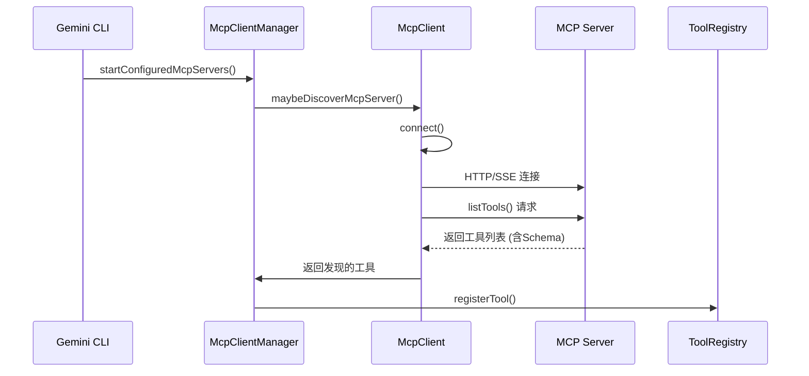
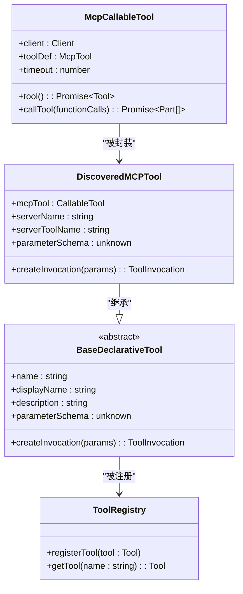
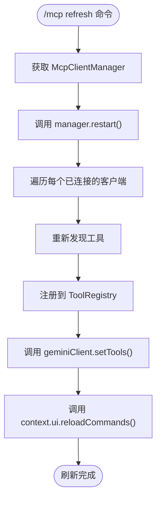

# 工具发现与集成

<cite>
**本文档中引用的文件**  
- [mcp-client.ts](file://packages/core/src/tools/mcp-client.ts)
- [mcp-client-manager.ts](file://packages/core/src/tools/mcp-client-manager.ts)
- [mcp-tool.ts](file://packages/core/src/tools/mcp-tool.ts)
- [mcpCommand.ts](file://packages/cli/src/ui/commands/mcpCommand.ts)
- [McpPromptLoader.ts](file://packages/core/src/services/McpPromptLoader.ts)
- [modelConfigService.ts](file://packages/core/src/services/modelConfigService.ts)
</cite>

## 目录
1. [简介](#简介)
2. [工具发现机制](#工具发现机制)
3. [工具封装与注册](#工具封装与注册)
4. [发现缓存与刷新命令](#发现缓存与刷新命令)
5. [工具上下文注入](#工具上下文注入)
6. [总结](#总结)

## 简介
本技术文档深入解析了Gemini CLI中MCP（Model Context Protocol）工具的发现、集成与管理机制。文档详细阐述了系统如何通过`/list`和`/schema`端点与MCP服务器交互，动态获取可用工具及其JSON Schema定义，并将这些远程工具封装为本地可调用的对象。同时，文档还说明了工具发现结果的缓存策略、`/mcp refresh`命令的作用，以及如何通过`modelConfigService`将新发现的工具上下文注入到AI模型的提示词中，使其能够知晓并调用这些扩展功能。

## 工具发现机制
MCP工具的发现过程由`mcp-client.ts`文件中的核心函数驱动，主要通过`discoverMcpTools`和`connectAndDiscover`函数实现。该过程始于CLI启动或用户手动触发，系统会遍历所有配置的MCP服务器。

对于每个服务器，系统首先通过`connectToMcpServer`建立连接。连接成功后，客户端会调用MCP协议的`tools/list`端点（在代码中通过`mcpClient.listTools()`实现）来获取服务器上所有可用工具的列表。此请求的响应包含每个工具的名称、描述和最重要的`inputSchema`（输入JSON Schema）。该Schema定义了工具的参数结构、类型、是否必需等元数据，是AI模型理解如何调用该工具的关键。



**Diagram sources**
- [mcp-client.ts](file://packages/core/src/tools/mcp-client.ts#L712-L741)
- [mcp-client-manager.ts](file://packages/core/src/tools/mcp-client-manager.ts#L261-L277)

**Section sources**
- [mcp-client.ts](file://packages/core/src/tools/mcp-client.ts#L712-L954)
- [mcp-client-manager.ts](file://packages/core/src/tools/mcp-client-manager.ts#L261-L305)

## 工具封装与注册
一旦工具列表和Schema被发现，`mcp-client.ts`中的`discoverTools`函数会将这些原始数据封装成可在系统内部使用的对象。每个工具首先被包装成一个`McpCallableTool`实例，该实例实现了`CallableTool`接口，其核心是`callTool`方法，负责通过`mcpClient.callTool()`向远程服务器发起实际的调用。

随后，一个`DiscoveredMCPTool`对象被创建。这个类继承自`BaseDeclarativeTool`，它不仅包含了工具的调用能力，还包含了其元数据（如名称、描述、Schema）。`DiscoveredMCPTool`的关键作用是作为一个适配器，将MCP协议的工具抽象与Gemini CLI的核心工具系统（`ToolRegistry`）连接起来。最后，`McpClientManager`将这些`DiscoveredMCPTool`实例注册到全局的`ToolRegistry`中，使它们成为系统可用工具的一部分。



**Diagram sources**
- [mcp-tool.ts](file://packages/core/src/tools/mcp-tool.ts#L215-L283)
- [mcp-client.ts](file://packages/core/src/tools/mcp-client.ts#L887-L927)

**Section sources**
- [mcp-tool.ts](file://packages/core/src/tools/mcp-tool.ts#L1-L430)
- [mcp-client.ts](file://packages/core/src/tools/mcp-client.ts#L887-L954)

## 发现缓存与刷新命令
工具发现的结果是动态的，但并非每次都需要重新发现。系统通过`McpClient`类的内部状态（如`isRefreshingTools`标志）和连接状态来管理发现结果的缓存。当一个MCP服务器首次连接时，会进行一次完整的发现过程。之后，如果服务器支持，它可以通过`tool/listChanged`通知来告知客户端工具列表已更新，从而触发增量刷新。

`/mcp refresh`命令是手动刷新机制的核心。该命令在`mcpCommand.ts`中定义，其`action`会调用`McpClientManager`的`restart()`方法。`restart()`方法会遍历所有已连接的MCP客户端，对每个客户端调用`maybeDiscoverMcpServer`，这相当于重新执行了连接和发现的完整流程。这确保了工具注册表与服务器的最新状态保持同步。刷新完成后，系统会调用`geminiClient.setTools()`和`context.ui.reloadCommands()`来更新AI模型的可用工具列表和用户界面。



**Diagram sources**
- [mcpCommand.ts](file://packages/cli/src/ui/commands/mcpCommand.ts#L321-L367)
- [mcp-client-manager.ts](file://packages/core/src/tools/mcp-client-manager.ts#L282-L294)

**Section sources**
- [mcpCommand.ts](file://packages/cli/src/ui/commands/mcpCommand.ts#L321-L383)
- [mcp-client-manager.ts](file://packages/core/src/tools/mcp-client-manager.ts#L282-L305)

## 工具上下文注入
为了让AI模型能够“知晓”新发现的工具，系统需要将工具的元数据注入到发送给模型的提示词（prompt）中。这一过程由`modelConfigService.ts`负责。该服务会从`McpClientManager`获取所有已连接MCP服务器的指令（instructions）和工具信息。

`McpClientManager`提供了一个`getMcpInstructions()`方法，它会收集所有已连接客户端的`getInstructions()`返回值，并将它们格式化为一段结构化的文本。这段文本随后被`modelConfigService`整合到模型的系统提示词中。当模型生成响应时，它会看到这些指令，从而理解它可以调用哪些MCP工具以及如何调用它们。此外，`McpPromptLoader`还会将MCP服务器暴露的`prompts`加载为可执行的斜杠命令，进一步扩展了用户的交互能力。

```mermaid
graph TB
subgraph "MCP Servers"
Server1[MCP Server 1]
Server2[MCP Server 2]
end
subgraph "Gemini CLI Core"
Manager[McpClientManager]
Service[modelConfigService]
Model[AI Model]
end
Server1 --> |提供 instructions| Manager
Server2 --> |提供 instructions| Manager
Manager --> |getMcpInstructions()| Service
Service --> |注入上下文| Model
Model --> |知晓并调用| Server1
Model --> |知晓并调用| Server2
```

**Diagram sources**
- [modelConfigService.ts](file://packages/core/src/services/modelConfigService.ts)
- [mcp-client-manager.ts](file://packages/core/src/tools/mcp-client-manager.ts#L330-L357)
- [McpPromptLoader.ts](file://packages/core/src/services/McpPromptLoader.ts)

**Section sources**
- [modelConfigService.ts](file://packages/core/src/services/modelConfigService.ts)
- [mcp-client-manager.ts](file://packages/core/src/tools/mcp-client-manager.ts#L330-L357)
- [McpPromptLoader.ts](file://packages/core/src/services/McpPromptLoader.ts)

## 总结
Gemini CLI的MCP工具集成机制是一个高效且动态的系统。它通过标准化的协议与外部服务器交互，实现了工具的自动发现、安全封装和集中注册。通过`/mcp refresh`命令，用户可以随时同步最新的工具状态。最关键的是，通过`modelConfigService`的服务，新发现的工具能力能够无缝地注入到AI模型的上下文中，极大地扩展了模型的交互能力和实用性，实现了本地环境与AI智能体之间的强大连接。