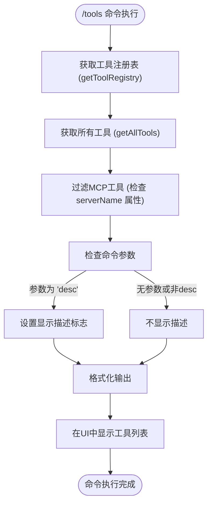
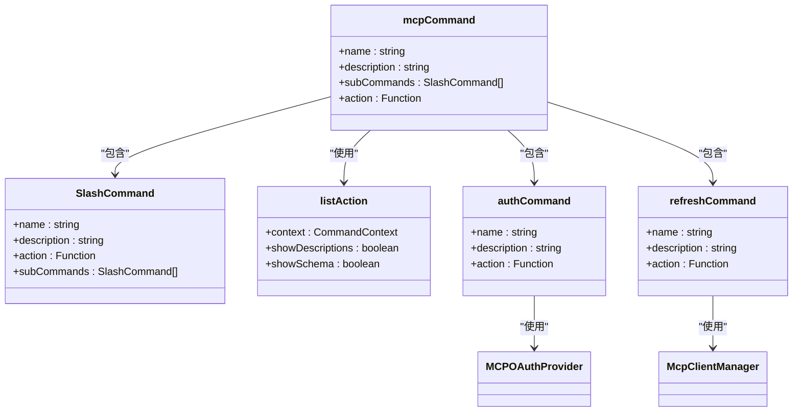
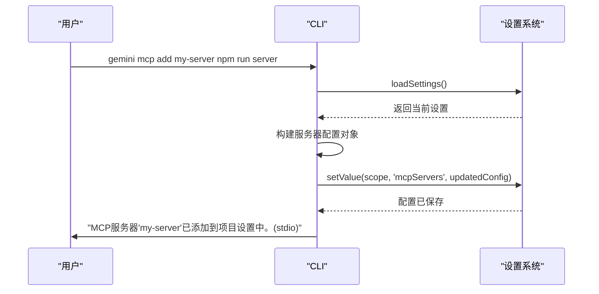
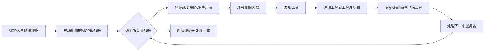

# 工具管理命令

<cite>
**本文档中引用的文件**  
- [toolsCommand.ts](file://packages/cli/src/ui/commands/toolsCommand.ts)
- [mcpCommand.ts](file://packages/cli/src/ui/commands/mcpCommand.ts)
- [mcp-client-manager.ts](file://packages/core/src/tools/mcp-client-manager.ts)
- [tool-registry.ts](file://packages/core/src/tools/tool-registry.ts)
- [add.ts](file://packages/cli/src/commands/mcp/add.ts)
- [list.ts](file://packages/cli/src/commands/mcp/list.ts)
- [remove.ts](file://packages/cli/src/commands/mcp/remove.ts)
</cite>

## 目录
1. [简介](#简介)
2. [工具命令](#工具命令)
3. [MCP命令](#mcp命令)
4. [MCP服务器配置](#mcp服务器配置)
5. [核心组件分析](#核心组件分析)
6. [依赖关系分析](#依赖关系分析)

## 简介
本文档详细介绍了Gemini CLI中的工具管理命令，重点阐述了`/tools`和`/mcp`命令的功能、实现机制和使用方法。文档深入解析了这些命令如何与核心系统组件交互，包括工具注册表（tool-registry）和MCP客户端管理器（mcp-client-manager），以及它们在AI模型工具暴露和管理中的作用。

## 工具命令
`/tools`命令用于列出当前可用的Gemini CLI工具。该命令通过查询工具注册表（tool-registry）来获取所有已注册的工具，并根据用户参数决定是否显示工具描述。

当执行`/tools`命令时，系统会从配置服务中获取工具注册表实例，调用`getAllTools()`方法获取所有工具。然后，它会过滤掉MCP工具（通过检查`serverName`属性），只显示Gemini核心工具。输出格式为一个工具列表，包含工具名称、显示名称和描述。默认情况下不显示描述，用户可以通过添加`desc`或`descriptions`参数来请求显示详细描述。



**图示来源**
- [toolsCommand.ts](file://packages/cli/src/ui/commands/toolsCommand.ts#L19-L54)

**本节来源**
- [toolsCommand.ts](file://packages/cli/src/ui/commands/toolsCommand.ts#L1-L57)
- [tool-registry.ts](file://packages/core/src/tools/tool-registry.ts#L294-L298)

## MCP命令
`/mcp`命令是一个复合命令，用于管理和监控Model Context Protocol (MCP) 服务器。它提供了一系列子命令，包括`list`、`desc`、`schema`、`auth`和`refresh`，用于执行不同的MCP服务器管理任务。

### 子命令功能
- **list**: 列出所有配置的MCP服务器及其状态
- **desc**: 列出服务器和工具，并包含描述信息
- **schema**: 列出服务器、工具、提示和资源，并包含完整的JSON Schema
- **auth**: 为OAuth认证的MCP服务器执行认证流程
- **refresh**: 重启所有MCP服务器以重新发现工具

这些子命令通过`mcpCommand`对象的`subCommands`数组进行注册，并共享一个核心的`listAction`函数来处理大部分逻辑。



**图示来源**
- [mcpCommand.ts](file://packages/cli/src/ui/commands/mcpCommand.ts#L370-L383)
- [mcp-client-manager.ts](file://packages/core/src/tools/mcp-client-manager.ts#L282-L294)

**本节来源**
- [mcpCommand.ts](file://packages/cli/src/ui/commands/mcpCommand.ts#L31-L383)
- [mcp-client-manager.ts](file://packages/core/src/tools/mcp-client-manager.ts#L282-L294)

## MCP服务器配置
MCP服务器可以通过命令行工具进行配置，支持添加、列出和删除操作。服务器配置信息存储在用户或项目级别的设置文件中。

### 添加MCP服务器
使用`gemini mcp add`命令可以添加新的MCP服务器。该命令支持多种传输类型（stdio, sse, http），并允许指定环境变量、HTTP头、超时等选项。



**图示来源**
- [add.ts](file://packages/cli/src/commands/mcp/add.ts#L139-L238)

### 列出MCP服务器
`gemini mcp list`命令用于列出所有已配置的MCP服务器及其连接状态。该命令会尝试连接到每个服务器以测试其可达性。

**本节来源**
- [list.ts](file://packages/cli/src/commands/mcp/list.ts#L1-L152)
- [add.ts](file://packages/cli/src/commands/mcp/add.ts#L1-L239)

### 删除MCP服务器
`gemini mcp remove`命令用于从配置中删除指定的MCP服务器。

**本节来源**
- [remove.ts](file://packages/cli/src/commands/mcp/remove.ts#L1-L64)

## 核心组件分析
### 工具注册表 (Tool Registry)
工具注册表是系统的核心组件，负责管理所有可用工具的生命周期。它提供了注册、查询和删除工具的接口，并维护工具的排序和过滤逻辑。

**本节来源**
- [tool-registry.ts](file://packages/core/src/tools/tool-registry.ts#L277-L304)

### MCP客户端管理器 (MCP Client Manager)
MCP客户端管理器负责管理所有MCP客户端的生命周期，包括连接、断开连接和工具发现。它与工具注册表紧密协作，当发现新工具时会自动注册到工具注册表中。



**图示来源**
- [mcp-client-manager.ts](file://packages/core/src/tools/mcp-client-manager.ts#L261-L277)

**本节来源**
- [mcp-client-manager.ts](file://packages/core/src/tools/mcp-client-manager.ts#L1-L358)

## 依赖关系分析
系统中各个组件之间存在明确的依赖关系。`/tools`和`/mcp`命令依赖于配置服务来获取工具注册表和MCP客户端管理器实例。工具注册表和MCP客户端管理器是核心服务，被多个上层组件所依赖。

```mermaid
graph TD
A[/tools 命令] --> B[配置服务]
C[/mcp 命令] --> B
B --> D[工具注册表]
B --> E[MCP客户端管理器]
E --> D
F[MCP客户端] --> E
G[工具] --> D
```

**图示来源**
- [mcp-client-manager.ts](file://packages/core/src/tools/mcp-client-manager.ts#L28-L35)
- [toolsCommand.ts](file://packages/cli/src/ui/commands/toolsCommand.ts#L28-L30)

**本节来源**
- [mcp-client-manager.ts](file://packages/core/src/tools/mcp-client-manager.ts#L1-L358)
- [toolsCommand.ts](file://packages/cli/src/ui/commands/toolsCommand.ts#L1-L57)