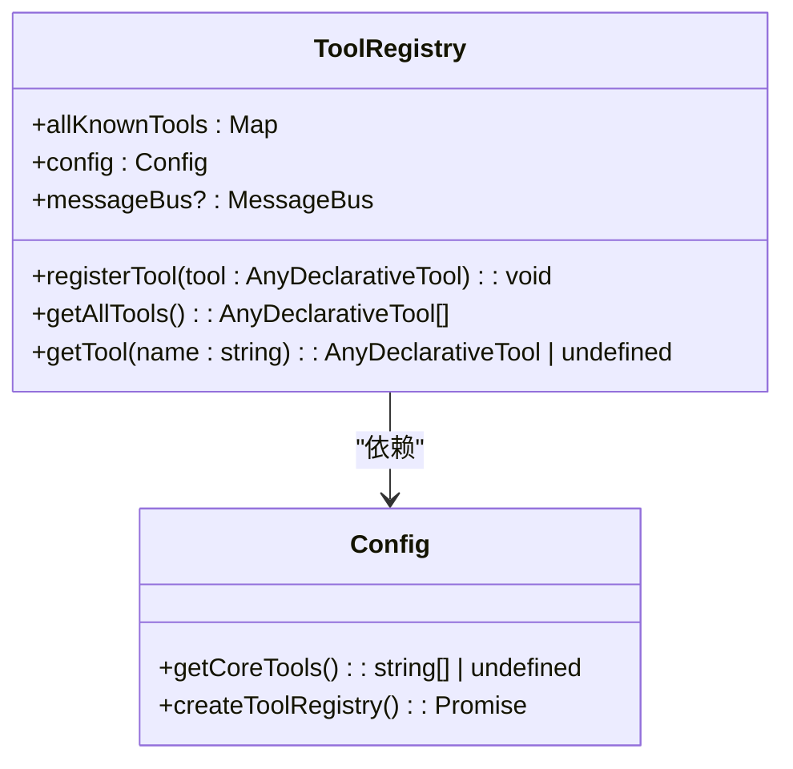
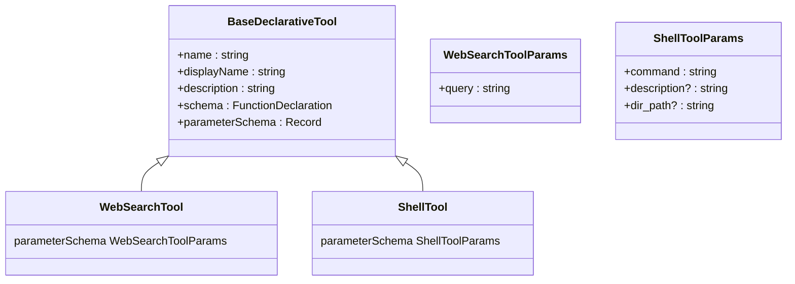
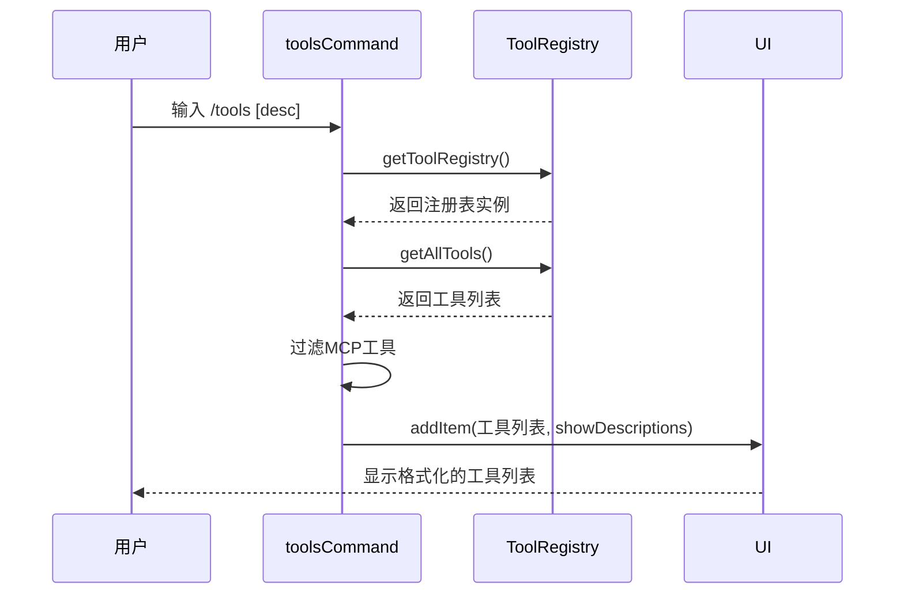
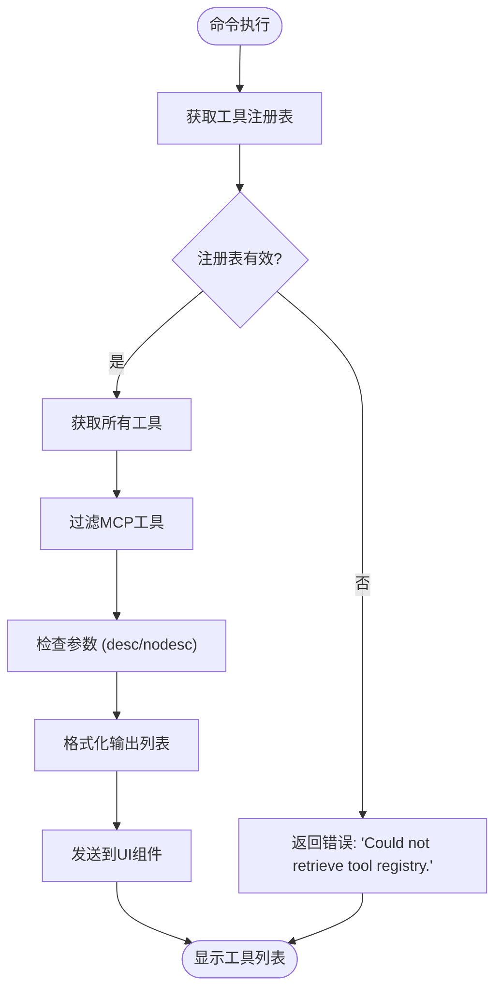

# 本地工具管理

<cite>
**本文档中引用的文件**  
- [toolsCommand.ts](file://packages/cli/src/ui/commands/toolsCommand.ts)
- [tool-registry.ts](file://packages/core/src/tools/tool-registry.ts)
- [tools.ts](file://packages/core/src/tools/tools.ts)
- [shell.ts](file://packages/core/src/tools/shell.ts)
- [web-search.ts](file://packages/core/src/tools/web-search.ts)
- [config.ts](file://packages/core/src/config/config.ts)
</cite>

## 目录
1. [简介](#简介)
2. [核心组件](#核心组件)
3. [工具注册机制](#工具注册机制)
4. [工具元数据与参数](#工具元数据与参数)
5. `/tools` 命令实现
6. [输出格式与错误处理](#输出格式与错误处理)
7. [核心调度系统集成](#核心调度系统集成)

## 简介
本文档详细介绍了 Gemini CLI 中本地工具管理系统的实现，重点分析 `/tools` 命令如何与 `tool-registry` 交互以获取和展示所有已注册的内置工具。文档深入解析了文件系统、shell、网络搜索等工具的注册、查询和调用机制，并说明了这些工具如何被核心调度系统集成和执行。

## 核心组件
本地工具管理系统由多个核心组件构成，包括命令处理器、工具注册表、工具定义和执行器。`toolsCommand.ts` 负责处理 `/tools` 命令的用户请求，`tool-registry.ts` 管理所有工具的生命周期，而具体的工具实现（如 `shell.ts` 和 `web-search.ts`）则定义了各自的业务逻辑。

**Section sources**
- [toolsCommand.ts](file://packages/cli/src/ui/commands/toolsCommand.ts)
- [tool-registry.ts](file://packages/core/src/tools/tool-registry.ts)

## 工具注册机制
工具注册机制通过 `ToolRegistry` 类实现，该类负责管理所有已注册的工具实例。工具在系统初始化时通过 `Config` 类的 `createToolRegistry` 方法进行注册。注册过程会根据配置中的 `coreTools` 列表决定哪些核心工具是启用的。

**Diagram sources**
- [tool-registry.ts](file://packages/core/src/tools/tool-registry.ts)
- [config.ts](file://packages/core/src/config/config.ts)

**Section sources**
- [tool-registry.ts](file://packages/core/src/tools/tool-registry.ts)
- [config.ts](file://packages/core/src/config/config.ts)

## 工具元数据与参数
每个工具都包含丰富的元数据，如名称、描述和参数模式。这些信息在 `BaseDeclarativeTool` 基类中定义，并通过 `FunctionDeclaration` 结构暴露给 LLM。例如，`WebSearchTool` 的参数包括一个必需的 `query` 字符串。

**Diagram sources**
- [tools.ts](file://packages/core/src/tools/tools.ts)
- [web-search.ts](file://packages/core/src/tools/web-search.ts)
- [shell.ts](file://packages/core/src/tools/shell.ts)

**Section sources**
- [tools.ts](file://packages/core/src/tools/tools.ts)
- [web-search.ts](file://packages/core/src/tools/web-search.ts)
- [shell.ts](file://packages/core/src/tools/shell.ts)

## `/tools` 命令实现
`/tools` 命令的实现位于 `toolsCommand.ts` 文件中。该命令通过 `CommandContext` 获取 `ToolRegistry` 实例，然后调用 `getAllTools()` 方法获取所有已注册的工具。根据用户提供的参数（`desc` 或 `nodesc`），命令会决定是否在输出中包含工具的详细描述。

**Diagram sources**
- [toolsCommand.ts](file://packages/cli/src/ui/commands/toolsCommand.ts)
- [tool-registry.ts](file://packages/core/src/tools/tool-registry.ts)

**Section sources**
- [toolsCommand.ts](file://packages/cli/src/ui/commands/toolsCommand.ts)

## 输出格式与错误处理
`/tools` 命令的输出格式为 `HistoryItemToolsList`，包含工具名称、显示名称和可选的描述。当无法获取工具注册表时，系统会返回一个错误消息。工具执行过程中的错误通过 `ToolErrorType` 枚举进行分类，例如 `SHELL_EXECUTE_ERROR` 或 `WEB_SEARCH_FAILED`。

**Diagram sources**
- [toolsCommand.ts](file://packages/cli/src/ui/commands/toolsCommand.ts)
- [tool-error.ts](file://packages/core/src/tools/tool-error.ts)

**Section sources**
- [toolsCommand.ts](file://packages/cli/src/ui/commands/toolsCommand.ts)
- [tool-error.ts](file://packages/core/src/tools/tool-error.ts)

## 核心调度系统集成
工具通过核心调度系统被调用，该系统利用 `ToolInvocation` 接口来执行具体的工具逻辑。每个工具的 `execute` 方法在被调用时会接收一个 `AbortSignal` 用于取消操作，并可选择性地提供一个回调函数来流式传输输出。调度系统还负责处理工具确认、错误报告和结果返回。

**Section sources**
- [tools.ts](file://packages/core/src/tools/tools.ts)
- [coreToolScheduler.ts](file://packages/core/src/core/coreToolScheduler.ts)