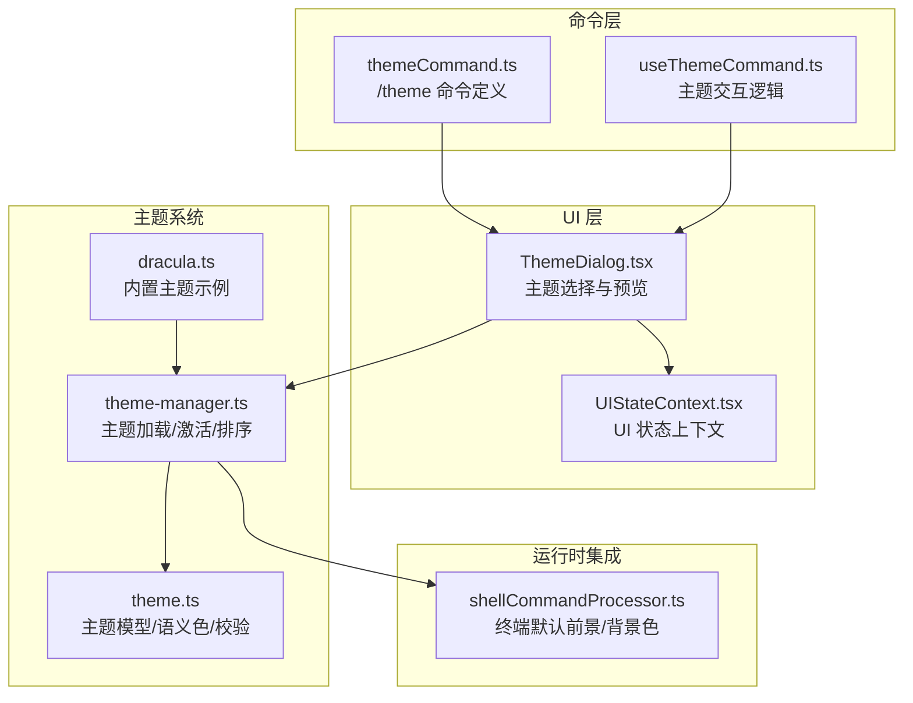
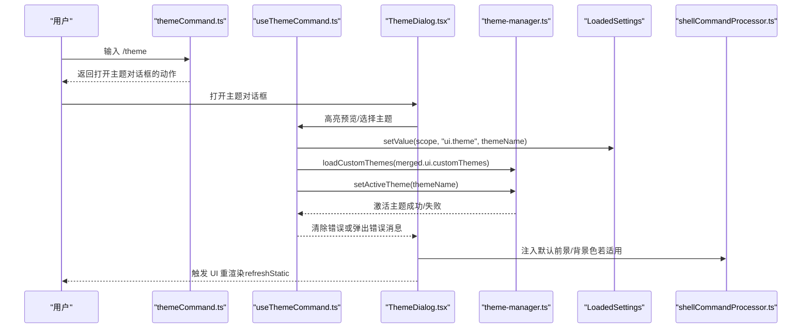
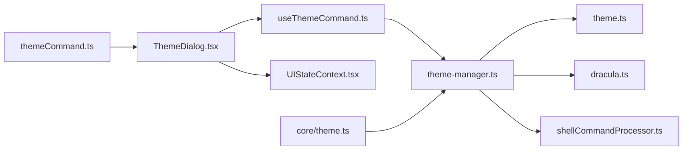

# 主题命令 (/theme)

<cite>
**本文引用的文件**
- [themeCommand.ts](file://packages/cli/src/ui/commands/themeCommand.ts)
- [useThemeCommand.ts](file://packages/cli/src/ui/hooks/useThemeCommand.ts)
- [ThemeDialog.tsx](file://packages/cli/src/ui/components/ThemeDialog.tsx)
- [theme-manager.ts](file://packages/cli/src/ui/themes/theme-manager.ts)
- [theme.ts](file://packages/cli/src/ui/themes/theme.ts)
- [dracula.ts](file://packages/cli/src/ui/themes/dracula.ts)
- [shellCommandProcessor.ts](file://packages/cli/src/ui/hooks/shellCommandProcessor.ts)
- [theme.ts（核心校验）](file://packages/cli/src/core/theme.ts)
- [themes.md](file://docs/cli/themes.md)
- [UIStateContext.tsx](file://packages/cli/src/ui/contexts/UIStateContext.tsx)
</cite>

## 目录
1. [简介](#简介)
2. [项目结构](#项目结构)
3. [核心组件](#核心组件)
4. [架构总览](#架构总览)
5. [详细组件分析](#详细组件分析)
6. [依赖分析](#依赖分析)
7. [性能考虑](#性能考虑)
8. [故障排查指南](#故障排查指南)
9. [结论](#结论)
10. [附录](#附录)

## 简介
本文件为 /theme 命令的权威文档，面向终端用户与开发者，系统性说明该命令如何切换 CLI 的视觉主题。内容涵盖：
- 命令语法与行为：/theme 打开主题选择对话框；支持在对话框中预览并确认应用主题。
- 内部实现：theme-manager 如何加载内置主题与自定义主题（含文件路径主题），如何将当前主题应用到 UI 并触发重渲染。
- 使用示例：列出可用主题、选择主题、持久化设置、从文件加载主题等。
- 权限与环境：无需特殊权限；受 NO_COLOR 环境变量影响。
- 错误与边界：主题不存在、文件路径越权、NO_COLOR 禁用等场景的处理。
- 高级技巧：通过自定义主题文件微调特定组件颜色的方法。

## 项目结构
/theme 命令由“命令入口 + 对话框 + 主题管理器 + 主题模型”协同完成，同时与设置系统、UI 状态上下文、渲染管线紧密集成。

图表来源
- [themeCommand.ts](file://packages/cli/src/ui/commands/themeCommand.ts#L1-L20)
- [useThemeCommand.ts](file://packages/cli/src/ui/hooks/useThemeCommand.ts#L1-L111)
- [ThemeDialog.tsx](file://packages/cli/src/ui/components/ThemeDialog.tsx#L1-L301)
- [theme-manager.ts](file://packages/cli/src/ui/themes/theme-manager.ts#L1-L331)
- [theme.ts](file://packages/cli/src/ui/themes/theme.ts#L1-L502)
- [dracula.ts](file://packages/cli/src/ui/themes/dracula.ts#L1-L125)
- [shellCommandProcessor.ts](file://packages/cli/src/ui/hooks/shellCommandProcessor.ts#L142-L152)
- [UIStateContext.tsx](file://packages/cli/src/ui/contexts/UIStateContext.tsx#L1-L150)

章节来源
- [themeCommand.ts](file://packages/cli/src/ui/commands/themeCommand.ts#L1-L20)
- [ThemeDialog.tsx](file://packages/cli/src/ui/components/ThemeDialog.tsx#L1-L301)
- [theme-manager.ts](file://packages/cli/src/ui/themes/theme-manager.ts#L1-L331)
- [theme.ts](file://packages/cli/src/ui/themes/theme.ts#L1-L502)
- [dracula.ts](file://packages/cli/src/ui/themes/dracula.ts#L1-L125)
- [shellCommandProcessor.ts](file://packages/cli/src/ui/hooks/shellCommandProcessor.ts#L142-L152)
- [UIStateContext.tsx](file://packages/cli/src/ui/contexts/UIStateContext.tsx#L1-L150)

## 核心组件
- /theme 命令定义：声明命令名称、描述、自动执行与动作（打开主题对话框）。
- useThemeCommand：封装主题对话框的打开、高亮预览、选择确认、错误提示与设置合并。
- ThemeDialog：提供主题列表、作用域切换、实时预览（代码高亮与 diff）、键盘交互。
- theme-manager：维护内置主题、加载自定义主题（含文件路径主题）、设置/获取活动主题、安全加载策略。
- theme 模型：定义主题类型、颜色映射、语义色、自定义主题校验与创建。
- 运行时集成：在 shell 执行配置中注入默认前景/背景色，确保外部程序与主题一致。

章节来源
- [themeCommand.ts](file://packages/cli/src/ui/commands/themeCommand.ts#L1-L20)
- [useThemeCommand.ts](file://packages/cli/src/ui/hooks/useThemeCommand.ts#L1-L111)
- [ThemeDialog.tsx](file://packages/cli/src/ui/components/ThemeDialog.tsx#L1-L301)
- [theme-manager.ts](file://packages/cli/src/ui/themes/theme-manager.ts#L1-L331)
- [theme.ts](file://packages/cli/src/ui/themes/theme.ts#L1-L502)

## 架构总览
下面的序列图展示从输入 /theme 到应用主题并触发 UI 重渲染的关键流程。

图表来源
- [themeCommand.ts](file://packages/cli/src/ui/commands/themeCommand.ts#L1-L20)
- [useThemeCommand.ts](file://packages/cli/src/ui/hooks/useThemeCommand.ts#L1-L111)
- [ThemeDialog.tsx](file://packages/cli/src/ui/components/ThemeDialog.tsx#L1-L301)
- [theme-manager.ts](file://packages/cli/src/ui/themes/theme-manager.ts#L1-L331)
- [shellCommandProcessor.ts](file://packages/cli/src/ui/hooks/shellCommandProcessor.ts#L142-L152)

## 详细组件分析

### /theme 命令入口（themeCommand）
- 负责注册命令名、描述、自动执行与动作。
- 动作返回“打开主题对话框”的指令，交由 UI 层处理。

章节来源
- [themeCommand.ts](file://packages/cli/src/ui/commands/themeCommand.ts#L1-L20)

### 主题交互钩子（useThemeCommand）
- 打开对话框前检查 NO_COLOR 环境变量，必要时向历史记录添加提示。
- 高亮预览时即时调用 setActiveTheme，实现“所见即所得”的预览体验。
- 关闭对话框时回滚到已保存的主题，避免预览污染最终结果。
- 选择主题后合并用户与工作区自定义主题，校验可选范围，写入设置并应用主题。

章节来源
- [useThemeCommand.ts](file://packages/cli/src/ui/hooks/useThemeCommand.ts#L1-L111)

### 主题选择对话框（ThemeDialog）
- 支持两种模式：主题选择与作用域选择（Tab 在两者间切换）。
- 列表项包含内置主题与自定义主题，并按类型分组排序。
- 实时预览：右侧区域展示代码高亮与 diff，使用当前高亮主题渲染。
- 键盘交互：Enter 应用主题/作用域，Esc 关闭，Tab 切换模式。

章节来源
- [ThemeDialog.tsx](file://packages/cli/src/ui/components/ThemeDialog.tsx#L1-L301)

### 主题管理器（theme-manager）
- 内置主题：包含多款深色/浅色/ANSI 主题，统一注册到可用主题列表。
- 自定义主题：
  - 从设置加载：loadCustomThemes 将用户/工作区/系统合并后的 customThemes 注入。
  - 文件主题：findThemeByName 识别以 .json/. 或绝对路径结尾的主题名，仅允许加载用户家目录内的文件，防止越权。
- 激活主题：setActiveTheme 设置当前主题；getActiveTheme 在 NO_COLOR 或无效时回退至默认主题。
- 可用主题排序：内置主题按类型分组并按名称排序，自定义主题排在最后。

章节来源
- [theme-manager.ts](file://packages/cli/src/ui/themes/theme-manager.ts#L1-L331)

### 主题模型与语义色（theme）
- 定义主题类型（light/dark/ansi/custom）与颜色键集合。
- 提供 createCustomTheme：将自定义配置映射为颜色映射与语义色对象。
- 提供 validateCustomTheme：校验主题名称与必填字段。
- Theme 类：构建高亮映射、解析默认前景色、提供按 hljs 类名查询颜色的能力。

章节来源
- [theme.ts](file://packages/cli/src/ui/themes/theme.ts#L1-L502)

### 内置主题示例（dracula）
- 展示如何基于 ColorsTheme 创建 Theme 实例，并覆盖部分高亮样式权重。
- 作为主题文件组织方式的参考。

章节来源
- [dracula.ts](file://packages/cli/src/ui/themes/dracula.ts#L1-L125)

### 运行时集成（shellCommandProcessor）
- 在执行外部 shell 命令时，从当前活动主题提取默认前景/背景色，注入到终端执行配置，保证外部输出与 CLI 主题一致。

章节来源
- [shellCommandProcessor.ts](file://packages/cli/src/ui/hooks/shellCommandProcessor.ts#L142-L152)

### 核心校验（validateTheme）
- 启动时对已合并设置中的 ui.theme 进行存在性校验，若不存在于可用主题列表则返回错误信息。

章节来源
- [theme.ts（核心校验）](file://packages/cli/src/core/theme.ts#L1-L22)

### UI 状态上下文（UIStateContext）
- 提供 isThemeDialogOpen、themeError 等状态，供 UI 组件与对话框共享。
- 与 useThemeCommand 协同，驱动主题对话框的可见性与错误提示。

章节来源
- [UIStateContext.tsx](file://packages/cli/src/ui/contexts/UIStateContext.tsx#L1-L150)

## 依赖分析
- 命令层依赖 UI 层对话框；UI 层依赖主题管理器与设置系统。
- 主题管理器依赖主题模型与文件系统（仅允许家目录内文件）。
- shellCommandProcessor 依赖当前活动主题以保持一致性。
- 核心校验依赖主题管理器进行存在性判断。

图表来源
- [themeCommand.ts](file://packages/cli/src/ui/commands/themeCommand.ts#L1-L20)
- [ThemeDialog.tsx](file://packages/cli/src/ui/components/ThemeDialog.tsx#L1-L301)
- [useThemeCommand.ts](file://packages/cli/src/ui/hooks/useThemeCommand.ts#L1-L111)
- [theme-manager.ts](file://packages/cli/src/ui/themes/theme-manager.ts#L1-L331)
- [theme.ts](file://packages/cli/src/ui/themes/theme.ts#L1-L502)
- [dracula.ts](file://packages/cli/src/ui/themes/dracula.ts#L1-L125)
- [shellCommandProcessor.ts](file://packages/cli/src/ui/hooks/shellCommandProcessor.ts#L142-L152)
- [core_theme.ts](file://packages/cli/src/core/theme.ts#L1-L22)
- [UIStateContext.tsx](file://packages/cli/src/ui/contexts/UIStateContext.tsx#L1-L150)

## 性能考虑
- 主题切换为轻量操作：主要涉及设置写入与 UI 重渲染，复杂度低。
- 预览渲染：ThemeDialog 的预览区域会根据终端宽度/高度动态计算布局，避免过度占用资源。
- 文件主题加载：仅在首次加载时进行安全检查与解析，后续通过缓存命中提升性能。
- 高亮映射：Theme 构造时冻结颜色映射，查询为 O(1)，渲染高效。

[本节为通用建议，不直接分析具体文件]

## 故障排查指南
- 主题不存在
  - 现象：选择主题后提示未找到。
  - 排查：确认主题名存在于可用列表；若为自定义主题，请检查合并后的 customThemes 是否包含该名称。
  - 处理：回到主题对话框重新选择或修正设置。
  - 参考
    - [useThemeCommand.ts](file://packages/cli/src/ui/hooks/useThemeCommand.ts#L74-L101)
    - [theme-manager.ts](file://packages/cli/src/ui/themes/theme-manager.ts#L301-L326)

- 文件主题加载失败
  - 现象：指定文件路径但未生效。
  - 排查：路径是否位于用户家目录；JSON 结构是否符合自定义主题规范；是否存在权限问题。
  - 处理：将主题文件移至家目录内，修正 JSON 结构，确保可读权限。
  - 参考
    - [theme-manager.ts](file://packages/cli/src/ui/themes/theme-manager.ts#L239-L299)
    - [themes.md](file://docs/cli/themes.md#L120-L170)

- NO_COLOR 禁用主题
  - 现象：打开主题对话框或执行命令时提示不可用。
  - 排查：检查 NO_COLOR 环境变量是否设置。
  - 处理：清除 NO_COLOR 后重试。
  - 参考
    - [useThemeCommand.ts](file://packages/cli/src/ui/hooks/useThemeCommand.ts#L34-L46)
    - [theme-manager.ts](file://packages/cli/src/ui/themes/theme-manager.ts#L124-L149)

- 启动时主题校验失败
  - 现象：启动时报错提示主题不存在。
  - 排查：检查 ui.theme 的值是否拼写正确且存在于可用主题列表。
  - 处理：修改 settings.json 中的 ui.theme 或删除该项。
  - 参考
    - [core_theme.ts](file://packages/cli/src/core/theme.ts#L1-L22)

## 结论
/theme 命令通过“命令入口 + 对话框 + 主题管理器”的清晰分层，实现了易用、安全、可扩展的主题切换能力。用户可通过内置主题与自定义主题满足个性化需求；系统在安全性、一致性与性能方面均提供了稳健保障。

[本节为总结性内容，不直接分析具体文件]

## 附录

### 命令语法与行为
- 语法
  - /theme：打开主题选择对话框。
  - /theme list：在终端中列出可用主题（通过对话框实现）。
- 行为
  - 支持内置主题与自定义主题（含文件路径主题）。
  - 支持作用域选择（用户/工作区/系统）。
  - 预览模式下可实时查看代码高亮与 diff 的效果。
- 参考
  - [themeCommand.ts](file://packages/cli/src/ui/commands/themeCommand.ts#L1-L20)
  - [ThemeDialog.tsx](file://packages/cli/src/ui/components/ThemeDialog.tsx#L1-L301)
  - [themes.md](file://docs/cli/themes.md#L1-L238)

### 实际使用示例
- 列出可用主题
  - 在 CLI 中输入 /theme，打开对话框后即可看到内置与自定义主题列表。
  - 参考
    - [ThemeDialog.tsx](file://packages/cli/src/ui/components/ThemeDialog.tsx#L60-L86)

- 选择并应用主题
  - 在对话框中使用方向键高亮预览，按 Enter 确认应用。
  - 若为自定义主题，需确保其存在于合并后的 customThemes。
  - 参考
    - [useThemeCommand.ts](file://packages/cli/src/ui/hooks/useThemeCommand.ts#L74-L101)

- 从文件加载主题
  - 在 settings.json 中将 ui.theme 指向家目录内的 .json 文件。
  - 参考
    - [themes.md](file://docs/cli/themes.md#L120-L170)
    - [theme-manager.ts](file://packages/cli/src/ui/themes/theme-manager.ts#L239-L299)

- 持久化设置
  - 选择主题后，ui.theme 会被写入当前作用域的设置，重启后仍有效。
  - 参考
    - [useThemeCommand.ts](file://packages/cli/src/ui/hooks/useThemeCommand.ts#L90-L96)

### 权限与环境
- 权限要求：无特殊权限；仅需对家目录内文件有读取权限。
- 环境变量：NO_COLOR 设置时禁用彩色主题，对话框会提示不可用。
- 参考
  - [useThemeCommand.ts](file://packages/cli/src/ui/hooks/useThemeCommand.ts#L34-L46)
  - [theme-manager.ts](file://packages/cli/src/ui/themes/theme-manager.ts#L124-L149)

### 错误状态与处理
- 主题不存在：提示“未找到”，可重新选择或修正设置。
- 文件路径越权：仅允许家目录内文件，否则警告并拒绝加载。
- NO_COLOR：提示不可用，需清除环境变量后重试。
- 参考
  - [useThemeCommand.ts](file://packages/cli/src/ui/hooks/useThemeCommand.ts#L48-L73)
  - [theme-manager.ts](file://packages/cli/src/ui/themes/theme-manager.ts#L239-L299)
  - [core_theme.ts](file://packages/cli/src/core/theme.ts#L1-L22)

### 高级技巧：微调特定组件颜色
- 方法一：通过自定义主题文件
  - 在 settings.json 的 ui.customThemes 下新增一个主题对象，设置 name、type 与所需颜色键。
  - 参考
    - [themes.md](file://docs/cli/themes.md#L47-L119)
    - [theme.ts](file://packages/cli/src/ui/themes/theme.ts#L255-L468)

- 方法二：覆盖语义色
  - 在自定义主题中设置 text/background/border/ui/status 等语义色键，以影响文本、背景、边框、UI 元素与状态色。
  - 参考
    - [theme.ts](file://packages/cli/src/ui/themes/theme.ts#L139-L253)

- 方法三：调整高亮映射
  - 通过 dracula.ts 示例了解如何为特定 hljs 类名设置颜色权重，从而微调代码高亮风格。
  - 参考
    - [dracula.ts](file://packages/cli/src/ui/themes/dracula.ts#L1-L125)