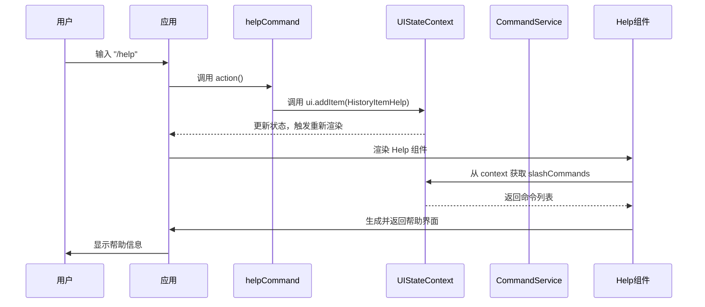

# 帮助命令 (/help)

<cite>
**本文档中引用的文件**  
- [helpCommand.ts](file://packages/cli/src/ui/commands/helpCommand.ts)
- [Help.tsx](file://packages/cli/src/ui/components/Help.tsx)
- [CommandService.ts](file://packages/cli/src/services/CommandService.ts)
- [UIStateContext.tsx](file://packages/cli/src/ui/contexts/UIStateContext.tsx)
- [BuiltinCommandLoader.ts](file://packages/cli/src/services/BuiltinCommandLoader.ts)
- [types.ts](file://packages/cli/src/ui/commands/types.ts)
- [useHistoryManager.ts](file://packages/cli/src/ui/hooks/useHistoryManager.ts)
</cite>

## 目录
1. [简介](#简介)
2. [语法与用法](#语法与用法)
3. [内部实现机制](#内部实现机制)
4. [权限与错误处理](#权限与错误处理)
5. [高级技巧](#高级技巧)

## 简介

`/help` 命令是 Gemini CLI 的核心交互式帮助系统。其主要用途是为用户提供一个清晰、实时的命令指南，帮助用户发现和学习 CLI 的所有功能。该命令通过一个结构化的界面，动态地列出所有可用的斜杠命令（如 `/chat`, `/settings` 等），并提供基本的使用提示和键盘快捷键。

该命令的实现遵循了 CLI 的模块化设计原则，与 `CommandService` 和 `UIStateContext` 紧密集成，确保了帮助信息的准确性和实时性。它不执行任何外部操作，因此没有特殊权限要求，是用户探索 CLI 功能的安全入口。

## 语法与用法

`/help` 命令的语法简洁明了，支持基本的命令调用和特定命令的帮助查询。

### 基本语法
```
/help [command]
```
或使用其别名：
```
/? [command]
```

### 使用示例

*   **列出所有命令**: 执行 `/help` 或 `/?` 将在终端中显示一个包含所有可用命令的列表。该列表会过滤掉隐藏命令，并按命令类型（如 `[MCP]`）进行标记。
    *   **示例**: 输入 `/help` 后，用户会看到一个包含 `/chat`, `/model`, `/settings` 等命令的列表。

*   **查看特定命令的帮助**: 通过在 `/help` 后跟上一个具体的命令名，可以获取该命令的详细信息。这在学习新命令或回忆命令参数时非常有用。
    *   **示例**: 输入 `/help settings` 将显示 `settings` 命令的详细用法，包括其描述和可能的子命令。

## 内部实现机制

`/help` 命令的实现是一个多组件协作的过程，涉及命令注册、动态列表生成和 UI 渲染。

### 命令注册与发现

CLI 的所有命令，包括 `/help` 本身，都通过 `CommandService` 进行集中管理。`CommandService` 使用一个基于提供者的加载器模式，从多个来源（如内置代码、用户文件、扩展）异步加载命令。

*   **`BuiltinCommandLoader`**: `/help` 命令作为一个内置命令，由 `BuiltinCommandLoader` 在应用启动时加载。它被定义为一个 `SlashCommand` 对象，其 `action` 属性指向一个异步函数。
*   **`CommandService`**: 该服务负责聚合所有加载器返回的命令，解决命名冲突，并提供一个统一的、只读的命令列表。`/help` 命令的元数据（名称、描述、别名）就是通过这个服务获取的。

### 动态生成命令列表

当用户执行 `/help` 命令时，其核心逻辑是触发一个 UI 状态的更新，而不是直接生成列表。

1.  **执行 `action` 函数**: 当 `/help` 命令被调用时，其 `action` 函数被执行。该函数不接受参数，其主要作用是创建一个 `HistoryItemHelp` 类型的项目。
2.  **触发 UI 更新**: `action` 函数通过 `CommandContext` 中的 `ui.addItem` 方法，将这个 `HistoryItemHelp` 项目添加到应用的历史记录中。这只是一个标记，表示“需要显示帮助”。
3.  **渲染 `Help` 组件**: 应用的主 UI 组件（如 `DefaultAppLayout`）会监听历史记录的变化。当检测到 `HistoryItemHelp` 项目时，它会渲染 `Help` 组件。
4.  **获取命令列表**: `Help` 组件通过 `UIStateContext` 获取当前的 `slashCommands` 状态。这个状态是由 `CommandService` 提供的、经过过滤（移除隐藏命令）和排序的最新命令列表。
5.  **生成 UI**: `Help` 组件使用 React 和 Ink 库，将命令列表、基本用法说明和键盘快捷键格式化为一个美观的终端界面。它会遍历 `slashCommands` 数组，为每个命令创建相应的文本行。



**Diagram sources**
- [helpCommand.ts](file://packages/cli/src/ui/commands/helpCommand.ts#L17-L24)
- [UIStateContext.tsx](file://packages/cli/src/ui/contexts/UIStateContext.tsx#L66)
- [Help.tsx](file://packages/cli/src/ui/components/Help.tsx#L16-L196)
- [CommandService.ts](file://packages/cli/src/services/CommandService.ts#L101-L103)

**Section sources**
- [helpCommand.ts](file://packages/cli/src/ui/commands/helpCommand.ts)
- [Help.tsx](file://packages/cli/src/ui/components/Help.tsx)
- [CommandService.ts](file://packages/cli/src/services/CommandService.ts)
- [UIStateContext.tsx](file://packages/cli/src/ui/contexts/UIStateContext.tsx)

## 权限与错误处理

### 权限要求

`/help` 命令是完全安全的，**没有任何特殊权限要求**。它不访问文件系统、不执行外部进程、也不需要网络连接。它只是读取和显示应用内部已有的元数据，因此在任何环境下都可以安全执行。

### 错误状态

由于其简单性，`/help` 命令本身几乎不会产生错误。然而，与之相关的系统组件可能会遇到问题：

*   **UI 渲染失败**: 如果终端环境不支持 Ink 库使用的某些 ANSI 转义序列，或者存在严重的 UI 状态损坏，帮助界面的渲染可能会出现乱码或布局错乱。但这通常不会阻止信息的显示。
*   **命令列表为空**: 在极少数情况下，如果 `CommandService` 加载失败或所有命令都被禁用，`/help` 可能会显示一个空的命令列表。这更多是配置问题，而非运行时错误。

## 高级技巧

`/help` 命令不仅是查询内置功能的工具，也是探索和学习 CLI 扩展性的强大助手。

*   **学习新安装的扩展命令**: 当用户安装一个新的扩展时，该扩展可能会自带一些自定义命令。执行 `/help` 是发现这些新命令的最快方式。新命令通常会以 `[扩展名]` 作为前缀或标记出现在列表中，让用户一目了然地知道它们的来源。
*   **理解命令结构**: 通过观察 `/help` 输出的命令列表，用户可以学习到 CLI 的命名约定和命令分组。例如，`[MCP]` 标记的命令通常与外部服务器或工具集成有关。
*   **快捷键参考**: `/help` 界面包含了完整的键盘快捷键列表，是用户快速查阅 `Ctrl+C`（退出）、`Ctrl+S`（复制模式）等关键操作的便捷途径，无需查阅外部文档。

**Section sources**
- [Help.tsx](file://packages/cli/src/ui/components/Help.tsx#L109-L187)
- [BuiltinCommandLoader.ts](file://packages/cli/src/services/BuiltinCommandLoader.ts#L74-L97)