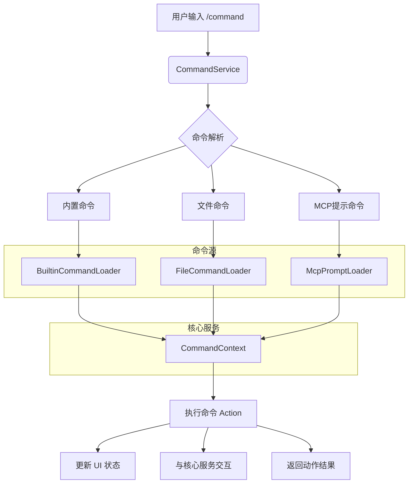

# 斜杠命令 (/)

<cite>
**本文档中引用的文件**
- [helpCommand.ts](file://packages/cli/src/ui/commands/helpCommand.ts)
- [settingsCommand.ts](file://packages/cli/src/ui/commands/settingsCommand.ts)
- [statsCommand.ts](file://packages/cli/src/ui/commands/statsCommand.ts)
- [themeCommand.ts](file://packages/cli/src/ui/commands/themeCommand.ts)
- [quitCommand.ts](file://packages/cli/src/ui/commands/quitCommand.ts)
- [restoreCommand.ts](file://packages/cli/src/ui/commands/restoreCommand.ts)
- [types.ts](file://packages/cli/src/ui/commands/types.ts)
- [BuiltinCommandLoader.ts](file://packages/cli/src/services/BuiltinCommandLoader.ts)
- [CommandService.ts](file://packages/cli/src/services/CommandService.ts)
</cite>

## 目录
1. [简介](#简介)
2. [核心斜杠命令](#核心斜杠命令)
   1. [/help](#help)
   2. [/settings](#settings)
   3. [/stats](#stats)
   4. [/theme](#theme)
   5. [/quit](#quit)
   6. [/restore](#restore)
3. [命令系统架构](#命令系统架构)
4. [高级使用技巧](#高级使用技巧)

## 简介
本文档详细介绍了 `gemini-cli` 中所有以 `/` 开头的内置斜杠命令。这些命令为用户提供了一种快速访问核心功能、配置系统和诊断工具的交互式方式。每个命令都设计为在命令行界面中直接调用，以触发特定操作，如打开对话框、显示信息或修改应用状态。文档将深入探讨每个命令的用途、语法、内部实现机制及其与核心系统组件（如配置服务、UI状态和遥测系统）的集成关系。

## 核心斜杠命令

### /help
提供关于 `gemini-cli` 的帮助信息。

**用途**  
当用户需要获取应用的帮助信息时，调用此命令会向历史记录中添加一个特殊类型的消息项，触发UI显示帮助内容。

**语法**  
```
/help
```
或使用别名：
```
/?
```

**参数**  
无参数。

**返回值**  
无直接返回值。该命令通过 `context.ui.addItem()` 方法向UI的历史记录管理器添加一个类型为 `MessageType.HELP` 的项目。

**内部实现机制**  
`helpCommand` 是一个简单的内置命令对象。其 `action` 函数创建一个符合 `HistoryItemHelp` 接口的对象，并通过 `CommandContext` 提供的 `ui.addItem` 方法将其注入到应用的UI状态中。UI组件监听到此类型的消息后，会渲染相应的帮助界面。

**权限要求**  
无特殊权限要求，所有用户均可使用。

**错误状态**  
此命令的执行是同步且无外部依赖的，因此不会产生运行时错误。

**集成关系**  
- **UI状态**: 直接与 `ui` 模块交互，修改历史记录状态。
- **核心系统**: 不直接依赖核心服务。

**实际使用示例**  
```bash
/gemini> /help
```
执行后，界面会显示帮助文档和可用命令列表。

**Section sources**
- [helpCommand.ts](file://packages/cli/src/ui/commands/helpCommand.ts#L11-L26)

### /settings
查看和编辑 `gemini-cli` 的设置。

**用途**  
允许用户访问和修改应用的配置设置。

**语法**  
```
/settings
```

**参数**  
无参数。

**返回值**  
返回一个 `OpenDialogActionReturn` 对象，指示系统打开“设置”对话框。

**内部实现机制**  
`settingsCommand` 的 `action` 函数返回一个结构化的动作对象 `{ type: 'dialog', dialog: 'settings' }`。这个返回值被命令执行系统捕获，系统根据 `type` 字段识别出需要打开一个对话框，并根据 `dialog` 字段确定要打开的具体对话框类型。

**权限要求**  
无特殊权限要求。

**错误状态**  
此命令不涉及文件I/O或网络请求，因此不会抛出错误。

**集成关系**  
- **UI状态**: 触发UI打开一个模态对话框。
- **配置系统**: 对话框本身会与 `LoadedSettings` 对象交互以读取和保存配置。

**实际使用示例**  
```bash
/gemini> /settings
```
执行后，会弹出一个设置对话框，用户可以在其中更改主题、键盘快捷键等选项。

**Section sources**
- [settingsCommand.ts](file://packages/cli/src/ui/commands/settingsCommand.ts#L10-L20)

### /stats
检查会话统计信息。

**用途**  
显示当前会话的使用统计信息，包括会话时长和配额信息。

**语法**  
```
/stats [session|model|tools]
```

**参数**  
- 无参数：显示默认的会话统计信息。
- `session`：显示会话特定的使用统计数据。
- `model`：显示模型特定的使用统计数据。
- `tools`：显示工具特定的使用统计数据。

**返回值**  
向UI添加一个类型为 `MessageType.STATS`、`MessageType.MODEL_STATS` 或 `MessageType.TOOL_STATS` 的历史记录项。

**内部实现机制**  
`statsCommand` 实现了一个主命令和三个子命令（`session`, `model`, `tools`）。主命令的 `action` 调用 `defaultSessionView` 函数。该函数首先计算自会话开始以来的持续时间。如果配置服务可用，它会从 `CodeAssistServer` 获取用户的配额信息，并将其附加到统计信息项中。对于 `model` 和 `tools` 子命令，它们直接向UI添加一个占位符消息，用于触发更详细的统计信息视图。

**权限要求**  
需要有效的配置和认证才能获取配额信息。如果用户未登录，配额部分将为空。

**错误状态**  
- 如果会话开始时间不可用，会向用户显示一条错误消息。
- 如果获取配额信息失败，错误会被静默处理，仅显示会话时长。

**集成关系**  
- **遥测系统**: 从 `session.stats` 对象获取会话开始时间。
- **配置系统**: 通过 `services.config` 访问配置，并从中获取 `CodeAssistServer` 实例。
- **核心服务**: 调用 `getCodeAssistServer()` 和 `server.retrieveUserQuota()` 来获取配额数据。
- **UI状态**: 通过 `addItem` 方法更新UI。

**实际使用示例**  
```bash
/gemini> /stats
/gemini> /stats model
```
第一个命令显示会话时长和API配额。第二个命令将显示模型使用情况的详细信息。

**Section sources**
- [statsCommand.ts](file://packages/cli/src/ui/commands/statsCommand.ts#L50-L99)

### /theme
更改应用主题。

**用途**  
打开主题选择对话框，允许用户更改应用的视觉外观。

**语法**  
```
/theme
```

**参数**  
无参数。

**返回值**  
返回一个 `OpenDialogActionReturn` 对象，指示系统打开“主题”对话框。

**内部实现机制**  
与 `/settings` 命令类似，`themeCommand` 的 `action` 函数返回 `{ type: 'dialog', dialog: 'theme' }`。命令执行系统解析此返回值并打开相应的主题选择UI。

**权限要求**  
无特殊权限要求。

**错误状态**  
无。

**集成关系**  
- **UI状态**: 触发打开主题对话框。
- **配置系统**: 用户选择的主题会通过配置系统持久化。

**实际使用示例**  
```bash
/gemini> /theme
```
执行后，会弹出一个对话框，列出所有可用的主题，用户可以选择一个进行应用。

**Section sources**
- [themeCommand.ts](file://packages/cli/src/ui/commands/themeCommand.ts#L10-L20)

### /quit
退出CLI。

**用途**  
优雅地退出 `gemini-cli` 应用程序。

**语法**  
```
/quit
```
或使用别名：
```
/exit
```

**参数**  
无参数。

**返回值**  
返回一个 `QuitActionReturn` 对象，其中包含两条消息：一条记录用户输入的命令，另一条包含格式化的会话持续时间。

**内部实现机制**  
`quitCommand` 的 `action` 函数计算当前会话的总持续时间（从 `session.stats.sessionStartTime` 到当前时间）。然后，它返回一个包含两条历史记录消息的对象。系统接收到此返回值后，会执行退出流程，并在退出前显示会话时长摘要。

**权限要求**  
无特殊权限要求。

**错误状态**  
无。

**集成关系**  
- **遥测系统**: 依赖 `session.stats.sessionStartTime` 来计算会话时长。
- **UI状态**: 返回的消息会被UI渲染，作为退出前的最后一条信息。

**实际使用示例**  
```bash
/gemini> /quit
```
执行后，应用会显示类似 "Session duration: 1h 23m 45s" 的消息，然后关闭。

**Section sources**
- [quitCommand.ts](file://packages/cli/src/ui/commands/quitCommand.ts#L10-L38)

### /restore
恢复一个工具调用。

**用途**  
将对话和文件历史恢复到先前工具调用建议时的状态。

**语法**  
```
/restore [checkpoint_name]
```

**参数**  
- 无参数：列出所有可用的可恢复检查点。
- `checkpoint_name`：要恢复的检查点的名称（无需 `.json` 扩展名）。

**返回值**  
- 列出检查点时：返回一条包含可用检查点列表的信息消息。
- 恢复成功时：返回一个 `tool` 类型的动作，重新执行原始的工具调用。
- 出错时：返回一条错误消息。

**内部实现机制**  
`restoreCommand` 是一个条件性命令，仅在配置中启用了检查点功能时才注册。其 `action` 函数首先确定检查点目录。如果没有提供参数，则读取目录并列出所有 `.json` 文件。如果提供了参数，它会尝试读取指定的检查点文件，使用Zod模式进行验证。验证通过后，它会调用核心模块的 `performRestore` 函数，该函数是一个异步生成器，逐步发出恢复操作（如添加消息或加载历史记录）。最后，它返回一个 `tool` 动作来重新执行原始工具。

**权限要求**  
需要文件系统读写权限来访问 `.gemini` 临时目录。

**错误状态**  
- **文件未找到**: 如果指定的检查点文件不存在。
- **无效文件**: 如果检查点文件的JSON格式或结构无效。
- **读取错误**: 如果由于权限或其他I/O问题无法读取文件。

**集成关系**  
- **配置系统**: 使用 `config.storage.getProjectTempCheckpointsDir()` 获取检查点目录。
- **文件系统**: 直接与文件系统交互，读取和解析检查点文件。
- **核心服务**: 调用 `performRestore` 函数，并可能与 `gitService` 交互。
- **UI状态**: 通过 `addItem` 和 `loadHistory` 方法更新UI和会话历史。

**实际使用示例**  
```bash
/gemini> /restore
Available tool calls to restore:
- write_file_2025-03-15_10-30-00.json
- run_shell_command_2025-03-15_11-15-00.json

/gemini> /restore write_file_2025-03-15_10-30-00
```
第一次调用列出所有检查点。第二次调用恢复指定的检查点，将对话历史回滚到该工具调用发生时的状态。

**Section sources**
- [restoreCommand.ts](file://packages/cli/src/ui/commands/restoreCommand.ts#L160-L175)

## 命令系统架构

斜杠命令系统采用模块化和可扩展的架构，核心组件包括命令加载器和服务。



**Diagram sources**
- [CommandService.ts](file://packages/cli/src/services/CommandService.ts#L22-L105)
- [BuiltinCommandLoader.ts](file://packages/cli/src/services/BuiltinCommandLoader.ts#L50-L103)
- [types.ts](file://packages/cli/src/ui/commands/types.ts#L28-L89)

`CommandService` 是命令系统的中心协调者。它在启动时通过 `create` 工厂方法初始化，该方法并行调用所有注册的 `ICommandLoader`（如 `BuiltinCommandLoader` 和 `FileCommandLoader`）来加载命令。加载的命令被聚合到一个 `Map` 中，解决名称冲突（例如，通过添加 `extensionName.` 前缀来重命名扩展命令）。最终的命令列表通过 `getCommands()` 方法提供给UI，用于自动补全和执行。

每个命令都实现 `SlashCommand` 接口，定义了 `name`、`description`、`action` 等属性。`CommandContext` 提供了执行命令所需的所有依赖项，包括对配置、UI、会话状态和核心服务的访问。

**Section sources**
- [CommandService.ts](file://packages/cli/src/services/CommandService.ts#L22-L105)
- [BuiltinCommandLoader.ts](file://packages/cli/src/services/BuiltinCommandLoader.ts#L50-L103)
- [types.ts](file://packages/cli/src/ui/commands/types.ts#L160-L197)

## 高级使用技巧

- **组合命令**: 虽然斜杠命令本身是原子操作，但可以通过在会话中按顺序执行它们来实现组合效果。例如，可以先运行 `/stats` 检查配额，然后运行 `/settings` 调整模型设置，最后继续交互。
- **利用别名**: 记住常用命令的别名可以提高效率，例如使用 `/?` 代替 `/help` 或使用 `/exit` 代替 `/quit`。
- **检查点恢复**: `/restore` 命令是调试和迭代的强大工具。如果一个工具调用的结果不理想，可以使用 `/restore` 回到之前的状态，修改提示词，然后重新尝试，而不会丢失上下文。
- **开发专用命令**: 在开发版本中，`/profile` 命令可用于切换调试性能分析器，帮助开发者诊断性能瓶颈。