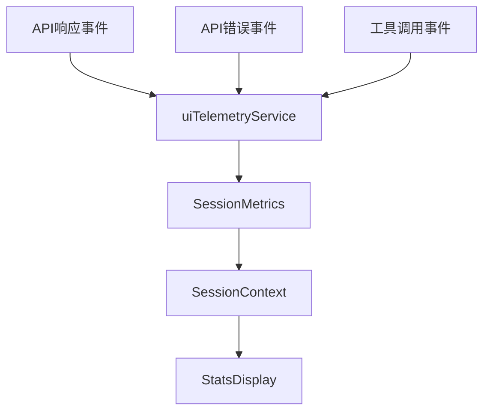
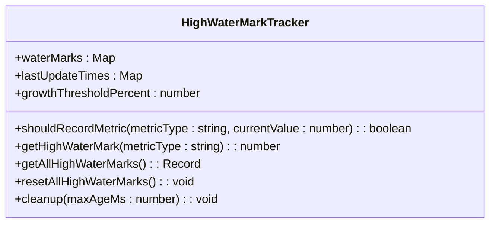
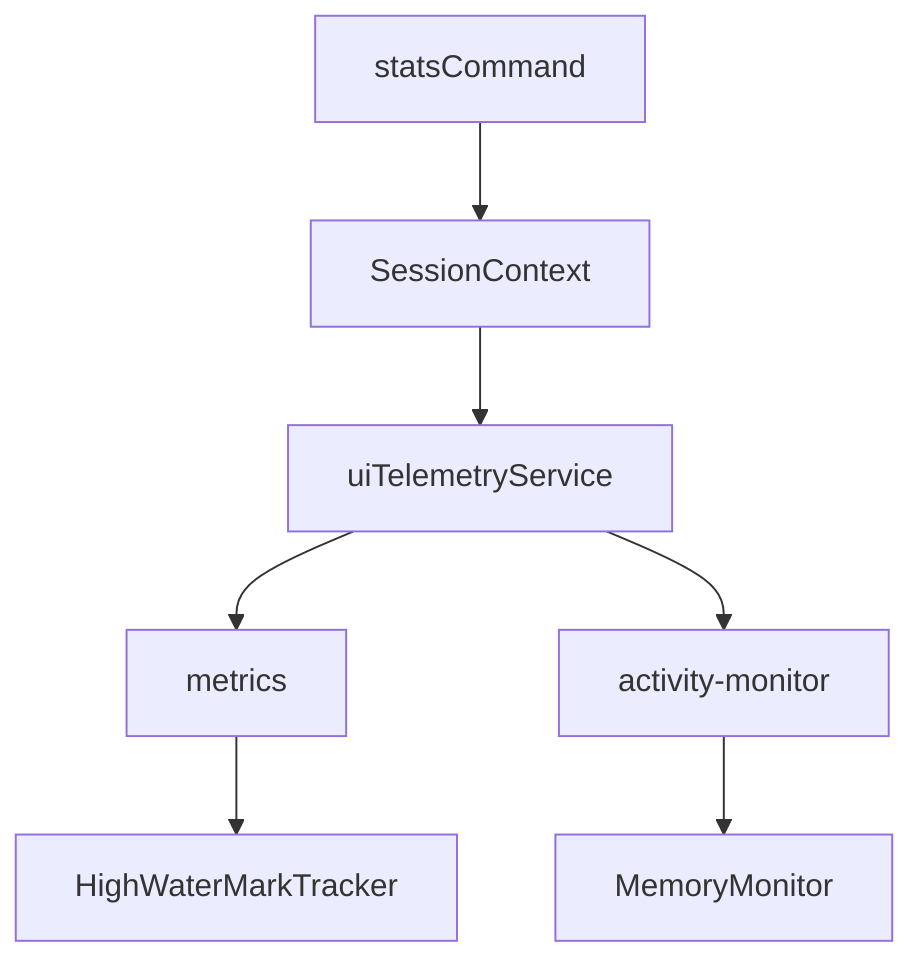

# 统计命令 (/stats)

<cite>
**本文档引用的文件**
- [statsCommand.ts](file://packages/cli/src/ui/commands/statsCommand.ts)
- [StatsDisplay.tsx](file://packages/cli/src/ui/components/StatsDisplay.tsx)
- [SessionContext.tsx](file://packages/cli/src/ui/contexts/SessionContext.tsx)
- [uiTelemetry.ts](file://packages/core/src/telemetry/uiTelemetry.ts)
- [activity-monitor.ts](file://packages/core/src/telemetry/activity-monitor.ts)
- [high-water-mark-tracker.ts](file://packages/core/src/telemetry/high-water-mark-tracker.ts)
- [formatters.ts](file://packages/cli/src/ui/utils/formatters.ts)
- [computeStats.ts](file://packages/cli/src/ui/utils/computeStats.ts)
</cite>

## 目录
1. [简介](#简介)
2. [命令语法与输出格式](#命令语法与输出格式)
3. [内部实现机制](#内部实现机制)
4. [使用示例](#使用示例)
5. [权限要求与错误状态](#权限要求与错误状态)
6. [高级技巧](#高级技巧)
7. [集成关系](#集成关系)

## 简介
`/stats` 命令用于显示当前会话的详细统计信息，帮助用户监控AI代理的资源消耗和活动状态。该命令提供了一个全面的视图，包括会话运行时长、token使用量、工具调用成功率等关键指标。通过这些数据，用户可以深入了解AI代理的行为模式，优化提示词以减少资源消耗，并评估整体使用效率。

**Section sources**
- [statsCommand.ts](file://packages/cli/src/ui/commands/statsCommand.ts#L1-L98)

## 命令语法与输出格式
`/stats` 命令支持多种子命令，允许用户查看不同维度的统计信息。基本语法如下：

```
/stats [session|model|tools]
```

- `/stats` 或 `/stats session`：显示会话级别的统计信息。
- `/stats model`：显示模型使用统计信息。
- `/stats tools`：显示工具调用统计信息。

执行 `/stats` 命令后，系统会输出一个格式化的统计报告，包含以下主要部分：

1. **交互摘要**：显示会话ID、工具调用总数、成功率和用户同意率。
2. **性能**：显示会话的墙钟时间（Wall Time）、代理活跃时间、API调用时间和工具执行时间。
3. **模型使用**：以表格形式展示各模型的请求次数、输入/输出token数量及配额剩余情况。

**Section sources**
- [statsCommand.ts](file://packages/cli/src/ui/commands/statsCommand.ts#L50-L98)
- [StatsDisplay.tsx](file://packages/cli/src/ui/components/StatsDisplay.tsx#L277-L403)

## 内部实现机制
`/stats` 命令的实现依赖于多个核心组件的协同工作，包括遥测服务、活动监控器和统计数据显示组件。

### 数据收集
`/stats` 命令的数据主要来源于 `telemetry` 服务的 `metrics` 和 `activity-monitor` 模块。`uiTelemetryService` 负责收集和聚合来自不同事件的度量数据，如API响应、API错误和工具调用事件。这些数据被存储在 `SessionMetrics` 对象中，并通过 `SessionContext` 提供给UI组件。



**Diagram sources**
- [uiTelemetry.ts](file://packages/core/src/telemetry/uiTelemetry.ts#L113-L236)
- [SessionContext.tsx](file://packages/cli/src/ui/contexts/SessionContext.tsx#L183-L255)

### 高水位标记计算
系统使用 `HighWaterMarkTracker` 类来计算和跟踪关键性能指标的高水位标记。当某个指标（如内存使用量）的增长超过预设阈值（默认5%）时，系统会更新该指标的高水位标记并记录相关事件。这一机制有助于识别潜在的性能问题和资源泄漏。



**Diagram sources**
- [high-water-mark-tracker.ts](file://packages/core/src/telemetry/high-water-mark-tracker.ts#L1-L100)

### 统计数据显示
`StatsDisplay` 组件负责将收集到的统计数据渲染为用户友好的格式。该组件从 `SessionContext` 中获取当前会话的统计信息，并使用 `computeSessionStats` 函数计算各种派生指标，如API时间百分比、工具时间百分比和缓存效率。

**Section sources**
- [StatsDisplay.tsx](file://packages/cli/src/ui/components/StatsDisplay.tsx#L1-L403)
- [computeStats.ts](file://packages/cli/src/ui/utils/computeStats.ts#L1-L100)

## 使用示例
以下是一些使用 `/stats` 命令的实际示例：

### 监控会话统计
```bash
/stats
```
此命令将显示当前会话的综合统计信息，包括会话ID、工具调用成功率和性能指标。

### 查看模型使用情况
```bash
/stats model
```
此命令将显示各模型的详细使用情况，包括输入/输出token数量和配额剩余情况。

### 监控工具调用
```bash
/stats tools
```
此命令将显示工具调用的详细统计信息，包括每个工具的成功率和平均执行时间。

**Section sources**
- [statsCommand.ts](file://packages/cli/src/ui/commands/statsCommand.ts#L50-L98)

## 权限要求与错误状态
`/stats` 命令不需要特殊权限即可执行。然而，在某些情况下可能会遇到错误状态：

- **遥测数据未初始化**：如果遥测服务尚未初始化，系统将无法提供准确的统计信息。
- **会话开始时间不可用**：如果系统无法获取会话的开始时间，则无法计算会话的运行时长。

这些错误通常会在命令输出中以错误消息的形式显示。

**Section sources**
- [statsCommand.ts](file://packages/cli/src/ui/commands/statsCommand.ts#L20-L28)

## 高级技巧
利用 `/stats` 命令提供的统计信息，用户可以采取以下措施来优化提示词和减少token消耗：

1. **分析缓存效率**：通过查看缓存命中率，用户可以调整提示词以更好地利用缓存，从而减少重复计算。
2. **监控工具调用**：通过分析工具调用的成功率和执行时间，用户可以优化工具的使用方式，提高整体效率。
3. **评估模型性能**：通过比较不同模型的性能指标，用户可以选择最适合当前任务的模型。

**Section sources**
- [computeStats.ts](file://packages/cli/src/ui/utils/computeStats.ts#L1-L100)
- [StatsDisplay.tsx](file://packages/cli/src/ui/components/StatsDisplay.tsx#L291-L292)

## 集成关系
`/stats` 命令与系统的多个组件紧密集成，包括遥测系统、`SessionContext` 和 `activity-monitor`。这些集成确保了统计信息的准确性和实时性。



**Diagram sources**
- [statsCommand.ts](file://packages/cli/src/ui/commands/statsCommand.ts#L1-L98)
- [SessionContext.tsx](file://packages/cli/src/ui/contexts/SessionContext.tsx#L183-L255)
- [uiTelemetry.ts](file://packages/core/src/telemetry/uiTelemetry.ts#L113-L236)
- [activity-monitor.ts](file://packages/core/src/telemetry/activity-monitor.ts#L60-L293)
- [high-water-mark-tracker.ts](file://packages/core/src/telemetry/high-water-mark-tracker.ts#L1-L100)