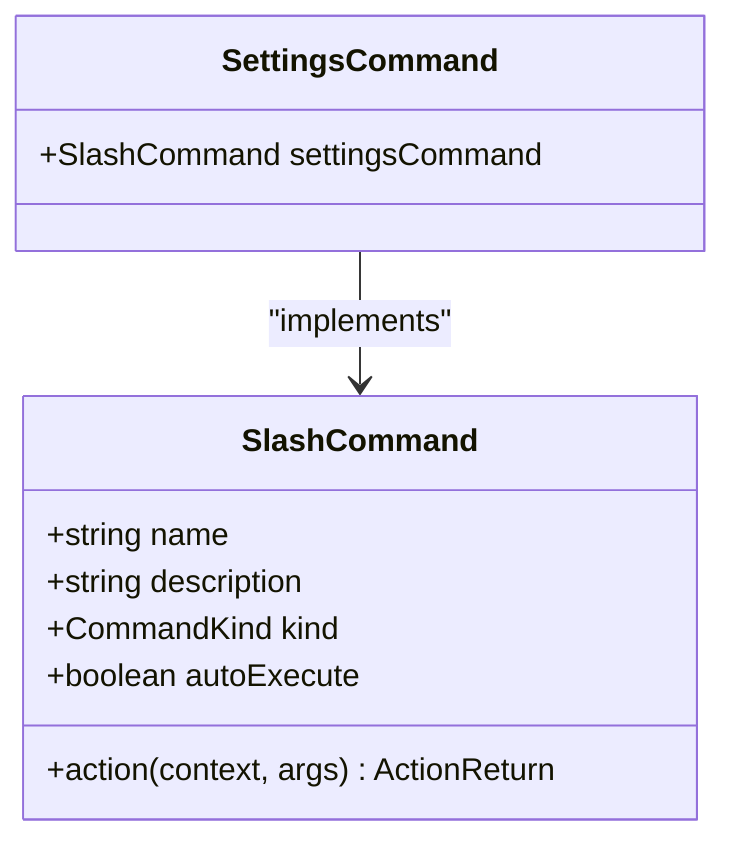
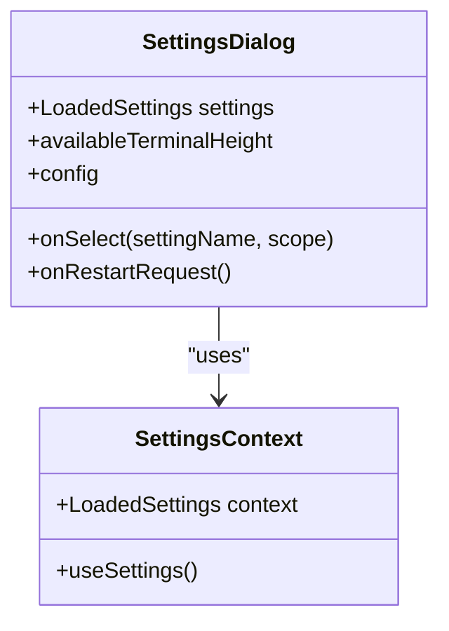
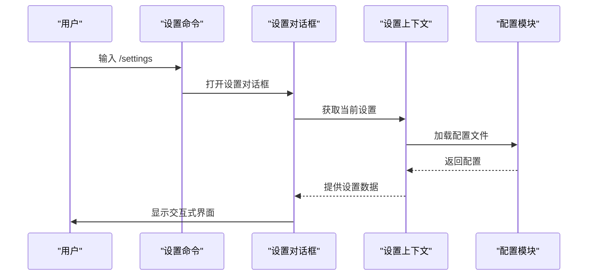
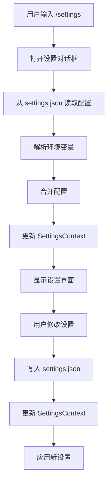

# 设置命令 (/settings)

<cite>
**本文档引用的文件**
- [settingsCommand.ts](file://packages/cli/src/ui/commands/settingsCommand.ts)
- [settings.ts](file://packages/cli/src/config/settings.ts)
- [settingsSchema.ts](file://packages/cli/src/config/settingsSchema.ts)
- [settingsUtils.ts](file://packages/cli/src/utils/settingsUtils.ts)
- [SettingsDialog.tsx](file://packages/cli/src/ui/components/SettingsDialog.tsx)
- [SettingsContext.tsx](file://packages/cli/src/ui/contexts/SettingsContext.tsx)
- [extensionSettings.ts](file://packages/cli/src/config/extensions/extensionSettings.ts)
- [settings.schema.json](file://schemas/settings.schema.json)
</cite>

## 目录
1. [简介](#简介)
2. [命令语法与用法](#命令语法与用法)
3. [核心组件分析](#核心组件分析)
4. [内部实现机制](#内部实现机制)
5. [配置系统集成](#配置系统集成)
6. [高级技巧与调试](#高级技巧与调试)
7. [权限与错误处理](#权限与错误处理)
8. [结论](#结论)

## 简介
`/settings` 命令是 Gemini CLI 的核心功能之一，用于查看和修改用户配置。该命令提供了一个交互式对话框，允许用户在运行时动态调整各种设置，包括模型路由、工具启用状态和界面偏好。此文档详细说明了 `/settings` 命令的语法、内部实现、与配置系统的集成以及高级使用技巧。

**Section sources**
- [settingsCommand.ts](file://packages/cli/src/ui/commands/settingsCommand.ts#L1-L20)

## 命令语法与用法
`/settings` 命令支持多种语法，用于查看和修改配置：

- `/settings list`：显示所有可用的配置项。
- `/settings set key value`：修改特定配置项的值。

例如，要启用 Vim 模式，可以使用 `/settings set general.vimMode true`。该命令通过解析用户输入并调用相应的处理函数来执行操作。

**Section sources**
- [settingsCommand.ts](file://packages/cli/src/ui/commands/settingsCommand.ts#L1-L20)

## 核心组件分析

### 设置命令实现
`/settings` 命令的实现位于 `settingsCommand.ts` 文件中。它定义了一个 `SlashCommand` 对象，包含命令名称、描述和执行动作。当用户输入 `/settings` 时，该命令会触发一个对话框动作，打开设置对话框。

**Diagram sources**
- [settingsCommand.ts](file://packages/cli/src/ui/commands/settingsCommand.ts#L1-L20)

### 设置对话框
设置对话框由 `SettingsDialog.tsx` 组件实现，提供了一个交互式界面，允许用户浏览和修改设置。该组件使用 `SettingsContext` 来访问当前的配置状态，并在用户修改设置后更新状态。

**Diagram sources**
- [SettingsDialog.tsx](file://packages/cli/src/ui/components/SettingsDialog.tsx#L1-L200)
- [SettingsContext.tsx](file://packages/cli/src/ui/contexts/SettingsContext.tsx#L1-L21)

## 内部实现机制
`/settings` 命令的内部实现涉及多个组件和模块的协同工作。首先，`settings.ts` 文件中的 `loadSettings` 函数负责从用户目录和工作区目录加载配置。然后，`settingsSchema.ts` 文件定义了所有配置项的结构和默认值。最后，`settingsUtils.ts` 文件提供了各种工具函数，用于处理配置项的读取、写入和验证。

**Diagram sources**
- [settings.ts](file://packages/cli/src/config/settings.ts#L1-L845)
- [settingsSchema.ts](file://packages/cli/src/config/settingsSchema.ts#L1-L800)
- [settingsUtils.ts](file://packages/cli/src/utils/settingsUtils.ts#L1-L200)

## 配置系统集成
`/settings` 命令与 `config` 模块紧密集成，通过 `settings.json` 文件读取和写入配置。`config` 模块还负责解析环境变量，并将它们与配置文件中的值合并。`SettingsContext` 用于在应用程序的不同部分之间同步配置状态。

**Diagram sources**
- [settings.ts](file://packages/cli/src/config/settings.ts#L1-L845)
- [settingsUtils.ts](file://packages/cli/src/utils/settingsUtils.ts#L1-L200)

## 高级技巧与调试
`/settings` 命令可以用于动态调试 MCP 服务器连接问题。通过修改 `mcpServers` 配置，用户可以添加、删除或更新 MCP 服务器的连接信息。此外，该命令还可以用于配置模型路由和工具启用状态，以优化性能和功能。

**Section sources**
- [settings.ts](file://packages/cli/src/config/settings.ts#L1-L845)
- [settingsSchema.ts](file://packages/cli/src/config/settingsSchema.ts#L1-L800)

## 权限与错误处理
`/settings` 命令需要写入配置文件的权限。如果用户没有足够的权限，命令将无法保存更改。可能的错误状态包括无效的 JSON 值和文件读写错误。`config` 模块提供了详细的错误处理机制，确保配置文件的完整性和一致性。

**Section sources**
- [settings.ts](file://packages/cli/src/config/settings.ts#L1-L845)
- [settingsUtils.ts](file://packages/cli/src/utils/settingsUtils.ts#L1-L200)

## 结论
`/settings` 命令是 Gemini CLI 中一个强大且灵活的工具，允许用户在运行时动态调整配置。通过深入了解其内部实现和与配置系统的集成，用户可以更好地利用这一功能，优化他们的开发体验。