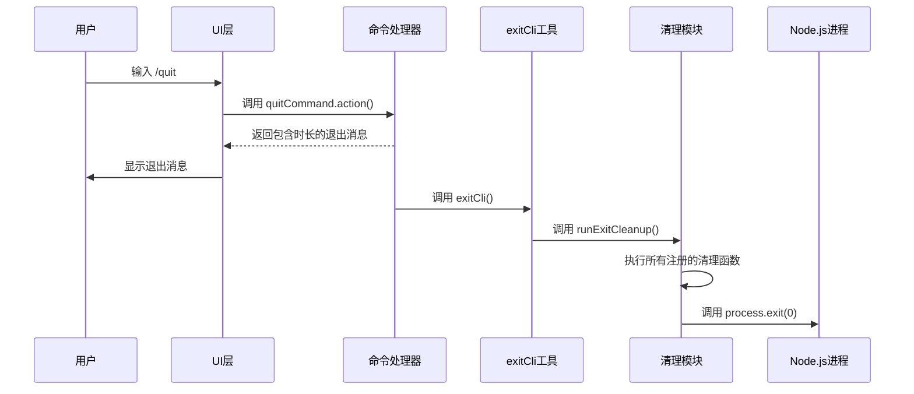
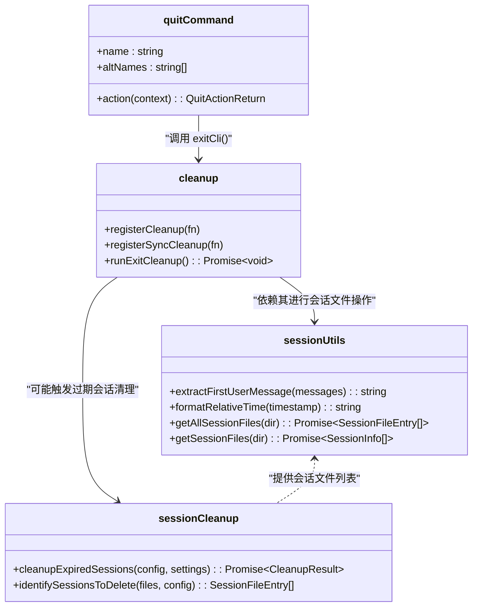

# 退出命令 (/quit)

<cite>
**本文档中引用的文件**  
- [quitCommand.ts](file://packages/cli/src/ui/commands/quitCommand.ts)
- [sessionCleanup.ts](file://packages/cli/src/utils/sessionCleanup.ts)
- [sessionUtils.ts](file://packages/cli/src/utils/sessionUtils.ts)
- [cleanup.ts](file://packages/cli/src/utils/cleanup.ts)
- [utils.ts](file://packages/cli/src/commands/utils.ts)
- [gemini.tsx](file://packages/cli/src/gemini.tsx)
</cite>

## 目录
1. [简介](#简介)
2. [语法与参数](#语法与参数)
3. [内部实现机制](#内部实现机制)
4. [使用示例](#使用示例)
5. [权限与错误状态](#权限与错误状态)
6. [会话管理集成](#会话管理集成)
7. [高级技巧：退出前执行自定义清理](#高级技巧退出前执行自定义清理)
8. [结论](#结论)

## 简介

`/quit` 命令是 Gemini CLI 中用于安全终止当前会话的核心命令。它提供了一种优雅的方式来结束用户交互，确保所有必要的清理工作在进程退出前完成。该命令不仅会结束当前的 CLI 会话，还会触发一系列关键的清理流程，包括保存会话状态、清理临时文件以及关闭网络连接等，以保证数据的完整性和系统的稳定性。

此命令是内置的（built-in），用户可以直接在 CLI 中输入 `/quit` 或其别名 `/exit` 来执行。执行后，CLI 会显示会话持续时间，并最终调用 `process.exit()` 终止进程。整个过程设计为安全且可预测，是用户正常结束工作的标准方式。

**Section sources**
- [quitCommand.ts](file://packages/cli/src/ui/commands/quitCommand.ts#L1-L37)

## 语法与参数

`/quit` 命令的语法非常简单，旨在提供一个直接的退出机制。

### 基本语法

```bash
/quit
```

或使用其别名：

```bash
/exit
```

### 参数

`/quit` 命令本身不接受任何参数。它是一个纯粹的、无参数的命令，用于触发标准的退出流程。

然而，值得注意的是，CLI 的退出行为可以通过配置文件中的设置来影响，例如会话保留策略（session retention settings），但这不属于 `/quit` 命令的直接参数。

**Section sources**
- [quitCommand.ts](file://packages/cli/src/ui/commands/quitCommand.ts#L1-L37)

## 内部实现机制

`/quit` 命令的执行是一个多阶段的、有序的清理过程，涉及多个模块的协同工作。其核心目标是确保在进程终止前，所有资源都被正确释放，所有状态都被持久化。

### 1. 命令触发与响应

当用户输入 `/quit` 时，CLI 的命令处理器会识别该命令并调用其 `action` 函数。该函数位于 `quitCommand.ts` 中，其主要职责是：
- 计算本次会话的持续时间（wall duration）。
- 构造一个包含会话时长信息的 `QuitActionReturn` 对象。
- 将此对象返回给 UI 层，以便在终端中显示退出消息。



**Diagram sources**
- [quitCommand.ts](file://packages/cli/src/ui/commands/quitCommand.ts#L16-L36)
- [utils.ts](file://packages/cli/src/commands/utils.ts#L9-L12)
- [cleanup.ts](file://packages/cli/src/utils/cleanup.ts#L47-L67)

### 2. 核心清理流程 (sessionCleanup)

`/quit` 命令的核心是 `sessionCleanup` 流程，它由 `runExitCleanup()` 函数协调执行。该流程确保了以下关键操作：

#### a. 注册清理函数
CLI 在启动和运行过程中，会通过 `registerCleanup()` 和 `registerSyncCleanup()` 函数将各种清理任务注册到一个队列中。这些任务可能包括：
- 关闭 MCP (Model Control Protocol) 客户端连接。
- 清理临时检查点（checkpoints）文件。
- 刷新并关闭遥测（telemetry）服务。

#### b. 执行清理
当 `runExitCleanup()` 被调用时，它会按顺序执行所有注册的清理函数：
1.  **同步清理**：首先执行所有同步的清理函数 (`syncCleanupFunctions`)。
2.  **异步清理**：然后按顺序执行所有异步的清理函数 (`cleanupFunctions`)。即使某个清理函数抛出错误，系统也会捕获并忽略它，以确保后续的清理函数能够继续执行。
3.  **遥测关闭**：在所有其他清理工作完成后，最后一步是关闭遥测 SDK。这一步至关重要，因为它确保了 `SessionEnd` 钩子等事件能够被正确记录和发送。

#### c. 进程终止
在所有清理工作完成后，`exitCli()` 函数会调用 `process.exit(0)`，以成功状态码 0 终止 Node.js 进程。

**Section sources**
- [cleanup.ts](file://packages/cli/src/utils/cleanup.ts#L1-L79)
- [utils.ts](file://packages/cli/src/commands/utils.ts#L9-L12)
- [gemini.tsx](file://packages/cli/src/gemini.tsx#L30-L34)

## 使用示例

### 正常退出

最简单的用法就是输入 `/quit` 命令。

```bash
> /quit
[退出] 会话持续时间: 1h 30m 15s
```

执行此命令后，CLI 会显示会话时长，并在几秒钟内安全退出。

### 对比：正常退出 vs. 强制退出

虽然 `/quit` 命令本身没有 `--force` 参数，但我们可以将其与操作系统级别的强制终止进行对比。

| 特性 | `/quit` (正常退出) | `Ctrl+C` (强制退出) |
| :--- | :--- | :--- |
| **触发方式** | 输入 `/quit` 或 `/exit` | 在终端中连续按两次 `Ctrl+C` | 
| **清理流程** | 执行完整的 `sessionCleanup`，包括保存状态、关闭连接 | 仅执行基本的清理，可能无法完成所有异步操作 |
| **会话保存** | 保证会话状态被保存 | 会话状态可能丢失 |
| **遥测数据** | `SessionEnd` 事件被完整记录 | 可能丢失部分遥测数据 |
| **进程退出码** | 0 (成功) | 130 (SIGINT) |
| **用户体验** | 优雅、可预测 | 突然、可能不完整 |

**Section sources**
- [quitCommand.ts](file://packages/cli/src/ui/commands/quitCommand.ts#L16-L36)
- [AppContainer.test.tsx](file://packages/cli/src/ui/AppContainer.test.tsx#L1433-L1445)

## 权限与错误状态

### 权限要求

`/quit` 命令本身不直接要求特殊的系统权限。然而，其背后的 `sessionCleanup` 流程需要对文件系统具有**写入权限**，因为：
- 它需要将当前会话的状态（如消息历史、配置）写入到项目临时目录下的会话文件（`chats/` 目录）中。
- 它可能需要删除过期的会话文件或临时检查点。

如果 CLI 没有对项目临时目录的写入权限，会话保存可能会失败，尽管进程仍会退出。

### 可能的错误状态

`/quit` 命令的执行过程设计为尽可能健壮，因此它本身很少会直接向用户报告错误。然而，在清理过程中可能会遇到以下情况：

- **会话保存失败**：如果文件系统 I/O 出现问题（如磁盘已满、权限不足），会话数据可能无法保存。系统会记录一个调试日志，但不会阻止进程退出。
- **清理函数失败**：任何一个注册的清理函数（如关闭 MCP 连接）如果失败，错误会被捕获并忽略，以确保其他清理任务和最终的 `process.exit()` 能够执行。这保证了“退出”这一核心操作的可靠性。

**Section sources**
- [sessionUtils.ts](file://packages/cli/src/utils/sessionUtils.ts#L7-L474)
- [sessionCleanup.ts](file://packages/cli/src/utils/sessionCleanup.ts#L7-L300)
- [cleanup.ts](file://packages/cli/src/utils/cleanup.ts#L47-L67)

## 会话管理集成

`/quit` 命令与 CLI 的会话管理 (`sessionUtils`) 模块紧密集成。

- **会话状态保存**：在 `runExitCleanup()` 过程中，会话管理模块负责将当前会话的 `ConversationRecord` 序列化并写入到 JSON 文件中。这个文件通常位于项目临时目录的 `chats/` 子目录下，文件名以时间戳和会话 ID 为前缀。
- **会话信息提取**：`sessionUtils` 模块提供了 `extractFirstUserMessage` 和 `formatRelativeTime` 等工具函数，用于生成会话的显示名称和摘要，这些信息在会话列表中可见。
- **会话选择器**：`SessionSelector` 类允许用户通过 `--resume` 参数恢复之前的会话，这与 `/quit` 命令形成闭环：用户可以开始一个会话，使用 `/quit` 退出，然后在下次启动时恢复它。



**Diagram sources**
- [quitCommand.ts](file://packages/cli/src/ui/commands/quitCommand.ts#L10-L37)
- [sessionUtils.ts](file://packages/cli/src/utils/sessionUtils.ts#L7-L474)
- [sessionCleanup.ts](file://packages/cli/src/utils/sessionCleanup.ts#L37-L141)
- [cleanup.ts](file://packages/cli/src/utils/cleanup.ts#L16-L17)

## 高级技巧：退出前执行自定义清理

CLI 提供了强大的钩子（hooks）系统，允许用户在特定事件发生前执行自定义脚本。对于 `/quit` 命令，可以通过配置 `SessionEnd` 钩子来实现在会话结束前执行自定义清理逻辑。

### 配置方法

1.  在项目的 `.gemini` 目录下创建或编辑 `hooks.json` 文件。
2.  添加一个 `SessionEnd` 事件的钩子。

```json
{
  "hooks": [
    {
      "event": "SessionEnd",
      "command": "echo '会话即将结束，正在执行自定义清理...'",
      "name": "custom_cleanup"
    }
  ]
}
```

### 工作原理

当 `/quit` 命令被调用并触发 `SessionEnd` 事件时：
1.  CLI 的钩子系统会启动一个子进程来执行 `command` 字段中指定的脚本。
2.  该脚本可以执行任何操作，例如：
    - 将会话日志备份到远程服务器。
    - 清理项目中的特定临时文件。
    - 发送通知。
3.  CLI 会等待脚本执行完成（或超时），然后继续执行其内部的清理流程并最终退出。

这为用户提供了极大的灵活性，可以在标准的退出流程之外，添加项目或工作流特定的清理步骤。

**Section sources**
- [hooks-system.test.ts](file://integration-tests/hooks-system.test.ts#L1072-L1291)
- [hooksCommand.ts](file://packages/cli/src/ui/commands/hooksCommand.ts)

## 结论

`/quit` 命令远不止是一个简单的 `process.exit()` 调用。它是一个精心设计的入口点，触发了一套完整的、有序的清理协议。通过集成 `sessionUtils` 和 `cleanup` 模块，它确保了会话状态的持久化、资源的释放和遥测数据的完整性。其与 `SessionEnd` 钩子的结合，进一步扩展了其功能，允许用户进行自定义的清理操作。理解其内部机制有助于用户更安全、更高效地使用 CLI，并在需要时进行故障排查。