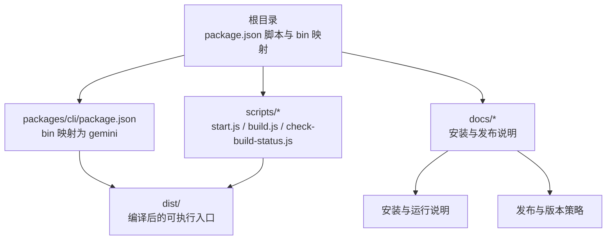
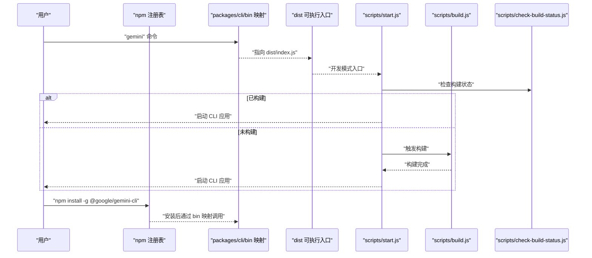
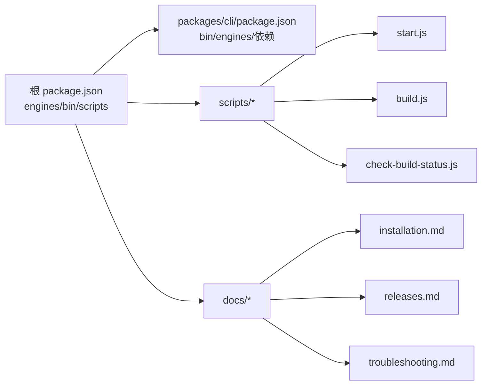

# 安装指南

<cite>
**本文引用的文件**
- [package.json](file://package.json)
- [README.md](file://README.md)
- [docs/get-started/installation.md](file://docs/get-started/installation.md)
- [docs/releases.md](file://docs/releases.md)
- [docs/troubleshooting.md](file://docs/troubleshooting.md)
- [docs/local-development.md](file://docs/local-development.md)
- [scripts/start.js](file://scripts/start.js)
- [scripts/build.js](file://scripts/build.js)
- [scripts/check-build-status.js](file://scripts/check-build-status.js)
- [packages/cli/package.json](file://packages/cli/package.json)
- [scripts/version.js](file://scripts/version.js)
</cite>

## 目录
1. [简介](#简介)
2. [项目结构与入口](#项目结构与入口)
3. [核心安装方式](#核心安装方式)
4. [架构概览](#架构概览)
5. [详细组件解析](#详细组件解析)
6. [依赖关系分析](#依赖关系分析)
7. [性能与版本管理建议](#性能与版本管理建议)
8. [安装验证与常见问题排查](#安装验证与常见问题排查)
9. [结论](#结论)

## 简介
本指南面向首次安装与日常维护 Gemini CLI 的用户，覆盖以下内容：
- 系统要求：Node.js 版本与操作系统兼容性
- 多种安装方式：npm 全局安装、npx 直接执行、Homebrew 安装、从源码构建与本地运行
- 版本管理：预览版、稳定版、夜间版标签的使用与切换
- 安装验证：如何通过命令确认安装成功
- 常见问题与排障：权限、网络、CI 环境、调试日志等

## 项目结构与入口
Gemini CLI 是一个基于 Node.js 的终端应用，支持通过 npm 包或直接运行打包产物两种方式使用。根目录的脚本与工作区配置决定了安装与运行路径。

图表来源
- [package.json](file://package.json#L1-L148)
- [packages/cli/package.json](file://packages/cli/package.json#L1-L93)
- [scripts/start.js](file://scripts/start.js#L1-L79)
- [scripts/build.js](file://scripts/build.js#L1-L56)
- [scripts/check-build-status.js](file://scripts/check-build-status.js#L1-L149)
- [docs/get-started/installation.md](file://docs/get-started/installation.md#L1-L142)
- [docs/releases.md](file://docs/releases.md#L1-L541)

章节来源
- [package.json](file://package.json#L1-L148)
- [packages/cli/package.json](file://packages/cli/package.json#L1-L93)

## 核心安装方式
本节按适用场景给出推荐的安装与运行方式，并说明每种方式的优缺点与边界条件。

- 系统要求
  - Node.js：版本 20 或更高
  - 操作系统：macOS、Linux、Windows
  - 参考：[README 系统要求](file://README.md#L29-L35)

- 方式一：npm 全局安装（推荐用于生产与日常使用）
  - 全局安装命令：npm install -g @google/gemini-cli
  - 使用版本标签选择通道：
    - 预览版：npm install -g @google/gemini-cli@preview
    - 稳定版：npm install -g @google/gemini-cli@latest
    - 夜间版：npm install -g @google/gemini-cli@nightly
  - 参考：[README 版本标签说明](file://README.md#L61-L90)、[发布与版本策略](file://docs/releases.md#L25-L68)

- 方式二：npx 直接执行（无需全局安装）
  - 临时运行最新版本：npx @google/gemini-cli
  - 直接运行仓库最新提交：npx https://github.com/google-gemini/gemini-cli
  - 参考：[安装与运行说明](file://docs/get-started/installation.md#L16-L40)

- 方式三：Homebrew 安装（macOS/Linux）
  - brew install gemini-cli
  - 参考：[README Homebrew 安装](file://README.md#L51-L56)

- 方式四：从源码构建与本地运行（推荐用于开发者与贡献者）
  - 依赖安装：npm install
  - 项目构建：npm run build
  - 本地运行：npm run start
  - 参考：[安装与运行说明](file://docs/get-started/installation.md#L59-L81)、[scripts/build.js](file://scripts/build.js#L1-L56)、[scripts/start.js](file://scripts/start.js#L1-L79)

- 方式五：容器沙箱运行（安全隔离）
  - 直接拉取官方镜像运行
  - 在本地已安装 CLI 的情况下使用 --sandbox 参数
  - 参考：[安装与运行说明](file://docs/get-started/installation.md#L40-L58)

章节来源
- [README.md](file://README.md#L29-L90)
- [docs/get-started/installation.md](file://docs/get-started/installation.md#L16-L81)
- [docs/releases.md](file://docs/releases.md#L25-L68)
- [scripts/build.js](file://scripts/build.js#L1-L56)
- [scripts/start.js](file://scripts/start.js#L1-L79)

## 架构概览
下图展示从“安装/运行”到“应用启动”的关键路径，帮助理解不同安装方式的差异与共性。

图表来源
- [packages/cli/package.json](file://packages/cli/package.json#L1-L93)
- [scripts/start.js](file://scripts/start.js#L1-L79)
- [scripts/build.js](file://scripts/build.js#L1-L56)
- [scripts/check-build-status.js](file://scripts/check-build-status.js#L1-L149)

## 详细组件解析

### 组件A：命令入口与 bin 映射
- packages/cli/package.json 中定义了 bin 映射，使 gemini 命令指向 dist/index.js
- 该映射在全局安装时生效；在源码开发时，可通过 scripts/start.js 间接启动
- 参考：[packages/cli/package.json](file://packages/cli/package.json#L1-L93)

章节来源
- [packages/cli/package.json](file://packages/cli/package.json#L1-L93)

### 组件B：开发模式启动流程
- scripts/start.js 负责：
  - 检查构建状态（生成警告文件供应用显示）
  - 解析调试模式与沙箱参数
  - 以子进程方式启动 CLI 主程序
- 参考：[scripts/start.js](file://scripts/start.js#L1-L79)、[scripts/check-build-status.js](file://scripts/check-build-status.js#L1-L149)

章节来源
- [scripts/start.js](file://scripts/start.js#L1-L79)
- [scripts/check-build-status.js](file://scripts/check-build-status.js#L1-L149)

### 组件C：构建与打包流程
- scripts/build.js 自动处理：
  - 缺失 node_modules 时执行 npm install
  - 生成与构建工作区（含核心与 CLI）
  - 可选构建沙箱镜像
- 参考：[scripts/build.js](file://scripts/build.js#L1-L56)

章节来源
- [scripts/build.js](file://scripts/build.js#L1-L56)

### 组件D：版本与发布策略
- 发布通道与标签：
  - preview：每周三预览版
  - latest：每周三稳定版
  - nightly：每日夜间版
- 版本号更新与镜像 URI 同步由 scripts/version.js 负责
- 参考：[docs/releases.md](file://docs/releases.md#L25-L68)、[scripts/version.js](file://scripts/version.js#L1-L110)

章节来源
- [docs/releases.md](file://docs/releases.md#L25-L68)
- [scripts/version.js](file://scripts/version.js#L1-L110)

## 依赖关系分析
- 根 package.json
  - engines 指定 Node.js >= 20
  - bin 将 gemini 指向 bundle/gemini.js（用于 npx 场景）
  - 提供 start、build、test 等脚本
- packages/cli/package.json
  - bin 将 gemini 指向 dist/index.js（用于全局安装）
  - 依赖 @google/gemini-cli-core
  - engines 指定 Node.js >= 20
- scripts/*
  - start.js：开发模式启动
  - build.js：统一构建流程
  - check-build-status.js：构建状态检查与警告输出
- docs/*
  - installation.md：安装与运行说明
  - releases.md：发布与版本策略
  - troubleshooting.md：常见问题与排障

图表来源
- [package.json](file://package.json#L1-L148)
- [packages/cli/package.json](file://packages/cli/package.json#L1-L93)
- [scripts/start.js](file://scripts/start.js#L1-L79)
- [scripts/build.js](file://scripts/build.js#L1-L56)
- [scripts/check-build-status.js](file://scripts/check-build-status.js#L1-L149)
- [docs/get-started/installation.md](file://docs/get-started/installation.md#L1-L142)
- [docs/releases.md](file://docs/releases.md#L1-L541)
- [docs/troubleshooting.md](file://docs/troubleshooting.md#L1-L156)

章节来源
- [package.json](file://package.json#L1-L148)
- [packages/cli/package.json](file://packages/cli/package.json#L1-L93)
- [scripts/start.js](file://scripts/start.js#L1-L79)
- [scripts/build.js](file://scripts/build.js#L1-L56)
- [scripts/check-build-status.js](file://scripts/check-build-status.js#L1-L149)
- [docs/get-started/installation.md](file://docs/get-started/installation.md#L1-L142)
- [docs/releases.md](file://docs/releases.md#L1-L541)
- [docs/troubleshooting.md](file://docs/troubleshooting.md#L1-L156)

## 性能与版本管理建议
- 版本通道选择
  - 开发与测试：nightly 或 preview
  - 生产与稳定：latest
  - 参考：[docs/releases.md](file://docs/releases.md#L25-L68)
- 构建缓存与增量
  - 使用 scripts/check-build-status.js 提示是否需要重新构建
  - 参考：[scripts/check-build-status.js](file://scripts/check-build-status.js#L1-L149)
- 依赖安装
  - 推荐使用 npm install 完整安装依赖后再构建
  - 参考：[scripts/build.js](file://scripts/build.js#L1-L56)

章节来源
- [docs/releases.md](file://docs/releases.md#L25-L68)
- [scripts/check-build-status.js](file://scripts/check-build-status.js#L1-L149)
- [scripts/build.js](file://scripts/build.js#L1-L56)

## 安装验证与常见问题排查

### 安装验证
- 验证命令：gemini --version
- 说明：该命令会输出当前 CLI 版本，用于确认安装成功
- 参考：[README 基本使用与版本查询](file://README.md#L198-L210)

章节来源
- [README.md](file://README.md#L198-L210)

### 常见问题与解决方案
- 权限错误（如 Permission denied）
  - 检查沙箱配置与写入权限，参考沙箱相关文档
  - 参考：[docs/troubleshooting.md](file://docs/troubleshooting.md#L79-L86)
- 网络问题（如证书校验失败）
  - 设置 NODE_EXTRA_CA_CERTS 指向企业根证书
  - 参考：[docs/troubleshooting.md](file://docs/troubleshooting.md#L41-L49)
- 命令不可用（Command not found）
  - 确认 npm 全局安装路径在 PATH 中，或使用源码方式运行
  - 参考：[docs/troubleshooting.md](file://docs/troubleshooting.md#L58-L69)
- 依赖缺失或导入错误
  - 执行 npm install 并重新构建 npm run build
  - 参考：[docs/troubleshooting.md](file://docs/troubleshooting.md#L71-L78)
- CI 环境非交互
  - CI 环境变量导致无法进入交互模式，可临时 unset CI_* 变量
  - 参考：[docs/troubleshooting.md](file://docs/troubleshooting.md#L87-L101)
- 调试日志与追踪
  - 使用 GEMINI_DEV_TRACING=true 启用开发追踪，配合 Genkit 或 Jaeger 查看
  - 参考：[docs/local-development.md](file://docs/local-development.md#L1-L129)

章节来源
- [docs/troubleshooting.md](file://docs/troubleshooting.md#L41-L101)
- [docs/local-development.md](file://docs/local-development.md#L1-L129)

## 结论
- 生产与日常使用：优先采用 npm 全局安装（latest），必要时使用 preview/nightly
- 开发与贡献：从源码构建与本地运行，结合 scripts/start.js 与 scripts/build.js
- 验证与排障：以 gemini --version 作为基础验证，遇到问题按文档指引定位
- 版本管理：遵循发布与版本策略，合理选择通道与标签