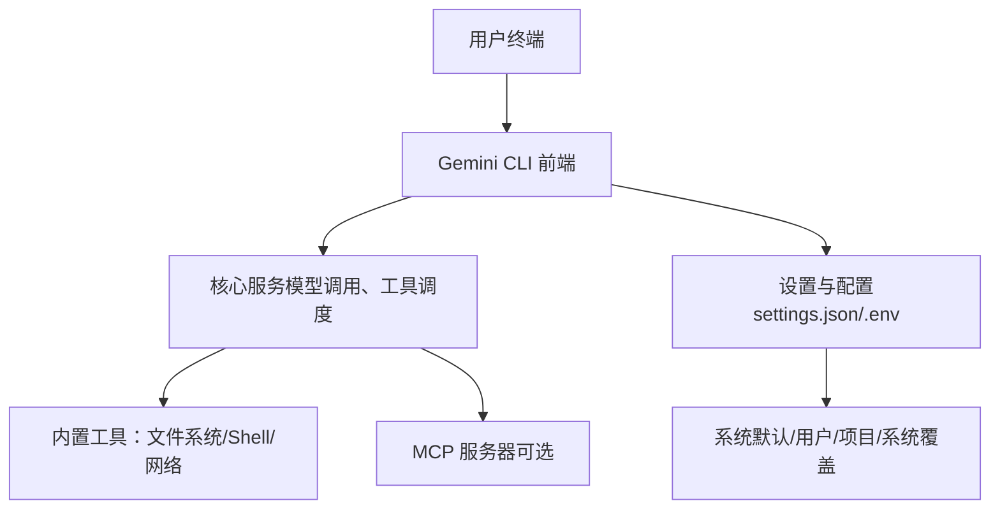
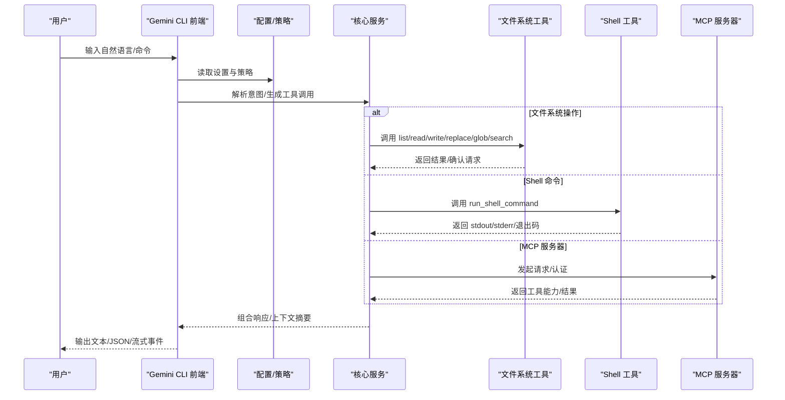
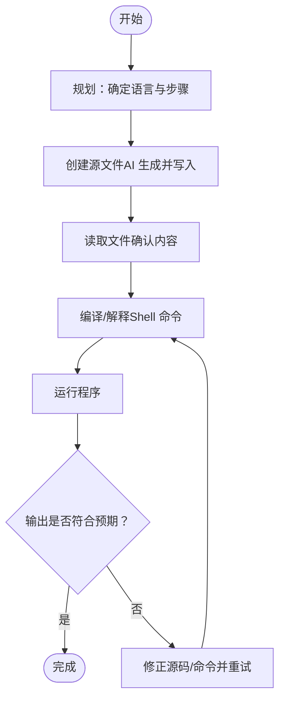

# 快速入门

<cite>
**本文引用的文件**
- [README.md](file://README.md)
- [安装与运行指南](file://docs/get-started/installation.md)
- [快速开始指南](file://docs/get-started/index.md)
- [配置与设置](file://docs/get-started/configuration.md)
- [命令参考](file://docs/cli/commands.md)
- [设置命令](file://docs/cli/settings.md)
- [文件系统工具](file://docs/tools/file-system.md)
- [Shell 工具](file://docs/tools/shell.md)
- [故障排查](file://docs/troubleshooting.md)
- [常见问题](file://docs/faq.md)
- [教程：MCP 服务器集成](file://docs/cli/tutorials.md)
- [Gemini 3 使用说明](file://docs/get-started/gemini-3.md)
</cite>

## 目录
1. [简介](#简介)
2. [项目结构](#项目结构)
3. [核心组件](#核心组件)
4. [架构总览](#架构总览)
5. [详细组件分析](#详细组件分析)
6. [依赖关系分析](#依赖关系分析)
7. [性能与最佳实践](#性能与最佳实践)
8. [故障排查指南](#故障排查指南)
9. [结论](#结论)
10. [附录](#附录)

## 简介
本快速入门面向首次使用 Gemini CLI 的用户，目标是帮助你在最短时间内完成安装、认证与基础配置，并通过一系列循序渐进的示例掌握核心能力：从简单的“你好世界”问候，到文件系统操作与 Shell 命令执行；并通过“/help”探索功能、“/settings”调整偏好；最后以一个完整的端到端示例，演示如何让 AI 助手协助你从创建文件到编译运行一个简单程序。文中还提供预期输出提示与最佳实践建议，帮助你高效地与 AI 对话。

## 项目结构
Gemini CLI 是一个终端优先的 AI 助手，提供模型调用、工具执行（文件系统、Shell、网络等）与会话管理能力。其文档分为多个主题域：
- 安装与运行：支持全局安装、npx 直接运行、容器沙箱、源码开发等多种方式
- 配置与设置：多层配置叠加（系统默认、用户、项目、系统覆盖）、环境变量、命令行参数
- 命令与交互：内置命令（/help、/settings、/chat、/tools 等）、快捷输入（@ 文件注入）、Shell 模式（!）
- 工具与扩展：文件系统工具、Shell 工具、MCP 服务器集成、自定义扩展
- 故障排查与常见问题：认证错误、权限限制、退出码、调试技巧

[无图表来源：该图为概念性结构示意，不直接映射具体源文件]

**章节来源**
- [安装与运行指南](file://docs/get-started/installation.md#L1-L142)
- [配置与设置](file://docs/get-started/configuration.md#L1-L120)

## 核心组件
- 启动与认证
  - 支持多种安装方式（全局安装、npx、容器沙箱、源码运行）
  - 提供多种认证方式（Google 登录、API Key、Vertex AI），并支持企业级项目配置
- 内置命令与交互
  - /help 展示可用命令；/settings 打开设置编辑器；/chat 管理会话；/tools 列出可用工具
  - @ 注入文件内容；! 进入 Shell 模式或执行单条命令
- 工具体系
  - 文件系统工具：列出目录、读取文件、写入/替换文件、搜索文件内容、glob 查找
  - Shell 工具：安全可控的命令执行，支持交互式会话、颜色输出、分页器、后台进程
- 配置与策略
  - 多层配置叠加、环境变量注入、工具白名单/黑名单、沙箱策略、上下文过滤

**章节来源**
- [快速开始指南](file://docs/get-started/index.md#L1-L72)
- [命令参考](file://docs/cli/commands.md#L1-L355)
- [文件系统工具](file://docs/tools/file-system.md#L1-L218)
- [Shell 工具](file://docs/tools/shell.md#L1-L261)
- [配置与设置](file://docs/get-started/configuration.md#L1-L200)

## 架构总览
下图展示了从用户输入到工具执行与结果返回的关键流程，以及配置与策略对行为的影响。

[无图表来源：该图为概念性流程示意，不直接映射具体源文件]

## 详细组件分析

### 启动与认证（从零到一）
- 安装方式
  - 全局安装：使用包管理器安装后即可在任意位置运行
  - npx 直接运行：无需全局安装，适合一次性试用
  - 容器沙箱：通过 Docker/Podman 在隔离环境中运行
  - 源码运行：开发者模式，便于本地调试与热更新
- 认证选项
  - Google 登录：最便捷，适合个人与组织订阅用户
  - API Key：适合需要特定模型选择与计费控制的场景
  - Vertex AI：企业级部署，具备更高的配额与合规能力
- 企业与项目配置
  - 可通过环境变量指定 Google Cloud 项目，满足组织订阅要求
  - 支持强制认证类型与外部认证流程，确保合规

**章节来源**
- [安装与运行指南](file://docs/get-started/installation.md#L1-L142)
- [README.md](file://README.md#L129-L196)

### 初始设置向导与基础配置
- 配置层级（优先级从低到高）
  - 默认值、系统默认文件、用户设置、项目设置、系统设置、环境变量、命令行参数
- 设置文件位置
  - 用户设置：用户主目录下的配置文件
  - 项目设置：项目根目录下的配置文件
  - 系统设置：系统范围的配置文件
- 常用设置类别
  - 通用：预览特性、首选编辑器、Vim 模式、自动更新、会话保留
  - 输出：输出格式（文本/JSON）
  - UI：主题、标题栏、底部信息、可访问性、全宽显示、备用缓冲区
  - 模型：最大会话轮次、压缩阈值、跳过下一说话者检查
  - 上下文：GEMINI.md 加载、递归搜索、忽略规则
  - 工具：交互式 Shell、颜色输出、自动接受、ripgrep、输出截断、消息总线集成
  - 安全：禁用 YOLO 模式、阻止 Git 扩展、文件夹信任
  - 实验：代理子代理、扩展管理、即时上下文加载

**章节来源**
- [配置与设置](file://docs/get-started/configuration.md#L1-L200)
- [设置命令](file://docs/cli/settings.md#L1-L113)

### 从“你好世界”开始：循序渐进示例

#### 示例一：问候与探索（/help 与 /settings）
- 步骤
  - 启动 CLI，输入“你好”
  - 输入“/help”查看可用命令
  - 输入“/settings”打开设置编辑器，尝试切换主题、启用 Vim 模式、调整输出格式
- 预期输出
  - 交互式对话窗口显示 AI 回复
  - /help 列表包含 /help、/settings、/chat、/tools 等命令
  - /settings 编辑器允许修改 UI/模型/工具等设置

**章节来源**
- [命令参考](file://docs/cli/commands.md#L105-L196)
- [设置命令](file://docs/cli/settings.md#L1-L113)

#### 示例二：文件系统操作（创建与读取）
- 场景
  - 使用 AI 助手创建一个新文件，然后读取其内容
- 步骤
  - 在当前目录创建一个新文件（AI 将提示并请求确认）
  - 使用“/tools”查看可用工具，确认“WriteFile/ReadFile”存在
  - 使用“@路径”将文件内容注入到后续查询中
- 预期输出
  - 成功写入文件后，AI 会给出成功提示
  - 读取文件时返回文件内容或部分片段（受截断策略影响）

**章节来源**
- [文件系统工具](file://docs/tools/file-system.md#L72-L120)
- [命令参考](file://docs/cli/commands.md#L216-L239)

#### 示例三：运行 Shell 命令（列出与执行）
- 场景
  - 使用 AI 助手列出当前目录内容，并执行一条简单命令
- 步骤
  - 输入“!ls -la”进入 Shell 模式并执行
  - 或在普通模式下输入“!git status”查看仓库状态
- 预期输出
  - 命令输出显示在对话区域
  - 若开启交互式 Shell，可进一步进行交互式任务（如编辑器、TUI）

**章节来源**
- [Shell 工具](file://docs/tools/shell.md#L1-L160)
- [命令参考](file://docs/cli/commands.md#L323-L355)

#### 示例四：端到端“Hello World”程序（从创建到运行）
- 场景
  - 让 AI 助手帮助你创建一个简单的“Hello World”程序，从创建文件到编译运行
- 步骤
  1) 创建源文件：让 AI 生成并写入一个最小化的 Hello World 源文件（例如 C/C++/Python/Go 等）
  2) 检查文件：使用“/tools”中的“ReadFile”读取文件内容，确认生成正确
  3) 编译/解释：根据所选语言，使用“!编译命令”或“!解释命令”执行
  4) 运行：执行生成的可执行文件或脚本，观察输出
- 预期输出
  - 写入文件成功提示
  - 读取文件返回源码内容
  - 编译/运行命令返回标准输出或错误信息
  - 最终看到“Hello World”字样或等价输出

[无图表来源：该图为概念性流程示意，不直接映射具体源文件]

**章节来源**
- [文件系统工具](file://docs/tools/file-system.md#L72-L120)
- [Shell 工具](file://docs/tools/shell.md#L1-L160)
- [命令参考](file://docs/cli/commands.md#L216-L239)

### 探索功能与偏好调整
- /help：查看所有内置命令与简要说明
- /settings：打开设置编辑器，按类别浏览与修改
- /tools：列出当前可用工具及其描述
- /chat：保存/恢复/分享会话，便于长期任务追踪
- /model：切换模型或路由策略（如需使用更高性能模型）
- /mcp：管理 MCP 服务器（第三方扩展工具链）

**章节来源**
- [命令参考](file://docs/cli/commands.md#L1-L355)
- [教程：MCP 服务器集成](file://docs/cli/tutorials.md#L1-L84)
- [Gemini 3 使用说明](file://docs/get-started/gemini-3.md#L1-L136)

## 依赖关系分析
- 配置层叠与优先级
  - 默认值 < 系统默认文件 < 用户设置 < 项目设置 < 系统设置 < 环境变量 < 命令行参数
- 工具与策略
  - 工具白名单/黑名单、交互式 Shell、ripgrep、输出截断、消息总线集成
- 安全与合规
  - 强制认证类型、外部认证、文件夹信任、阻止 Git 扩展

**章节来源**
- [配置与设置](file://docs/get-started/configuration.md#L1-L120)

## 性能与最佳实践
- 有效提示
  - 提问具体、明确上下文；必要时使用“@路径”注入相关文件内容
  - 分步执行复杂任务，先计划再行动，减少一次性长上下文带来的成本
- 工具使用
  - 使用“/tools desc”查看工具详情，避免误用高风险工具
  - 对大文件/大量输出启用输出截断或分页器，提升可读性
- 安全与合规
  - 严格限制 Shell 命令白名单，避免危险命令
  - 使用沙箱或受限配置，降低副作用风险
- 会话与上下文
  - 合理使用“/compress”压缩上下文，节省令牌
  - 使用“/memory refresh”同步 GEMINI.md 上下文，保持指令一致性

[本节为通用指导，不直接分析具体文件]

## 故障排查指南
- 认证与登录
  - 组织订阅冲突：清理项目相关环境变量或联系管理员
  - 自由额度限制：检查配额与限额，必要时升级或等待重置
  - 证书问题：在企业网络环境下设置额外 CA 证书
- 常见错误
  - 端口占用：更换 MCP 服务器端口或停止占用进程
  - 命令未找到：确认 PATH 与安装方式，必要时重新安装或构建
  - 权限不足：检查沙箱配置与目录权限
- 调试与日志
  - 使用调试标志与日志目录定位问题
  - 对工具失败进行预检，先在本地 Shell 中验证命令

**章节来源**
- [故障排查](file://docs/troubleshooting.md#L1-L156)
- [常见问题](file://docs/faq.md#L1-L155)

## 结论
通过本快速入门，你已了解如何安装与认证、如何使用“/help”与“/settings”探索与定制 CLI、如何安全地进行文件系统与 Shell 操作，并完成了从创建到运行的“Hello World”端到端示例。建议在日常使用中持续优化提示质量、合理配置工具与策略、关注安全与合规，从而获得更稳定、高效的开发体验。

[本节为总结性内容，不直接分析具体文件]

## 附录
- 快速链接
  - 安装与运行：[安装与运行指南](file://docs/get-started/installation.md#L1-L142)
  - 配置与设置：[配置与设置](file://docs/get-started/configuration.md#L1-L200)
  - 命令参考：[命令参考](file://docs/cli/commands.md#L1-L355)
  - 文件系统工具：[文件系统工具](file://docs/tools/file-system.md#L1-L218)
  - Shell 工具：[Shell 工具](file://docs/tools/shell.md#L1-L261)
  - 故障排查：[故障排查](file://docs/troubleshooting.md#L1-L156)
  - 常见问题：[常见问题](file://docs/faq.md#L1-L155)
  - MCP 服务器集成：[教程：MCP 服务器集成](file://docs/cli/tutorials.md#L1-L84)
  - Gemini 3 使用说明：[Gemini 3 使用说明](file://docs/get-started/gemini-3.md#L1-L136)