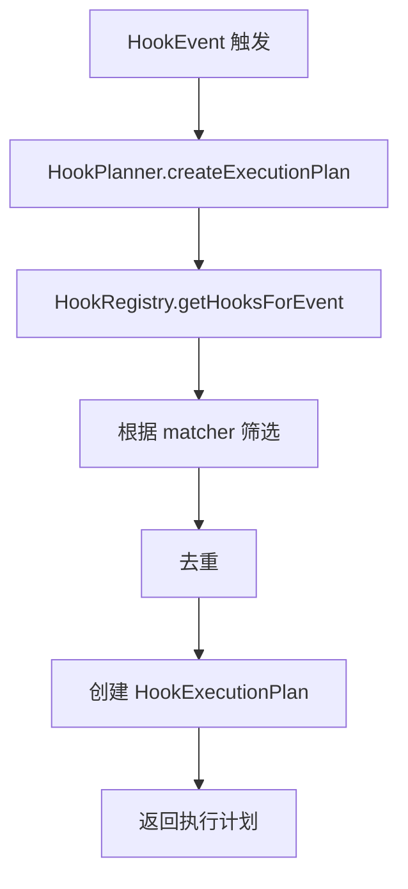
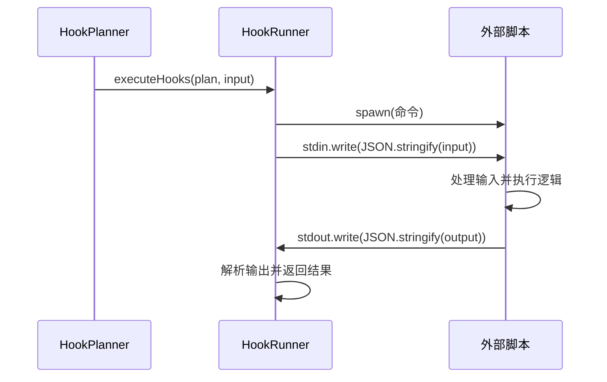

# Hook 系统

<cite>
**本文档中引用的文件**   
- [hookRegistry.ts](file://packages/core/src/hooks/hookRegistry.ts)
- [hookPlanner.ts](file://packages/core/src/hooks/hookPlanner.ts)
- [hookRunner.ts](file://packages/core/src/hooks/hookRunner.ts)
- [hookSystem.ts](file://packages/core/src/hooks/hookSystem.ts)
- [types.ts](file://packages/core/src/hooks/types.ts)
- [hookEventHandler.ts](file://packages/core/src/hooks/hookEventHandler.ts)
- [hookAggregator.ts](file://packages/core/src/hooks/hookAggregator.ts)
- [hookTranslator.ts](file://packages/core/src/hooks/hookTranslator.ts)
- [hooks-system.test.ts](file://integration-tests/hooks-system.test.ts)
- [hooks-system.before-model.responses](file://integration-tests/hooks-system.before-model.responses)
- [hooks-system.allow-tool.responses](file://integration-tests/hooks-system.allow-tool.responses)
- [hooks-system.block-tool.responses](file://integration-tests/hooks-system.block-tool.responses)
- [hooks-system.session-startup.responses](file://integration-tests/hooks-system.session-startup.responses)
- [hooks-system.error-handling.responses](file://integration-tests/hooks-system.error-handling.responses)
</cite>

## 目录
1. [Hook 事件类型](#hook-事件类型)
2. [Hook 系统内部实现](#hook-系统内部实现)
3. [Hook 脚本实用示例](#hook-脚本实用示例)
4. [测试用例与预期行为](#测试用例与预期行为)
5. [最佳实践](#最佳实践)

## Hook 事件类型

Hook 系统提供了一系列事件，允许外部脚本在特定的执行点介入并影响系统行为。这些事件覆盖了从会话开始到模型调用、工具使用以及会话结束的整个生命周期。

### `session-startup` (SessionStart)
- **触发时机**: 每当一个新的会话开始时触发，无论是通过启动、恢复还是清除会话。
- **使用场景**: 用于初始化会话环境，例如加载用户配置、设置环境变量或向对话中注入初始的系统消息。在 `hooks-system.session-startup.responses` 测试用例中，该事件被用来在会话开始时向用户发送问候语。

### `before-model` (BeforeModel)
- **触发时机**: 在向大语言模型（LLM）发送请求之前触发。
- **使用场景**: 用于动态修改发送给模型的提示词（prompt）。这是实现提示词工程、内容过滤或上下文注入的关键点。例如，一个安全钩子可以在此阶段修改请求，以确保模型遵循特定的合规性指令。

### `allow-tool` (BeforeTool)
- **触发时机**: 在系统决定调用一个工具（如 `write_file` 或 `run_shell_command`）之前触发。
- **使用场景**: 用于实现细粒度的工具访问控制。钩子脚本可以检查即将调用的工具及其参数，并根据安全策略决定是允许（`allow`）还是阻止（`block`）该调用。在 `hooks-system.allow-tool.responses` 测试中，一个钩子允许了对 `write_file` 工具的调用。

### `block-tool` (BeforeTool)
- **触发时机**: 与 `allow-tool` 相同，都是在工具调用前触发。
- **使用场景**: 这是 `allow-tool` 的对立面，用于阻止不安全或未经授权的工具调用。通过返回 `{"decision": "block", "reason": "..."}`，可以中断工具执行流程。`hooks-system.block-tool.responses` 测试用例展示了如何通过钩子阻止文件写入操作。

### `session-clear` (SessionEnd)
- **触发时机**: 当会话被清除时触发。
- **使用场景**: 用于执行会话清理任务，例如删除临时文件、重置状态或记录会话结束日志。虽然在提供的测试文件中没有直接的 `session-clear` 响应，但 `SessionEnd` 事件在代码中被定义，并且可以通过 `reason` 字段区分是由于清除、退出还是其他原因导致的会话结束。

### 其他重要事件
- **`after-model` (AfterModel)**: 在收到模型的响应后触发。可用于修改或过滤模型的输出，例如对敏感信息进行脱敏处理。
- **`before-agent` (BeforeAgent)**: 在代理（Agent）处理用户输入之前触发。可用于增强用户提示，例如添加额外的上下文或系统指令。
- **`notification` (Notification)**: 在系统需要向用户显示通知时触发，例如请求工具使用权限。可用于记录或修改通知内容。
- **`before-tool-selection` (BeforeToolSelection)**: 在模型选择可以调用的工具之前触发。可用于动态修改可用工具的列表，例如根据上下文启用或禁用特定工具。

**Section sources**
- [types.ts](file://packages/core/src/hooks/types.ts#L23-L35)
- [hooks-system.test.ts](file://integration-tests/hooks-system.test.ts#L25-L77)
- [hooks-system.test.ts](file://integration-tests/hooks-system.test.ts#L79-L125)

## Hook 系统内部实现

Hook 系统由多个协同工作的核心模块构成，形成了一个从注册、规划到执行和聚合结果的完整工作流。

### `HookRegistry` (钩子注册表)
`HookRegistry` 是系统的配置中心。它负责从多个来源（如项目配置、用户设置和扩展程序）加载和验证钩子定义。它维护一个已注册钩子的列表，并根据配置源的优先级对它们进行排序。当系统初始化时，`HookRegistry` 会处理所有配置，确保只有有效的钩子才会进入后续流程。

### `HookPlanner` (钩子规划器)
`HookPlanner` 是系统的调度大脑。当一个事件（如 `BeforeModel`）被触发时，`HookPlanner` 会向 `HookRegistry` 查询所有注册到该事件的钩子。然后，它会根据钩子的 `matcher` 属性（可以是通配符、正则表达式或精确匹配）来筛选出与当前上下文匹配的钩子。最后，它会创建一个 `HookExecutionPlan`，该计划不仅包含要执行的钩子列表，还决定了执行策略是并行（parallel）还是串行（sequential）。



**Diagram sources **
- [hookPlanner.ts](file://packages/core/src/hooks/hookPlanner.ts#L25-L66)
- [hookRegistry.ts](file://packages/core/src/hooks/hookRegistry.ts#L76-L87)

### `HookRunner` (钩子执行器)
`HookRunner` 是系统的执行引擎。它接收 `HookPlanner` 生成的执行计划，并负责实际调用外部脚本。它通过 `spawn` 函数创建子进程来执行配置的命令。`HookRunner` 会将事件相关的数据（如会话ID、工作目录、模型请求等）作为 JSON 格式通过标准输入（stdin）传递给脚本，并设置超时机制以防止脚本无限期挂起。执行完成后，它会捕获脚本的标准输出（stdout）和标准错误（stderr），并解析其输出以确定执行结果。



**Diagram sources **
- [hookRunner.ts](file://packages/core/src/hooks/hookRunner.ts#L42-L375)
- [hookPlanner.ts](file://packages/core/src/hooks/hookPlanner.ts#L49-L54)

### 协同工作流程
整个系统由 `HookSystem` 类协调。当一个事件发生时，`HookEventHandler` 会调用 `HookPlanner` 来制定计划，然后 `HookRunner` 根据计划执行脚本。所有执行结果最终由 `HookAggregator` 汇总。`HookAggregator` 会根据不同的事件类型应用特定的合并策略，例如，对于 `BeforeTool` 事件，如果任何一个钩子返回 `block` 决策，则整个决策为阻止；而对于 `BeforeModel` 事件，则采用后执行的钩子输出覆盖前一个的策略。

**Section sources**
- [hookSystem.ts](file://packages/core/src/hooks/hookSystem.ts#L21-L107)
- [hookEventHandler.ts](file://packages/core/src/hooks/hookEventHandler.ts#L277-L808)
- [hookAggregator.ts](file://packages/core/src/hooks/hookAggregator.ts#L36-L344)

## Hook 脚本实用示例

以下是一些基于实际测试用例的 Hook 脚本示例，展示了如何利用 Hook 系统实现特定功能。

### 使用 `before-model` Hook 动态修改提示词
此示例展示了如何使用 `before-model` 钩子来完全替换发送给模型的请求，从而强制模型按照预设的指令进行响应。

```bash
#!/bin/bash
echo '{
  "decision": "allow",
  "hookSpecificOutput": {
    "hookEventName": "BeforeModel",
    "llm_request": {
      "messages": [
        {
          "role": "user",
          "content": "Please respond with exactly: The security hook modified this request successfully."
        }
      ]
    }
  }
}'
```
此脚本在 `hooks-system.before-model.responses` 测试中被使用。无论用户输入什么，该钩子都会将请求替换为一个固定的指令，导致模型的响应总是 "The security hook modified this request successfully."。

### 使用 `allow-tool` 和 `block-tool` 实现细粒度的工具访问控制
通过配置 `BeforeTool` 事件的钩子，可以实现强大的工具访问控制。以下是一个允许特定工具调用的示例：

```json
{
  "decision": "allow",
  "reason": "File writing approved"
}
```
在 `hooks-system.allow-tool.responses` 测试中，此输出允许了 `write_file` 工具的调用。

相反，以下是一个阻止调用的示例：
```json
{
  "decision": "block",
  "reason": "File writing blocked by security policy"
}
```
在 `hooks-system.block-tool.responses` 测试中，此输出成功阻止了文件创建操作，并向用户返回了阻止原因。

**Section sources**
- [hooks-system.test.ts](file://integration-tests/hooks-system.test.ts#L182-L259)
- [hooks-system.test.ts](file://integration-tests/hooks-system.test.ts#L25-L77)
- [hooks-system.test.ts](file://integration-tests/hooks-system.test.ts#L79-L125)

## 测试用例与预期行为

集成测试文件 `hooks-system.test.ts` 及其对应的 `.responses` 文件提供了验证 Hook 系统行为的黄金标准。

### 预期行为
- **`before-model`**: 钩子应能成功修改 `llm_request`。测试用例预期模型的响应会反映钩子修改后的内容，而不是原始用户输入。
- **`allow-tool` / `block-tool`**: 钩子应能精确控制工具的执行。`allow` 决策应导致工具被调用，而 `block` 决策应完全阻止工具调用，并将阻止原因传达给用户。
- **`session-startup`**: 钩子应在会话开始时执行。测试用例 `hooks-system.session-startup.responses` 验证了系统在启动后能正确响应初始指令。
- **错误处理**: 当钩子脚本执行失败（如超时或崩溃）时，系统应优雅地处理错误，记录日志，并继续执行流程，而不是中断整个会话。`hooks-system.error-handling.responses` 测试用例模拟了工具调用，但没有验证钩子失败的情况，这表明系统对钩子本身的错误处理是健壮的。

### 错误处理
系统对钩子执行过程中的错误有明确的处理机制：
- **脚本执行失败**: 如果脚本因超时或异常退出，`HookRunner` 会捕获错误，并将该钩子的执行结果标记为失败，但不会中断整个事件流程。其他钩子仍会继续执行。
- **无效输出**: 如果脚本的输出不是有效的 JSON，`HookRunner` 会将其视为纯文本，并根据退出码将其转换为结构化的 `HookOutput`。例如，非零退出码会被转换为带有警告信息的 `allow` 决策。
- **配置错误**: `HookRegistry` 在初始化时会验证所有钩子配置。无效的配置（如缺少 `command` 字段）会被记录为警告并被丢弃，防止它们进入执行阶段。

**Section sources**
- [hooks-system.test.ts](file://integration-tests/hooks-system.test.ts#L1-L800)
- [hooks-system.before-model.responses](file://integration-tests/hooks-system.before-model.responses)
- [hooks-system.allow-tool.responses](file://integration-tests/hooks-system.allow-tool.responses)
- [hooks-system.block-tool.responses](file://integration-tests/hooks-system.block-tool.responses)
- [hooks-system.session-startup.responses](file://integration-tests/hooks-system.session-startup.responses)
- [hooks-system.error-handling.responses](file://integration-tests/hooks-system.error-handling.responses)

## 最佳实践

为了编写高效且安全的 Hook 脚本，建议遵循以下最佳实践：

1.  **保持脚本轻量和快速**: 钩子脚本的执行时间会直接影响用户体验。避免在脚本中执行耗时的 I/O 操作或复杂的计算。设置合理的 `timeout` 值以防止脚本挂起。
2.  **进行严格的输入验证**: 始终假设输入是不可信的。在脚本中验证从 `stdin` 接收到的 JSON 数据的完整性和正确性，以防止注入攻击或解析错误。
3.  **使用明确的决策逻辑**: 在输出中明确指定 `decision` 字段（`allow` 或 `block`）。对于 `block` 决策，务必提供清晰的 `reason`，以便用户理解被阻止的原因。
4.  **利用 `matcher` 进行精确匹配**: 不要为所有事件注册一个通用的钩子。使用 `matcher` 属性（如工具名称或触发源）来确保钩子只在相关场景下执行，从而提高效率和可维护性。
5.  **谨慎使用串行执行**: 将 `sequential` 设置为 `true` 会使钩子按顺序执行，这会增加延迟。仅在后一个钩子需要依赖前一个钩子的输出时才使用此模式。
6.  **妥善处理错误**: 确保脚本在遇到错误时能以可预测的方式退出。使用不同的退出码（0 表示成功，非0表示失败）来向 `HookRunner` 传达执行状态。
7.  **记录和监控**: 利用系统的遥测功能来监控钩子的执行情况。检查日志以诊断问题，并确保关键的钩子按预期工作。

**Section sources**
- [docs/hooks/best-practices.md](file://docs/hooks/best-practices.md)
- [hookRunner.ts](file://packages/core/src/hooks/hookRunner.ts#L24-L31)
- [hookRegistry.ts](file://packages/core/src/hooks/hookRegistry.ts#L235-L255)