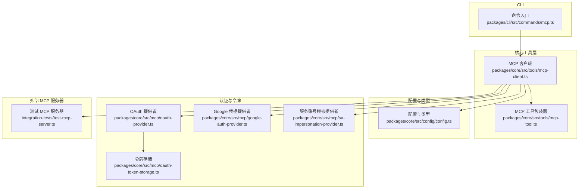
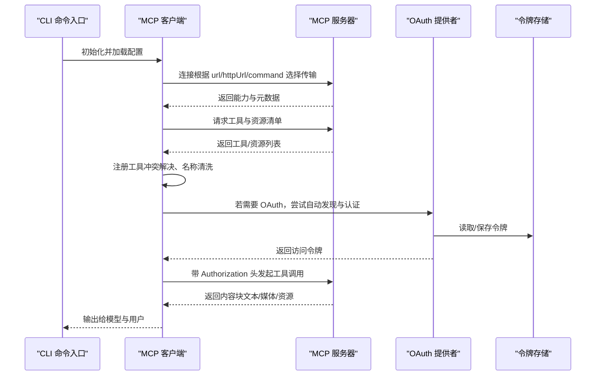
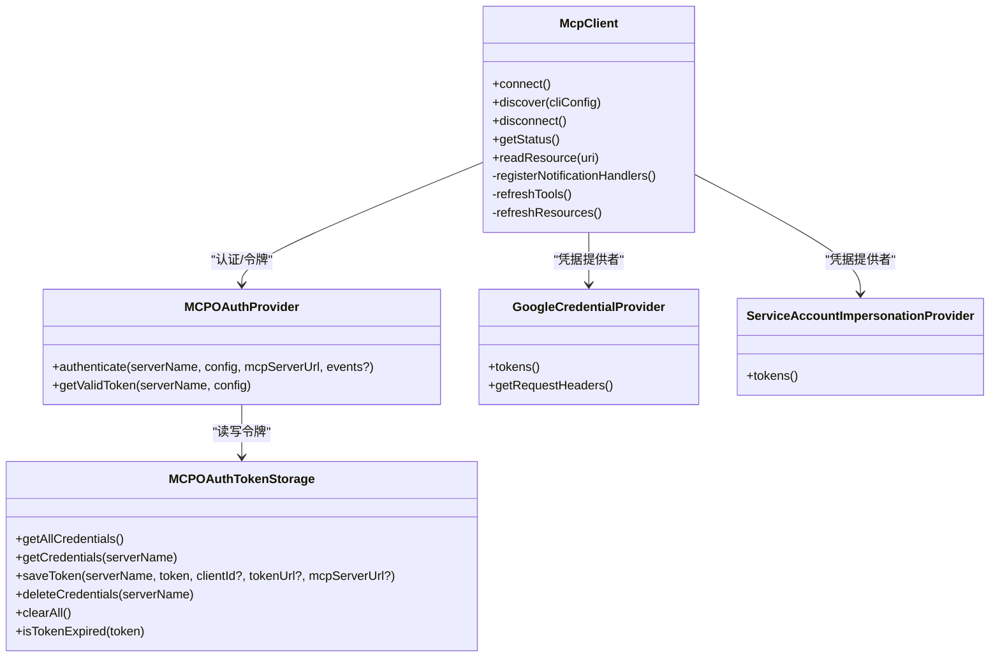
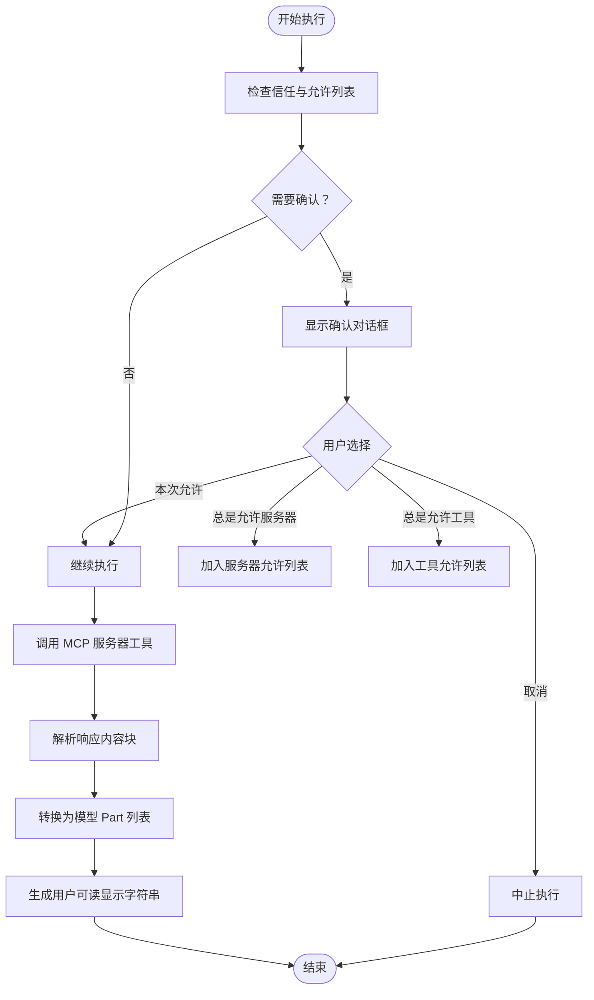
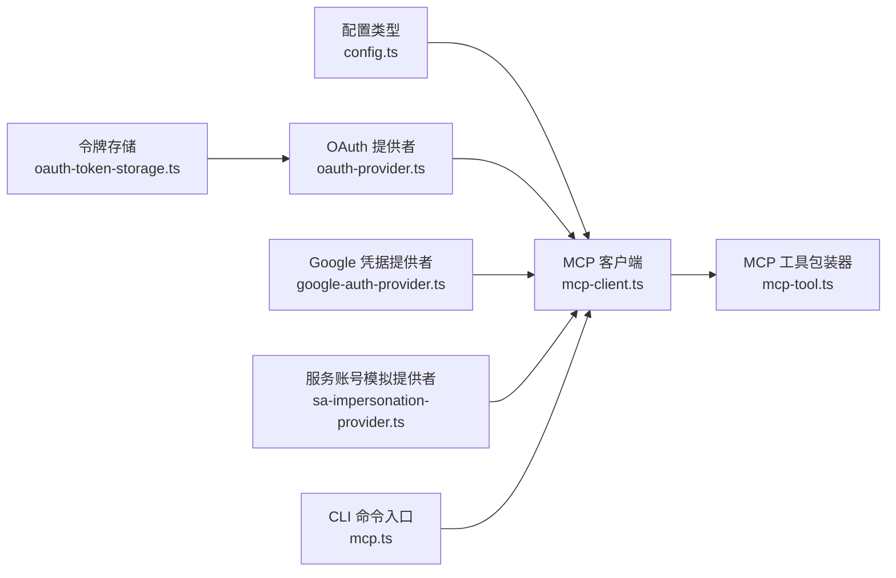

# MCP 服务器集成

<cite>
**本文引用的文件列表**
- [mcp-server.md](file://docs/tools/mcp-server.md)
- [mcp-client.ts](file://packages/core/src/tools/mcp-client.ts)
- [mcp-tool.ts](file://packages/core/src/tools/mcp-tool.ts)
- [config.ts](file://packages/core/src/config/config.ts)
- [oauth-provider.ts](file://packages/core/src/mcp/oauth-provider.ts)
- [oauth-token-storage.ts](file://packages/core/src/mcp/oauth-token-storage.ts)
- [google-auth-provider.ts](file://packages/core/src/mcp/google-auth-provider.ts)
- [sa-impersonation-provider.ts](file://packages/core/src/mcp/sa-impersonation-provider.ts)
- [mcp.ts](file://packages/cli/src/commands/mcp.ts)
- [test-mcp-server.ts](file://integration-tests/test-mcp-server.ts)
- [simple-mcp-server.test.ts](file://integration-tests/simple-mcp-server.test.ts)
- [mcp_server_cyclic_schema.test.ts](file://integration-tests/mcp_server_cyclic_schema.test.ts)
</cite>

## 目录
1. [简介](#简介)
2. [项目结构](#项目结构)
3. [核心组件](#核心组件)
4. [架构总览](#架构总览)
5. [详细组件分析](#详细组件分析)
6. [依赖关系分析](#依赖关系分析)
7. [性能考量](#性能考量)
8. [故障排查指南](#故障排查指南)
9. [结论](#结论)
10. [附录](#附录)

## 简介
本文件面向希望在 Gemini CLI 中集成 MCP（Model Context Protocol）服务器的开发者与用户，系统性阐述 MCP 协议的设计目标与工作原理，并聚焦于其作为“AI 模型与外部工具服务器之间通信桥梁”的角色。文档覆盖：
- 在 Gemini CLI 中配置 MCP 服务器的方式与关键字段
- 认证机制（OAuth、服务账号模拟）
- 完整端到端示例：从 Node.js/TypeScript 创建简单 MCP 服务器，定义自定义工具的 JSON Schema，到在 CLI 中注册并使用该工具
- 安全最佳实践（令牌存储、认证流程）
- 核心层模块 mcp-client.ts 与 mcp-tool.ts 的职责与交互

## 项目结构
围绕 MCP 集成，核心代码分布在以下位置：
- 文档：docs/tools/mcp-server.md 提供配置与使用指南
- 核心工具层：packages/core/src/tools 下的 mcp-client.ts、mcp-tool.ts 负责发现、连接、执行与结果转换
- 配置与类型：packages/core/src/config/config.ts 定义 MCPServerConfig、AuthProviderType 等
- 认证与令牌：packages/core/src/mcp 下的 oauth-provider.ts、oauth-token-storage.ts、google-auth-provider.ts、sa-impersonation-provider.ts
- CLI 命令入口：packages/cli/src/commands/mcp.ts
- 集成测试：integration-tests 下的 test-mcp-server.ts、simple-mcp-server.test.ts、mcp_server_cyclic_schema.test.ts

图表来源
- [mcp.ts](file://packages/cli/src/commands/mcp.ts#L1-L30)
- [mcp-client.ts](file://packages/core/src/tools/mcp-client.ts#L1-L120)
- [mcp-tool.ts](file://packages/core/src/tools/mcp-tool.ts#L1-L120)
- [config.ts](file://packages/core/src/config/config.ts#L180-L230)
- [oauth-provider.ts](file://packages/core/src/mcp/oauth-provider.ts#L1-L120)
- [oauth-token-storage.ts](file://packages/core/src/mcp/oauth-token-storage.ts#L1-L120)
- [google-auth-provider.ts](file://packages/core/src/mcp/google-auth-provider.ts#L1-L80)
- [sa-impersonation-provider.ts](file://packages/core/src/mcp/sa-impersonation-provider.ts#L1-L80)
- [test-mcp-server.ts](file://integration-tests/test-mcp-server.ts#L1-L80)

章节来源
- [mcp.ts](file://packages/cli/src/commands/mcp.ts#L1-L30)
- [mcp-client.ts](file://packages/core/src/tools/mcp-client.ts#L1-L120)
- [mcp-tool.ts](file://packages/core/src/tools/mcp-tool.ts#L1-L120)
- [config.ts](file://packages/core/src/config/config.ts#L180-L230)
- [oauth-provider.ts](file://packages/core/src/mcp/oauth-provider.ts#L1-L120)
- [oauth-token-storage.ts](file://packages/core/src/mcp/oauth-token-storage.ts#L1-L120)
- [google-auth-provider.ts](file://packages/core/src/mcp/google-auth-provider.ts#L1-L80)
- [sa-impersonation-provider.ts](file://packages/core/src/mcp/sa-impersonation-provider.ts#L1-L80)
- [test-mcp-server.ts](file://integration-tests/test-mcp-server.ts#L1-L80)

## 核心组件
- MCP 客户端（mcp-client.ts）：负责连接、发现工具与资源、动态更新、状态管理、错误处理与重试策略；支持自动 OAuth 发现与认证。
- MCP 工具包装器（mcp-tool.ts）：将 MCP 工具封装为可确认、可执行的通用工具，负责参数校验、调用 MCP 服务器、内容块转换与展示。
- 配置与类型（config.ts）：定义 MCPServerConfig、AuthProviderType、OAuth 配置等，统一 MCP 服务器配置入口。
- 认证与令牌（oauth-provider.ts、oauth-token-storage.ts、google-auth-provider.ts、sa-impersonation-provider.ts）：实现 OAuth 授权码流程、令牌存储与刷新、Google 凭据与服务账号模拟等。
- CLI 命令入口（mcp.ts）：提供管理 MCP 服务器的子命令入口，驱动后续流程。

章节来源
- [mcp-client.ts](file://packages/core/src/tools/mcp-client.ts#L120-L220)
- [mcp-tool.ts](file://packages/core/src/tools/mcp-tool.ts#L120-L220)
- [config.ts](file://packages/core/src/config/config.ts#L180-L230)
- [oauth-provider.ts](file://packages/core/src/mcp/oauth-provider.ts#L1-L120)
- [oauth-token-storage.ts](file://packages/core/src/mcp/oauth-token-storage.ts#L1-L120)
- [google-auth-provider.ts](file://packages/core/src/mcp/google-auth-provider.ts#L1-L80)
- [sa-impersonation-provider.ts](file://packages/core/src/mcp/sa-impersonation-provider.ts#L1-L80)
- [mcp.ts](file://packages/cli/src/commands/mcp.ts#L1-L30)

## 架构总览
MCP 集成采用“发现—执行—反馈”的闭环：
- 发现阶段：遍历配置中的 MCP 服务器，选择传输方式（Stdio/SSE/HTTP），建立连接，拉取工具与资源清单，进行名称与模式兼容处理。
- 执行阶段：当模型决定调用某个工具时，触发确认流程（信任豁免或用户确认），随后以 MCP 协议调用服务器，解析返回的内容块并生成对模型与用户的输出。
- 认证阶段：若服务器要求 OAuth，客户端会尝试自动发现 OAuth 元数据并完成授权码流程，保存令牌并在后续请求中携带。

图表来源
- [mcp-client.ts](file://packages/core/src/tools/mcp-client.ts#L555-L740)
- [oauth-provider.ts](file://packages/core/src/mcp/oauth-provider.ts#L578-L738)
- [oauth-token-storage.ts](file://packages/core/src/mcp/oauth-token-storage.ts#L120-L180)
- [test-mcp-server.ts](file://integration-tests/test-mcp-server.ts#L1-L80)

章节来源
- [mcp-client.ts](file://packages/core/src/tools/mcp-client.ts#L555-L740)
- [oauth-provider.ts](file://packages/core/src/mcp/oauth-provider.ts#L578-L738)
- [oauth-token-storage.ts](file://packages/core/src/mcp/oauth-token-storage.ts#L120-L180)
- [test-mcp-server.ts](file://integration-tests/test-mcp-server.ts#L1-L80)

## 详细组件分析

### MCP 客户端（mcp-client.ts）
职责与要点：
- 连接与状态管理：维护 MCPServerStatus、MCPDiscoveryState，监听服务器通知，支持工具/资源变更的动态刷新。
- 自动 OAuth：当连接失败且返回 WWW-Authenticate 头时，解析元数据 URI 并尝试发现 OAuth 配置，再执行授权码流程。
- 传输创建：根据配置选择 SSE 或 HTTP 传输，并注入 Authorization 头。
- 工具发现与注册：拉取工具列表，进行名称清洗与冲突解决，注册到全局工具注册表。
- 资源发现与引用：拉取资源列表，支持在对话中通过 @server://URI 引用资源。

图表来源
- [mcp-client.ts](file://packages/core/src/tools/mcp-client.ts#L120-L220)
- [oauth-provider.ts](file://packages/core/src/mcp/oauth-provider.ts#L1-L120)
- [oauth-token-storage.ts](file://packages/core/src/mcp/oauth-token-storage.ts#L1-L120)
- [google-auth-provider.ts](file://packages/core/src/mcp/google-auth-provider.ts#L1-L80)
- [sa-impersonation-provider.ts](file://packages/core/src/mcp/sa-impersonation-provider.ts#L1-L80)

章节来源
- [mcp-client.ts](file://packages/core/src/tools/mcp-client.ts#L120-L220)
- [mcp-client.ts](file://packages/core/src/tools/mcp-client.ts#L555-L740)
- [mcp-client.ts](file://packages/core/src/tools/mcp-client.ts#L740-L840)
- [mcp-client.ts](file://packages/core/src/tools/mcp-client.ts#L1157-L1184)
- [mcp-client.ts](file://packages/core/src/tools/mcp-client.ts#L1709-L1747)

### MCP 工具包装器（mcp-tool.ts）
职责与要点：
- 确认逻辑：基于信任设置与允许列表决定是否弹出确认对话；支持“本次允许/总是允许服务器/总是允许工具/取消”等选项。
- 执行流程：构造函数调用，将 MCP 服务器原始响应转换为模型可用的 Part 数组，并生成用户可读的显示字符串。
- 内容块转换：支持 text、image、audio、resource、resource_link 等类型，按规范转换为标准 Part 结构。
- 名称清洗：确保工具名满足 API 限制（长度与字符集）。

图表来源
- [mcp-tool.ts](file://packages/core/src/tools/mcp-tool.ts#L90-L140)
- [mcp-tool.ts](file://packages/core/src/tools/mcp-tool.ts#L146-L208)
- [mcp-tool.ts](file://packages/core/src/tools/mcp-tool.ts#L285-L373)
- [mcp-tool.ts](file://packages/core/src/tools/mcp-tool.ts#L375-L416)

章节来源
- [mcp-tool.ts](file://packages/core/src/tools/mcp-tool.ts#L90-L140)
- [mcp-tool.ts](file://packages/core/src/tools/mcp-tool.ts#L146-L208)
- [mcp-tool.ts](file://packages/core/src/tools/mcp-tool.ts#L285-L373)
- [mcp-tool.ts](file://packages/core/src/tools/mcp-tool.ts#L375-L416)

### 配置与类型（config.ts）
要点：
- MCPServerConfig：统一承载服务器配置（command/url/httpUrl/headers/type/timeout/trust/includeTools/excludeTools/oauth/authProviderType/targetAudience/targetServiceAccount 等）。
- AuthProviderType：支持 dynamic_discovery、google_credentials、service_account_impersonation。
- ConfigParameters：包含 mcpServers 字段，作为 CLI 配置的入口。

章节来源
- [config.ts](file://packages/core/src/config/config.ts#L180-L230)
- [config.ts](file://packages/core/src/config/config.ts#L220-L230)
- [config.ts](file://packages/core/src/config/config.ts#L231-L320)

### 认证与令牌（oauth-provider.ts、oauth-token-storage.ts、google-auth-provider.ts、sa-impersonation-provider.ts）
要点：
- OAuth 提供者（MCPOAuthProvider）：实现授权码流程、PKCE、动态客户端注册、令牌刷新、资源参数构建等。
- 令牌存储（MCPOAuthTokenStorage）：支持文件与加密混合存储，默认权限严格控制，支持过期检测与清理。
- Google 凭据提供者（GoogleCredentialProvider）：使用 ADC 获取访问令牌，限定允许主机，支持用户项目头。
- 服务账号模拟提供者（ServiceAccountImpersonationProvider）：通过 IAM Credentials API 生成 ID Token，用于 IAP 场景。

章节来源
- [oauth-provider.ts](file://packages/core/src/mcp/oauth-provider.ts#L1-L120)
- [oauth-provider.ts](file://packages/core/src/mcp/oauth-provider.ts#L578-L738)
- [oauth-token-storage.ts](file://packages/core/src/mcp/oauth-token-storage.ts#L1-L120)
- [oauth-token-storage.ts](file://packages/core/src/mcp/oauth-token-storage.ts#L120-L180)
- [google-auth-provider.ts](file://packages/core/src/mcp/google-auth-provider.ts#L1-L80)
- [sa-impersonation-provider.ts](file://packages/core/src/mcp/sa-impersonation-provider.ts#L1-L80)

### CLI 命令入口（mcp.ts）
要点：
- 提供管理 MCP 服务器的子命令入口，初始化输出监听并聚合 add/list/remove 子命令。

章节来源
- [mcp.ts](file://packages/cli/src/commands/mcp.ts#L1-L30)

## 依赖关系分析
- MCP 客户端依赖配置类型（MCPServerConfig、AuthProviderType）、OAuth 提供者与令牌存储、Google 凭据与服务账号模拟提供者。
- MCP 工具包装器依赖 MCP 客户端返回的可调用工具，负责确认与执行。
- CLI 命令入口依赖 MCP 客户端与工具包装器，驱动发现与执行流程。

图表来源
- [config.ts](file://packages/core/src/config/config.ts#L180-L230)
- [mcp-client.ts](file://packages/core/src/tools/mcp-client.ts#L120-L220)
- [oauth-provider.ts](file://packages/core/src/mcp/oauth-provider.ts#L1-L120)
- [oauth-token-storage.ts](file://packages/core/src/mcp/oauth-token-storage.ts#L1-L120)
- [google-auth-provider.ts](file://packages/core/src/mcp/google-auth-provider.ts#L1-L80)
- [sa-impersonation-provider.ts](file://packages/core/src/mcp/sa-impersonation-provider.ts#L1-L80)
- [mcp-tool.ts](file://packages/core/src/tools/mcp-tool.ts#L120-L220)
- [mcp.ts](file://packages/cli/src/commands/mcp.ts#L1-L30)

章节来源
- [config.ts](file://packages/core/src/config/config.ts#L180-L230)
- [mcp-client.ts](file://packages/core/src/tools/mcp-client.ts#L120-L220)
- [oauth-provider.ts](file://packages/core/src/mcp/oauth-provider.ts#L1-L120)
- [oauth-token-storage.ts](file://packages/core/src/mcp/oauth-token-storage.ts#L1-L120)
- [google-auth-provider.ts](file://packages/core/src/mcp/google-auth-provider.ts#L1-L80)
- [sa-impersonation-provider.ts](file://packages/core/src/mcp/sa-impersonation-provider.ts#L1-L80)
- [mcp-tool.ts](file://packages/core/src/tools/mcp-tool.ts#L120-L220)
- [mcp.ts](file://packages/cli/src/commands/mcp.ts#L1-L30)

## 性能考量
- 连接持久化：成功注册工具的服务器保持连接，减少重复握手开销。
- 动态刷新合并：工具与资源变更采用“合并模式”避免频繁刷新导致的抖动。
- 超时与中止：默认较长超时时间，支持 AbortSignal 中止长耗时调用。
- 输出验证降级：复杂工具输出模式编译失败时采用宽松验证，保证可用性。

章节来源
- [mcp-client.ts](file://packages/core/src/tools/mcp-client.ts#L380-L446)
- [mcp-client.ts](file://packages/core/src/tools/mcp-client.ts#L743-L773)

## 故障排查指南
常见问题与建议：
- 服务器无法连接：检查 command/args/cwd、手动运行验证、查看日志、确认权限。
- 未发现工具：确认服务器正确实现工具列表接口、检查 stderr 日志、逐步缩小功能范围。
- 工具执行失败：核对参数与 JSON Schema、检查异常处理、适当增加超时。
- 沙盒兼容：确保服务器在沙盒内可访问网络与必要路径，传递所需环境变量。
- OAuth 流程：确保本地可打开浏览器并接收回调；在无头环境或容器中需额外配置。

章节来源
- [mcp-server.md](file://docs/tools/mcp-server.md#L655-L768)

## 结论
MCP 为 Gemini CLI 提供了强大的扩展能力，通过标准化的工具与资源发现、灵活的传输方式以及完善的认证与令牌管理，既保障了安全性，又提升了易用性。结合本文档的配置与端到端示例，用户可以快速搭建并安全地使用自定义 MCP 服务器。

## 附录

### 在 Gemini CLI 中配置 MCP 服务器
- 在 settings.json 中添加 mcpServers 对象，定义服务器名称与配置项（command/url/httpUrl/headers/type/timeout/trust/includeTools/excludeTools/oauth/authProviderType/targetAudience/targetServiceAccount 等）。
- 使用全局 mcp 对象控制允许/排除列表与全局命令。
- 参考文档中的示例配置，覆盖 Stdio、HTTP、SSE、Docker、过滤工具等场景。

章节来源
- [mcp-server.md](file://docs/tools/mcp-server.md#L90-L180)
- [mcp-server.md](file://docs/tools/mcp-server.md#L180-L268)
- [mcp-server.md](file://docs/tools/mcp-server.md#L348-L470)

### 认证机制与最佳实践
- OAuth 自动发现：当服务器返回 WWW-Authenticate 头时，客户端自动解析元数据并启动授权码流程。
- 令牌存储：默认存储在安全位置，具备过期检测与清理；支持加密文件存储。
- Google 凭据：使用 ADC，限定允许主机，支持用户项目头。
- 服务账号模拟：通过 IAM Credentials API 生成 ID Token，适用于 IAP 场景。

章节来源
- [mcp-client.ts](file://packages/core/src/tools/mcp-client.ts#L555-L740)
- [oauth-provider.ts](file://packages/core/src/mcp/oauth-provider.ts#L578-L738)
- [oauth-token-storage.ts](file://packages/core/src/mcp/oauth-token-storage.ts#L1-L120)
- [google-auth-provider.ts](file://packages/core/src/mcp/google-auth-provider.ts#L1-L80)
- [sa-impersonation-provider.ts](file://packages/core/src/mcp/sa-impersonation-provider.ts#L1-L80)

### 端到端示例：Node.js/TypeScript MCP 服务器
步骤概览：
- 使用 @modelcontextprotocol/sdk/server 创建 McpServer 实例，注册工具回调。
- 通过 StreamableHTTPServerTransport 暴露 /mcp 端点。
- 在 settings.json 中配置 httpUrl/httpUrl+headers 或 command/url 等不同传输方式。
- 启动 Gemini CLI，使用 /mcp 查看服务器状态与工具列表，直接调用工具。

参考实现与测试：
- 测试服务器实现：integration-tests/test-mcp-server.ts
- 简单 MCP 服务器集成测试：integration-tests/simple-mcp-server.test.ts
- 循环 Schema 兼容性测试：integration-tests/mcp_server_cyclic_schema.test.ts

章节来源
- [test-mcp-server.ts](file://integration-tests/test-mcp-server.ts#L1-L80)
- [simple-mcp-server.test.ts](file://integration-tests/simple-mcp-server.test.ts#L1-L120)
- [mcp_server_cyclic_schema.test.ts](file://integration-tests/mcp_server_cyclic_schema.test.ts#L137-L203)