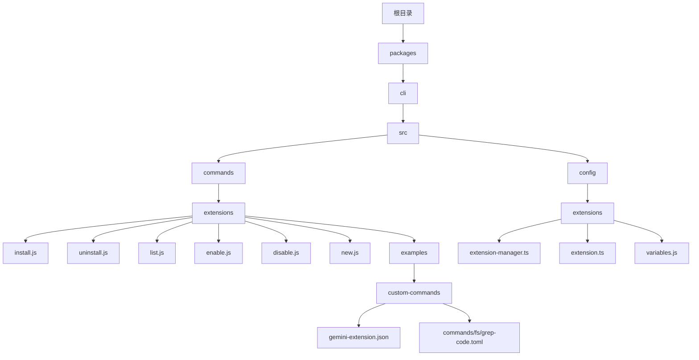
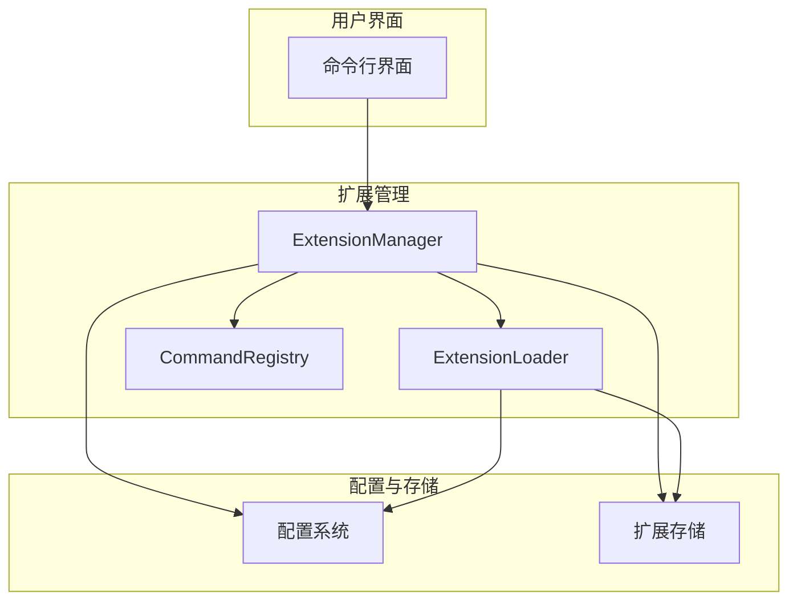
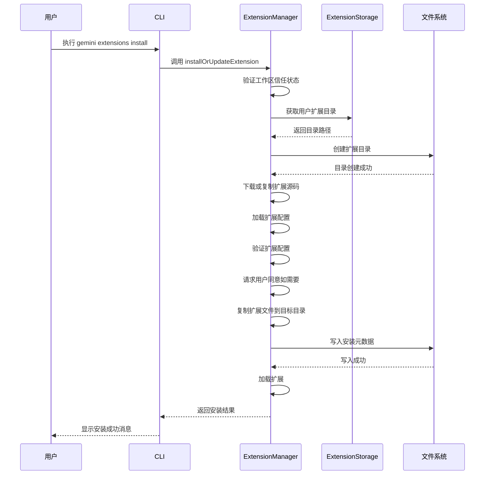

# 自定义扩展

<cite>
**本文档中引用的文件**  
- [extension-manager.ts](file://packages/cli/src/config/extension-manager.ts)
- [extension.ts](file://packages/cli/src/config/extension.ts)
- [gemini-extension.json](file://packages/cli/src/commands/extensions/examples/custom-commands/gemini-extension.json)
- [grep-code.toml](file://packages/cli/src/commands/extensions/examples/custom-commands/commands/fs/grep-code.toml)
- [extensions.tsx](file://packages/cli/src/commands/extensions.tsx)
- [config.ts](file://packages/core/src/config/config.ts)
- [variables.js](file://packages/cli/src/config/extensions/variables.js)
</cite>

## 目录
1. [简介](#简介)
2. [项目结构](#项目结构)
3. [核心组件](#核心组件)
4. [架构概述](#架构概述)
5. [详细组件分析](#详细组件分析)
6. [依赖分析](#依赖分析)
7. [性能考虑](#性能考虑)
8. [故障排除指南](#故障排除指南)
9. [结论](#结论)

## 简介
本文档全面介绍了Gemini CLI的自定义扩展系统。该系统允许用户通过`gemini-extension.json`文件定义扩展的元数据、命令和权限，从而增强CLI的功能。文档详细说明了扩展系统的架构，包括如何创建扩展包、CLI如何加载和管理扩展，以及扩展的安全模型。通过本指南，开发者可以了解如何添加全新的CLI命令，并遵循最佳实践来确保扩展的安全性和可靠性。

## 项目结构
Gemini CLI的项目结构组织良好，扩展相关功能主要分布在`packages/cli/src/commands/extensions`和`packages/cli/src/config/extensions`目录中。核心扩展管理逻辑位于`extension-manager.ts`文件中，而扩展的配置和元数据定义则在`extension.ts`中。扩展示例位于`packages/cli/src/commands/extensions/examples`目录下，提供了创建自定义命令、MCP服务器集成等实际案例。



**Diagram sources**
- [extension-manager.ts](file://packages/cli/src/config/extension-manager.ts#L1-L820)
- [extension.ts](file://packages/cli/src/config/extension.ts#L1-L50)

**Section sources**
- [extension-manager.ts](file://packages/cli/src/config/extension-manager.ts#L1-L820)
- [extension.ts](file://packages/cli/src/config/extension.ts#L1-L50)

## 核心组件
自定义扩展系统的核心组件包括`ExtensionManager`、`CommandRegistry`和`ExtensionLoader`。`ExtensionManager`负责扩展的安装、卸载、启用和禁用，是扩展生命周期管理的主要入口。`CommandRegistry`用于注册和管理由扩展提供的自定义命令。`ExtensionLoader`则负责加载已安装的扩展，并将其集成到CLI环境中。这些组件共同协作，确保扩展能够安全、可靠地运行。

**Section sources**
- [extension-manager.ts](file://packages/cli/src/config/extension-manager.ts#L77-L820)
- [config.ts](file://packages/core/src/config/config.ts#L138-L149)

## 架构概述
Gemini CLI的扩展系统采用模块化架构，通过清晰的接口和职责分离来管理扩展的各个方面。系统通过`ExtensionManager`类来协调扩展的安装、加载和生命周期管理。当用户执行扩展命令时，CLI会调用相应的子命令处理器，这些处理器通过`CommandRegistry`来注册和调用扩展功能。



**Diagram sources**
- [extension-manager.ts](file://packages/cli/src/config/extension-manager.ts#L77-L820)
- [extensions.tsx](file://packages/cli/src/commands/extensions.tsx#L1-L44)

## 详细组件分析

### 扩展管理器分析
`ExtensionManager`是扩展系统的核心，负责处理扩展的整个生命周期。它继承自`ExtensionLoader`，并实现了扩展的安装、卸载、启用和禁用功能。该类通过事件发射器与其他系统组件通信，并使用`ExtensionStorage`来管理扩展的物理存储位置。

#### 类图
```mermaid
classDiagram
class ExtensionManager {
+workspaceDir : string
+settings : Settings
+requestConsent : (consent : string) => Promise<boolean>
+requestSetting : ((setting : ExtensionSetting) => Promise<string>) | undefined
+telemetryConfig : Config
+loadedExtensions : GeminiCLIExtension[] | undefined
+installOrUpdateExtension(installMetadata : ExtensionInstallMetadata, previousExtensionConfig? : ExtensionConfig) : Promise<GeminiCLIExtension>
+uninstallExtension(extensionIdentifier : string, isUpdate : boolean) : Promise<void>
+loadExtensions() : Promise<GeminiCLIExtension[]>
+loadExtension(extensionDir : string) : Promise<GeminiCLIExtension | null>
+unloadExtension(extension : GeminiCLIExtension) : Promise<void> | undefined
+loadExtensionConfig(extensionDir : string) : ExtensionConfig
+loadExtensionHooks(extensionDir : string, context : { extensionPath : string; workspacePath : string }) : Promise<{ [K in HookEventName]? : HookDefinition[] } | undefined>
+toOutputString(extension : GeminiCLIExtension) : string
+disableExtension(name : string, scope : SettingScope)
+enableExtension(name : string, scope : SettingScope)
}
class ExtensionLoader {
+eventEmitter : EventEmitter<ExtensionEvents>
+config : Config | undefined
+maybeStartExtension(extension : GeminiCLIExtension) : Promise<void>
+maybeStopExtension(extension : GeminiCLIExtension) : Promise<void>
}
ExtensionManager --|> ExtensionLoader
ExtensionManager --> ExtensionEnablementManager : "使用"
ExtensionManager --> ExtensionStorage : "使用"
ExtensionManager --> Config : "使用"
```

**Diagram sources**
- [extension-manager.ts](file://packages/cli/src/config/extension-manager.ts#L77-L820)

#### 扩展安装流程


**Diagram sources**
- [extension-manager.ts](file://packages/cli/src/config/extension-manager.ts#L129-L358)

### 扩展配置分析
扩展的元数据通过`gemini-extension.json`文件定义，该文件包含扩展的名称、版本、MCP服务器配置、上下文文件名、排除的工具和设置等信息。系统通过`ExtensionConfig`接口来表示这些配置。

#### 扩展配置示例
```json
{
  "name": "custom-commands",
  "version": "1.0.0"
}
```

**Section sources**
- [gemini-extension.json](file://packages/cli/src/commands/extensions/examples/custom-commands/gemini-extension.json#L1-L5)
- [extension.ts](file://packages/cli/src/config/extension.ts#L23-L30)

#### 自定义命令配置
扩展可以定义自定义命令，这些命令通过TOML文件在`commands`目录下进行配置。例如，`grep-code.toml`文件定义了一个用于搜索代码的命令。

```toml
# 这是一个自定义命令的示例配置
name = "grep-code"
description = "在代码库中搜索指定模式"
command = "grep -r {pattern} {directory}"
```

**Section sources**
- [grep-code.toml](file://packages/cli/src/commands/extensions/examples/custom-commands/commands/fs/grep-code.toml#L1-L4)

## 依赖分析
扩展系统依赖于多个核心组件和外部库。主要依赖包括Node.js的文件系统和路径模块、chalk用于终端颜色输出，以及核心包中的配置和事件系统。扩展管理器与配置系统紧密集成，通过设置来控制扩展的行为，如是否允许从Git安装扩展。

```mermaid
graph TD
A[ExtensionManager] --> B[fs: node:fs]
A --> C[path: node:path]
A --> D[os: node:os]
A --> E[chalk]
A --> F[ExtensionEnablementManager]
A --> G[ExtensionStorage]
A --> H[Config]
A --> I[EventEmitter]
A --> J[loadInstallMetadata]
A --> K[resolveEnvVarsInObject]
A --> L[recursivelyHydrateStrings]
A --> M[maybeRequestConsentOrFail]
A --> N[getEnvContents]
A --> O[maybePromptForSettings]
A --> P[copyExtension]
A --> Q[logExtensionInstallEvent]
A --> R[logExtensionUpdateEvent]
A --> S[logExtensionUninstall]
A --> T[logExtensionEnable]
A --> U[logExtensionDisable]
```



**Diagram sources**
- [extension-manager.ts](file://packages/cli/src/config/extension-manager.ts#L7-L800)
- [config.ts](file://packages/core/src/config/config.ts#L138-L149)

## 性能考虑
扩展系统的性能主要受扩展加载和命令执行的影响。系统通过异步操作和缓存机制来优化性能。例如，`ExtensionManager`在加载扩展时使用递归读取目录，并异步处理每个扩展的加载。此外，系统通过`ExtensionStorage`来管理扩展的存储位置，避免重复下载和安装。

## 故障排除指南
在使用自定义扩展时，可能会遇到各种问题。以下是一些常见问题及其解决方案：

- **扩展安装失败**：检查工作区是否受信任，确保网络连接正常，并验证扩展源的有效性。
- **扩展命令无法执行**：确认扩展已正确启用，并检查命令配置文件的语法是否正确。
- **权限问题**：确保扩展请求的权限已获得用户同意，并检查系统设置是否允许扩展执行相关操作。

**Section sources**
- [extension-manager.ts](file://packages/cli/src/config/extension-manager.ts#L545-L551)
- [extension.ts](file://packages/cli/src/config/extension.ts#L41-L48)

## 结论
Gemini CLI的自定义扩展系统提供了一个强大而灵活的框架，允许开发者通过简单的配置文件来扩展CLI的功能。通过`gemini-extension.json`文件，开发者可以定义扩展的元数据、命令和权限，而`ExtensionManager`和`CommandRegistry`则确保这些扩展能够安全、可靠地集成到CLI环境中。该系统的设计注重安全性、可维护性和易用性，为用户提供了丰富的扩展能力。