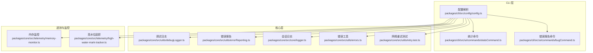
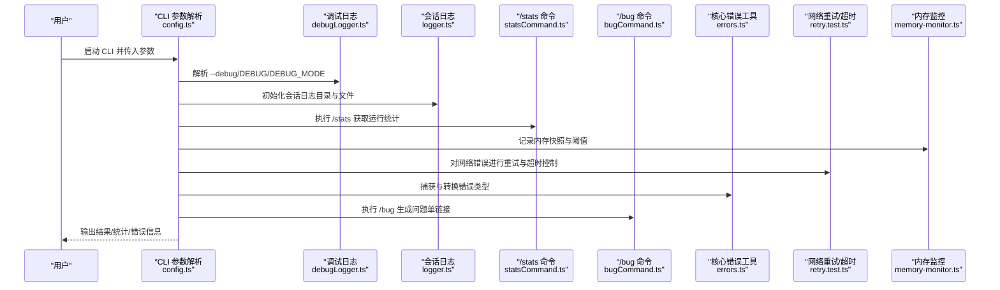
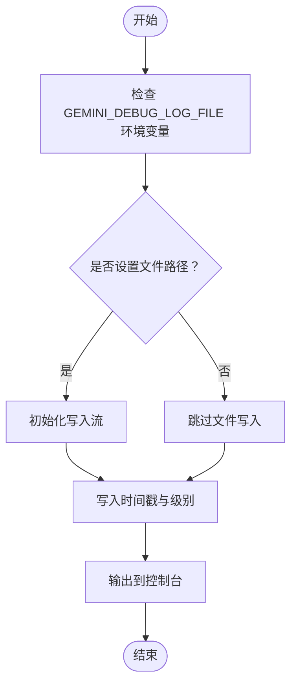
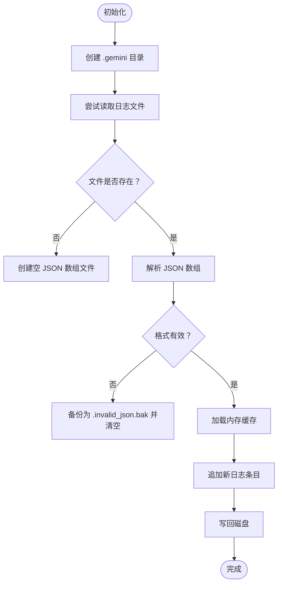
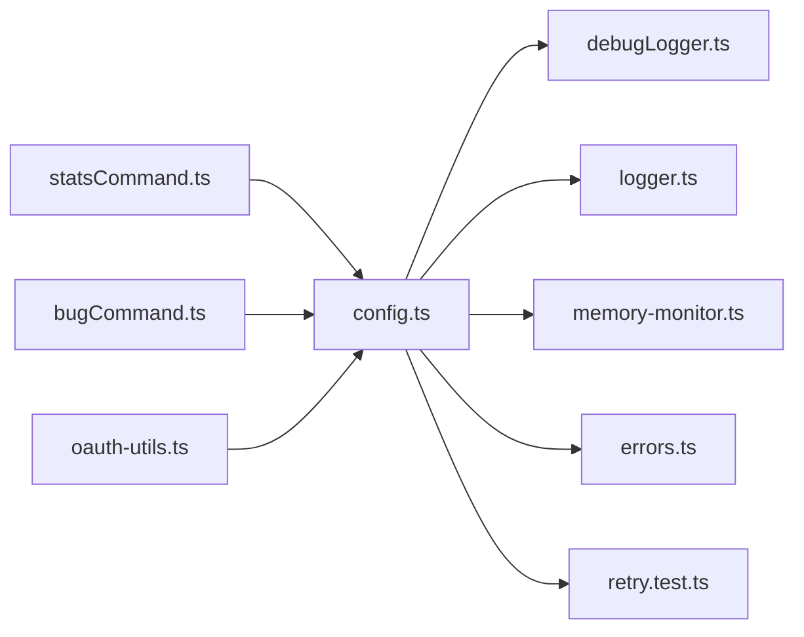

# 故障排除

<cite>
**本文引用的文件**
- [README.md](file://README.md)
- [docs/troubleshooting.md](file://docs/troubleshooting.md)
- [packages/cli/src/config/config.ts](file://packages/cli/src/config/config.ts)
- [packages/cli/src/ui/commands/statsCommand.ts](file://packages/cli/src/ui/commands/statsCommand.ts)
- [packages/cli/src/ui/commands/bugCommand.ts](file://packages/cli/src/ui/commands/bugCommand.ts)
- [packages/core/src/utils/debugLogger.ts](file://packages/core/src/utils/debugLogger.ts)
- [packages/core/src/utils/errorReporting.ts](file://packages/core/src/utils/errorReporting.ts)
- [packages/core/src/core/logger.ts](file://packages/core/src/core/logger.ts)
- [packages/core/src/utils/errors.ts](file://packages/core/src/utils/errors.ts)
- [packages/core/src/utils/retry.test.ts](file://packages/core/src/utils/retry.test.ts)
- [packages/core/src/telemetry/memory-monitor.ts](file://packages/core/src/telemetry/memory-monitor.ts)
- [packages/core/src/telemetry/high-water-mark-tracker.ts](file://packages/core/src/telemetry/high-water-mark-tracker.ts)
- [packages/cli/src/ui/hooks/useMemoryMonitor.test.tsx](file://packages/cli/src/ui/hooks/useMemoryMonitor.test.tsx)
- [packages/cli/src/ui/components/MemoryUsageDisplay.test.tsx](file://packages/cli/src/ui/components/MemoryUsageDisplay.test.tsx)
- [packages/core/src/mcp/oauth-utils.ts](file://packages/core/src/mcp/oauth-utils.ts)
- [packages/core/src/safety/checker-runner.ts](file://packages/core/src/safety/checker-runner.ts)
- [schemas/settings.schema.json](file://schemas/settings.schema.json)
</cite>

## 目录
1. [简介](#简介)
2. [项目结构与定位](#项目结构与定位)
3. [核心组件与职责](#核心组件与职责)
4. [架构总览](#架构总览)
5. [详细组件分析](#详细组件分析)
6. [依赖关系分析](#依赖关系分析)
7. [性能与资源瓶颈排查](#性能与资源瓶颈排查)
8. [常见问题与排错清单](#常见问题与排错清单)
9. [错误代码参考表](#错误代码参考表)
10. [提交有效错误报告指南](#提交有效错误报告指南)
11. [结论](#结论)

## 简介
本指南面向使用 Gemini CLI 的用户，提供系统化的故障排除流程：覆盖认证失败、网络连接问题、工具执行错误、性能瓶颈等常见场景；指导如何检查日志、收集调试信息；解释如何使用 /stats 和 --debug 标志；给出错误代码参考与提交高质量问题单的方法。目标是帮助你在最短时间内定位并解决问题，或在需要时高效获得社区支持。

## 项目结构与定位
Gemini CLI 由多包组成，故障排除相关的关键模块集中在：
- CLI 层：参数解析、交互命令、统计与错误上报
- 核心层：日志持久化、调试日志、错误报告、重试与超时控制
- 遥测与内存监控：内存使用统计、高水位阈值跟踪
- 设置与配置：settings.json 结构、环境变量与调试开关

图表来源
- [packages/cli/src/config/config.ts](file://packages/cli/src/config/config.ts#L372-L380)
- [packages/cli/src/ui/commands/statsCommand.ts](file://packages/cli/src/ui/commands/statsCommand.ts#L1-L48)
- [packages/cli/src/ui/commands/bugCommand.ts](file://packages/cli/src/ui/commands/bugCommand.ts#L1-L97)
- [packages/core/src/utils/debugLogger.ts](file://packages/core/src/utils/debugLogger.ts#L1-L69)
- [packages/core/src/utils/errorReporting.ts](file://packages/core/src/utils/errorReporting.ts#L1-L119)
- [packages/core/src/core/logger.ts](file://packages/core/src/core/logger.ts#L70-L190)
- [packages/core/src/utils/errors.ts](file://packages/core/src/utils/errors.ts#L1-L35)
- [packages/core/src/utils/retry.test.ts](file://packages/core/src/utils/retry.test.ts#L311-L353)
- [packages/core/src/telemetry/memory-monitor.ts](file://packages/core/src/telemetry/memory-monitor.ts#L176-L449)
- [packages/core/src/telemetry/high-water-mark-tracker.ts](file://packages/core/src/telemetry/high-water-mark-tracker.ts#L1-L41)

章节来源
- [README.md](file://README.md#L1-L120)

## 核心组件与职责
- 调试日志与错误报告：统一输出到控制台与可选文件，便于收集上下文
- 会话日志：按会话持久化聊天记录，便于回溯
- 统计命令：展示运行时统计、配额等信息
- 错误报告命令：一键生成带环境信息的 GitHub Issue 链接
- 内存监控与高水位追踪：识别内存增长趋势与异常峰值
- 网络重试与超时：对常见网络错误进行退避重试与超时保护
- 配置与调试开关：解析 --debug、环境变量 DEBUG/DEBUG_MODE，以及 settings.json 中的调试选项

章节来源
- [packages/core/src/utils/debugLogger.ts](file://packages/core/src/utils/debugLogger.ts#L1-L69)
- [packages/core/src/utils/errorReporting.ts](file://packages/core/src/utils/errorReporting.ts#L1-L119)
- [packages/core/src/core/logger.ts](file://packages/core/src/core/logger.ts#L70-L190)
- [packages/cli/src/ui/commands/statsCommand.ts](file://packages/cli/src/ui/commands/statsCommand.ts#L1-L48)
- [packages/cli/src/ui/commands/bugCommand.ts](file://packages/cli/src/ui/commands/bugCommand.ts#L1-L97)
- [packages/core/src/telemetry/memory-monitor.ts](file://packages/core/src/telemetry/memory-monitor.ts#L176-L449)
- [packages/core/src/telemetry/high-water-mark-tracker.ts](file://packages/core/src/telemetry/high-water-mark-tracker.ts#L1-L41)
- [packages/core/src/utils/retry.test.ts](file://packages/core/src/utils/retry.test.ts#L311-L353)
- [packages/cli/src/config/config.ts](file://packages/cli/src/config/config.ts#L372-L380)

## 架构总览
下图展示了从用户输入到系统响应、日志与错误上报的整体路径，以及与外部服务（如 MCP 服务器、模型服务）的交互。

图表来源
- [packages/cli/src/config/config.ts](file://packages/cli/src/config/config.ts#L372-L380)
- [packages/core/src/utils/debugLogger.ts](file://packages/core/src/utils/debugLogger.ts#L1-L69)
- [packages/core/src/core/logger.ts](file://packages/core/src/core/logger.ts#L70-L190)
- [packages/cli/src/ui/commands/statsCommand.ts](file://packages/cli/src/ui/commands/statsCommand.ts#L1-L48)
- [packages/cli/src/ui/commands/bugCommand.ts](file://packages/cli/src/ui/commands/bugCommand.ts#L1-L97)
- [packages/core/src/utils/errors.ts](file://packages/core/src/utils/errors.ts#L1-L35)
- [packages/core/src/utils/retry.test.ts](file://packages/core/src/utils/retry.test.ts#L311-L353)
- [packages/core/src/telemetry/memory-monitor.ts](file://packages/core/src/telemetry/memory-monitor.ts#L176-L449)

## 详细组件分析

### 调试日志与错误报告
- 调试日志：支持写入可选文件（通过环境变量），同时输出到控制台，便于在脚本与交互模式下统一收集
- 错误报告：自动生成 JSON 报告文件，包含错误详情与上下文，并在失败时回退到控制台输出

图表来源
- [packages/core/src/utils/debugLogger.ts](file://packages/core/src/utils/debugLogger.ts#L1-L69)

章节来源
- [packages/core/src/utils/debugLogger.ts](file://packages/core/src/utils/debugLogger.ts#L1-L69)
- [packages/core/src/utils/errorReporting.ts](file://packages/core/src/utils/errorReporting.ts#L1-L119)

### 会话日志与恢复
- 初始化：确保 .gemini 目录存在，创建空日志文件（JSON 数组）
- 容错：遇到非数组或损坏 JSON 时备份并重建
- 追加：读取现有日志，追加新条目并更新内存缓存

图表来源
- [packages/core/src/core/logger.ts](file://packages/core/src/core/logger.ts#L128-L190)

章节来源
- [packages/core/src/core/logger.ts](file://packages/core/src/core/logger.ts#L70-L190)

### 统计命令与配额查询
- /stats：计算会话持续时间、显示配额信息（当可用时）
- 可用于快速判断是否因配额限制导致请求失败

章节来源
- [packages/cli/src/ui/commands/statsCommand.ts](file://packages/cli/src/ui/commands/statsCommand.ts#L1-L48)

### 错误报告命令
- /bug：自动拼装版本、提交信息、模型、内存、IDE 等信息，打开浏览器直达模板
- 支持通过配置自定义 URL 模板

章节来源
- [packages/cli/src/ui/commands/bugCommand.ts](file://packages/cli/src/ui/commands/bugCommand.ts#L1-L97)

### 内存监控与高水位阈值
- 记录 heapUsed、heapTotal、external、rss 等指标
- 高水位追踪：仅在显著增长时触发记录，避免噪声
- UI 层可显示内存使用并触发警告

章节来源
- [packages/core/src/telemetry/memory-monitor.ts](file://packages/core/src/telemetry/memory-monitor.ts#L176-L449)
- [packages/core/src/telemetry/high-water-mark-tracker.ts](file://packages/core/src/telemetry/high-water-mark-tracker.ts#L1-L41)
- [packages/cli/src/ui/hooks/useMemoryMonitor.test.tsx](file://packages/cli/src/ui/hooks/useMemoryMonitor.test.tsx#L1-L42)
- [packages/cli/src/ui/components/MemoryUsageDisplay.test.tsx](file://packages/cli/src/ui/components/MemoryUsageDisplay.test.tsx#L1-L55)

### 网络重试与超时
- 对常见网络错误（如 ECONNRESET、ETIMEDOUT）进行退避重试
- 可通过配置启用“重试抓取错误”策略

章节来源
- [packages/core/src/utils/retry.test.ts](file://packages/core/src/utils/retry.test.ts#L311-L353)
- [schemas/settings.schema.json](file://schemas/settings.schema.json#L90-L100)

### 认证与 MCP 服务器
- OAuth 发现与配置：从 WWW-Authenticate 头部解析授权服务器元数据
- 401 场景：优先尝试 SSE 回退，再根据情况引导手动认证

章节来源
- [packages/core/src/mcp/oauth-utils.ts](file://packages/core/src/mcp/oauth-utils.ts#L1-L334)
- [packages/core/src/safety/checker-runner.ts](file://packages/core/src/safety/checker-runner.ts#L280-L297)

## 依赖关系分析
- CLI 参数解析依赖调试日志、会话日志、内存监控与错误工具
- 统计命令依赖配置与服务端配额查询
- 错误报告命令依赖版本信息、IDE 客户端检测与浏览器打开
- 网络重试与超时贯穿工具调用链，提升稳定性

图表来源
- [packages/cli/src/config/config.ts](file://packages/cli/src/config/config.ts#L372-L380)
- [packages/core/src/utils/debugLogger.ts](file://packages/core/src/utils/debugLogger.ts#L1-L69)
- [packages/core/src/core/logger.ts](file://packages/core/src/core/logger.ts#L70-L190)
- [packages/core/src/telemetry/memory-monitor.ts](file://packages/core/src/telemetry/memory-monitor.ts#L176-L449)
- [packages/core/src/utils/errors.ts](file://packages/core/src/utils/errors.ts#L1-L35)
- [packages/core/src/utils/retry.test.ts](file://packages/core/src/utils/retry.test.ts#L311-L353)
- [packages/cli/src/ui/commands/statsCommand.ts](file://packages/cli/src/ui/commands/statsCommand.ts#L1-L48)
- [packages/cli/src/ui/commands/bugCommand.ts](file://packages/cli/src/ui/commands/bugCommand.ts#L1-L97)
- [packages/core/src/mcp/oauth-utils.ts](file://packages/core/src/mcp/oauth-utils.ts#L1-L334)

## 性能与资源瓶颈排查
- 使用 /stats 查看会话耗时与配额
- 开启 --debug 或设置 DEBUG/DEBUG_MODE 观察详细日志
- 在 UI 中开启“显示内存使用”，结合高水位阈值判断是否出现内存泄漏
- 对长时间运行任务，关注工具输出截断与总结策略，避免大输出导致内存压力

章节来源
- [packages/cli/src/ui/commands/statsCommand.ts](file://packages/cli/src/ui/commands/statsCommand.ts#L1-L48)
- [packages/cli/src/config/config.ts](file://packages/cli/src/config/config.ts#L372-L380)
- [packages/core/src/telemetry/memory-monitor.ts](file://packages/core/src/telemetry/memory-monitor.ts#L176-L449)
- [schemas/settings.schema.json](file://schemas/settings.schema.json#L260-L270)

## 常见问题与排错清单

### 认证失败
- 症状：提示组织订阅或登录失败
- 排查要点：
  - 检查是否设置了 GOOGLE_CLOUD_PROJECT 或 GOOGLE_CLOUD_PROJECT_ID 导致强制组织订阅校验
  - 若使用 Google Workspace/Gmail 账号，可能无法激活免费配额，考虑设置项目或使用 API Key
  - 企业网络可能拦截 SSL/TLS，需配置 NODE_EXTRA_CA_CERTS
- 变通方案：
  - 临时移除相关环境变量或切换账户
  - 使用 API Key 或 Vertex AI 方案
  - 配置企业根证书

章节来源
- [docs/troubleshooting.md](file://docs/troubleshooting.md#L11-L49)

### 网络连接问题
- 症状：EADDRINUSE（端口占用）、fetch 失败、ECONNRESET/ETIMEDOUT
- 排查要点：
  - MCP 服务器端口被占用时更换端口
  - 使用重试策略（settings.general.retryFetchErrors）
  - 检查代理与防火墙设置
- 变通方案：
  - 更换端口或停止占用进程
  - 启用重试配置
  - 配置 HTTPS_PROXY/HTTP_PROXY

章节来源
- [docs/troubleshooting.md](file://docs/troubleshooting.md#L50-L90)
- [packages/core/src/utils/retry.test.ts](file://packages/core/src/utils/retry.test.ts#L311-L353)
- [schemas/settings.schema.json](file://schemas/settings.schema.json#L90-L100)

### 工具执行错误
- 症状：权限不足、路径错误、工具不兼容
- 排查要点：
  - 检查沙箱配置与信任目录
  - 确认路径与权限
  - 在非交互模式下排除需要用户确认的工具
- 变通方案：
  - 调整沙箱策略或信任目录
  - 使用允许列表或批准模式
  - 在交互模式下逐项确认

章节来源
- [docs/troubleshooting.md](file://docs/troubleshooting.md#L79-L109)
- [packages/cli/src/config/config.ts](file://packages/cli/src/config/config.ts#L527-L566)

### 性能瓶颈
- 症状：内存持续增长、UI 卡顿、长时间无响应
- 排查要点：
  - 使用 /stats 查看会话耗时
  - 开启内存使用显示，观察 RSS/heap 增长
  - 关注高水位阈值触发频率
- 变通方案：
  - 减少一次性输出量，启用工具输出截断
  - 降低上下文大小或启用压缩阈值
  - 优化工具调用频次

章节来源
- [packages/cli/src/ui/commands/statsCommand.ts](file://packages/cli/src/ui/commands/statsCommand.ts#L1-L48)
- [packages/core/src/telemetry/memory-monitor.ts](file://packages/core/src/telemetry/memory-monitor.ts#L176-L449)
- [schemas/settings.schema.json](file://schemas/settings.schema.json#L420-L440)

### CI 环境交互模式不可用
- 症状：CI 环境不进入交互模式
- 排查要点：
  - 检查是否存在 CI_ 前缀环境变量
- 变通方案：
  - 临时 unset CI_* 变量运行
  - 使用非交互模式（-p/-i）

章节来源
- [docs/troubleshooting.md](file://docs/troubleshooting.md#L87-L109)

### DEBUG 模式未生效
- 症状：项目 .env 中设置 DEBUG=true 不生效
- 排查要点：
  - CLI 自动排除项目 .env 中的 DEBUG/DEBUG_MODE
- 变通方案：
  - 使用 ~/.gemini/.env 或调整 advanced.excludedEnvVars 设置

章节来源
- [docs/troubleshooting.md](file://docs/troubleshooting.md#L102-L110)

## 错误代码参考表
以下为 CLI 使用的退出码，便于脚本化与自动化排障：

- 41：致命认证错误（认证过程失败）
- 42：致命输入错误（非交互模式下输入无效或缺失）
- 52：致命配置错误（settings.json 无效或包含错误）
- 130：取消（Ctrl+C 等中断）

章节来源
- [docs/troubleshooting.md](file://docs/troubleshooting.md#L111-L123)
- [packages/core/src/utils/errors.ts](file://packages/core/src/utils/errors.ts#L1-L35)

## 提交有效错误报告指南
- 使用 /bug 命令自动生成包含版本、提交信息、会话 ID、操作系统、沙箱环境、模型版本、内存使用、IDE 客户端等信息的问题单链接
- 如需自定义模板，可在配置中设置 bugCommand.urlTemplate
- 若浏览器无法打开链接，命令会提示错误信息，可复制链接手动打开

章节来源
- [packages/cli/src/ui/commands/bugCommand.ts](file://packages/cli/src/ui/commands/bugCommand.ts#L1-L97)

## 结论
通过结合 /stats、--debug、日志与错误报告命令，你可以快速定位认证、网络、工具与性能问题。建议在复现问题时：
- 启用 --debug 或设置 DEBUG/DEBUG_MODE
- 收集会话日志与错误报告文件
- 使用 /stats 与内存监控确认资源使用
- 以 /bug 生成标准化问题单，附上必要上下文