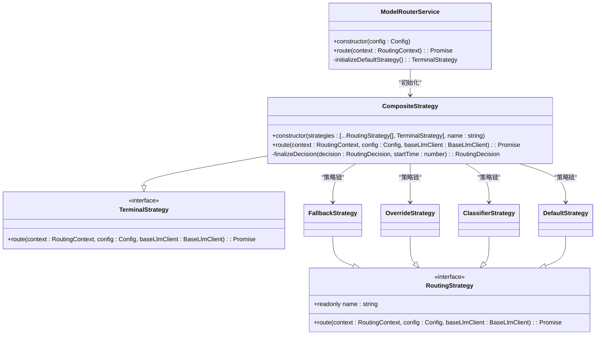
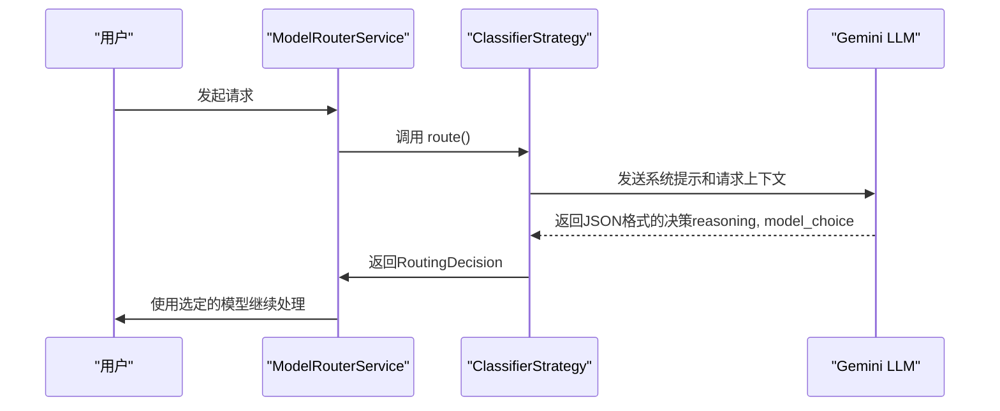
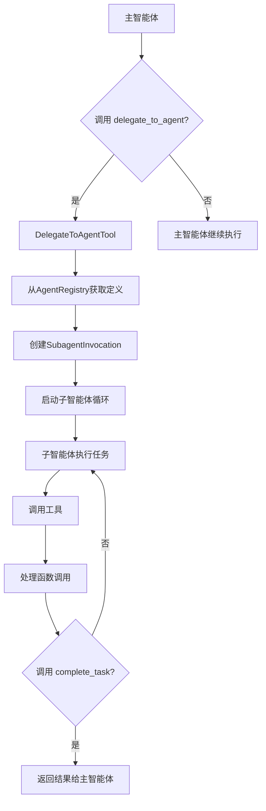

# AI交互

<cite>
**本文档中引用的文件**   
- [modelRouterService.ts](file://packages/core/src/routing/modelRouterService.ts)
- [classifierStrategy.ts](file://packages/core/src/routing/strategies/classifierStrategy.ts)
- [fallbackStrategy.ts](file://packages/core/src/routing/strategies/fallbackStrategy.ts)
- [overrideStrategy.ts](file://packages/core/src/routing/strategies/overrideStrategy.ts)
- [compositeStrategy.ts](file://packages/core/src/routing/strategies/compositeStrategy.ts)
- [codebase-investigator.ts](file://packages/core/src/agents/codebase-investigator.ts)
- [delegate-to-agent-tool.ts](file://packages/core/src/agents/delegate-to-agent-tool.ts)
- [registry.ts](file://packages/core/src/agents/registry.ts)
- [executor.ts](file://packages/core/src/agents/executor.ts)
- [subagent-tool-wrapper.ts](file://packages/core/src/agents/subagent-tool-wrapper.ts)
- [types.ts](file://packages/core/src/agents/types.ts)
- [models.ts](file://packages/core/src/config/models.ts)
- [GEMINI.md](file://GEMINI.md)
- [model-routing.md](file://docs/cli/model-routing.md)
</cite>

## 目录
1. [简介](#简介)
2. [模型路由策略](#模型路由策略)
3. [多智能体协作机制](#多智能体协作机制)
4. [AI提示工程与行为定制](#ai提示工程与行为定制)
5. [性能优化与故障排查](#性能优化与故障排查)

## 简介

本项目实现了一套先进的AI交互系统，其核心是动态的模型路由策略和基于多智能体（Multi-Agent）的协作架构。系统能够根据任务的复杂度、上下文长度和成本效益，自动选择最合适的Gemini模型（如Gemini Pro、Gemini Flash）进行处理。同时，通过一个可扩展的多智能体框架，复杂的任务可以被分解并委派给专门的子智能体，从而实现更高效、更精准的解决方案。本指南将深入解析`modelRouterService`的实现细节、多智能体系统的工作原理，并提供最佳实践和故障排查方法。

## 模型路由策略

系统的模型路由策略是一个分层的、基于优先级的决策链，由`ModelRouterService`协调多个`RoutingStrategy`共同完成。该服务确保了模型选择的灵活性、鲁棒性和可扩展性。

### `modelRouterService` 实现

`ModelRouterService`是模型路由决策的中心枢纽。它在初始化时构建了一个由多个策略组成的复合链，这些策略按照预定义的优先级顺序执行，形成一个责任链模式（Chain of Responsibility）。

**Diagram sources**
- [modelRouterService.ts](file://packages/core/src/routing/modelRouterService.ts#L29-L127)
- [routingStrategy.ts](file://packages/core/src/routing/routingStrategy.ts#L40-L76)
- [compositeStrategy.ts](file://packages/core/src/routing/strategies/compositeStrategy.ts#L19-L110)

**Section sources**
- [modelRouterService.ts](file://packages/core/src/routing/modelRouterService.ts#L1-L127)

### 分类策略 (Classifier Strategy)

分类策略是决定模型选择的核心智能组件。它利用一个专门的AI模型（或当前模型本身）来分析用户请求的复杂度，并据此推荐使用`Gemini Pro`（复杂任务）还是`Gemini Flash`（简单任务）。

该策略通过向模型发送一个结构化的系统提示（System Prompt）来工作，该提示定义了复杂度的评判标准。评判标准包括：
- **高操作复杂度**：需要4个或更多步骤/工具调用的任务。
- **战略规划与概念设计**：需要提供建议、架构或高层策略的问题。
- **高模糊性或大范围**：需要广泛调查的宽泛定义请求。
- **深度调试与根因分析**：根据症状诊断未知或复杂问题。

如果任务不满足上述任何条件，则被视为简单任务，适合使用`Gemini Flash`。

**Diagram sources**
- [classifierStrategy.ts](file://packages/core/src/routing/strategies/classifierStrategy.ts#L130-L207)

### 回退策略 (Fallback Strategy)

回退策略是一种故障转移机制，用于在主模型不可用时保证服务的连续性。当系统检测到模型调用失败（如服务器错误）时，会激活回退模式。

一旦`config.isInFallbackMode()`返回`true`，`FallbackStrategy`就会立即生效，它会忽略其他所有策略，直接返回一个预定义的、更稳定的回退模型（通常是`gemini-2.5-flash`）。这确保了即使在主模型出现问题时，用户也能获得基本的服务响应。

**Section sources**
- [fallbackStrategy.ts](file://packages/core/src/routing/strategies/fallbackStrategy.ts#L16-L44)
- [model-routing.md](file://docs/cli/model-routing.md#L1-L42)

### 覆盖策略 (Override Strategy)

覆盖策略处理用户显式指定模型的情况。它检查当前配置中的`model`设置（可能来自命令行标志、环境变量或配置文件）。如果用户指定了一个具体的模型（非`auto`），该策略就会立即返回该模型，从而覆盖所有其他自动决策逻辑。这为用户提供了最高级别的控制权。

**Section sources**
- [overrideStrategy.ts](file://packages/core/src/routing/strategies/overrideStrategy.ts#L22-L45)
- [models.ts](file://packages/core/src/config/models.ts#L39-L59)

### 路由决策流程

整个路由决策流程遵循一个严格的优先级顺序，由`CompositeStrategy`管理：
1.  **回退策略 (Fallback)**：首先检查是否处于回退模式。如果是，则立即选择回退模型。
2.  **覆盖策略 (Override)**：其次检查用户是否强制指定了模型。如果是，则使用指定的模型。
3.  **分类策略 (Classifier)**：然后由分类器分析请求的复杂度，并推荐`Pro`或`Flash`模型。
4.  **默认策略 (Default)**：如果以上策略均未匹配，则使用默认模型。

这种分层设计确保了系统行为的可预测性和健壮性。

## 多智能体协作机制

多智能体系统是本项目处理复杂任务的核心。它允许主智能体将超出其能力范围的子任务委派给专门的、功能更强大的子智能体。

### `codebase-investigator` 智能体

`codebase-investigator`（代码库调查员）是一个专门用于分析代码库结构、依赖关系和技术栈的子智能体。它被设计用于处理模糊的请求、根因分析、系统重构和复杂功能实现等任务。

该智能体的关键特性包括：
- **强类型化输出**：其输出被定义为一个Zod Schema，确保返回的报告结构化且可预测，包含`SummaryOfFindings`（发现摘要）、`ExplorationTrace`（探索轨迹）和`RelevantLocations`（相关位置）。
- **系统性探索**：它被赋予`ls`、`read_file`、`grep`等只读工具，并被指令进行系统性、好奇的探索，直到解决所有疑问。
- **专用模型配置**：通常配置为使用`Gemini Pro`模型，以处理其复杂的分析任务。

**Section sources**
- [codebase-investigator.ts](file://packages/core/src/agents/codebase-investigator.ts#L44-L153)

### `delegate-to-agent-tool` 实现

`delegate-to-agent-tool`是实现智能体委派功能的核心工具。它充当了主智能体与所有已注册的子智能体之间的桥梁。

#### 工作原理
1.  **动态Schema生成**：在初始化时，`DelegateToAgentTool`会查询`AgentRegistry`，获取所有已注册子智能体的定义。然后，它会动态地为每个子智能体的输入参数生成一个Zod Schema，并将它们组合成一个“判别联合”（Discriminated Union）Schema。这使得工具能够接受任何子智能体的调用，并根据`agent_name`参数正确地路由请求。
2.  **委派执行**：当主智能体调用`delegate_to_agent`工具时，`DelegateInvocation`会根据`agent_name`从注册表中查找对应的`AgentDefinition`。
3.  **启动子智能体**：创建一个`SubagentInvocation`实例，并启动一个独立的子智能体执行循环（loop）。

**Diagram sources**
- [delegate-to-agent-tool.ts](file://packages/core/src/agents/delegate-to-agent-tool.ts#L26-L182)
- [registry.ts](file://packages/core/src/agents/registry.ts#L32-L200)
- [executor.ts](file://packages/core/src/agents/executor.ts#L81-L549)

#### 智能体注册与执行

`AgentRegistry`负责管理所有子智能体的生命周期。它在初始化时加载内置智能体（如`codebase-investigator`），并允许动态注册新的智能体。`AgentExecutor`则负责执行单个智能体的完整生命周期，包括创建聊天会话、调用模型、处理工具调用、执行压缩以及处理超时和终止。

**Section sources**
- [delegate-to-agent-tool.ts](file://packages/core/src/agents/delegate-to-agent-tool.ts#L1-L182)
- [registry.ts](file://packages/core/src/agents/registry.ts#L1-L200)
- [executor.ts](file://packages/core/src/agents/executor.ts#L1-L800)
- [subagent-tool-wrapper.ts](file://packages/core/src/agents/subagent-tool-wrapper.ts#L1-L78)

## AI提示工程与行为定制

系统通过精心设计的提示工程（Prompt Engineering）来引导AI的行为，并允许通过配置文件进行深度定制。

### 最佳实践

- **明确的系统指令**：每个智能体都有一个清晰的系统提示，定义其角色、唯一目的、核心指令和终止条件。例如，`codebase-investigator`被明确告知其“唯一目的”是构建代码库的心理模型。
- **结构化输出**：利用JSON Schema强制要求智能体以结构化格式返回结果，便于程序化处理。
- **思维链（Chain-of-Thought）**：鼓励智能体在内部“思考”过程中展示其推理过程，这有助于提高决策的透明度和准确性。

### 通过`GEMINI.md`定制行为

`GEMINI.md`文件不仅是项目的开发指南，也包含了影响AI行为的规则。例如，文档中强调使用纯JavaScript对象而非类，以及避免使用`any`类型而偏好`unknown`类型。这些编码规范可以被注入到智能体的上下文中，从而引导其生成符合项目风格的代码。

**Section sources**
- [GEMINI.md](file://GEMINI.md#L1-L401)
- [codebase-investigator.ts](file://packages/core/src/agents/codebase-investigator.ts#L88-L153)

## 性能优化与故障排查

### 性能优化建议

- **合理使用模型**：对于简单查询和工具调用，优先使用`Gemini Flash`以降低成本和延迟。仅在处理复杂任务时才使用`Gemini Pro`。
- **启用预览模型**：如果启用了预览功能，系统会尝试使用最新的`gemini-3-pro-preview`模型，以获得最佳性能。
- **监控回退模式**：频繁进入回退模式可能表明主模型存在稳定性问题，需要检查API配额或网络状况。

### 常见问题排查

- **问题**：模型路由决策不符合预期。
  - **排查**：检查`model-routing.md`文档中描述的优先级顺序。确认`--model`标志、`GEMINI_MODEL`环境变量或`settings.json`中的设置是否覆盖了自动决策。
- **问题**：`delegate_to_agent`工具未显示可用的智能体。
  - **排查**：检查`AgentRegistry`的初始化过程。确认`codebase-investigator`等智能体的启用设置（如`config.getCodebaseInvestigatorSettings()`）是否正确。
- **问题**：子智能体执行超时或未完成。
  - **排查**：查看`AgentExecutor`的`runConfig`，检查`max_time_minutes`和`max_turns`的设置。系统会尝试进行一次“最终警告”恢复，如果失败，会在日志中记录原因。

**Section sources**
- [model-routing.md](file://docs/cli/model-routing.md#L1-L42)
- [registry.ts](file://packages/core/src/agents/registry.ts#L51-L91)
- [executor.ts](file://packages/core/src/agents/executor.ts#L363-L549)