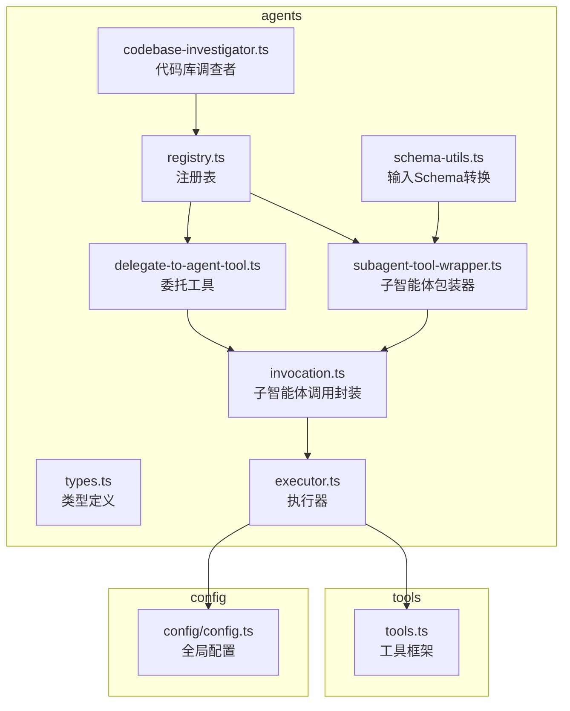
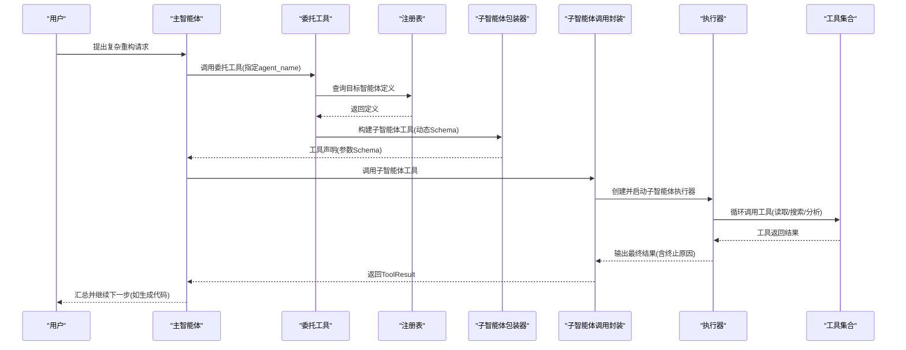
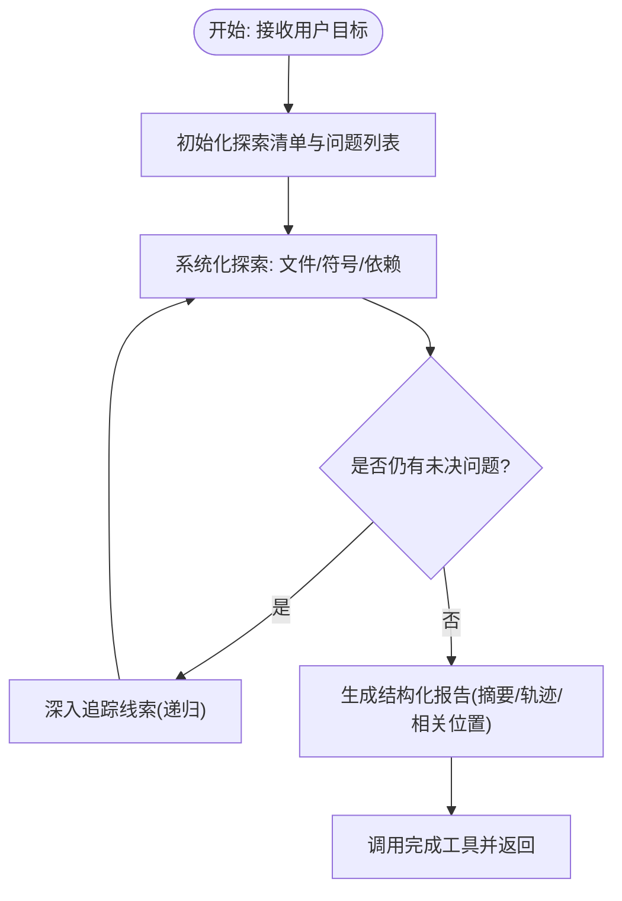
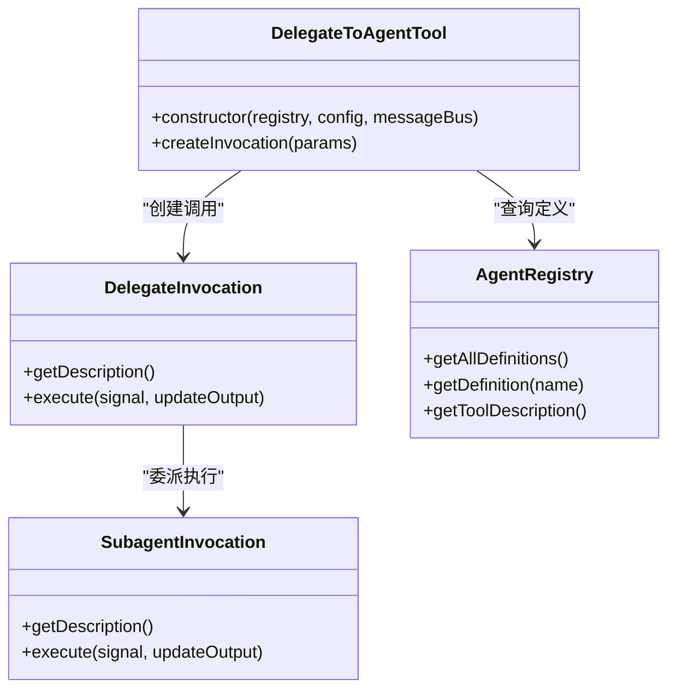
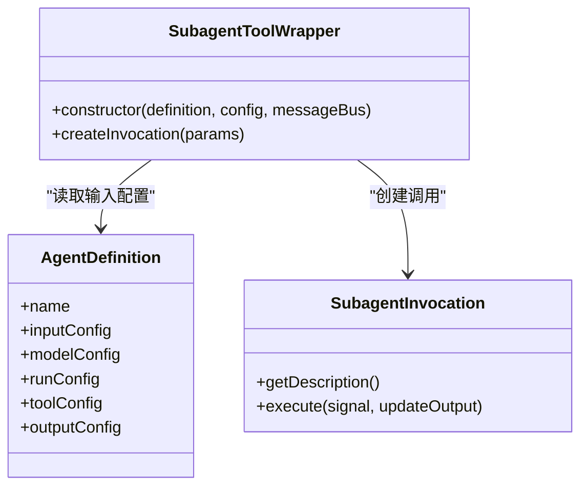
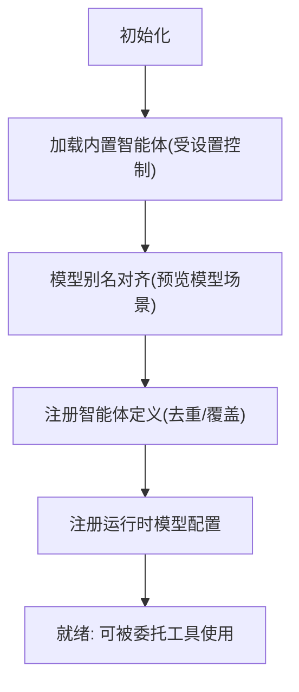
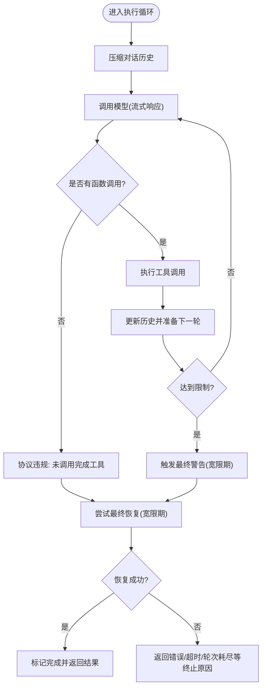
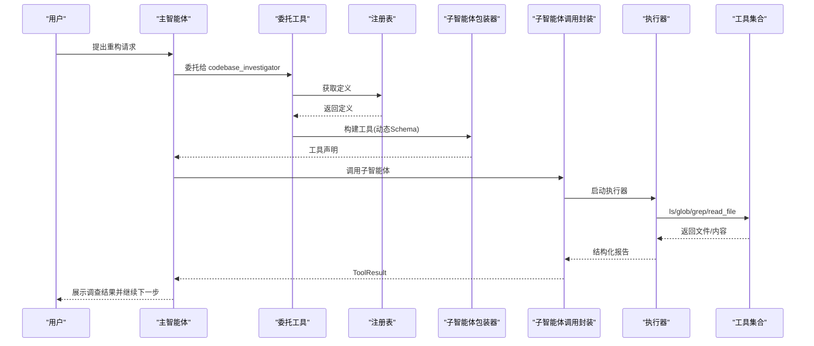
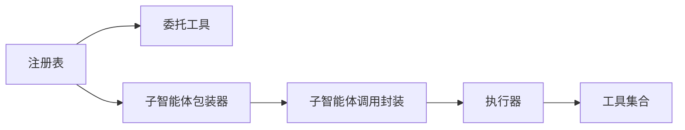

# 多智能体系统

<cite>
**本文引用的文件**
- [packages/core/src/agents/codebase-investigator.ts](file://packages/core/src/agents/codebase-investigator.ts)
- [packages/core/src/agents/delegate-to-agent-tool.ts](file://packages/core/src/agents/delegate-to-agent-tool.ts)
- [packages/core/src/agents/subagent-tool-wrapper.ts](file://packages/core/src/agents/subagent-tool-wrapper.ts)
- [packages/core/src/agents/registry.ts](file://packages/core/src/agents/registry.ts)
- [packages/core/src/agents/invocation.ts](file://packages/core/src/agents/invocation.ts)
- [packages/core/src/agents/executor.ts](file://packages/core/src/agents/executor.ts)
- [packages/core/src/agents/types.ts](file://packages/core/src/agents/types.ts)
- [packages/core/src/agents/schema-utils.ts](file://packages/core/src/agents/schema-utils.ts)
</cite>

## 目录
1. [简介](#简介)
2. [项目结构](#项目结构)
3. [核心组件](#核心组件)
4. [架构总览](#架构总览)
5. [详细组件分析](#详细组件分析)
6. [依赖关系分析](#依赖关系分析)
7. [性能与可扩展性](#性能与可扩展性)
8. [故障排查指南](#故障排查指南)
9. [结论](#结论)
10. [附录：创建与注册新智能体](#附录创建与注册新智能体)

## 简介
本文件系统化阐述多智能体系统的实现与使用方式，重点覆盖以下方面：
- 如何将复杂用户请求拆解为子任务并委派给专门的子智能体（Sub-Agent）
- codebase-investigator 智能体如何分析代码库结构、搜索相关文件并提供上下文
- delegate-to-agent-tool 的实现机制：主智能体如何通过该工具调用其他智能体
- subagent-tool-wrapper 如何封装并管理子智能体的调用过程
- 完整调用链示例：从用户提出复杂重构请求，到主智能体调用 codebase-investigator 收集信息，再到其他智能体生成代码
- 智能体注册表（registry）工作原理、智能体间通信模式、错误处理与超时机制
- 如何创建并注册新的自定义智能体

## 项目结构
多智能体系统位于核心包中，关键文件分布如下：
- agents 子模块：定义智能体类型、执行器、委托工具、包装器、注册表等
- tools 子模块：提供通用工具框架（用于智能体可调用的工具）
- config 子模块：模型配置与运行参数
- services 与 utils：聊天压缩、日志、策略等支撑能力

图表来源
- [packages/core/src/agents/registry.ts](file://packages/core/src/agents/registry.ts#L1-L200)
- [packages/core/src/agents/delegate-to-agent-tool.ts](file://packages/core/src/agents/delegate-to-agent-tool.ts#L1-L183)
- [packages/core/src/agents/subagent-tool-wrapper.ts](file://packages/core/src/agents/subagent-tool-wrapper.ts#L1-L79)
- [packages/core/src/agents/invocation.ts](file://packages/core/src/agents/invocation.ts#L1-L138)
- [packages/core/src/agents/executor.ts](file://packages/core/src/agents/executor.ts#L1-L200)
- [packages/core/src/agents/types.ts](file://packages/core/src/agents/types.ts#L1-L170)
- [packages/core/src/agents/schema-utils.ts](file://packages/core/src/agents/schema-utils.ts#L1-L91)
- [packages/core/src/agents/codebase-investigator.ts](file://packages/core/src/agents/codebase-investigator.ts#L1-L154)

章节来源
- [packages/core/src/agents/registry.ts](file://packages/core/src/agents/registry.ts#L1-L200)
- [packages/core/src/agents/types.ts](file://packages/core/src/agents/types.ts#L1-L170)

## 核心组件
- 智能体定义与类型
  - AgentDefinition：统一描述智能体名称、显示名、描述、提示词配置、模型配置、运行配置、工具配置、输出配置、输入配置等
  - AgentInputs：调用时的参数对象
  - OutputObject：最终输出与终止原因
- 执行器 AgentExecutor：驱动单个智能体在循环中调用工具，直到调用完成工具或达到终止条件
- 子智能体调用封装 SubagentInvocation：将子智能体作为工具调用，桥接活动事件与流式输出
- 委托工具 DelegateToAgentTool：动态构建可调用的“委托给另一个智能体”的工具，支持按 agent_name 分发
- 子智能体包装器 SubagentToolWrapper：将任意 AgentDefinition 包装为标准 DeclarativeTool
- 注册表 AgentRegistry：集中管理智能体定义、动态生成工具描述、注入系统提示目录、注册运行时模型配置
- 输入 Schema 转换 schema-utils：将内部 InputConfig 转换为 JSON Schema，供模型函数声明使用
- codebase-investigator：专用子智能体，负责代码库分析、文件定位与架构洞察

章节来源
- [packages/core/src/agents/types.ts](file://packages/core/src/agents/types.ts#L1-L170)
- [packages/core/src/agents/executor.ts](file://packages/core/src/agents/executor.ts#L1-L200)
- [packages/core/src/agents/invocation.ts](file://packages/core/src/agents/invocation.ts#L1-L138)
- [packages/core/src/agents/delegate-to-agent-tool.ts](file://packages/core/src/agents/delegate-to-agent-tool.ts#L1-L183)
- [packages/core/src/agents/subagent-tool-wrapper.ts](file://packages/core/src/agents/subagent-tool-wrapper.ts#L1-L79)
- [packages/core/src/agents/registry.ts](file://packages/core/src/agents/registry.ts#L1-L200)
- [packages/core/src/agents/schema-utils.ts](file://packages/core/src/agents/schema-utils.ts#L1-L91)
- [packages/core/src/agents/codebase-investigator.ts](file://packages/core/src/agents/codebase-investigator.ts#L1-L154)

## 架构总览
多智能体系统采用“主智能体 + 子智能体”分层架构：
- 主智能体通过工具接口发起任务，必要时委托给子智能体
- 子智能体由 AgentExecutor 驱动，循环调用工具直至完成
- 委托工具根据注册表动态生成可用子智能体列表，确保安全与一致
- 子智能体包装器将任意 AgentDefinition 暴露为标准工具，便于主智能体直接调用
- 注册表集中管理智能体定义、模型配置与系统提示目录

图表来源
- [packages/core/src/agents/delegate-to-agent-tool.ts](file://packages/core/src/agents/delegate-to-agent-tool.ts#L1-L183)
- [packages/core/src/agents/subagent-tool-wrapper.ts](file://packages/core/src/agents/subagent-tool-wrapper.ts#L1-L79)
- [packages/core/src/agents/registry.ts](file://packages/core/src/agents/registry.ts#L1-L200)
- [packages/core/src/agents/invocation.ts](file://packages/core/src/agents/invocation.ts#L1-L138)
- [packages/core/src/agents/executor.ts](file://packages/core/src/agents/executor.ts#L1-L200)

## 详细组件分析

### codebase-investigator 智能体
- 角色与职责
  - 专注于代码库结构分析、依赖与技术栈理解
  - 对于模糊请求、根因分析、系统重构、综合特性实现等任务提供深入上下文
- 输入与输出
  - 输入：包含用户目标、问题与额外上下文的详细描述
  - 输出：结构化报告，包含摘要、探索轨迹、相关位置（文件路径、推理、关键符号）
- 运行约束
  - 限制最大时间与最大轮次，使用专用模型别名
  - 可选地允许网络搜索工具以补充知识
- 工具访问
  - 仅授予只读工具（列出、读取、全局匹配、文本搜索），避免破坏性操作
- 系统提示与指令
  - 强调深度分析、系统化探索、整体与精确兼顾、思维记录与终止条件

图表来源
- [packages/core/src/agents/codebase-investigator.ts](file://packages/core/src/agents/codebase-investigator.ts#L1-L154)

章节来源
- [packages/core/src/agents/codebase-investigator.ts](file://packages/core/src/agents/codebase-investigator.ts#L1-L154)

### delegate-to-agent-tool 实现机制
- 动态 Schema 生成
  - 从注册表获取所有已注册智能体定义，基于每个智能体的 InputConfig 生成 Zod Schema
  - 使用判别联合（discriminated union）以 agent_name 为分支键，确保参数校验与工具声明一致
- 参数校验与保留字段
  - 严格禁止子智能体输入中出现名为 agent_name 的参数，防止冲突
- 执行流程
  - 解析参数后提取除 agent_name 外的其余输入
  - 通过 SubagentInvocation 启动子智能体执行循环
  - 将子智能体的活动事件映射为工具输出流，便于观察与调试

图表来源
- [packages/core/src/agents/delegate-to-agent-tool.ts](file://packages/core/src/agents/delegate-to-agent-tool.ts#L1-L183)
- [packages/core/src/agents/registry.ts](file://packages/core/src/agents/registry.ts#L1-L200)
- [packages/core/src/agents/invocation.ts](file://packages/core/src/agents/invocation.ts#L1-L138)

章节来源
- [packages/core/src/agents/delegate-to-agent-tool.ts](file://packages/core/src/agents/delegate-to-agent-tool.ts#L1-L183)

### subagent-tool-wrapper 封装与管理
- 动态暴露子智能体为标准 DeclarativeTool
  - 将 AgentDefinition 的 inputConfig 转换为 JSON Schema，形成工具参数声明
  - 通过 createInvocation 将参数传递给 SubagentInvocation，启动子智能体执行
- 作用
  - 统一工具接口，使任意 AgentDefinition 可被主智能体直接调用
  - 保持强类型与参数校验，同时隐藏执行细节

图表来源
- [packages/core/src/agents/subagent-tool-wrapper.ts](file://packages/core/src/agents/subagent-tool-wrapper.ts#L1-L79)
- [packages/core/src/agents/invocation.ts](file://packages/core/src/agents/invocation.ts#L1-L138)
- [packages/core/src/agents/types.ts](file://packages/core/src/agents/types.ts#L1-L170)

章节来源
- [packages/core/src/agents/subagent-tool-wrapper.ts](file://packages/core/src/agents/subagent-tool-wrapper.ts#L1-L79)

### 智能体注册表（AgentRegistry）
- 初始化与内置智能体加载
  - 仅当设置启用时才注册 codebase-investigator
  - 支持根据主智能体使用的预览模型，自动对子智能体模型进行对齐
- 注册与覆盖
  - 校验智能体定义完整性；重复注册会覆盖旧定义（调试模式下记录覆盖日志）
- 运行时模型配置
  - 将子智能体的模型参数注册为运行时别名，便于执行器按需选择
- 工具描述与系统提示目录
  - 为委托工具生成可用子智能体列表的描述
  - 生成系统提示目录，供主智能体注入

图表来源
- [packages/core/src/agents/registry.ts](file://packages/core/src/agents/registry.ts#L1-L200)

章节来源
- [packages/core/src/agents/registry.ts](file://packages/core/src/agents/registry.ts#L1-L200)

### 智能体执行与错误处理、超时机制
- AgentExecutor
  - 单次调用循环：压缩历史 -> 调用模型 -> 处理函数调用 -> 更新历史
  - 终止条件：达到最大轮次、超时、外部中断、协议违规（未调用完成工具）
  - 最终恢复：针对超时/最大轮次/协议违规，提供一次宽限期恢复机会
- 超时与取消
  - 内部使用 AbortController 控制超时；与外部信号合并，优先响应外部取消
- 输出验证
  - 若定义了输出配置，将在完成时对输出进行结构化校验，失败则撤销完成状态

图表来源
- [packages/core/src/agents/executor.ts](file://packages/core/src/agents/executor.ts#L1-L200)
- [packages/core/src/agents/executor.ts](file://packages/core/src/agents/executor.ts#L266-L521)

章节来源
- [packages/core/src/agents/executor.ts](file://packages/core/src/agents/executor.ts#L1-L200)
- [packages/core/src/agents/executor.ts](file://packages/core/src/agents/executor.ts#L266-L521)

### 完整调用链示例：代码重构请求
- 用户提出复杂重构请求
- 主智能体评估后决定先进行“代码库调查”
- 主智能体通过委托工具调用 codebase-investigator
  - 委托工具根据注册表动态生成可用子智能体列表
  - 传入用户目标与上下文
- codebase-investigator 执行分析
  - 使用只读工具扫描与检索相关文件
  - 生成结构化报告（摘要、轨迹、相关位置）
- 主智能体接收报告，继续委派其他智能体生成代码或执行修复
- 整个过程通过子智能体包装器与调用封装统一接入工具框架

图表来源
- [packages/core/src/agents/delegate-to-agent-tool.ts](file://packages/core/src/agents/delegate-to-agent-tool.ts#L1-L183)
- [packages/core/src/agents/subagent-tool-wrapper.ts](file://packages/core/src/agents/subagent-tool-wrapper.ts#L1-L79)
- [packages/core/src/agents/registry.ts](file://packages/core/src/agents/registry.ts#L1-L200)
- [packages/core/src/agents/invocation.ts](file://packages/core/src/agents/invocation.ts#L1-L138)
- [packages/core/src/agents/executor.ts](file://packages/core/src/agents/executor.ts#L1-L200)
- [packages/core/src/agents/codebase-investigator.ts](file://packages/core/src/agents/codebase-investigator.ts#L1-L154)

## 依赖关系分析
- 组件耦合
  - 委托工具与注册表强耦合：委托工具依赖注册表提供的定义与描述
  - 子智能体包装器与执行器弱耦合：通过 SubagentInvocation 间接连接
  - 执行器与工具框架：通过工具注册表隔离，仅在运行时绑定
- 关键依赖链
  - 注册表 -> 委托工具 -> 子智能体包装器 -> 子智能体调用封装 -> 执行器 -> 工具集合
- 潜在风险
  - 注册表为空时委托工具仍可生成 Schema，但执行阶段会抛错
  - 子智能体输入命名冲突（agent_name）会被拒绝

图表来源
- [packages/core/src/agents/registry.ts](file://packages/core/src/agents/registry.ts#L1-L200)
- [packages/core/src/agents/delegate-to-agent-tool.ts](file://packages/core/src/agents/delegate-to-agent-tool.ts#L1-L183)
- [packages/core/src/agents/subagent-tool-wrapper.ts](file://packages/core/src/agents/subagent-tool-wrapper.ts#L1-L79)
- [packages/core/src/agents/invocation.ts](file://packages/core/src/agents/invocation.ts#L1-L138)
- [packages/core/src/agents/executor.ts](file://packages/core/src/agents/executor.ts#L1-L200)

章节来源
- [packages/core/src/agents/registry.ts](file://packages/core/src/agents/registry.ts#L1-L200)
- [packages/core/src/agents/delegate-to-agent-tool.ts](file://packages/core/src/agents/delegate-to-agent-tool.ts#L1-L183)
- [packages/core/src/agents/subagent-tool-wrapper.ts](file://packages/core/src/agents/subagent-tool-wrapper.ts#L1-L79)
- [packages/core/src/agents/invocation.ts](file://packages/core/src/agents/invocation.ts#L1-L138)
- [packages/core/src/agents/executor.ts](file://packages/core/src/agents/executor.ts#L1-L200)

## 性能与可扩展性
- 执行器侧优化
  - 对话历史压缩：减少上下文长度，提高吞吐
  - 流式响应：边思考边输出，改善可观测性
- 超时与恢复
  - 内置超时与最终恢复窗口，避免长时间卡死
  - 终止原因明确区分：超时、最大轮次、协议违规、外部取消
- 可扩展点
  - 新增子智能体：只需定义 AgentDefinition 并注册，即可被委托工具发现
  - 自定义工具：通过工具注册表注入，执行器在运行时绑定
  - 模型别名：注册表统一管理运行时模型配置，便于按需切换

[本节为通用指导，不直接分析具体文件]

## 故障排查指南
- 常见错误与定位
  - 委托工具找不到目标智能体：检查 agent_name 是否存在于注册表
  - 子智能体输入冲突：确保输入参数不含 agent_name
  - 协议违规：子智能体未调用完成工具即停止
  - 超时/最大轮次：查看终止原因与最终恢复是否生效
- 日志与可观测性
  - 执行器发出活动事件（思考片段、工具调用开始/结束、错误）
  - 终止原因与统计信息用于诊断
- 快速验证
  - 在调试模式下确认注册表是否正确覆盖已有定义
  - 使用最小输入参数验证委托工具 Schema 生成

章节来源
- [packages/core/src/agents/executor.ts](file://packages/core/src/agents/executor.ts#L266-L521)
- [packages/core/src/agents/delegate-to-agent-tool.ts](file://packages/core/src/agents/delegate-to-agent-tool.ts#L1-L183)
- [packages/core/src/agents/registry.ts](file://packages/core/src/agents/registry.ts#L1-L200)

## 结论
多智能体系统通过清晰的分层设计与工具化抽象，实现了复杂任务的模块化拆解与执行：
- 主智能体聚焦策略与编排，子智能体专注领域能力
- 注册表与动态 Schema 保障了扩展性与安全性
- 委托工具与包装器统一了调用入口，简化了主智能体的决策逻辑
- 执行器提供了稳健的超时、恢复与可观测性机制

[本节为总结性内容，不直接分析具体文件]

## 附录：创建与注册新智能体
- 定义 AgentDefinition
  - 填写 name、description、promptConfig、modelConfig、runConfig、toolConfig、outputConfig、inputConfig
  - 若需要结构化输出，提供 Zod schema 并在 processOutput 中格式化
- 生成输入 Schema
  - 使用 schema-utils 将 inputConfig 转换为 JSON Schema，供工具声明使用
- 注册智能体
  - 通过 AgentRegistry.registerAgent 或在初始化阶段加载内置智能体
  - 注意：名称冲突将覆盖旧定义（调试模式下会记录覆盖日志）
- 在主智能体中使用
  - 通过委托工具动态发现可用子智能体
  - 或使用子智能体包装器将其暴露为标准工具

章节来源
- [packages/core/src/agents/types.ts](file://packages/core/src/agents/types.ts#L1-L170)
- [packages/core/src/agents/schema-utils.ts](file://packages/core/src/agents/schema-utils.ts#L1-L91)
- [packages/core/src/agents/registry.ts](file://packages/core/src/agents/registry.ts#L1-L200)
- [packages/core/src/agents/subagent-tool-wrapper.ts](file://packages/core/src/agents/subagent-tool-wrapper.ts#L1-L79)
- [packages/core/src/agents/delegate-to-agent-tool.ts](file://packages/core/src/agents/delegate-to-agent-tool.ts#L1-L183)