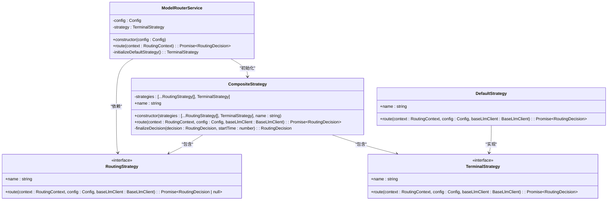

# 模型路由

<cite>
**本文档中引用的文件**  
- [modelRouterService.ts](file://packages/core/src/routing/modelRouterService.ts)
- [routingStrategy.ts](file://packages/core/src/routing/routingStrategy.ts)
- [models.ts](file://packages/core/src/config/models.ts)
- [classifierStrategy.ts](file://packages/core/src/routing/strategies/classifierStrategy.ts)
- [fallbackStrategy.ts](file://packages/core/src/routing/strategies/fallbackStrategy.ts)
- [overrideStrategy.ts](file://packages/core/src/routing/strategies/overrideStrategy.ts)
- [compositeStrategy.ts](file://packages/core/src/routing/strategies/compositeStrategy.ts)
- [config.ts](file://packages/core/src/config/config.ts)
- [modelConfigService.ts](file://packages/core/src/services/modelConfigService.ts)
- [defaultModelConfigs.ts](file://packages/core/src/config/defaultModelConfigs.ts)
</cite>

## 目录
1. [简介](#简介)
2. [核心架构与设计](#核心架构与设计)
3. [路由决策流程](#路由决策流程)
4. [核心路由策略详解](#核心路由策略详解)
5. [模型配置与管理](#模型配置与管理)
6. [性能与最佳实践](#性能与最佳实践)
7. [故障排查](#故障排查)
8. [结论](#结论)

## 简介

模型路由功能是本系统的核心组件，负责根据用户请求的上下文动态选择最合适的Gemini模型。该系统旨在优化性能、成本和延迟，通过智能决策在Gemini Pro和Gemini Flash等不同模型之间进行切换。路由决策基于任务的复杂度、上下文长度、成本和延迟要求，确保为每个请求提供最佳的模型选择。本文档将深入探讨`modelRouterService`的设计与实现，详细解释其工作原理和配置选项。

## 核心架构与设计

模型路由系统采用分层和模块化的设计，核心是`ModelRouterService`类，它作为路由决策的中心服务。该服务通过组合多种路由策略来实现灵活和可扩展的路由逻辑。路由策略遵循责任链模式，每个策略负责特定的决策场景，最终由一个默认策略作为兜底。



**图示来源**
- [modelRouterService.ts](file://packages/core/src/routing/modelRouterService.ts#L29-L127)
- [routingStrategy.ts](file://packages/core/src/routing/routingStrategy.ts#L44-L76)
- [compositeStrategy.ts](file://packages/core/src/routing/strategies/compositeStrategy.ts#L19-L110)
- [defaultStrategy.ts](file://packages/core/src/routing/strategies/defaultStrategy.ts#L16-L33)

## 路由决策流程

路由决策流程始于`ModelRouterService`的`route`方法。该方法接收一个包含会话历史、当前请求和中止信号的`RoutingContext`对象。流程首先通过`CompositeStrategy`按优先级顺序执行一系列路由策略。如果某个策略返回了有效的`RoutingDecision`，则立即返回该决策。如果所有非终止策略均未匹配，则执行默认策略。在决策完成后，系统会进行预览模型升级逻辑，如果启用了预览功能且决策为默认模型，则升级到预览模型。最后，系统会记录路由事件并返回最终决策。


**图示来源**
- [modelRouterService.ts](file://packages/core/src/routing/modelRouterService.ts#L58-L97)
- [compositeStrategy.ts](file://packages/core/src/routing/strategies/compositeStrategy.ts#L37-L84)

## 核心路由策略详解

### 分类策略 (classifierStrategy)

分类策略通过调用一个专门的分类器模型来分析用户请求的复杂度。该策略使用一个系统提示（system prompt）来指导分类器，根据任务的操作复杂度、战略规划需求、模糊性或调试深度来判断任务是简单（Simple）还是复杂（Complex）。对于简单任务，如列出文件或读取文件内容，策略会选择Gemini Flash模型；对于复杂任务，如架构设计或多步操作，则会选择Gemini Pro模型。该策略会过滤掉工具调用相关的对话历史，仅保留用户和模型的直接交互，以确保输入的清晰性。


**图示来源**
- [classifierStrategy.ts](file://packages/core/src/routing/strategies/classifierStrategy.ts#L130-L207)
- [classifierStrategy.test.ts](file://packages/core/src/routing/strategies/classifierStrategy.test.ts#L81-L132)

### 回退策略 (fallbackStrategy)

回退策略用于在主模型不可用或系统处于降级模式时保证服务的连续性。当配置中的`isInFallbackMode`标志为真时，此策略会生效。它会根据当前请求的模型和预览功能状态，通过`getEffectiveModel`函数确定一个有效的回退模型。默认情况下，它会降级到`gemini-2.5-flash`模型以确保服务可用，但会保留对“lite”模型的请求以节约成本。此策略不进行任何外部调用，因此执行速度非常快。

**本节来源**
- [fallbackStrategy.ts](file://packages/core/src/routing/strategies/fallbackStrategy.ts#L16-L43)
- [models.ts](file://packages/core/src/config/models.ts#L76-L95)

### 覆盖策略 (overrideStrategy)

覆盖策略允许用户或系统配置强制指定一个特定的模型。当用户通过命令行参数或配置文件明确设置了一个模型（例如`--model=gemini-2.5-pro`）时，此策略会捕获该请求。如果请求的模型是`auto`，则策略会返回`null`，将决策权交给后续策略。否则，它会使用`resolveModel`函数解析模型别名（如`pro`或`flash`）并返回一个明确的路由决策。这为用户提供了对模型选择的完全控制权。

**本节来源**
- [overrideStrategy.ts](file://packages/core/src/routing/strategies/overrideStrategy.ts#L22-L45)
- [models.ts](file://packages/core/src/config/models.ts#L39-L58)

## 模型配置与管理

模型配置由`ModelConfigService`和`Config`类共同管理。`ModelConfigService`负责解析和合并模型配置，支持别名（aliases）和覆盖（overrides）机制。别名允许为模型或配置集定义简短的名称，而覆盖则允许根据请求上下文（如模型名称、作用域）动态修改配置。`Config`类作为全局配置的入口，集成了`ModelConfigService`、`ModelRouterService`等核心服务，并提供对配置参数的访问。

```mermaid
classDiagram
class Config {
-modelConfigService : ModelConfigService
-modelRouterService : ModelRouterService
+getModel() : string
+getPreviewFeatures() : boolean
+getBaseLlmClient() : BaseLlmClient
+isInFallbackMode() : boolean
}
class ModelConfigService {
-config : ModelConfigServiceConfig
+registerRuntimeModelConfig(aliasName : string, alias : ModelConfigAlias) : void
+getResolvedConfig(context : ModelConfigKey) : ResolvedModelConfig
-resolveAlias(aliasName : string, aliases : Record<string, ModelConfigAlias>) : ModelConfigAlias
-internalGetResolvedConfig(context : ModelConfigKey) : { model : string | undefined; generateContentConfig : GenerateContentConfig }
}
class ModelConfigServiceConfig {
+aliases? : Record<string, ModelConfigAlias>
+customAliases? : Record<string, ModelConfigAlias>
+overrides? : ModelConfigOverride[]
+customOverrides? : ModelConfigOverride[]
}
Config --> ModelConfigService : "包含"
ModelConfigService --> ModelConfigServiceConfig : "使用"
```

**图示来源**
- [config.ts](file://packages/core/src/config/config.ts#L63-L66)
- [modelConfigService.ts](file://packages/core/src/services/modelConfigService.ts#L66-L273)
- [defaultModelConfigs.ts](file://packages/core/src/config/defaultModelConfigs.ts#L14-L222)

## 性能与最佳实践

为了优化性能和成本，建议在处理简单、明确的任务时使用Gemini Flash模型，因为它响应更快且成本更低。对于需要深入推理、多步规划或复杂问题解决的任务，则应使用Gemini Pro模型。启用预览功能可以自动尝试使用最新的预览模型，以获得潜在的性能提升。在配置中合理使用覆盖（overrides）可以为特定场景（如代码库调查）定制模型参数，例如调整温度（temperature）以获得更确定或更随机的输出。

## 故障排查

如果路由决策不符合预期，请首先检查配置中的`model`设置是否被意外覆盖。确认`isInFallbackMode`的状态，因为这会强制降级到Flash模型。检查分类器策略的日志，确保其API调用成功，因为失败时该策略会静默返回`null`，导致决策流程继续。此外，验证预览功能是否已正确启用，以及模型别名是否按预期解析。

**本节来源**
- [modelRouterService.test.ts](file://packages/core/src/routing/modelRouterService.test.ts#L134-L152)
- [classifierStrategy.test.ts](file://packages/core/src/routing/strategies/classifierStrategy.test.ts#L134-L149)

## 结论

模型路由系统通过一个精心设计的策略链，实现了对Gemini模型的智能、动态选择。其模块化架构使得添加新的路由策略变得简单，而强大的配置系统则提供了极大的灵活性。通过理解分类、回退和覆盖这三种核心策略，用户可以更好地掌控模型选择，从而在性能、成本和功能之间取得最佳平衡。