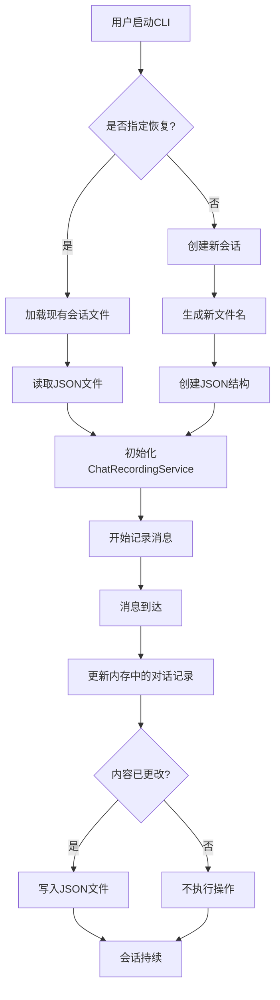
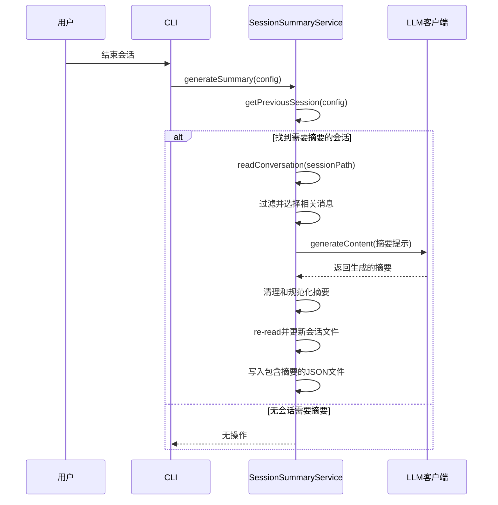
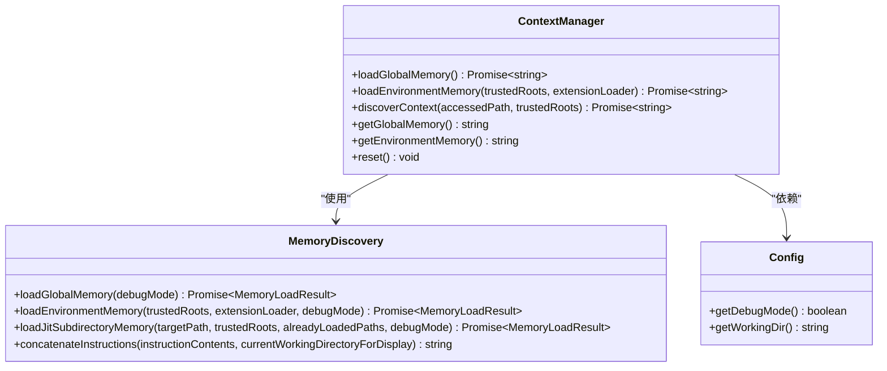
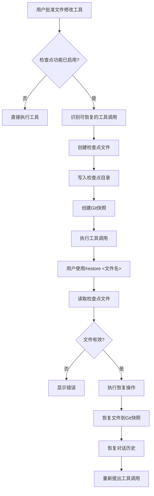

# 会话管理

<cite>
**本文档中引用的文件**   
- [sessionSummaryService.ts](file://packages/core/src/services/sessionSummaryService.ts)
- [chatRecordingService.ts](file://packages/core/src/services/chatRecordingService.ts)
- [contextManager.ts](file://packages/core/src/services/contextManager.ts)
- [storage.ts](file://packages/core/src/config/storage.ts)
- [session-management.md](file://docs/cli/session-management.md)
- [checkpointing.md](file://docs/cli/checkpointing.md)
- [sessionUtils.ts](file://packages/cli/src/utils/sessionUtils.ts)
- [sessionCleanup.ts](file://packages/cli/src/utils/sessionCleanup.ts)
</cite>

## 目录
1. [简介](#简介)
2. [会话生命周期管理](#会话生命周期管理)
3. [会话持久化与存储](#会话持久化与存储)
4. [会话恢复](#会话恢复)
5. [会话摘要生成](#会话摘要生成)
6. [上下文管理](#上下文管理)
7. [检查点功能](#检查点功能)
8. [会话配置与管理](#会话配置与管理)
9. [高级用例](#高级用例)

## 简介
本指南深入探讨了Gemini CLI的会话管理功能，详细说明了会话的全生命周期管理。会话管理是Gemini CLI的核心功能，它通过自动记录、持久化和恢复对话历史，确保用户能够中断工作并在之后无缝地从中断处继续。该系统不仅保存了用户与AI助手之间的所有交互，还记录了工具执行、令牌使用统计和AI的推理过程，为用户提供了一个完整、可追溯的交互历史。此外，系统还提供了强大的检查点（checkpointing）功能，允许用户在文件修改前创建项目状态的快照，从而安全地进行实验和代码变更。`sessionSummaryService`和`chatRecordingService`等服务协同工作，实现了会话的序列化、存储和摘要生成，而`contextManager`则负责管理会话的上下文和状态，确保AI在对话中保持连贯性和一致性。

**Section sources**
- [session-management.md](file://docs/cli/session-management.md#L1-L159)

## 会话生命周期管理
会话的生命周期从用户启动Gemini CLI时开始。系统会自动创建一个新的会话或恢复一个现有的会话。会话的创建是通过`ChatRecordingService`类的`initialize`方法触发的，该方法会生成一个唯一的会话ID，并根据当前时间戳和会话ID创建一个JSON文件来存储对话记录。一旦会话被初始化，任何用户输入或AI响应都会被实时记录。会话在用户主动结束会话或CLI进程终止时结束。在此期间，会话会持续更新，包括记录新的消息、工具调用和令牌使用情况。会话的生命周期管理确保了所有交互都被完整地捕获，为后续的恢复、分析和审计提供了基础。

**Section sources**
- [chatRecordingService.ts](file://packages/core/src/services/chatRecordingService.ts#L120-L178)
- [session-management.md](file://docs/cli/session-management.md#L8-L18)

## 会话持久化与存储
会话的持久化是通过`chatRecordingService`服务实现的，该服务将完整的对话历史序列化为JSON格式并存储在磁盘上。每个会话都存储在一个独立的JSON文件中，文件名遵循`session-<timestamp>-<sessionId>.json`的模式，其中`<timestamp>`是会话创建的时间戳，`<sessionId>`是会话的唯一标识符。这些文件被存储在`~/.gemini/tmp/<project_hash>/chats/`目录下，其中`<project_hash>`是当前项目根目录的哈希值，这确保了会话是按项目隔离的。当用户在不同的项目目录中运行CLI时，会自动切换到对应项目的会话历史。持久化过程是自动且透明的，每次消息记录后，系统都会检查文件内容是否发生变化，只有在内容更新时才会写入磁盘，以提高效率。存储的会话数据包括会话ID、项目哈希、开始时间、最后更新时间、消息列表以及可选的会话摘要。

**Diagram sources**
- [chatRecordingService.ts](file://packages/core/src/services/chatRecordingService.ts#L145-L169)
- [storage.ts](file://packages/core/src/config/storage.ts#L90-L94)

## 会话恢复
会话恢复功能允许用户中断工作后，从之前保存的状态继续。恢复可以通过命令行参数或交互式命令来实现。使用`--resume`（或`-r`）命令行标志可以恢复会话。如果未指定参数，则恢复最新的会话；如果提供索引号或会话ID，则恢复指定的会话。在交互模式下，用户可以使用`/resume`命令打开“会话浏览器”，该界面提供了一个交互式的列表，用户可以浏览、搜索和选择要恢复的会话。恢复过程涉及读取指定会话的JSON文件，将其内容解析为`ConversationRecord`对象，并使用该数据重新初始化`ChatRecordingService`。这确保了AI助手能够访问完整的对话历史，包括所有先前的上下文、工具调用和AI的推理过程，从而无缝地继续之前的任务。

**Section sources**
- [session-management.md](file://docs/cli/session-management.md#L22-L68)
- [sessionUtils.ts](file://packages/cli/src/utils/sessionUtils.ts#L348-L442)

## 会话摘要生成
`sessionSummaryService`服务负责为会话生成简洁的摘要。该服务利用Gemini Flash Lite模型，分析对话历史并生成一个聚焦于用户意图的单句摘要。摘要的生成过程是自动的，通常在会话结束或新会话开始时触发。服务会过滤掉系统消息，只保留用户和AI的消息，并应用一个滑动窗口策略来选择最相关的消息（通常是对话的开头和结尾部分），以避免超出模型的令牌限制。然后，这些消息被格式化成一个提示，发送给LLM客户端。生成的摘要会被清理和规范化，然后通过`chatRecordingService`的`saveSummary`方法保存回会话的JSON文件中。这使得用户能够快速了解过去会话的主要内容，而无需浏览完整的对话记录。

**Diagram sources**
- [sessionSummaryService.ts](file://packages/core/src/services/sessionSummaryService.ts#L53-L162)
- [sessionSummaryUtils.ts](file://packages/core/src/services/sessionSummaryUtils.ts#L23-L89)

## 上下文管理
`contextManager`在管理会话的上下文和状态方面起着核心作用。它通过一个分层的内存系统来组织和提供上下文信息。该系统分为三个层级：全局内存（Tier 1）、环境内存（Tier 2）和即时（JIT）内存（Tier 3）。全局内存从用户主目录下的`memory.md`文件加载，包含适用于所有项目的通用信息。环境内存从项目根目录向上遍历到受信任的根目录中找到的`gemini.md`文件加载，提供项目特定的上下文。JIT内存则在运行时动态发现，当AI访问某个文件时，系统会向上遍历目录树，加载该路径下的`gemini.md`文件，以提供更精细的上下文。`contextManager`通过`loadGlobalMemory`、`loadEnvironmentMemory`和`discoverContext`等方法加载这些内存，并使用`getGlobalMemory`和`getEnvironmentMemory`等方法提供已格式化的上下文字符串。这确保了AI在对话中始终拥有最相关和最新的上下文信息。

**Diagram sources**
- [contextManager.ts](file://packages/core/src/services/contextManager.ts#L15-L112)
- [memoryDiscovery.ts](file://packages/core/src/utils/memoryDiscovery.ts#L331-L646)

## 检查点功能
检查点功能是Gemini CLI的一项安全机制，它在AI执行任何文件修改工具（如`write_file`或`replace`）之前，自动创建项目状态的快照。此功能默认是禁用的，必须在`settings.json`配置文件中通过`"general": { "checkpointing": { "enabled": true } }`来启用。当一个可恢复的工具调用被批准时，系统会执行以下步骤：首先，它会创建一个检查点文件，该文件包含即将执行的工具调用的完整数据；其次，它会使用`gitService`在`~/.gemini/history/<project_hash>`下的一个影子Git仓库中创建一个提交，以捕获项目文件的当前状态。检查点文件本身以JSON格式存储在`~/.gemini/tmp/<project_hash>/checkpoints/`目录下，文件名包含时间戳、修改的文件名和工具名称。用户可以通过`/restore`命令来恢复检查点，这将撤销所有文件更改，恢复对话历史，并重新提出原始的工具调用，允许用户重新运行、修改或放弃该操作。

**Diagram sources**
- [checkpointing.md](file://docs/cli/checkpointing.md#L1-L95)
- [task.ts](file://packages/a2a-server/src/agent/task.ts#L559-L595)
- [restore.ts](file://packages/a2a-server/src/commands/restore.ts#L52-L100)

## 会话配置与管理
会话的配置和管理主要通过`settings.json`文件进行。用户可以配置会话的保留策略，以防止历史记录无限增长。通过设置`general.sessionRetention`对象，可以启用自动清理，并指定`maxAge`（最大保留时间，如"30d"）和`maxCount`（最大会话数量）来控制会话的保留。此外，还可以通过`model.maxSessionTurns`来限制单个会话的长度，以防止上下文窗口过大。会话管理还包括列出和删除会话的功能。用户可以使用`--list-sessions`命令从命令行查看所有可用的会话，或使用`--delete-session`命令删除特定的会话。在交互模式下，可以通过`/resume`命令的会话浏览器来浏览、搜索和删除会话。这些配置和管理功能为用户提供了对会话数据的完全控制，确保了系统的性能和存储效率。

**Section sources**
- [session-management.md](file://docs/cli/session-management.md#L107-L159)
- [sessionCleanup.ts](file://packages/cli/src/utils/sessionCleanup.ts#L143-L257)

## 高级用例
会话管理功能为实现长时间运行的复杂任务自动化提供了坚实的基础。一个高级用例是构建一个“AI代理”来执行多步骤的开发任务，例如重构一个大型代码库。用户可以启动一个会话，向AI描述重构目标。AI将分析代码，提出修改计划，并在执行每个`replace`或`write_file`操作前创建检查点。如果用户对结果不满意，可以使用`/restore`命令回滚到上一个检查点，而不会丢失整个对话上下文。这个过程可以迭代进行，直到所有更改都符合要求。由于会话被完整记录，用户可以随时中断任务，第二天再通过`--resume`命令恢复，AI将从它停止的地方继续。此外，`sessionSummaryService`生成的摘要可以帮助用户快速回顾代理在长时间运行任务中的进展和决策。通过结合持久化、检查点和上下文管理，Gemini CLI能够支持复杂、有状态的自动化工作流，极大地提升了开发效率和安全性。

**Section sources**
- [checkpointing.md](file://docs/cli/checkpointing.md#L24-L30)
- [session-management.md](file://docs/cli/session-management.md#L22-L68)
- [sessionSummaryService.ts](file://packages/core/src/services/sessionSummaryService.ts#L18-L31)