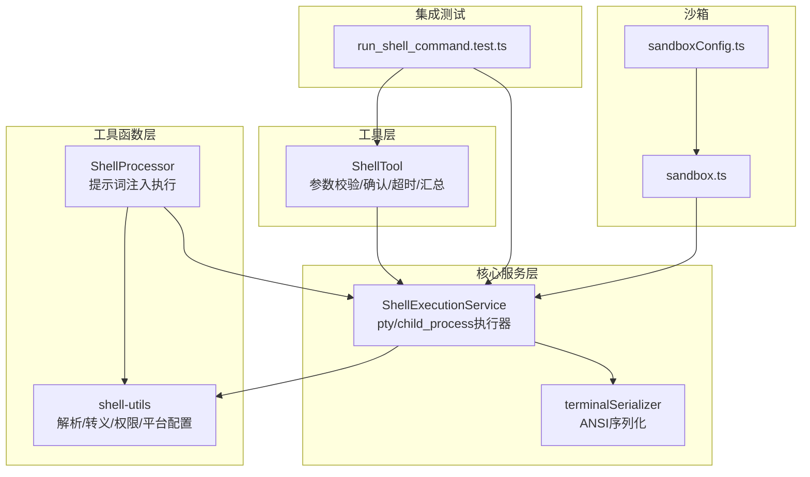
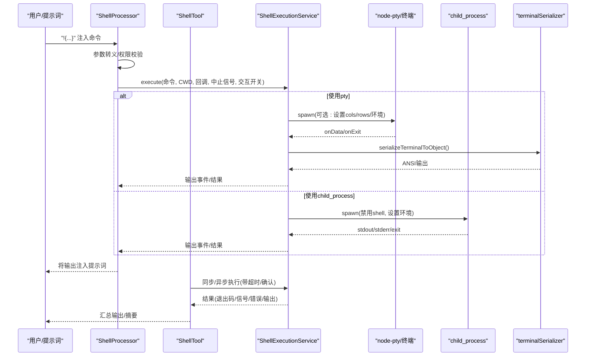
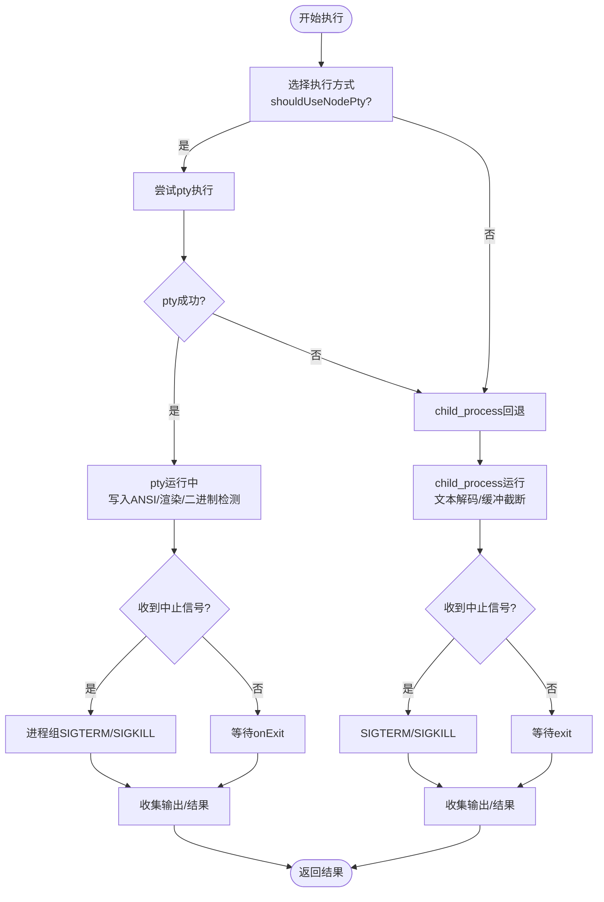
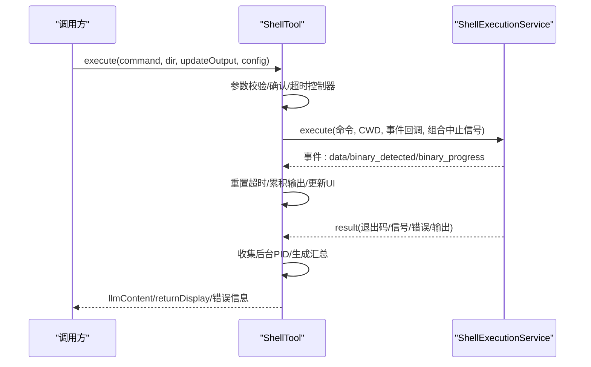
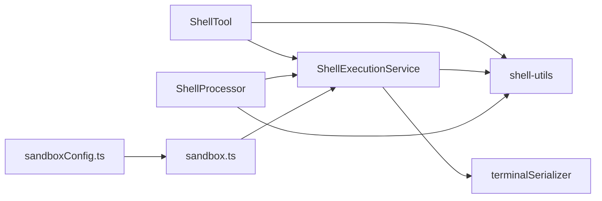

# Shell执行工具

<cite>
**本文引用的文件**
- [packages/core/src/services/shellExecutionService.ts](file://packages/core/src/services/shellExecutionService.ts)
- [packages/core/src/tools/shell.ts](file://packages/core/src/tools/shell.ts)
- [packages/core/src/utils/shell-utils.ts](file://packages/core/src/utils/shell-utils.ts)
- [packages/core/src/utils/terminalSerializer.ts](file://packages/core/src/utils/terminalSerializer.ts)
- [packages/cli/src/services/prompt-processors/shellProcessor.ts](file://packages/cli/src/services/prompt-processors/shellProcessor.ts)
- [integration-tests/run_shell_command.test.ts](file://integration-tests/run_shell_command.test.ts)
- [packages/cli/src/config/sandboxConfig.ts](file://packages/cli/src/config/sandboxConfig.ts)
- [packages/cli/src/utils/sandbox.ts](file://packages/cli/src/utils/sandbox.ts)
</cite>

## 目录
1. [简介](#简介)
2. [项目结构](#项目结构)
3. [核心组件](#核心组件)
4. [架构总览](#架构总览)
5. [详细组件分析](#详细组件分析)
6. [依赖关系分析](#依赖关系分析)
7. [性能考量](#性能考量)
8. [故障排查指南](#故障排查指南)
9. [结论](#结论)
10. [附录](#附录)

## 简介
本文件系统化梳理Shell执行工具的设计与实现，覆盖以下主题：
- 执行机制：同步与异步命令执行、交互式与非交互式模式、pty与child_process双通道回退
- 沙箱与安全：命令注入防护、环境变量隔离、执行权限控制、容器/沙箱隔离
- 输入输出流：stdout/stderr采集、ANSI颜色序列解析、二进制检测与节流、滚动缓冲区与渲染
- 超时与资源限制：空闲超时、进程组终止、缓冲区大小限制、信号处理
- 性能监控与日志：事件驱动的增量渲染、内存占用与输出截断提示
- 兼容性：跨平台（Windows/Unix）命令行与终端行为差异

## 项目结构
围绕Shell执行的关键模块分布如下：
- 核心服务层：ShellExecutionService（统一执行入口，支持pty与child_process）
- 工具层：ShellTool（面向工具调用的封装，负责确认、超时、汇总输出）
- 工具函数层：shell-utils（命令解析、转义、权限校验、平台配置）
- 终端序列化：terminalSerializer（ANSI到结构化对象的序列化）
- 提示词处理器：ShellProcessor（提示词中!{...}注入的安全执行）
- 集成测试：run_shell_command.test.ts（跨平台命令与权限策略验证）
- 沙箱配置与实现：sandboxConfig、sandbox（容器/沙箱隔离）

图表来源
- [packages/core/src/tools/shell.ts](file://packages/core/src/tools/shell.ts#L132-L378)
- [packages/core/src/services/shellExecutionService.ts](file://packages/core/src/services/shellExecutionService.ts#L221-L800)
- [packages/core/src/utils/terminalSerializer.ts](file://packages/core/src/utils/terminalSerializer.ts#L134-L197)
- [packages/core/src/utils/shell-utils.ts](file://packages/core/src/utils/shell-utils.ts#L416-L451)
- [packages/cli/src/services/prompt-processors/shellProcessor.ts](file://packages/cli/src/services/prompt-processors/shellProcessor.ts#L57-L216)
- [integration-tests/run_shell_command.test.ts](file://integration-tests/run_shell_command.test.ts#L1-L631)
- [packages/cli/src/config/sandboxConfig.ts](file://packages/cli/src/config/sandboxConfig.ts#L44-L83)
- [packages/cli/src/utils/sandbox.ts](file://packages/cli/src/utils/sandbox.ts#L319-L618)

章节来源
- [packages/core/src/services/shellExecutionService.ts](file://packages/core/src/services/shellExecutionService.ts#L221-L800)
- [packages/core/src/tools/shell.ts](file://packages/core/src/tools/shell.ts#L132-L378)
- [packages/core/src/utils/shell-utils.ts](file://packages/core/src/utils/shell-utils.ts#L416-L451)
- [packages/core/src/utils/terminalSerializer.ts](file://packages/core/src/utils/terminalSerializer.ts#L134-L197)
- [packages/cli/src/services/prompt-processors/shellProcessor.ts](file://packages/cli/src/services/prompt-processors/shellProcessor.ts#L57-L216)
- [integration-tests/run_shell_command.test.ts](file://integration-tests/run_shell_command.test.ts#L1-L631)
- [packages/cli/src/config/sandboxConfig.ts](file://packages/cli/src/config/sandboxConfig.ts#L44-L83)
- [packages/cli/src/utils/sandbox.ts](file://packages/cli/src/utils/sandbox.ts#L319-L618)

## 核心组件
- ShellExecutionService：统一的命令执行入口，支持交互式pty与非交互式child_process两种路径；自动回退与错误兜底；事件驱动输出流与结果聚合。
- ShellTool：面向工具调用的高层封装，负责参数校验、用户确认、空闲超时、后台进程PID收集、输出汇总与摘要。
- shell-utils：命令解析与转义、权限检查、平台配置（Windows/Unix）、命令拆分与根命令提取。
- terminalSerializer：将@xterm/headless终端缓冲区转换为结构化ANSI输出，支持颜色模式与属性。
- ShellProcessor：在提示词中安全执行!{...}注入的命令，进行参数转义与权限校验，并将输出注入提示词。
- 沙箱配置与实现：通过sandboxConfig与sandbox模块，支持容器或macOS沙箱隔离，实现环境变量与挂载路径的可控传递。

章节来源
- [packages/core/src/services/shellExecutionService.ts](file://packages/core/src/services/shellExecutionService.ts#L221-L800)
- [packages/core/src/tools/shell.ts](file://packages/core/src/tools/shell.ts#L132-L378)
- [packages/core/src/utils/shell-utils.ts](file://packages/core/src/utils/shell-utils.ts#L416-L451)
- [packages/core/src/utils/terminalSerializer.ts](file://packages/core/src/utils/terminalSerializer.ts#L134-L197)
- [packages/cli/src/services/prompt-processors/shellProcessor.ts](file://packages/cli/src/services/prompt-processors/shellProcessor.ts#L57-L216)
- [packages/cli/src/config/sandboxConfig.ts](file://packages/cli/src/config/sandboxConfig.ts#L44-L83)
- [packages/cli/src/utils/sandbox.ts](file://packages/cli/src/utils/sandbox.ts#L319-L618)

## 架构总览
Shell执行工具采用“工具层-服务层-工具函数层-终端序列化”的分层设计，结合提示词处理器与集成测试，形成从用户意图到安全执行再到可观测输出的闭环。

图表来源
- [packages/cli/src/services/prompt-processors/shellProcessor.ts](file://packages/cli/src/services/prompt-processors/shellProcessor.ts#L150-L216)
- [packages/core/src/tools/shell.ts](file://packages/core/src/tools/shell.ts#L199-L378)
- [packages/core/src/services/shellExecutionService.ts](file://packages/core/src/services/shellExecutionService.ts#L221-L800)
- [packages/core/src/utils/terminalSerializer.ts](file://packages/core/src/utils/terminalSerializer.ts#L134-L197)

## 详细组件分析

### ShellExecutionService：统一执行器与交互式pty支持
- 执行选择逻辑：优先尝试node-pty，失败则回退child_process；支持通过配置强制使用child_process。
- 交互式pty：
  - 创建headless终端，设置cols/rows与scrollback上限
  - 将ANSI输出写入终端缓冲，定时渲染增量输出，避免频繁全量刷新
  - 支持颜色/无色渲染切换，动态行裁剪以减少内存占用
  - 二进制输出检测：前4KB嗅探，若检测到二进制则停止原始流并上报进度
  - 终端滚动事件触发渲染，保证滚动时的实时性
- 非交互式child_process：
  - 禁用shell，显式设置环境变量（TERM、PAGER等），并合并安全化的进程环境
  - 文本编码探测与解码，按最大缓冲阈值截断，避免内存膨胀
  - 错误与退出码处理，输出截断警告
- 中止与信号：
  - 统一使用AbortSignal，Windows使用taskkill，类Unix使用进程组SIGTERM/SIGKILL
  - 渲染与处理链路使用race确保在中止后尽快收尾
- 结果聚合：
  - 返回pid（pty可用）、最终输出、退出码/信号/错误/是否中止、执行方法标识

图表来源
- [packages/core/src/services/shellExecutionService.ts](file://packages/core/src/services/shellExecutionService.ts#L221-L800)

章节来源
- [packages/core/src/services/shellExecutionService.ts](file://packages/core/src/services/shellExecutionService.ts#L221-L800)

### ShellTool：工具调用封装与超时控制
- 参数校验：命令合法性、目录有效性、工作空间内路径检查
- 用户确认：非交互模式下对未允许的工具直接拒绝；允许列表为空时根据策略决定是否需要确认
- 超时控制：基于空闲事件重置计时器，超时后中止；Windows不支持后台PID收集
- 后台进程追踪：非Windows通过pgrep收集子进程PID，便于后续清理
- 输出汇总：根据调试模式与输出内容生成llmContent与returnDisplay；支持摘要模型输出
- 结果呈现：包含命令、目录、输出、错误、退出码、信号、背景PID、进程组PGID等

图表来源
- [packages/core/src/tools/shell.ts](file://packages/core/src/tools/shell.ts#L132-L378)
- [packages/core/src/services/shellExecutionService.ts](file://packages/core/src/services/shellExecutionService.ts#L221-L800)

章节来源
- [packages/core/src/tools/shell.ts](file://packages/core/src/tools/shell.ts#L132-L378)

### shell-utils：命令解析、转义与权限控制
- 平台配置：Windows默认PowerShell，Unix默认bash；提供可移植的spawn参数
- 命令转义：针对不同shell的参数转义策略，防止注入
- 命令解析：Tree-sitter解析bash AST，PowerShell通过编码脚本解析AST，提取命令根名称与片段
- 权限检查：支持全局/会话两级allowlist/blocklist，支持通配符与具体命令模式匹配
- 安全策略：禁用promptvars扩展，避免命令替换；对多段命令逐一校验

章节来源
- [packages/core/src/utils/shell-utils.ts](file://packages/core/src/utils/shell-utils.ts#L416-L451)
- [packages/core/src/utils/shell-utils.ts](file://packages/core/src/utils/shell-utils.ts#L556-L725)
- [packages/core/src/utils/shell-utils.ts](file://packages/core/src/utils/shell-utils.ts#L727-L852)

### terminalSerializer：ANSI输出序列化
- 将@xterm/headless的缓冲区转换为结构化数组，包含每段文本、粗体/斜体/下划线/反显、前景/背景色
- 支持默认/调色板/RGB三种颜色模式，转换为十六进制颜色
- 逐单元格比较，合并连续相同属性的文本片段，减少冗余

章节来源
- [packages/core/src/utils/terminalSerializer.ts](file://packages/core/src/utils/terminalSerializer.ts#L134-L197)
- [packages/core/src/utils/terminalSerializer.ts](file://packages/core/src/utils/terminalSerializer.ts#L459-L477)

### ShellProcessor：提示词中的安全命令执行
- 处理!{...}注入与{{args}}占位符，区分普通与转义场景
- 对注入命令进行权限校验与确认要求，YOLO模式下可跳过确认
- 执行后将输出注入提示词，并追加状态信息（退出码/信号/中止）

章节来源
- [packages/cli/src/services/prompt-processors/shellProcessor.ts](file://packages/cli/src/services/prompt-processors/shellProcessor.ts#L57-L216)

### 沙箱与隔离：容器/Seatbelt隔离
- sandboxConfig：解析GEMINI_SANDBOX、GEMINI_SANDBOX_IMAGE等环境变量，选择sandbox-exec/docker/podman
- sandbox：构建容器启动参数，挂载ADC、SANDBOX_MOUNTS，复制SANDBOX_ENV与NODE_OPTIONS，必要时切换UID/GID
- 与ShellExecutionService协作：在沙箱环境中执行命令，隔离宿主环境

章节来源
- [packages/cli/src/config/sandboxConfig.ts](file://packages/cli/src/config/sandboxConfig.ts#L44-L83)
- [packages/cli/src/utils/sandbox.ts](file://packages/cli/src/utils/sandbox.ts#L319-L618)

## 依赖关系分析
- ShellTool依赖ShellExecutionService与shell-utils，负责上层确认、超时与汇总
- ShellExecutionService依赖shell-utils（平台配置/转义）、terminalSerializer（ANSI序列化）、node-pty（交互式）
- ShellProcessor依赖shell-utils（权限/转义）与ShellExecutionService（执行）
- 沙箱模块独立于执行器，但可作为外部隔离手段参与命令执行环境

图表来源
- [packages/core/src/tools/shell.ts](file://packages/core/src/tools/shell.ts#L132-L378)
- [packages/core/src/services/shellExecutionService.ts](file://packages/core/src/services/shellExecutionService.ts#L221-L800)
- [packages/core/src/utils/shell-utils.ts](file://packages/core/src/utils/shell-utils.ts#L416-L451)
- [packages/core/src/utils/terminalSerializer.ts](file://packages/core/src/utils/terminalSerializer.ts#L134-L197)
- [packages/cli/src/services/prompt-processors/shellProcessor.ts](file://packages/cli/src/services/prompt-processors/shellProcessor.ts#L57-L216)
- [packages/cli/src/config/sandboxConfig.ts](file://packages/cli/src/config/sandboxConfig.ts#L44-L83)
- [packages/cli/src/utils/sandbox.ts](file://packages/cli/src/utils/sandbox.ts#L319-L618)

## 性能考量
- 渲染优化：pty路径采用定时器批量渲染，仅在缓冲变化时触发，避免高频全量刷新
- 内存控制：child_process路径设置16MB输出缓冲上限并截断；pty路径设置30万行滚动缓冲上限
- 编码与嗅探：首次数据块嗅探4KB判断二进制，避免大体积二进制流阻塞
- 进程组管理：统一使用进程组终止，减少僵尸进程与孤儿进程
- 终端属性：ANSI序列化合并同属性片段，降低输出体积

章节来源
- [packages/core/src/services/shellExecutionService.ts](file://packages/core/src/services/shellExecutionService.ts#L221-L800)
- [packages/core/src/utils/terminalSerializer.ts](file://packages/core/src/utils/terminalSerializer.ts#L134-L197)

## 故障排查指南
- 命令被拒绝：检查allowlist/blocklist配置，确认命令解析与转义是否正确
- 二进制输出卡住：pty路径会检测二进制并切换为进度事件；child_process路径会截断输出
- 中止无效：确认AbortSignal已正确传入，Windows使用taskkill，类Unix使用进程组信号
- 超时取消：确认updateOutput事件持续触发以重置空闲计时器
- 沙箱问题：检查GEMINI_SANDBOX与镜像配置，确认容器命令存在且镜像可用

章节来源
- [packages/core/src/services/shellExecutionService.ts](file://packages/core/src/services/shellExecutionService.ts#L221-L800)
- [packages/core/src/utils/shell-utils.ts](file://packages/core/src/utils/shell-utils.ts#L556-L725)
- [packages/cli/src/config/sandboxConfig.ts](file://packages/cli/src/config/sandboxConfig.ts#L44-L83)
- [packages/cli/src/utils/sandbox.ts](file://packages/cli/src/utils/sandbox.ts#L319-L618)

## 结论
该Shell执行工具通过“交互式pty + child_process回退”的双通道设计，在保证跨平台兼容的同时兼顾了性能与安全性。配合严格的命令解析与权限控制、ANSI输出序列化与增量渲染、以及可选的容器/沙箱隔离，实现了从提示词注入到命令执行再到可观测输出的完整闭环。建议在生产环境中启用沙箱隔离与严格allowlist策略，并合理配置超时与缓冲上限以平衡性能与稳定性。

## 附录

### 同步与异步命令执行模式
- 异步模式：ShellExecutionService通过事件回调与Promise返回结果，适合长时间运行命令与交互式场景
- 同步模式：ShellTool在内部组合AbortController与超时控制器，等待result完成后再汇总输出

章节来源
- [packages/core/src/services/shellExecutionService.ts](file://packages/core/src/services/shellExecutionService.ts#L221-L800)
- [packages/core/src/tools/shell.ts](file://packages/core/src/tools/shell.ts#L199-L378)

### 处理stdout、stderr与退出码
- pty路径：ANSI写入终端缓冲，增量渲染；二进制检测后停止原始流
- child_process路径：文本解码与缓冲截断；最终合并stdout/stderr输出
- 结果字段：exitCode、signal、error、aborted、pid、executionMethod

章节来源
- [packages/core/src/services/shellExecutionService.ts](file://packages/core/src/services/shellExecutionService.ts#L221-L800)

### 安全防护措施
- 命令注入防护：参数转义、命令解析与AST提取、禁用promptvars扩展
- 环境变量隔离：仅保留必要变量，CI环境最小化暴露
- 执行权限控制：全局/会话allowlist/blocklist，YOLO模式下的确认豁免
- 沙箱隔离：容器/Seatbelt隔离，可控挂载与环境变量传递

章节来源
- [packages/core/src/utils/shell-utils.ts](file://packages/core/src/utils/shell-utils.ts#L416-L451)
- [packages/core/src/utils/shell-utils.ts](file://packages/core/src/utils/shell-utils.ts#L556-L725)
- [packages/cli/src/config/sandboxConfig.ts](file://packages/cli/src/config/sandboxConfig.ts#L44-L83)
- [packages/cli/src/utils/sandbox.ts](file://packages/cli/src/utils/sandbox.ts#L319-L618)

### 性能监控与日志记录
- 事件驱动：data/binary_detected/binary_progress事件用于增量更新
- 日志：调试模式下输出详细llmContent；非调试模式仅输出关键摘要
- 测试：集成测试覆盖跨平台命令、权限策略与环境变量传播

章节来源
- [packages/core/src/tools/shell.ts](file://packages/core/src/tools/shell.ts#L276-L378)
- [integration-tests/run_shell_command.test.ts](file://integration-tests/run_shell_command.test.ts#L1-L631)

### 不同操作系统下的兼容性处理
- Windows：PowerShell默认，使用taskkill终止；pgrep不可用，后台PID收集不可用
- Unix/macOS：bash默认，使用进程组信号；支持pgrep后台PID收集
- 终端：@xterm/headless在pty路径提供一致的ANSI渲染体验

章节来源
- [packages/core/src/utils/shell-utils.ts](file://packages/core/src/utils/shell-utils.ts#L416-L451)
- [packages/core/src/tools/shell.ts](file://packages/core/src/tools/shell.ts#L132-L378)