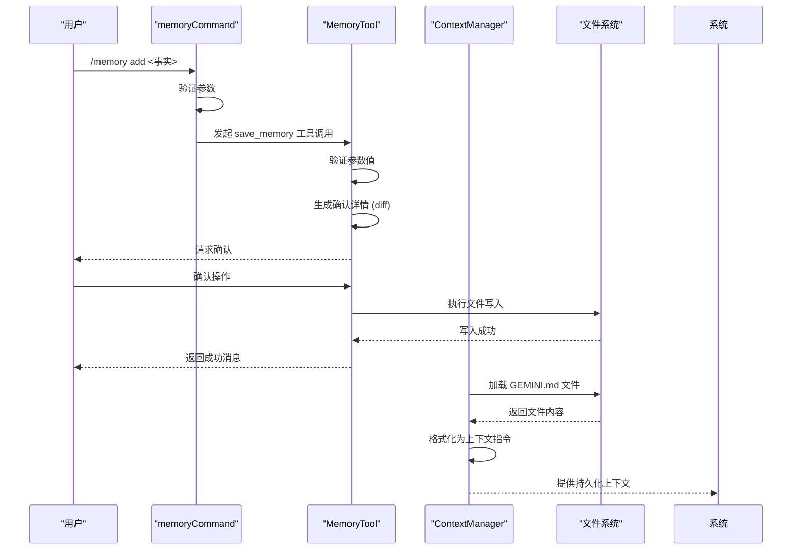
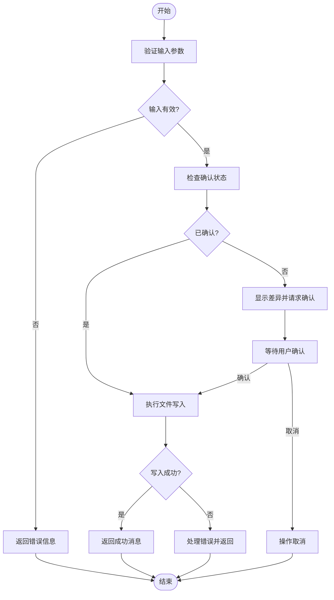
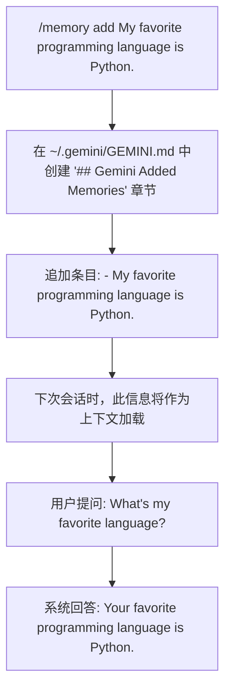

# 内存管理工具

<cite>
**本文档中引用的文件**   
- [memoryTool.ts](file://packages/core/src/tools/memoryTool.ts)
- [memoryCommand.ts](file://packages/cli/src/ui/commands/memoryCommand.ts)
- [contextManager.ts](file://packages/core/src/services/contextManager.ts)
- [memoryDiscovery.ts](file://packages/core/src/utils/memoryDiscovery.ts)
- [memory.md](file://docs/tools/memory.md)
</cite>

## 目录
1. [简介](#简介)
2. [核心组件](#核心组件)
3. [内存工具与上下文管理器的协作机制](#内存工具与上下文管理器的协作机制)
4. [API设计与操作实现](#api设计与操作实现)
5. [代码示例与使用场景](#代码示例与使用场景)
6. [存储格式与性能优化](#存储格式与性能优化)
7. [隐私保护与安全机制](#隐私保护与安全机制)
8. [结论](#结论)

## 简介
内存管理工具是Gemini CLI系统中的核心组件，负责实现长期记忆的持久化存储与检索。该工具通过`/memory`命令与用户交互，允许用户保存、查询和管理跨会话的上下文信息。内存工具与上下文管理器紧密协作，将用户记忆持久化存储在`GEMINI.md`文件中，并在会话启动时加载这些信息，从而实现个性化的持续服务。该系统设计遵循简洁性原则，专注于存储关键事实而非冗长对话，确保了高效性和实用性。

## 核心组件

内存管理工具的核心由`MemoryTool`类实现，该类继承自`BaseDeclarativeTool`，并实现了`ModifiableDeclarativeTool`接口。`MemoryTool`的主要职责是处理`save_memory`工具调用，将用户指定的事实（fact）安全地写入持久化存储。工具的参数通过`SaveMemoryParams`接口定义，其中`fact`字段是必需的字符串，表示要记忆的具体信息。工具的执行过程包含验证、确认和持久化三个阶段，确保了操作的安全性和可靠性。`MemoryTool`通过`getModifyContext`方法提供修改上下文，支持外部编辑器对内存文件的直接修改。

**Section sources**
- [memoryTool.ts](file://packages/core/src/tools/memoryTool.ts#L297-L399)

## 内存工具与上下文管理器的协作机制

**Diagram sources **
- [memoryCommand.ts](file://packages/cli/src/ui/commands/memoryCommand.ts#L45-L71)
- [memoryTool.ts](file://packages/core/src/tools/memoryTool.ts#L234-L275)
- [contextManager.ts](file://packages/core/src/services/contextManager.ts#L29-L37)

内存工具与上下文管理器的协作是实现会话上下文持久化的关键。当用户通过`/memory add`命令添加记忆时，`memoryCommand`会触发`save_memory`工具调用。`MemoryTool`在执行前会生成一个文件差异（diff），向用户请求确认，确保操作的透明性。一旦确认，工具会将事实追加到`~/.gemini/GEMINI.md`文件的`## Gemini Added Memories`章节下。在会话初始化阶段，`ContextManager`会调用`loadGlobalMemory`方法，从文件系统读取`GEMINI.md`的内容，并将其作为系统指令的一部分加载到当前会话中。这种机制实现了记忆的双向同步：写入时持久化，读取时恢复。

**Section sources**
- [memoryCommand.ts](file://packages/cli/src/ui/commands/memoryCommand.ts#L15-L145)
- [contextManager.ts](file://packages/core/src/services/contextManager.ts#L1-L112)

## API设计与操作实现

内存管理工具提供了清晰的API设计，支持创建、查询、更新和删除等基本操作。创建操作通过`/memory add <text>`命令实现，该命令会调用`save_memory`工具。查询操作通过`/memory show`命令实现，直接从配置服务中获取当前内存内容并展示给用户。更新操作支持两种方式：一是通过`add`命令追加新事实，二是通过外部编辑器直接修改`GEMINI.md`文件，工具会通过`modified_by_user`和`modified_content`参数处理这种场景。删除操作则通过`/memory refresh`命令间接实现，该命令会重新加载内存文件，从而反映外部的删除更改。

**Diagram sources **
- [memoryTool.ts](file://packages/core/src/tools/memoryTool.ts#L316-L338)
- [memoryCommand.ts](file://packages/cli/src/ui/commands/memoryCommand.ts#L26-L42)

**Section sources**
- [memoryTool.ts](file://packages/core/src/tools/memoryTool.ts#L101-L399)
- [memoryCommand.ts](file://packages/cli/src/ui/commands/memoryCommand.ts#L15-L145)

## 代码示例与使用场景

以下代码示例展示了如何使用`/memory`命令来管理长期记忆。这些示例体现了工具在实际应用中的灵活性和实用性。

**Diagram sources **
- [memory.md](file://docs/tools/memory.md#L37-L47)

**Section sources**
- [memory.md](file://docs/tools/memory.md#L1-L55)

## 存储格式与性能优化

内存存储采用纯文本Markdown格式，主文件名为`GEMINI.md`，位于用户主目录的`.gemini`子目录下。所有由工具添加的记忆条目都统一存储在`## Gemini Added Memories`标题下，以无序列表（`- `）的形式组织。这种格式简单、可读性强，允许用户直接手动编辑文件。性能优化策略主要体现在文件操作的原子性和幂等性上。`performAddMemoryEntry`方法通过`fsAdapter`抽象层进行文件读写，确保了操作的可靠性。在写入前，系统会检查文件是否存在，不存在则自动创建目录。此外，通过`allowlist`静态集合，系统实现了“始终允许”（ProceedAlways）的确认机制，避免了对同一文件的重复确认，提升了用户体验。

**Section sources**
- [memoryTool.ts](file://packages/core/src/tools/memoryTool.ts#L64-L65)
- [memoryTool.ts](file://packages/core/src/tools/memoryTool.ts#L340-L377)

## 隐私保护与安全机制

系统内置了多层次的隐私保护和安全机制。首先，所有内存操作都需要用户显式确认，`MemoryToolInvocation`在执行前会生成一个详细的文件差异（diff），让用户清楚地看到即将发生的变化。其次，`GEMINI.md`文件位于用户主目录下，其访问权限由操作系统控制，确保了数据的本地安全。此外，系统通过`trustedFolders`机制管理上下文加载的信任范围，防止从不受信任的目录加载潜在的恶意内容。对于敏感信息，系统依赖于用户自身的判断，建议用户不要存储机密信息。整个工具的设计遵循最小权限原则，仅在必要时请求用户确认，平衡了便利性与安全性。

**Section sources**
- [memoryTool.ts](file://packages/core/src/tools/memoryTool.ts#L194-L232)
- [memoryDiscovery.test.ts](file://packages/core/src/utils/memoryDiscovery.test.ts#L86-L138)

## 结论
内存管理工具通过简洁而强大的设计，成功实现了长期记忆的持久化。它与上下文管理器的无缝协作，使得跨会话的个性化服务成为可能。基于Markdown的存储格式保证了数据的可访问性和可移植性，而严格的确认流程和信任机制则确保了操作的安全性。该工具是Gemini CLI实现智能、连贯交互体验的基石，为用户提供了真正意义上的“记住”能力。