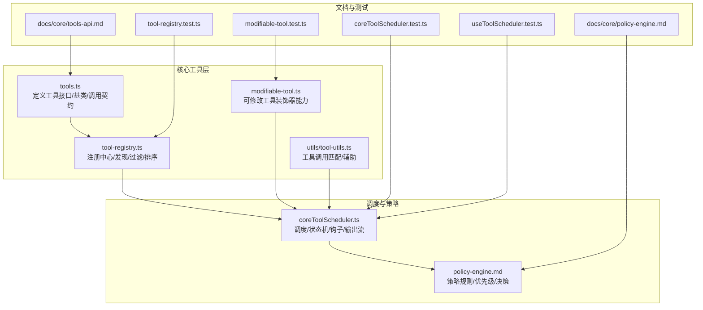
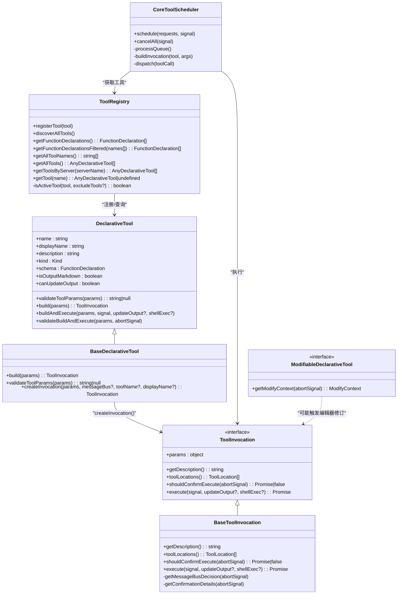
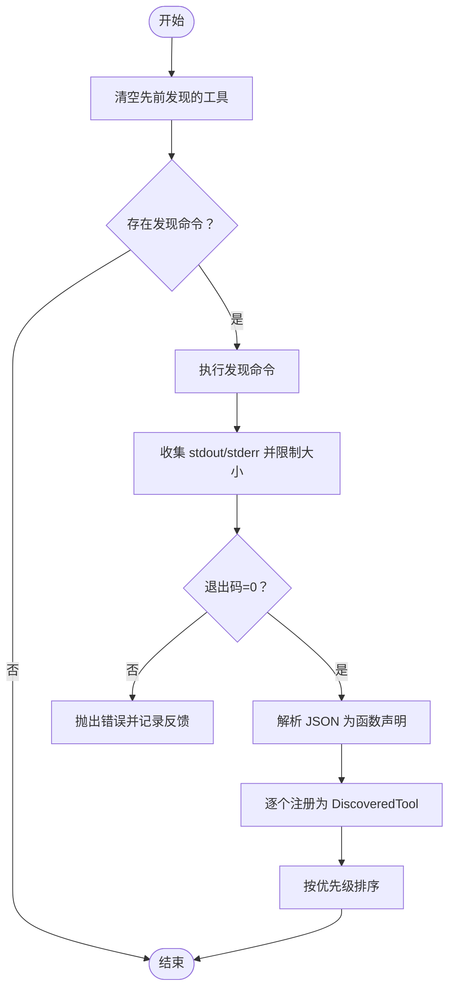
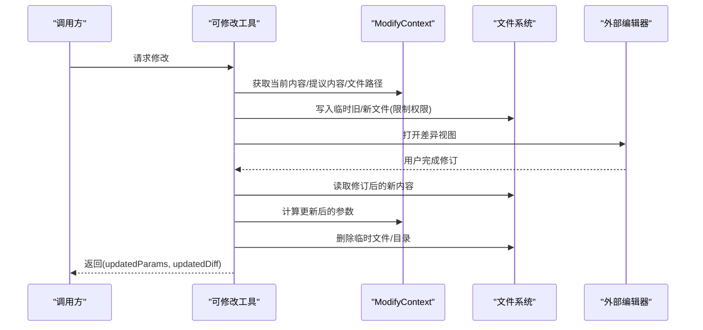
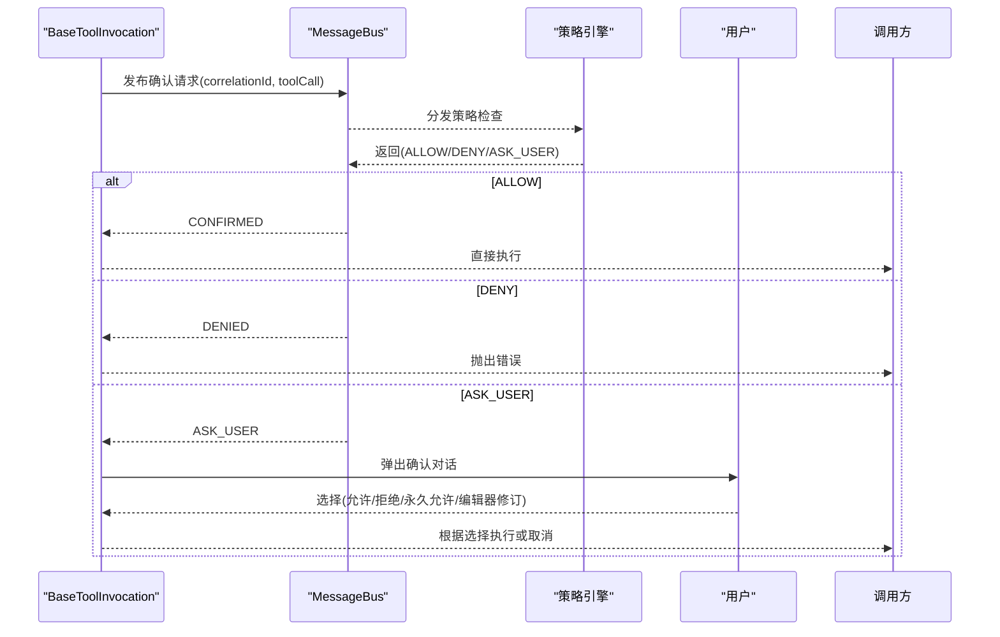
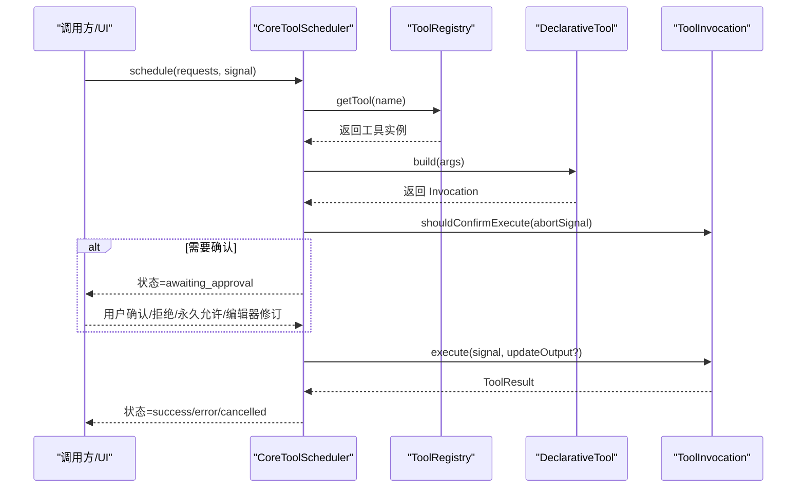
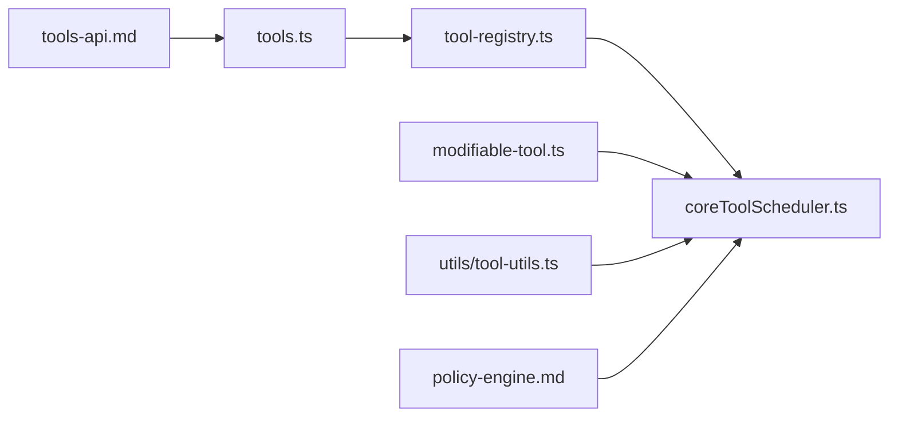

# 工具架构与扩展

<cite>
**本文引用的文件**
- [packages/core/src/tools/tool-registry.ts](file://packages/core/src/tools/tool-registry.ts)
- [packages/core/src/tools/tools.ts](file://packages/core/src/tools/tools.ts)
- [packages/core/src/tools/modifiable-tool.ts](file://packages/core/src/tools/modifiable-tool.ts)
- [packages/core/src/core/coreToolScheduler.ts](file://packages/core/src/core/coreToolScheduler.ts)
- [packages/core/src/tools/tool-registry.test.ts](file://packages/core/src/tools/tool-registry.test.ts)
- [packages/core/src/tools/modifiable-tool.test.ts](file://packages/core/src/tools/modifiable-tool.test.ts)
- [docs/core/tools-api.md](file://docs/core/tools-api.md)
- [docs/core/policy-engine.md](file://docs/core/policy-engine.md)
- [packages/core/src/utils/tool-utils.ts](file://packages/core/src/utils/tool-utils.ts)
- [packages/core/src/core/coreToolScheduler.test.ts](file://packages/core/src/core/coreToolScheduler.test.ts)
- [packages/cli/src/ui/hooks/useToolScheduler.test.ts](file://packages/cli/src/ui/hooks/useToolScheduler.test.ts)
</cite>

## 目录
1. [引言](#引言)
2. [项目结构](#项目结构)
3. [核心组件](#核心组件)
4. [架构总览](#架构总览)
5. [组件详解](#组件详解)
6. [依赖关系分析](#依赖关系分析)
7. [性能与可观测性](#性能与可观测性)
8. [故障排查指南](#故障排查指南)
9. [结论](#结论)
10. [附录：扩展与示例](#附录扩展与示例)

## 引言
本文件面向开发者与运维人员，系统化梳理 Gemini CLI 的工具系统架构，重点围绕以下目标：
- 工具注册中心（tool-registry）如何动态发现、注册与调度内置与扩展工具
- 可修改工具（modifiable-tool）的装饰器式能力与参数修订流程
- 基础工具调用（base-tool-invocation）的标准化接口与确认/策略集成
- 工具执行生命周期、上下文传递与错误传播策略
- 性能监控、统计采集与安全审计（策略引擎）
- 如何通过工具 API 扩展系统能力

## 项目结构
工具系统主要分布在 core 包的 tools 与 core 子模块中，并辅以 CLI 层的调度与测试验证：
- 核心接口与基类：tools.ts
- 注册中心：tool-registry.ts
- 可修改工具能力：modifiable-tool.ts
- 调度器：coreToolScheduler.ts
- 文档：docs/core/tools-api.md、docs/core/policy-engine.md
- 工具匹配工具函数：utils/tool-utils.ts
- 测试：tool-registry.test.ts、modifiable-tool.test.ts、coreToolScheduler.test.ts、CLI 层 useToolScheduler.test.ts

图表来源
- [packages/core/src/tools/tools.ts](file://packages/core/src/tools/tools.ts#L1-L200)
- [packages/core/src/tools/tool-registry.ts](file://packages/core/src/tools/tool-registry.ts#L1-L200)
- [packages/core/src/tools/modifiable-tool.ts](file://packages/core/src/tools/modifiable-tool.ts#L1-L120)
- [packages/core/src/core/coreToolScheduler.ts](file://packages/core/src/core/coreToolScheduler.ts#L1-L200)
- [docs/core/tools-api.md](file://docs/core/tools-api.md#L1-L132)
- [docs/core/policy-engine.md](file://docs/core/policy-engine.md#L1-L120)
- [packages/core/src/tools/tool-registry.test.ts](file://packages/core/src/tools/tool-registry.test.ts#L1-L120)
- [packages/core/src/tools/modifiable-tool.test.ts](file://packages/core/src/tools/modifiable-tool.test.ts#L1-L120)
- [packages/core/src/core/coreToolScheduler.test.ts](file://packages/core/src/core/coreToolScheduler.test.ts#L351-L420)
- [packages/cli/src/ui/hooks/useToolScheduler.test.ts](file://packages/cli/src/ui/hooks/useToolScheduler.test.ts#L226-L362)

章节来源
- [packages/core/src/tools/tools.ts](file://packages/core/src/tools/tools.ts#L1-L200)
- [packages/core/src/tools/tool-registry.ts](file://packages/core/src/tools/tool-registry.ts#L1-L200)
- [packages/core/src/tools/modifiable-tool.ts](file://packages/core/src/tools/modifiable-tool.ts#L1-L120)
- [packages/core/src/core/coreToolScheduler.ts](file://packages/core/src/core/coreToolScheduler.ts#L1-L200)
- [docs/core/tools-api.md](file://docs/core/tools-api.md#L1-L132)
- [docs/core/policy-engine.md](file://docs/core/policy-engine.md#L1-L120)

## 核心组件
- 工具接口与基类：定义工具契约、参数校验、构建调用对象、执行结果与确认流程
- 工具注册中心：集中注册、发现（命令/协议）、过滤、排序、查询
- 可修改工具：提供编辑器交互、参数修订、差异计算与临时文件清理
- 调度器：统一的状态机、并发队列、钩子、输出流、取消与错误处理
- 策略引擎：基于规则的访问控制、优先级与安全检查

章节来源
- [packages/core/src/tools/tools.ts](file://packages/core/src/tools/tools.ts#L1-L200)
- [packages/core/src/tools/tool-registry.ts](file://packages/core/src/tools/tool-registry.ts#L1-L200)
- [packages/core/src/tools/modifiable-tool.ts](file://packages/core/src/tools/modifiable-tool.ts#L1-L120)
- [packages/core/src/core/coreToolScheduler.ts](file://packages/core/src/core/coreToolScheduler.ts#L1-L200)

## 架构总览
工具系统采用“声明式工具 + 可插拔注册中心 + 统一调度器”的分层架构：
- 上层：工具定义（DeclarativeTool/BaseDeclarativeTool）与调用（ToolInvocation/BaseToolInvocation）
- 中层：注册中心（ToolRegistry）负责发现与聚合
- 下层：调度器（CoreToolScheduler）负责生命周期、并发、确认、钩子与输出
- 外部：策略引擎（Policy Engine）在确认阶段介入，决定是否允许或要求用户确认

图表来源
- [packages/core/src/tools/tools.ts](file://packages/core/src/tools/tools.ts#L1-L200)
- [packages/core/src/tools/tool-registry.ts](file://packages/core/src/tools/tool-registry.ts#L1-L200)
- [packages/core/src/core/coreToolScheduler.ts](file://packages/core/src/core/coreToolScheduler.ts#L1-L200)
- [packages/core/src/tools/modifiable-tool.ts](file://packages/core/src/tools/modifiable-tool.ts#L1-L120)

## 组件详解

### 工具注册中心（ToolRegistry）
职责与能力：
- 注册工具：支持覆盖与去重策略，保留已发现的 MCP 工具为完整实例
- 发现工具：支持命令行发现与 MCP 服务器发现；命令行发现会解析 JSON 输出并注册为 DiscoveredTool
- 过滤与排序：按内置/发现/MCP 优先级排序；支持按服务器筛选
- 查询：提供工具清单、名称列表、函数声明数组（供模型使用）

关键点：
- 排除策略：根据配置排除工具名或类名，支持 MCP 全限定名与非全限定名两种匹配
- 活跃工具集合：仅返回未被排除的工具
- 命令行发现：限制 stdout/stderr 最大尺寸，失败时抛出错误并上报反馈事件
- MCP 工具：支持移除指定服务器的工具，便于刷新

图表来源
- [packages/core/src/tools/tool-registry.ts](file://packages/core/src/tools/tool-registry.ts#L290-L423)

章节来源
- [packages/core/src/tools/tool-registry.ts](file://packages/core/src/tools/tool-registry.ts#L1-L200)
- [packages/core/src/tools/tool-registry.ts](file://packages/core/src/tools/tool-registry.ts#L290-L423)
- [packages/core/src/tools/tool-registry.ts](file://packages/core/src/tools/tool-registry.ts#L425-L535)
- [packages/core/src/tools/tool-registry.test.ts](file://packages/core/src/tools/tool-registry.test.ts#L401-L483)

### 可修改工具（ModifiableDeclarativeTool）
设计要点：
- 装饰器式能力：通过 getModifyContext 提供当前内容、提议内容、文件路径与参数修订逻辑
- 编辑器集成：创建临时文件，打开外部编辑器进行修订，计算差异并返回更新后的参数
- 安全与清理：严格设置临时文件权限，最终清理临时目录与文件，异常时也保证清理
- 覆盖选项：支持显式覆盖当前/提议内容，便于内联修改流程

图表来源
- [packages/core/src/tools/modifiable-tool.ts](file://packages/core/src/tools/modifiable-tool.ts#L1-L214)
- [packages/core/src/tools/modifiable-tool.test.ts](file://packages/core/src/tools/modifiable-tool.test.ts#L95-L185)

章节来源
- [packages/core/src/tools/modifiable-tool.ts](file://packages/core/src/tools/modifiable-tool.ts#L1-L214)
- [packages/core/src/tools/modifiable-tool.test.ts](file://packages/core/src/tools/modifiable-tool.test.ts#L1-L200)

### 基础工具调用（BaseToolInvocation）与确认/策略集成
- 统一确认流程：支持通过消息总线（MessageBus）与策略引擎协作，决定是否允许、拒绝或要求用户确认
- 默认回退：无消息总线时走默认确认流程
- 超时与取消：确认请求超时默认转为“要求用户确认”，AbortSignal 触发时视为拒绝
- 结果封装：统一的 ToolResult 结构，包含 llmContent（用于模型历史）与 returnDisplay（用于 UI）

图表来源
- [packages/core/src/tools/tools.ts](file://packages/core/src/tools/tools.ts#L90-L238)
- [docs/core/policy-engine.md](file://docs/core/policy-engine.md#L1-L120)

章节来源
- [packages/core/src/tools/tools.ts](file://packages/core/src/tools/tools.ts#L90-L238)
- [docs/core/policy-engine.md](file://docs/core/policy-engine.md#L1-L120)

### 调度器（CoreToolScheduler）与生命周期
生命周期状态机：
- validating/scheduled/executing/awaiting_approval/success/error/cancelled
- 支持批量请求、队列、并发控制、取消与输出流回调
- 集成钩子（hooks）与策略引擎：在确认阶段与执行前后触发钩子
- 错误处理：工具不存在、参数无效、执行失败、建议相似名称等

图表来源
- [packages/core/src/core/coreToolScheduler.ts](file://packages/core/src/core/coreToolScheduler.ts#L1-L200)
- [packages/core/src/core/coreToolScheduler.ts](file://packages/core/src/core/coreToolScheduler.ts#L622-L794)
- [packages/core/src/core/coreToolScheduler.test.ts](file://packages/core/src/core/coreToolScheduler.test.ts#L351-L420)
- [packages/cli/src/ui/hooks/useToolScheduler.test.ts](file://packages/cli/src/ui/hooks/useToolScheduler.test.ts#L226-L362)

章节来源
- [packages/core/src/core/coreToolScheduler.ts](file://packages/core/src/core/coreToolScheduler.ts#L1-L200)
- [packages/core/src/core/coreToolScheduler.ts](file://packages/core/src/core/coreToolScheduler.ts#L622-L794)
- [packages/core/src/core/coreToolScheduler.test.ts](file://packages/core/src/core/coreToolScheduler.test.ts#L351-L420)
- [packages/cli/src/ui/hooks/useToolScheduler.test.ts](file://packages/cli/src/ui/hooks/useToolScheduler.test.ts#L226-L362)

### 工具 API 扩展实践
- 命令行发现：通过配置发现命令输出 JSON 数组（FunctionDeclaration），注册为 DiscoveredTool
- MCP 发现：连接 MCP 服务器，注册 DiscoveredMCPTool
- 自定义工具：继承 BaseDeclarativeTool，实现参数校验与 createInvocation，返回自定义 ToolInvocation
- 可修改工具：实现 getModifyContext，提供当前/提议内容与参数修订逻辑

章节来源
- [docs/core/tools-api.md](file://docs/core/tools-api.md#L1-L132)
- [packages/core/src/tools/tool-registry.ts](file://packages/core/src/tools/tool-registry.ts#L290-L423)
- [packages/core/src/tools/tools.ts](file://packages/core/src/tools/tools.ts#L295-L421)

## 依赖关系分析
- 工具接口依赖 JSON Schema 校验器与终端序列化工具
- 注册中心依赖配置、消息总线、事件系统与子进程执行
- 调度器依赖注册中心、消息总线、钩子系统、策略引擎与 shell 工具白名单
- 可修改工具依赖编辑器与差异库，同时注意临时文件权限与清理

图表来源
- [packages/core/src/tools/tools.ts](file://packages/core/src/tools/tools.ts#L1-L200)
- [packages/core/src/tools/tool-registry.ts](file://packages/core/src/tools/tool-registry.ts#L1-L200)
- [packages/core/src/core/coreToolScheduler.ts](file://packages/core/src/core/coreToolScheduler.ts#L1-L200)
- [packages/core/src/tools/modifiable-tool.ts](file://packages/core/src/tools/modifiable-tool.ts#L1-L120)
- [packages/core/src/utils/tool-utils.ts](file://packages/core/src/utils/tool-utils.ts#L1-L40)
- [docs/core/tools-api.md](file://docs/core/tools-api.md#L1-L132)
- [docs/core/policy-engine.md](file://docs/core/policy-engine.md#L1-L120)

章节来源
- [packages/core/src/tools/tools.ts](file://packages/core/src/tools/tools.ts#L1-L200)
- [packages/core/src/tools/tool-registry.ts](file://packages/core/src/tools/tool-registry.ts#L1-L200)
- [packages/core/src/core/coreToolScheduler.ts](file://packages/core/src/core/coreToolScheduler.ts#L1-L200)
- [packages/core/src/tools/modifiable-tool.ts](file://packages/core/src/tools/modifiable-tool.ts#L1-L120)
- [packages/core/src/utils/tool-utils.ts](file://packages/core/src/utils/tool-utils.ts#L1-L40)
- [docs/core/tools-api.md](file://docs/core/tools-api.md#L1-L132)
- [docs/core/policy-engine.md](file://docs/core/policy-engine.md#L1-L120)

## 性能与可观测性
- 性能监控与统计
  - 调度器维护每个工具调用的 durationMs，支持批量完成回调与状态更新回调
  - 工具输出截断事件与日志工具可用于观测长输出
- 错误传播
  - 参数无效：返回 INVALID_TOOL_PARAMS 类型错误
  - 工具不存在：提示建议相似名称（Levenshtein 距离）
  - 执行失败：返回 EXECUTION_FAILED 类型错误
- 安全审计
  - 策略引擎在确认阶段介入，支持规则匹配、优先级与安全检查器
  - MCP 工具支持服务器维度的访问控制与全限定名匹配
- 可靠性
  - 命令行发现限制 stdout/stderr 大小，避免内存膨胀
  - 可修改工具临时文件权限严格设置，失败时仍清理

章节来源
- [packages/core/src/core/coreToolScheduler.ts](file://packages/core/src/core/coreToolScheduler.ts#L1-L200)
- [packages/core/src/core/coreToolScheduler.ts](file://packages/core/src/core/coreToolScheduler.ts#L622-L794)
- [packages/core/src/tools/tool-registry.ts](file://packages/core/src/tools/tool-registry.ts#L300-L423)
- [packages/core/src/tools/modifiable-tool.ts](file://packages/core/src/tools/modifiable-tool.ts#L170-L214)
- [docs/core/policy-engine.md](file://docs/core/policy-engine.md#L1-L120)

## 故障排查指南
常见问题与定位思路：
- 工具未找到
  - 检查注册中心是否正确发现与注册
  - 使用建议相似名称提示定位拼写问题
- 参数无效
  - 查看 JSON Schema 校验错误信息
  - 使用工具的 validateToolParamValues 自定义校验
- 执行失败
  - 检查工具返回的 ToolResult.error.type 与 message
  - 关注命令行发现/调用过程中的退出码与 stderr
- 确认流程异常
  - 消息总线订阅/发布是否正常
  - 策略引擎规则是否命中
  - 超时与取消信号是否正确传递

章节来源
- [packages/core/src/core/coreToolScheduler.ts](file://packages/core/src/core/coreToolScheduler.ts#L622-L794)
- [packages/core/src/tools/tool-registry.ts](file://packages/core/src/tools/tool-registry.ts#L300-L423)
- [packages/core/src/tools/tools.ts](file://packages/core/src/tools/tools.ts#L90-L238)
- [packages/core/src/tools/tool-registry.test.ts](file://packages/core/src/tools/tool-registry.test.ts#L445-L516)
- [packages/core/src/tools/modifiable-tool.test.ts](file://packages/core/src/tools/modifiable-tool.test.ts#L300-L353)

## 结论
该工具系统通过清晰的接口抽象、可插拔的注册中心与统一的调度器，实现了从“声明式工具定义”到“策略驱动的安全执行”的完整闭环。可修改工具增强了人机协作与参数修订体验；调度器提供了完善的生命周期管理与可观测性；策略引擎则为复杂场景下的访问控制与安全审计提供了强大支撑。整体架构具备良好的扩展性与稳定性，适合在企业与个人环境中持续演进。

## 附录：扩展与示例
- 通过命令行发现扩展工具
  - 在配置中设置发现命令，输出 JSON 数组（FunctionDeclaration），注册为 DiscoveredTool
  - 对应调用命令用于实际执行工具
- 通过 MCP 扩展工具
  - 配置 MCP 服务器，自动发现并注册 DiscoveredMCPTool
  - 支持服务器维度的工具筛选与全限定名匹配
- 自定义工具
  - 继承 BaseDeclarativeTool，实现参数校验与 createInvocation
  - 若需要编辑器修订，实现 getModifyContext
- 策略控制
  - 使用 TOML 规则文件定义 allow/deny/ask_user 决策
  - 支持工具名、参数正则、命令前缀/正则、MCP 服务器通配符与优先级

章节来源
- [docs/core/tools-api.md](file://docs/core/tools-api.md#L1-L132)
- [docs/core/policy-engine.md](file://docs/core/policy-engine.md#L1-L249)
- [packages/core/src/tools/tool-registry.ts](file://packages/core/src/tools/tool-registry.ts#L290-L423)
- [packages/core/src/tools/tools.ts](file://packages/core/src/tools/tools.ts#L295-L421)
- [packages/core/src/tools/modifiable-tool.ts](file://packages/core/src/tools/modifiable-tool.ts#L1-L120)