# 工具系统

<cite>
**本文档引用的文件**   
- [tool-registry.ts](file://packages/core/src/tools/tool-registry.ts)
- [tools.ts](file://packages/core/src/tools/tools.ts)
- [modifiable-tool.ts](file://packages/core/src/tools/modifiable-tool.ts)
- [read-file.ts](file://packages/core/src/tools/read-file.ts)
- [write-file.ts](file://packages/core/src/tools/write-file.ts)
- [ls.ts](file://packages/core/src/tools/ls.ts)
- [grep.ts](file://packages/core/src/tools/grep.ts)
- [shell.ts](file://packages/core/src/tools/shell.ts)
- [web-fetch.ts](file://packages/core/src/tools/web-fetch.ts)
- [web-search.ts](file://packages/core/src/tools/web-search.ts)
- [memoryTool.ts](file://packages/core/src/tools/memoryTool.ts)
- [tool-names.ts](file://packages/core/src/tools/tool-names.ts)
- [config.ts](file://packages/core/src/config/config.ts)
- [tool-error.ts](file://packages/core/src/tools/tool-error.ts)
- [sandboxConfig.ts](file://packages/cli/src/config/sandboxConfig.ts)
- [sandbox.ts](file://packages/cli/src/utils/sandbox.ts)
- [sandboxUtils.ts](file://packages/cli/src/utils/sandboxUtils.ts)
</cite>

## 目录
1. [简介](#简介)
2. [工具注册表与调度](#工具注册表与调度)
3. [核心工具实现](#核心工具实现)
   - [文件系统工具](#文件系统工具)
   - [Shell执行工具](#shell执行工具)
   - [网络工具](#网络工具)
   - [内存管理工具](#内存管理工具)
4. [工具执行上下文与安全模型](#工具执行上下文与安全模型)
5. [扩展机制](#扩展机制)
6. [错误处理与性能监控](#错误处理与性能监控)
7. [安全最佳实践](#安全最佳实践)

## 简介
本系统为Gemini CLI提供了一套全面的工具集，旨在通过安全、可扩展的API与本地环境进行交互。这些工具覆盖了文件系统操作、Shell命令执行、网络资源获取和长期记忆管理等核心功能。系统通过`tool-registry`统一管理所有工具，并利用`modifiable-tool`和`base-tool-invocation`模式提供强大的扩展能力。所有工具调用均在严格的权限控制和沙箱隔离策略下执行，确保了用户环境的安全。

## 工具注册表与调度

工具注册表（`ToolRegistry`）是整个工具系统的核心，负责管理所有工具的生命周期。它通过一个`Map`结构将工具名称映射到具体的工具实例，实现了高效的工具查找和调用。

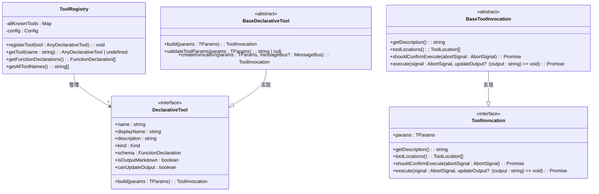

**Diagram sources**
- [tool-registry.ts](file://packages/core/src/tools/tool-registry.ts#L190-L534)
- [tools.ts](file://packages/core/src/tools/tools.ts#L299-L474)

**Section sources**
- [tool-registry.ts](file://packages/core/src/tools/tool-registry.ts#L190-L534)
- [tools.ts](file://packages/core/src/tools/tools.ts#L299-L474)

## 核心工具实现

### 文件系统工具
文件系统工具提供了对本地文件和目录的读写、搜索和管理能力。每个工具都严格遵循安全模型，确保操作仅限于工作区目录内。

#### 读取文件 (read_file)
`ReadFileTool`用于读取指定文件的内容。它支持读取文本、图像、音频和PDF文件，并能处理大文件的分页读取。

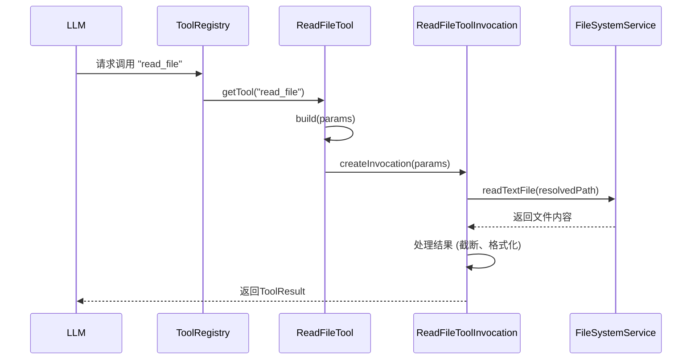

**Diagram sources**
- [read-file.ts](file://packages/core/src/tools/read-file.ts#L144-L240)
- [tools.ts](file://packages/core/src/tools/tools.ts#L71-L238)

#### 写入文件 (write_file)
`WriteFileTool`用于向指定文件写入内容。它实现了强大的确认机制，包括内容校正和IDE内联编辑，确保修改的安全性和准确性。

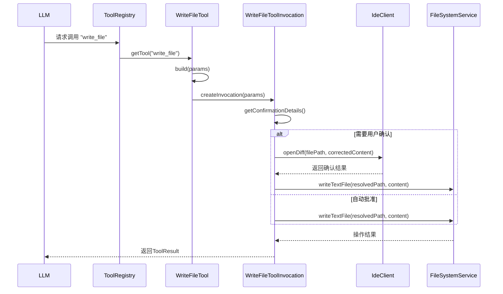

**Diagram sources**
- [write-file.ts](file://packages/core/src/tools/write-file.ts#L399-L521)
- [tools.ts](file://packages/core/src/tools/tools.ts#L71-L238)

#### 列出目录 (ls)
`LSTool`用于列出指定目录下的文件和子目录。它支持通过glob模式忽略文件，并尊重`.gitignore`和`.geminiignore`规则。

```mermaid
flowchart TD
A[开始] --> B{验证 dir_path}
B --> |无效| C[返回错误]
B --> |有效| D[读取目录内容]
D --> E[应用忽略规则]
E --> F[过滤用户指定的忽略模式]
F --> G[获取每个条目的详细信息]
G --> H[排序结果 (目录优先)]
H --> I[生成LLM内容]
I --> J[返回结果]
```

**Diagram sources**
- [ls.ts](file://packages/core/src/tools/ls.ts#L257-L345)
- [tools.ts](file://packages/core/src/tools/tools.ts#L71-L238)

#### 搜索文件内容 (search_file_content)
`GrepTool`用于在文件中搜索正则表达式模式。它采用多策略搜索，优先使用`git grep`，其次是系统`grep`，最后是纯JavaScript实现作为后备。

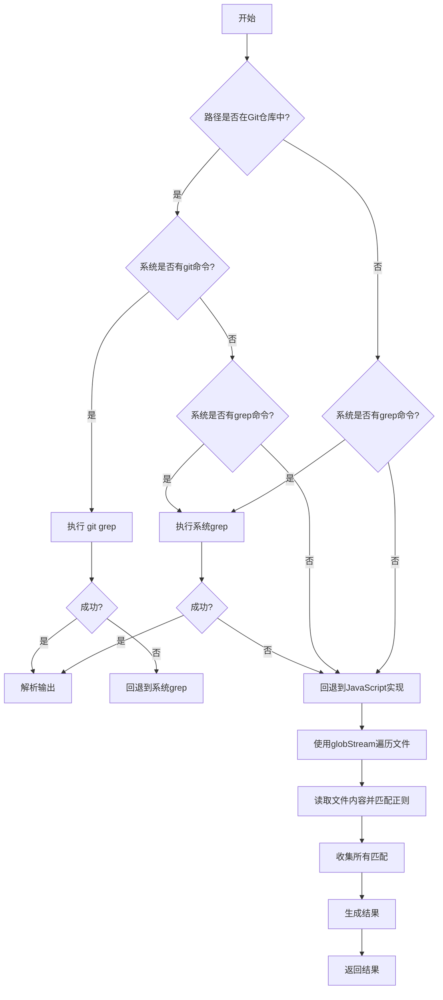

**Diagram sources**
- [grep.ts](file://packages/core/src/tools/grep.ts#L569-L688)
- [tools.ts](file://packages/core/src/tools/tools.ts#L71-L238)

### Shell执行工具
`ShellTool`允许执行任意的Shell命令，是功能最强大但也最具风险的工具。它通过命令解析、白名单机制和沙箱环境来控制风险。

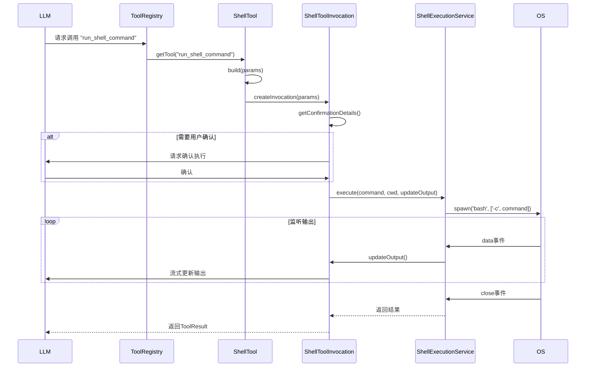

**Diagram sources**
- [shell.ts](file://packages/core/src/tools/shell.ts#L421-L515)
- [tools.ts](file://packages/core/src/tools/tools.ts#L71-L238)

### 网络工具
网络工具提供了从互联网获取信息的能力，包括直接的网页内容抓取和基于搜索引擎的查询。

#### Web Fetch (web_fetch)
`WebFetchTool`利用Gemini API直接处理URL内容。它支持从公共和私有网络地址（如localhost）获取内容，并能处理HTML、文本和JSON等多种格式。

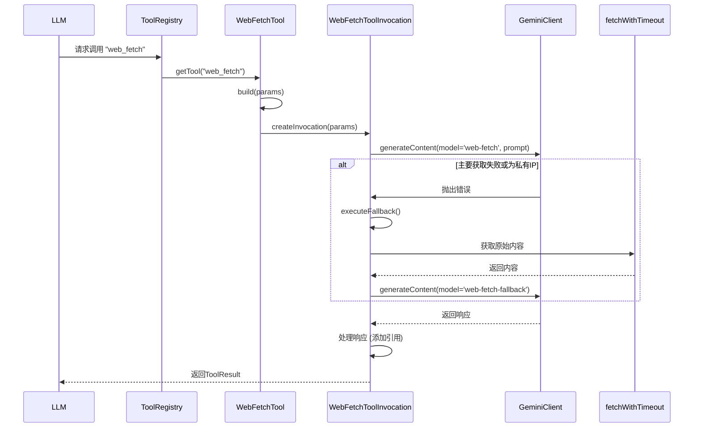

**Diagram sources**
- [web-fetch.ts](file://packages/core/src/tools/web-fetch.ts#L396-L463)
- [tools.ts](file://packages/core/src/tools/tools.ts#L71-L238)

#### Web Search (google_web_search)
`WebSearchTool`执行网络搜索并返回结果。它利用Gemini API的`web-search`模型，并自动为结果中的信息添加引用标记。

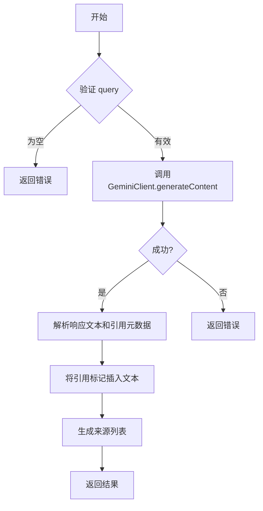

**Diagram sources**
- [web-search.ts](file://packages/core/src/tools/web-search.ts#L185-L245)
- [tools.ts](file://packages/core/src/tools/tools.ts#L71-L238)

### 内存管理工具
`MemoryTool`用于将重要信息持久化到用户的长期记忆中，通常存储在`GEMINI.md`文件中。

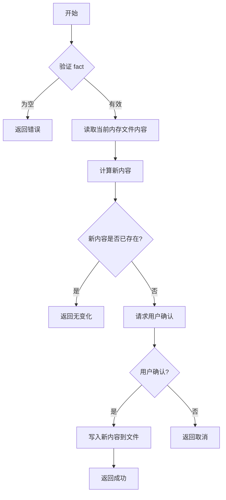

**Diagram sources**
- [memoryTool.ts](file://packages/core/src/tools/memoryTool.ts#L297-L399)
- [tools.ts](file://packages/core/src/tools/tools.ts#L71-L238)

## 工具执行上下文与安全模型
工具系统通过多层次的安全机制来保护用户环境。首先，`Config`对象提供了全局的配置和上下文，包括工作区路径、文件系统服务和权限设置。其次，`MessageBus`实现了策略引擎，可以动态决定是否允许、拒绝或询问用户关于工具调用的请求。

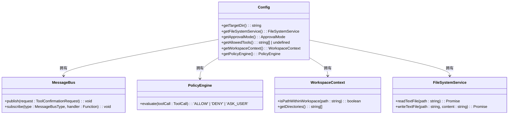

**Diagram sources**
- [config.ts](file://packages/core/src/config/config.ts#L1-L200)
- [tools.ts](file://packages/core/src/tools/tools.ts#L71-L238)

## 扩展机制
系统提供了`modifiable-tool`接口，允许工具支持用户在外部编辑器中修改其提议的内容。`WriteFileTool`和`MemoryTool`都实现了此接口，为用户提供了一个安全的修改流程。

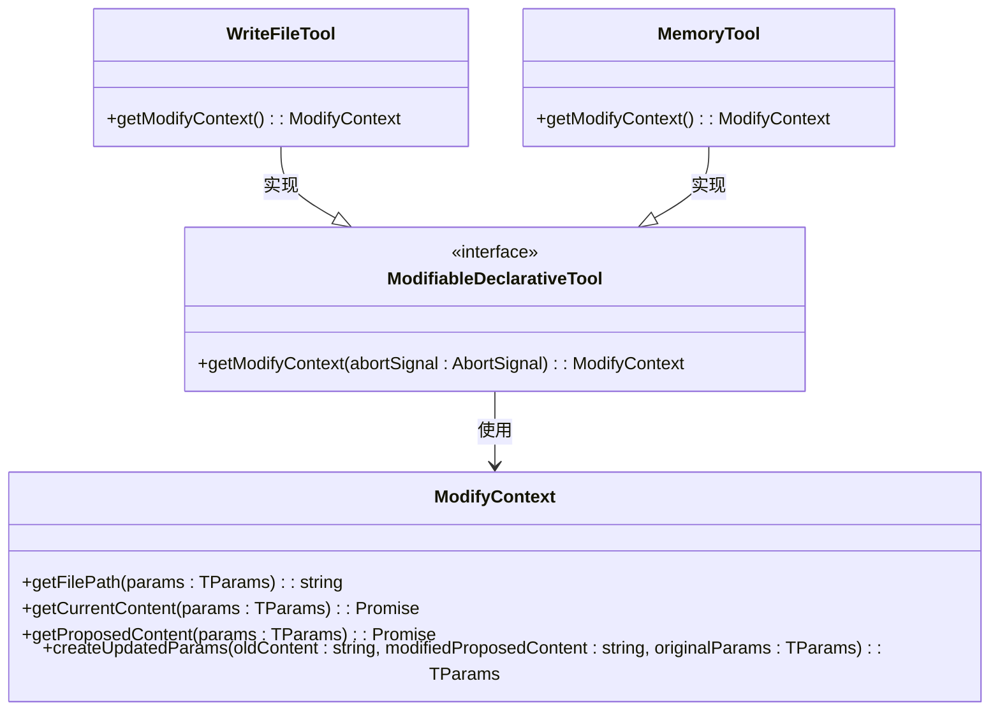

**Diagram sources**
- [modifiable-tool.ts](file://packages/core/src/tools/modifiable-tool.ts#L25-L213)
- [write-file.ts](file://packages/core/src/tools/write-file.ts#L400-L521)
- [memoryTool.ts](file://packages/core/src/tools/memoryTool.ts#L297-L399)

## 错误处理与性能监控
系统定义了详尽的`ToolErrorType`枚举，用于分类和处理各种错误。错误分为可恢复和致命两类，系统会根据错误类型决定是否继续执行。性能监控通过`telemetry`模块实现，可以记录工具调用的详细信息。

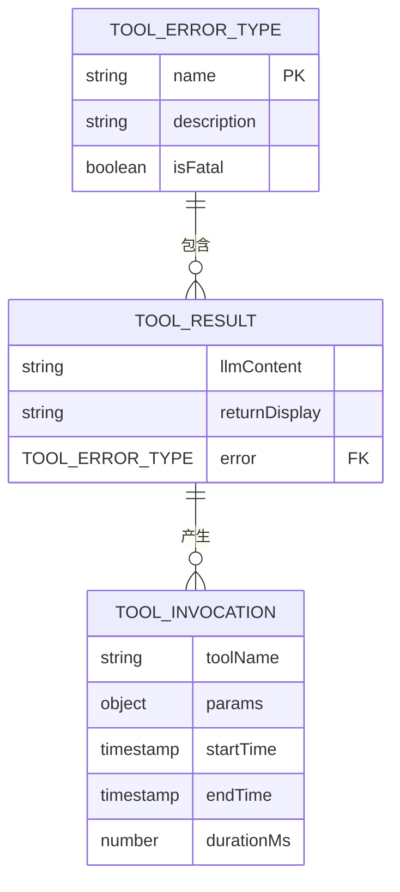

**Diagram sources**
- [tool-error.ts](file://packages/core/src/tools/tool-error.ts#L14-L100)
- [tools.ts](file://packages/core/src/tools/tools.ts#L491-L514)

## 安全最佳实践
为防止命令注入和路径遍历攻击，系统采取了以下措施：
1.  **路径验证**：所有文件路径都通过`WorkspaceContext.isPathWithinWorkspace()`验证，确保操作不会超出工作区。
2.  **命令解析**：`ShellTool`使用专门的解析器来识别命令根，避免被复杂的Shell语法欺骗。
3.  **沙箱隔离**：通过`sandboxConfig.ts`和`sandbox.ts`配置和启动沙箱环境（如Docker或macOS的`sandbox-exec`），将工具执行与主机环境隔离。
4.  **输入验证**：所有工具参数都经过严格的JSON Schema验证和自定义逻辑检查。