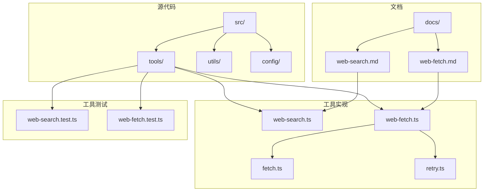
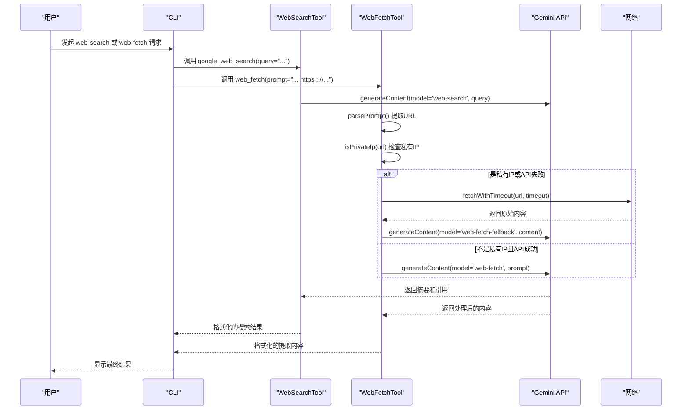
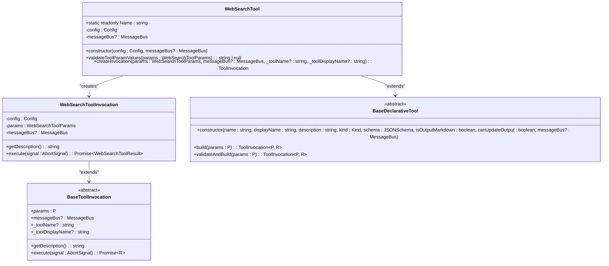
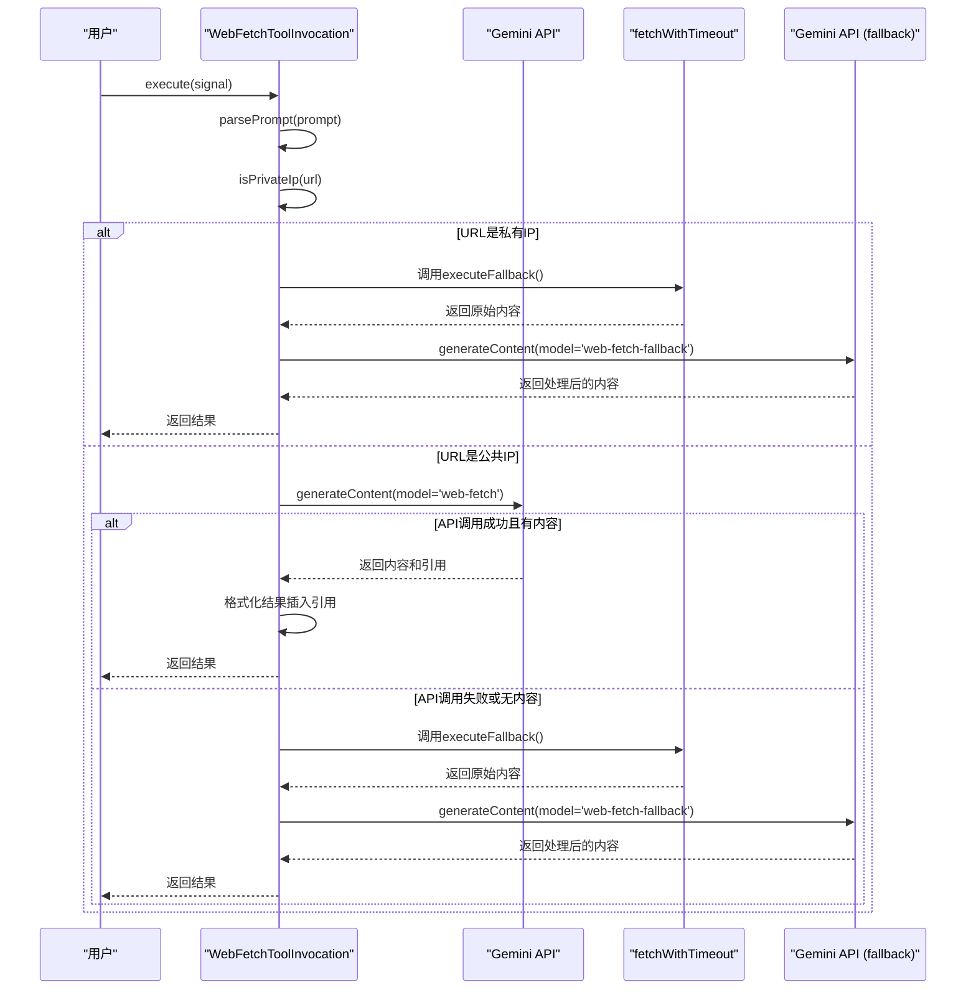
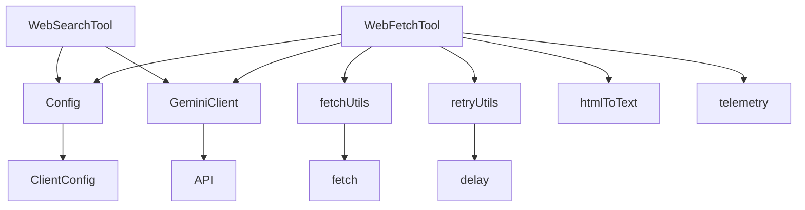

# 网络工具

<cite>
**本文档中引用的文件**  
- [web-search.md](file://docs/tools/web-search.md)
- [web-fetch.md](file://docs/tools/web-fetch.md)
- [web-search.ts](file://packages/core/src/tools/web-search.ts)
- [web-fetch.ts](file://packages/core/src/tools/web-fetch.ts)
- [fetch.ts](file://packages/core/src/utils/fetch.ts)
- [retry.ts](file://packages/core/src/utils/retry.ts)
- [retry.test.ts](file://packages/core/src/utils/retry.test.ts)
</cite>

## 目录
1. [简介](#简介)
2. [项目结构](#项目结构)
3. [核心组件](#核心组件)
4. [架构概述](#架构概述)
5. [详细组件分析](#详细组件分析)
6. [依赖分析](#依赖分析)
7. [性能考虑](#性能考虑)
8. [故障排除指南](#故障排除指南)
9. [结论](#结论)
10. [附录](#附录)（如有必要）

## 简介
本文档全面介绍了 `gemini-cli` 项目中的两个核心网络工具：`web-search` 和 `web-fetch`。`web-search` 工具通过 Gemini API 集成 Google 搜索引擎，允许用户执行网络搜索并获取包含引用的摘要结果。`web-fetch` 工具则用于从一个或多个 URL 中提取、总结或比较内容，它通过自然语言提示来指导内容处理。文档详细阐述了这两个工具的实现细节，包括查询参数构造、结果解析、HTTP 客户端实现、安全策略和性能优化技巧。此外，还提供了在会话中调用这些工具以获取实时网络信息的代码示例。

## 项目结构
该项目采用模块化结构，核心功能位于 `packages/core/src/tools/` 目录下。`web-search` 和 `web-fetch` 工具的实现文件（`web-search.ts` 和 `web-fetch.ts`）与它们的测试文件（`web-search.test.ts` 和 `web-fetch.test.ts`）位于同一目录。相关的工具文档位于 `docs/tools/` 目录下。工具的实现依赖于核心的配置（`config`）、消息总线（`confirmation-bus`）和工具基类（`tools.js`）。HTTP 请求的底层处理（如超时和重试）在 `packages/core/src/utils/fetch.ts` 和 `packages/core/src/utils/retry.ts` 中定义。



**Diagram sources**
- [docs/tools/web-search.md](file://docs/tools/web-search.md)
- [docs/tools/web-fetch.md](file://docs/tools/web-fetch.md)
- [packages/core/src/tools/web-search.ts](file://packages/core/src/tools/web-search.ts)
- [packages/core/src/tools/web-fetch.ts](file://packages/core/src/tools/web-fetch.ts)
- [packages/core/src/utils/fetch.ts](file://packages/core/src/utils/fetch.ts)
- [packages/core/src/utils/retry.ts](file://packages/core/src/utils/retry.ts)

**Section sources**
- [docs/tools/web-search.md](file://docs/tools/web-search.md)
- [docs/tools/web-fetch.md](file://docs/tools/web-fetch.md)
- [packages/core/src/tools/web-search.ts](file://packages/core/src/tools/web-search.ts)
- [packages/core/src/tools/web-fetch.ts](file://packages/core/src/tools/web-fetch.ts)

## 核心组件
`web-search` 和 `web-fetch` 是两个独立的工具类，均继承自 `BaseDeclarativeTool`。`web-search` 的核心是 `WebSearchTool` 类，它通过 `geminiClient.generateContent` 方法，使用 `web-search` 模型向 Gemini API 发送查询。`web-fetch` 的核心是 `WebFetchTool` 类，它同样使用 `geminiClient.generateContent`，但模型为 `web-fetch`，并能处理包含多个 URL 的复杂提示。两个工具都实现了参数验证、执行逻辑和结果返回。`web-fetch` 具有更复杂的逻辑，包括对私有 IP 地址的检测和备用的直接抓取机制。

**Section sources**
- [packages/core/src/tools/web-search.ts](file://packages/core/src/tools/web-search.ts#L186-L245)
- [packages/core/src/tools/web-fetch.ts](file://packages/core/src/tools/web-fetch.ts#L397-L463)

## 架构概述
这两个工具的架构遵循一个清晰的模式：用户输入 -> 工具调用 -> API 通信 -> 结果处理 -> 输出。`web-search` 的流程相对直接：用户查询被发送到 Gemini API，API 执行搜索并返回带有引用的摘要，该摘要被格式化后返回给用户。`web-fetch` 的流程更为健壮：首先，它解析提示中的 URL；然后，它检查 URL 是否指向私有网络；如果是，则使用 `fetchWithTimeout` 进行直接抓取；如果不是，则尝试通过 Gemini API 获取内容；如果 API 调用失败或未返回内容，它会自动回退到直接抓取的备用路径。



**Diagram sources**
- [packages/core/src/tools/web-search.ts](file://packages/core/src/tools/web-search.ts#L78-L180)
- [packages/core/src/tools/web-fetch.ts](file://packages/core/src/tools/web-fetch.ts#L124-L391)
- [packages/core/src/utils/fetch.ts](file://packages/core/src/utils/fetch.ts#L41-L59)

## 详细组件分析

### web-search 组件分析
`web-search` 工具的核心功能是执行网络搜索并返回一个结构化的摘要。其主要组件包括 `WebSearchTool` 类和 `WebSearchToolInvocation` 类。`WebSearchTool` 负责定义工具的元数据（如名称、描述、参数）和创建执行实例。`WebSearchToolInvocation` 则封装了实际的执行逻辑。

#### 对象导向组件：


**Diagram sources**
- [packages/core/src/tools/web-search.ts](file://packages/core/src/tools/web-search.ts#L186-L245)

**Section sources**
- [packages/core/src/tools/web-search.ts](file://packages/core/src/tools/web-search.ts#L40-L245)
- [docs/tools/web-search.md](file://docs/tools/web-search.md#L1-L43)

### web-fetch 组件分析
`web-fetch` 工具是一个更复杂的组件，旨在处理各种网络内容获取场景。其核心是 `WebFetchTool` 和 `WebFetchToolInvocation` 类。`WebFetchToolInvocation` 实现了双重获取策略：主路径依赖于 Gemini API，而备用路径则使用 Node.js 的 `fetch` API 进行直接抓取。

#### API/服务组件：


**Diagram sources**
- [packages/core/src/tools/web-fetch.ts](file://packages/core/src/tools/web-fetch.ts#L110-L391)

**Section sources**
- [packages/core/src/tools/web-fetch.ts](file://packages/core/src/tools/web-fetch.ts#L37-L463)
- [docs/tools/web-fetch.md](file://docs/tools/web-fetch.md#L1-L60)

### 复杂逻辑组件
`web-fetch` 工具中的 `parsePrompt` 函数是一个关键的复杂逻辑组件，它负责从用户提示中安全地提取有效的 URL。

#### 复杂逻辑组件：
```mermaid
flowchart TD
Start([开始: parsePrompt(text)]) --> SplitTokens["将文本按空格分割成tokens"]
SplitTokens --> LoopTokens{遍历每个token}
LoopTokens --> HasProtocol{"token包含'://'?"}
HasProtocol --> |否| NextToken["处理下一个token"]
HasProtocol --> |是| TryURL["尝试 new URL(token)"]
TryURL --> |成功| IsValidProtocol{"协议是http或https?"}
IsValidProtocol --> |是| AddToValid["添加到validUrls列表"]
IsValidProtocol --> |否| AddToErrors["添加'不支持的协议'错误"]
TryURL --> |失败| AddToErrorsMalformed["添加'格式错误的URL'错误"]
AddToValid --> NextToken
AddToErrors --> NextToken
AddToErrorsMalformed --> NextToken
NextToken --> MoreTokens{"还有更多token?"}
MoreTokens --> |是| LoopTokens
MoreTokens --> |否| ReturnResult["返回 {validUrls, errors}"]
ReturnResult --> End([结束])
```

**Diagram sources**
- [packages/core/src/tools/web-fetch.ts](file://packages/core/src/tools/web-fetch.ts#L40-L73)

## 依赖分析
`web-search` 和 `web-fetch` 工具都依赖于 `Config` 对象来获取 `GeminiClient` 实例，这是与 Gemini API 通信的核心。`web-fetch` 有额外的依赖：
- `fetchWithTimeout` 和 `isPrivateIp` 来自 `packages/core/src/utils/fetch.ts`，用于直接网络请求和安全检查。
- `retryWithBackoff` 来自 `packages/core/src/utils/retry.ts`，用于在直接抓取时处理网络错误。
- `html-to-text` 库，用于将抓取到的 HTML 内容转换为纯文本。
- `logWebFetchFallbackAttempt` 来自 `telemetry` 模块，用于记录回退事件。



**Diagram sources**
- [packages/core/src/tools/web-search.ts](file://packages/core/src/tools/web-search.ts#L79-L86)
- [packages/core/src/tools/web-fetch.ts](file://packages/core/src/tools/web-fetch.ts#L137-L152)
- [packages/core/src/utils/fetch.ts](file://packages/core/src/utils/fetch.ts#L41-L59)
- [packages/core/src/utils/retry.ts](file://packages/core/src/utils/retry.ts#L128-L137)

**Section sources**
- [packages/core/src/tools/web-search.ts](file://packages/core/src/tools/web-search.ts)
- [packages/core/src/tools/web-fetch.ts](file://packages/core/src/tools/web-fetch.ts)
- [packages/core/src/utils/fetch.ts](file://packages/core/src/utils/fetch.ts)
- [packages/core/src/utils/retry.ts](file://packages/core/src/utils/retry.ts)

## 性能考虑
为了优化性能，系统实现了多种策略。`web-fetch` 工具内置了回退机制，当主 API 路径不可用时，可以无缝切换到直接抓取，提高了整体的可靠性和响应速度。`retryWithBackoff` 函数实现了指数退避和抖动算法，可以有效处理临时性网络故障，避免因重试风暴而加剧服务器压力。此外，代码库中还存在多个缓存机制，例如 `LruCache` 类和 `crawlCache`，虽然它们不直接用于这两个网络工具，但体现了项目对性能优化的整体重视，这些模式可以被借鉴用于缓存频繁的网络请求结果。

**Section sources**
- [packages/core/src/utils/retry.ts](file://packages/core/src/utils/retry.ts#L128-L338)
- [packages/core/src/utils/LruCache.ts](file://packages/core/src/utils/LruCache.ts)
- [packages/core/src/utils/filesearch/crawlCache.ts](file://packages/core/src/utils/filesearch/crawlCache.ts)

## 故障排除指南
当使用 `web-search` 或 `web-fetch` 工具遇到问题时，可以参考以下指南：
- **网络搜索无结果**：检查 `query` 参数是否为空或仅包含空格。确保网络连接正常。
- **无法获取网页内容**：检查 `prompt` 中的 URL 是否有效且以 `http://` 或 `https://` 开头。检查是否因私有 IP 地址而触发了回退机制。
- **超时错误**：这通常由 `fetchWithTimeout` 引起，表示目标服务器响应过慢。可以检查 `URL_FETCH_TIMEOUT_MS` 常量（在 `web-fetch.ts` 中定义为 10000 毫秒）。
- **重试失败**：查看 `retryWithBackoff` 的日志，确认错误类型是否在重试策略的范围内（如 5xx 错误、网络连接重置等）。
- **权限或安全错误**：检查 `isPrivateIp` 函数的正则表达式，确认目标 IP 是否被正确识别为私有地址。

**Section sources**
- [packages/core/src/tools/web-search.ts](file://packages/core/src/tools/web-search.ts#L166-L178)
- [packages/core/src/tools/web-fetch.ts](file://packages/core/src/tools/web-fetch.ts#L197-L207)
- [packages/core/src/utils/fetch.ts](file://packages/core/src/utils/fetch.ts#L52-L55)
- [packages/core/src/utils/retry.ts](file://packages/core/src/utils/retry.ts#L305-L336)

## 结论
`web-search` 和 `web-fetch` 工具为 `gemini-cli` 提供了强大的网络信息获取能力。`web-search` 通过 Gemini API 提供了便捷的搜索摘要功能，而 `web-fetch` 则通过其双重获取策略和灵活的提示处理，能够可靠地从各种来源提取内容。这两个工具的设计体现了对安全性（如私有 IP 检查）、健壮性（如重试和回退机制）和用户体验（如引用和摘要）的综合考虑。通过理解其内部架构和实现细节，开发者可以更有效地利用这些工具，并在必要时进行定制和扩展。