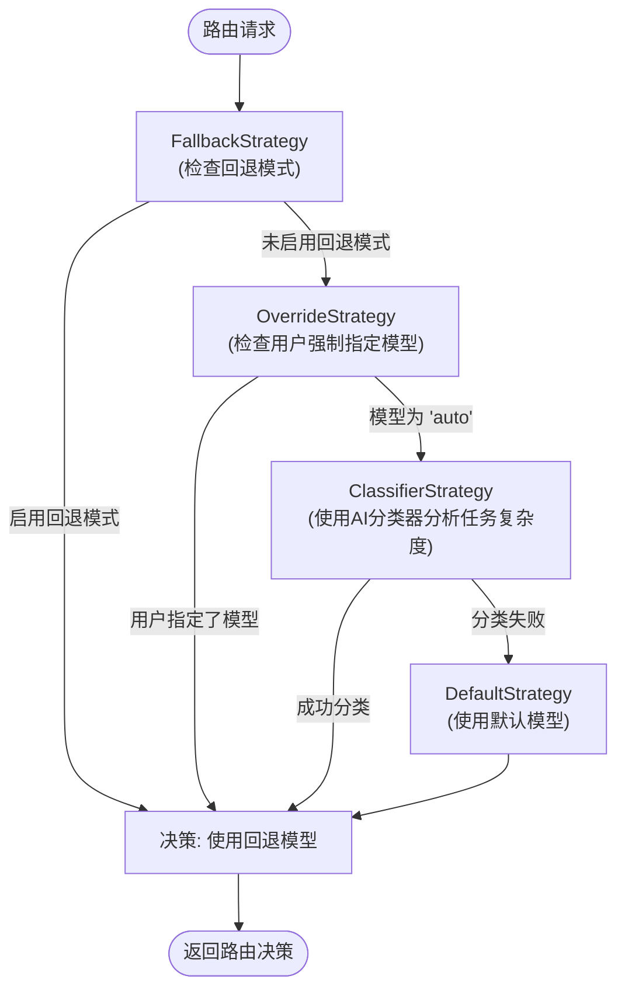

# 核心功能详解

<cite>
**本文档引用的文件**
- [modelRouterService.ts](file://packages/core/src/routing/modelRouterService.ts)
- [classifierStrategy.ts](file://packages/core/src/routing/strategies/classifierStrategy.ts)
- [compositeStrategy.ts](file://packages/core/src/routing/strategies/compositeStrategy.ts)
- [fallbackStrategy.ts](file://packages/core/src/routing/strategies/fallbackStrategy.ts)
- [overrideStrategy.ts](file://packages/core/src/routing/strategies/overrideStrategy.ts)
- [defaultStrategy.ts](file://packages/core/src/routing/strategies/defaultStrategy.ts)
- [models.ts](file://packages/core/src/config/models.ts)
- [sessionSummaryService.ts](file://packages/core/src/services/sessionSummaryService.ts)
- [fileSystemService.ts](file://packages/core/src/services/fileSystemService.ts)
- [shellExecutionService.ts](file://packages/core/src/services/shellExecutionService.ts)
- [config.ts](file://packages/core/src/config/config.ts)
- [sessionUtils.ts](file://packages/core/utils/sessionUtils.ts)
</cite>

## 目录
1. [AI交互](#ai交互)
2. [工具系统](#工具系统)
3. [会话管理](#会话管理)

## AI交互

本节详细解释系统如何根据任务复杂度自动选择合适的Gemini模型。模型路由策略通过一个链式责任模式（Composite Strategy）实现，该模式按优先级顺序尝试多个路由策略。



**图示来源**
- [modelRouterService.ts](file://packages/core/src/routing/modelRouterService.ts#L38-L49)
- [compositeStrategy.ts](file://packages/core/src/routing/strategies/compositeStrategy.ts#L19-L35)
- [fallbackStrategy.ts](file://packages/core/src/routing/strategies/fallbackStrategy.ts#L16-L44)
- [overrideStrategy.ts](file://packages/core/src/routing/strategies/overrideStrategy.ts#L22-L45)
- [classifierStrategy.ts](file://packages/core/src/routing/strategies/classifierStrategy.ts#L130-L207)
- [defaultStrategy.ts](file://packages/core/src/routing/strategies/defaultStrategy.ts#L16-L33)

**AI交互部分的实现细节如下：**

1.  **回退策略 (Fallback Strategy)**：当系统处于回退模式时，此策略优先执行，强制使用一个更稳定的模型以保证服务可用性。
2.  **覆盖策略 (Override Strategy)**：如果用户通过配置明确指定了一个模型（非'auto'），此策略会直接返回该模型，绕过后续所有复杂度分析。
3.  **分类器策略 (Classifier Strategy)**：这是核心的智能路由逻辑。系统会调用一个专门的AI模型（Gemini Flash）来分析用户请求的复杂度。该模型根据预定义的复杂度标准（如操作步骤数、是否需要战略规划、调试深度等）判断任务是“简单”还是“复杂”，并据此选择`gemini-2.5-flash`或`gemini-2.5-pro`模型。
4.  **默认策略 (Default Strategy)**：如果以上所有策略均未返回决策（例如分类器调用失败），则作为兜底方案，使用默认的`gemini-2.5-pro`模型。

此外，系统还包含一个统一的预览模型升级逻辑。当决策为使用默认模型且预览功能已启用时，系统会自动将模型升级为`gemini-3.0-pro`（预览版），以探索新模型的性能。

**本节来源**
- [modelRouterService.ts](file://packages/core/src/routing/modelRouterService.ts#L29-L127)
- [classifierStrategy.ts](file://packages/core/src/routing/strategies/classifierStrategy.ts#L35-L107)
- [models.ts](file://packages/core/src/config/models.ts)

## 工具系统

本节详细介绍内置工具的实现和使用，包括文件系统、shell执行和web搜索工具。这些工具的执行受到严格的安全策略和执行上下文的控制。

### 文件系统工具

文件系统工具通过`FileSystemService`接口实现，提供了读写文件的基本功能。该设计允许在不同环境下使用不同的实现，例如标准的`StandardFileSystemService`。


**图示来源**
- [fileSystemService.ts](file://packages/core/src/services/fileSystemService.ts#L12-L41)

### Shell执行工具

Shell执行工具通过`ShellExecutionService`实现，它是一个高度复杂的组件，负责安全地执行shell命令并捕获输出。该服务优先使用`node-pty`库来创建一个伪终端（PTY），以获得最真实的shell体验和完整的ANSI转义序列支持。如果PTY创建失败（例如在沙箱环境中），则会优雅地降级到使用Node.js的`child_process`模块。


**图示来源**
- [shellExecutionService.ts](file://packages/core/src/services/shellExecutionService.ts#L209-L800)
- [getPty.js](file://packages/core/utils/getPty.js)

**安全考虑和执行上下文：**
- **环境变量清理**：在CI/CD环境（如GitHub Actions）中，系统会清理环境变量，只保留必要的系统变量，以防止敏感信息泄露。
- **信号处理**：通过`AbortSignal`可以安全地中止正在运行的命令及其所有子进程。
- **二进制检测**：系统会检测输出是否为二进制流，并相应地调整处理方式，避免尝试解析二进制数据为文本。
- **缓冲区限制**：对输出缓冲区大小进行了限制（16MB），防止内存耗尽。

**本节来源**
- [shellExecutionService.ts](file://packages/core/src/services/shellExecutionService.ts#L1-L800)
- [fileSystemService.ts](file://packages/core/src/services/fileSystemService.ts)
- [config.ts](file://packages/core/src/config/config.ts)

## 会话管理

本节说明会话的创建、保存、恢复和检查点机制，以及会话数据的存储格式和位置。

### 会话生命周期

会话管理的核心是`SessionSummaryService`，它负责生成会话摘要。会话的创建和保存通常由上层应用逻辑触发，而检查点机制则用于定期持久化会话状态。

```mermaid
flowchart LR
A[用户开始新会话] --> B[初始化会话上下文]
B --> C[用户与AI交互]
C --> D{是否达到检查点条件?}
D -- 是 --> E[调用SessionSummaryService生成摘要]
E --> F[将完整会话数据(含摘要)持久化到磁盘]
F --> C
D -- 否 --> C
G[用户恢复会话] --> H[从磁盘加载会话数据]
H --> I[重建会话上下文]
I --> C
```

**图示来源**
- [sessionSummaryService.ts](file://packages/core/src/services/sessionSummaryService.ts#L46-L162)
- [sessionUtils.ts](file://packages/core/utils/sessionUtils.ts)

### 会话数据存储

会话数据的存储格式主要包含完整的对话记录（`MessageRecord`数组）和一个由AI生成的摘要。`SessionSummaryService`在生成摘要时，会从对话历史中提取用户和AI的消息，应用滑动窗口算法（取前N条和后N条）来选择最相关的上下文，然后将其格式化为一个提示词，发送给Gemini Flash模型进行摘要生成。

**会话数据存储位置**由配置系统决定，通常位于用户的主目录下的一个隐藏配置文件夹中（例如`~/.gemini-cli/sessions/`）。每个会话以唯一的ID保存为一个独立的JSON文件。

**高级用例：构建复杂的多步骤工作流**
通过结合会话管理和工具系统，可以构建复杂的多步骤工作流。例如，一个工作流可以是：
1.  **分析**：用户请求“重构这个模块”。
2.  **规划**：AI使用`list_directory`和`read_file`工具分析代码结构。
3.  **执行**：AI生成重构计划，并通过`edit`工具在多个文件中进行修改。
4.  **验证**：AI运行`run_shell_command`执行测试。
5.  **总结**：工作流结束时，`SessionSummaryService`自动生成一个摘要，如“重构了用户认证模块，提高了代码可维护性”。

整个工作流的状态被完整地记录在会话中，允许用户随时中断并在之后精确地恢复到中断点。

**本节来源**
- [sessionSummaryService.ts](file://packages/core/src/services/sessionSummaryService.ts#L1-L163)
- [sessionUtils.ts](file://packages/core/utils/sessionUtils.ts)
- [config.ts](file://packages/core/src/config/config.ts)