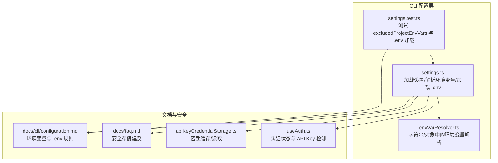
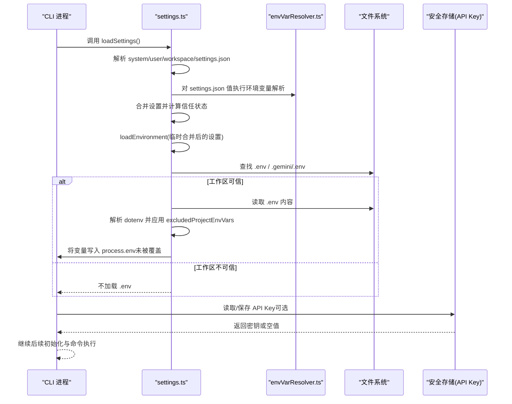
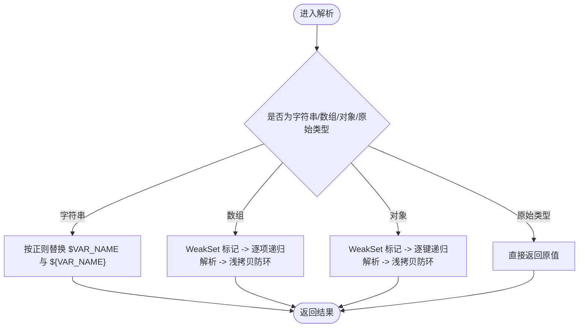
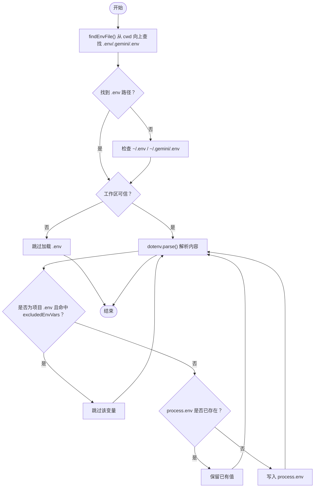
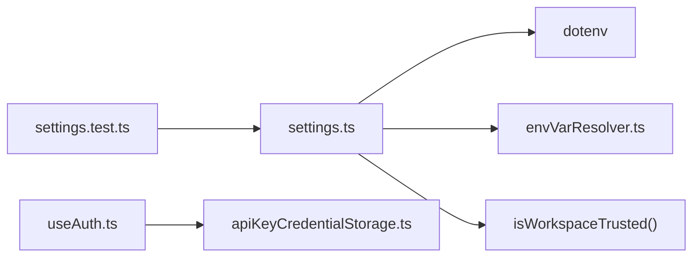

# 环境变量

<cite>
**本文引用的文件**
- [packages/cli/src/config/settings.ts](file://packages/cli/src/config/settings.ts)
- [packages/cli/src/utils/envVarResolver.ts](file://packages/cli/src/utils/envVarResolver.ts)
- [packages/cli/src/config/settings.test.ts](file://packages/cli/src/config/settings.test.ts)
- [docs/cli/configuration.md](file://docs/cli/configuration.md)
- [docs/faq.md](file://docs/faq.md)
- [packages/core/src/core/apiKeyCredentialStorage.ts](file://packages/core/src/core/apiKeyCredentialStorage.ts)
- [packages/cli/src/ui/auth/useAuth.ts](file://packages/cli/src/ui/auth/useAuth.ts)
</cite>

## 目录
1. [简介](#简介)
2. [项目结构](#项目结构)
3. [核心组件](#核心组件)
4. [架构总览](#架构总览)
5. [详细组件分析](#详细组件分析)
6. [依赖关系分析](#依赖关系分析)
7. [性能考量](#性能考量)
8. [故障排查指南](#故障排查指南)
9. [结论](#结论)
10. [附录](#附录)

## 简介
本章节系统性阐述 Gemini CLI 中与“环境变量”相关的配置方法与行为，包括：
- 受支持的环境变量清单与用途、格式与示例
- .env 文件的自动加载机制与搜索顺序
- excludedProjectEnvVars 配置项如何防止项目特定环境变量干扰 CLI 行为
- 使用环境变量管理敏感信息（如 API 密钥）的最佳实践

## 项目结构
围绕环境变量与 .env 加载的关键实现位于 CLI 包中，主要涉及以下模块：
- 配置加载与合并：settings.ts
- 环境变量解析器：envVarResolver.ts
- 测试用例与集成验证：settings.test.ts
- 文档化说明：docs/cli/configuration.md、docs/faq.md
- 敏感信息存储与认证流程：packages/core/src/core/apiKeyCredentialStorage.ts、packages/cli/src/ui/auth/useAuth.ts

图表来源
- [packages/cli/src/config/settings.ts](file://packages/cli/src/config/settings.ts#L550-L749)
- [packages/cli/src/utils/envVarResolver.ts](file://packages/cli/src/utils/envVarResolver.ts#L1-L127)
- [packages/cli/src/config/settings.test.ts](file://packages/cli/src/config/settings.test.ts#L368-L1710)
- [docs/cli/configuration.md](file://docs/cli/configuration.md#L437-L548)
- [docs/faq.md](file://docs/faq.md#L85-L123)
- [packages/core/src/core/apiKeyCredentialStorage.ts](file://packages/core/src/core/apiKeyCredentialStorage.ts#L1-L73)
- [packages/cli/src/ui/auth/useAuth.ts](file://packages/cli/src/ui/auth/useAuth.ts#L47-L89)

章节来源
- [packages/cli/src/config/settings.ts](file://packages/cli/src/config/settings.ts#L550-L749)
- [packages/cli/src/utils/envVarResolver.ts](file://packages/cli/src/utils/envVarResolver.ts#L1-L127)
- [packages/cli/src/config/settings.test.ts](file://packages/cli/src/config/settings.test.ts#L368-L1710)
- [docs/cli/configuration.md](file://docs/cli/configuration.md#L437-L548)
- [docs/faq.md](file://docs/faq.md#L85-L123)
- [packages/core/src/core/apiKeyCredentialStorage.ts](file://packages/core/src/core/apiKeyCredentialStorage.ts#L1-L73)
- [packages/cli/src/ui/auth/useAuth.ts](file://packages/cli/src/ui/auth/useAuth.ts#L47-L89)

## 核心组件
- 环境变量解析器：支持在字符串与嵌套对象中解析 $VAR_NAME 与 ${VAR_NAME} 占位符，保留未定义占位符，避免循环引用导致的无限递归。
- .env 自动加载：按“当前目录 -> 向上搜索 -> 家目录”的顺序查找 .env 或 .gemini/.env；项目级 .env 默认排除 DEBUG/DEBUG_MODE，可通过 excludedProjectEnvVars 自定义。
- 设置合并与信任：先合并 settings.json，再解析环境变量，最后加载 .env；仅在工作区可信时才加载 .env。
- 敏感信息存储：API Key 支持从进程环境或安全存储中读取，并在 UI 认证流程中检测与提示。

章节来源
- [packages/cli/src/utils/envVarResolver.ts](file://packages/cli/src/utils/envVarResolver.ts#L1-L127)
- [packages/cli/src/config/settings.ts](file://packages/cli/src/config/settings.ts#L550-L749)
- [packages/cli/src/config/settings.test.ts](file://packages/cli/src/config/settings.test.ts#L368-L1710)
- [packages/core/src/core/apiKeyCredentialStorage.ts](file://packages/core/src/core/apiKeyCredentialStorage.ts#L1-L73)
- [packages/cli/src/ui/auth/useAuth.ts](file://packages/cli/src/ui/auth/useAuth.ts#L47-L89)

## 架构总览
下图展示从启动到运行期间，环境变量与 .env 的加载与生效路径。

图表来源
- [packages/cli/src/config/settings.ts](file://packages/cli/src/config/settings.ts#L550-L749)
- [packages/cli/src/utils/envVarResolver.ts](file://packages/cli/src/utils/envVarResolver.ts#L1-L127)
- [packages/core/src/core/apiKeyCredentialStorage.ts](file://packages/core/src/core/apiKeyCredentialStorage.ts#L1-L73)

## 详细组件分析

### 环境变量解析器（字符串与对象）
- 功能要点
  - 字符串解析：支持 $VAR_NAME 与 ${VAR_NAME} 两种语法，未定义时保持原样。
  - 对象解析：递归遍历字符串、数组、对象，保留布尔/数字等原始类型；对循环引用进行浅拷贝保护。
  - 自定义环境源：支持传入 customEnv 作为优先级更高的变量源。
- 复杂度与性能
  - 时间复杂度：与对象大小线性相关；对数组/对象采用 WeakSet 防止重复访问。
  - 空间复杂度：生成新对象副本，避免修改输入。
- 典型用法
  - 在 settings.json 中使用占位符引用环境变量，加载时统一解析。

图表来源
- [packages/cli/src/utils/envVarResolver.ts](file://packages/cli/src/utils/envVarResolver.ts#L1-L127)

章节来源
- [packages/cli/src/utils/envVarResolver.ts](file://packages/cli/src/utils/envVarResolver.ts#L1-L127)

### .env 自动加载与搜索顺序
- 搜索顺序
  - 当前工作目录下的 .env
  - 向父目录逐级查找，直到遇到项目根（由 .git 标识）或家目录
  - 若仍未找到，则加载用户家目录下的 ~/.env
- 加载策略
  - 仅在工作区可信时加载 .env
  - 项目级 .env 默认排除 DEBUG/DEBUG_MODE；可通过 advanced.excludedEnvVars 自定义
  - 仅当 process.env 中不存在同名变量时才写入
  - Cloud Shell 环境下对 GOOGLE_CLOUD_PROJECT 有特殊默认处理
- 关键实现位置
  - .env 查找与加载逻辑：[packages/cli/src/config/settings.ts](file://packages/cli/src/config/settings.ts#L499-L590)
  - Cloud Shell 特殊处理：[packages/cli/src/config/settings.ts](file://packages/cli/src/config/settings.ts#L528-L548)

图表来源
- [packages/cli/src/config/settings.ts](file://packages/cli/src/config/settings.ts#L499-L590)

章节来源
- [packages/cli/src/config/settings.ts](file://packages/cli/src/config/settings.ts#L499-L590)

### excludedProjectEnvVars 配置项
- 默认排除列表
  - 默认排除 DEBUG 与 DEBUG_MODE，避免项目 .env 干扰 CLI 行为。
- 自定义排除
  - 可通过 settings.json 的 advanced.excludedEnvVars 指定额外变量名，支持用户与工作区设置合并。
- 行为验证
  - 测试覆盖了用户/工作区设置合并、去重、以及默认值与自定义值的优先级。

章节来源
- [packages/cli/src/config/settings.ts](file://packages/cli/src/config/settings.ts#L61-L63)
- [packages/cli/src/config/settings.test.ts](file://packages/cli/src/config/settings.test.ts#L368-L1710)
- [docs/cli/configuration.md](file://docs/cli/configuration.md#L350-L360)

### 受支持的环境变量与用途
以下变量在文档中有明确说明，适用于不同场景（认证、模型选择、代理、沙箱、调试、Telemetry 等）。请根据实际需要选择合适的变量并遵循安全实践。

- 认证与模型
  - GEMINI_API_KEY：必需，用于 Gemini API 认证
  - GEMINI_MODEL：默认模型名称，覆盖硬编码默认值
  - GEMINI_API_KEY_AUTH_MECHANISM：发送 API Key 的方式（x-goog-api-key 或 bearer）
  - GOOGLE_API_KEY：Vertex AI express 模式所需
  - GOOGLE_CLOUD_PROJECT：Code Assist 或 Vertex AI 所需；Cloud Shell 下有特殊默认处理
  - GOOGLE_APPLICATION_CREDENTIALS：Google 应用凭据文件路径
  - OTLP_GOOGLE_CLOUD_PROJECT：Telemetry 在 GCP 的项目 ID
  - GOOGLE_CLOUD_LOCATION：Vertex AI 非 express 模式所需

- 请求头与代理
  - GEMINI_CLI_CUSTOM_HEADERS：为 Gemini API/Code Assist 请求添加额外 HTTP 头，逗号分隔的 Name: value 列表
  - HTTP_PROXY / HTTPS_PROXY：出站请求代理

- 沙箱与调试
  - GEMINI_SANDBOX：替代 settings.json 的 sandbox 设置，支持 true/false/docker/podman/自定义命令
  - SEATBELT_PROFILE（macOS）：Seatbelt profile 切换
  - DEBUG / DEBUG_MODE：底层库或 CLI 自身的调试开关（默认从项目 .env 排除）

- 输出与标题
  - NO_COLOR：禁用 CLI 输出颜色
  - CLI_TITLE：自定义 CLI 标题

- 系统提示与开发辅助
  - CODE_ASSIST_ENDPOINT：Code Assist 服务端点
  - GEMINI_SYSTEM_MD：以 Markdown 文件覆盖基础系统提示
  - GEMINI_WRITE_SYSTEM_MD：将默认系统提示写入文件（可覆写）

- 其他
  - GEMINI_CONFIG_DIR：配置目录（用于 .gemini/.env 优先级判断）

章节来源
- [docs/cli/configuration.md](file://docs/cli/configuration.md#L458-L548)

### 敏感信息（API 密钥）配置最佳实践
- 存储建议
  - 使用项目 .gemini/.env 存放密钥，避免提交到版本控制
  - 更高的安全性可使用系统密钥链/凭证管理工具，脚本在运行时动态加载
- 读取优先级
  - 运行时优先读取 process.env 中的 GEMINI_API_KEY；若为空则尝试安全存储中的缓存密钥
- UI 提示
  - 当检测到已有 GEMINI_API_KEY 时，认证对话会提示用户选择“Gemini API Key”选项以复用现有密钥

章节来源
- [docs/faq.md](file://docs/faq.md#L85-L123)
- [packages/core/src/core/apiKeyCredentialStorage.ts](file://packages/core/src/core/apiKeyCredentialStorage.ts#L1-L73)
- [packages/cli/src/ui/auth/useAuth.ts](file://packages/cli/src/ui/auth/useAuth.ts#L47-L89)

## 依赖关系分析
- 模块耦合
  - settings.ts 依赖 dotenv 进行 .env 解析，依赖 envVarResolver.ts 对 settings.json 值进行占位符解析
  - settings.test.ts 通过模拟文件系统与 process.env 验证 excludedProjectEnvVars 与 .env 加载行为
  - useAuth.ts 与 apiKeyCredentialStorage.ts 协作，实现密钥读取与 UI 提示
- 外部依赖
  - dotenv：解析 .env 文件
  - node:fs/path/process：文件系统、路径解析与进程环境

图表来源
- [packages/cli/src/config/settings.ts](file://packages/cli/src/config/settings.ts#L1-L40)
- [packages/cli/src/utils/envVarResolver.ts](file://packages/cli/src/utils/envVarResolver.ts#L1-L127)
- [packages/cli/src/config/settings.test.ts](file://packages/cli/src/config/settings.test.ts#L368-L1710)
- [packages/core/src/core/apiKeyCredentialStorage.ts](file://packages/core/src/core/apiKeyCredentialStorage.ts#L1-L73)
- [packages/cli/src/ui/auth/useAuth.ts](file://packages/cli/src/ui/auth/useAuth.ts#L47-L89)

章节来源
- [packages/cli/src/config/settings.ts](file://packages/cli/src/config/settings.ts#L1-L40)
- [packages/cli/src/utils/envVarResolver.ts](file://packages/cli/src/utils/envVarResolver.ts#L1-L127)
- [packages/cli/src/config/settings.test.ts](file://packages/cli/src/config/settings.test.ts#L368-L1710)
- [packages/core/src/core/apiKeyCredentialStorage.ts](file://packages/core/src/core/apiKeyCredentialStorage.ts#L1-L73)
- [packages/cli/src/ui/auth/useAuth.ts](file://packages/cli/src/ui/auth/useAuth.ts#L47-L89)

## 性能考量
- 环境变量解析
  - 字符串解析为 O(n)（n 为字符串长度），对象解析为 O(N)（N 为节点数），WeakSet 防环避免重复遍历
- .env 加载
  - 文件读取与 dotenv.parse 为 O(F)（F 为 .env 文件大小），变量写入 process.env 为 O(V)（V 为变量数量）
- 建议
  - 将大型 settings.json 中的敏感字段使用占位符，减少不必要的字符串处理
  - 控制 excludedEnvVars 列表规模，避免过多变量导致 .env 解析开销

[本节为通用指导，不直接分析具体文件]

## 故障排查指南
- 问题：DEBUG/DEBUG_MODE 干扰 CLI 行为
  - 现象：项目 .env 中设置了 DEBUG/DEBUG_MODE 后出现异常日志级别或行为变化
  - 处理：确认 advanced.excludedEnvVars 是否包含对应变量；必要时调整为更严格的排除列表
  - 参考：[packages/cli/src/config/settings.ts](file://packages/cli/src/config/settings.ts#L61-L63)、[packages/cli/src/config/settings.test.ts](file://packages/cli/src/config/settings.test.ts#L1570-L1710)
- 问题：API 密钥未生效
  - 现象：GEMINI_API_KEY 已设置但认证失败
  - 处理：检查 process.env 是否存在；若为空，确认安全存储中是否有缓存密钥；查看 UI 提示是否要求选择“Gemini API Key”
  - 参考：[packages/cli/src/ui/auth/useAuth.ts](file://packages/cli/src/ui/auth/useAuth.ts#L47-L89)、[packages/core/src/core/apiKeyCredentialStorage.ts](file://packages/core/src/core/apiKeyCredentialStorage.ts#L1-L73)
- 问题：.env 未被加载
  - 现象：项目 .env 中的变量未生效
  - 处理：确认工作区是否可信；确认 .env 路径是否正确；检查 excludedEnvVars 是否排除了目标变量；确认 process.env 中是否已存在同名变量
  - 参考：[packages/cli/src/config/settings.ts](file://packages/cli/src/config/settings.ts#L550-L590)

章节来源
- [packages/cli/src/config/settings.ts](file://packages/cli/src/config/settings.ts#L550-L590)
- [packages/cli/src/config/settings.test.ts](file://packages/cli/src/config/settings.test.ts#L1570-L1710)
- [packages/cli/src/ui/auth/useAuth.ts](file://packages/cli/src/ui/auth/useAuth.ts#L47-L89)
- [packages/core/src/core/apiKeyCredentialStorage.ts](file://packages/core/src/core/apiKeyCredentialStorage.ts#L1-L73)

## 结论
- Gemini CLI 对环境变量与 .env 的支持完善：既允许在 settings.json 中使用占位符引用环境变量，也支持在运行时从 .env 文件加载变量，并提供灵活的排除策略
- excludedProjectEnvVars 有效避免项目特定变量干扰 CLI 行为，同时保留 .gemini/.env 的完全控制权
- 敏感信息（API 密钥）应结合 .env 与系统密钥存储使用，配合 UI 提示与安全存储读取，提升整体安全性

[本节为总结性内容，不直接分析具体文件]

## 附录
- 受支持的环境变量清单与用途、格式与示例，请参阅：
  - [docs/cli/configuration.md](file://docs/cli/configuration.md#L458-L548)
- 安全存储建议与 FAQ：
  - [docs/faq.md](file://docs/faq.md#L85-L123)

[本节为补充说明，不直接分析具体文件]