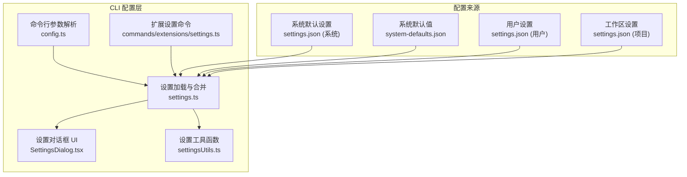
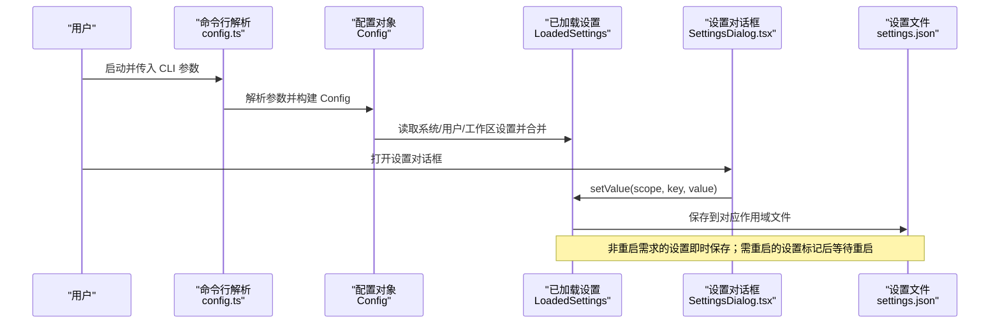
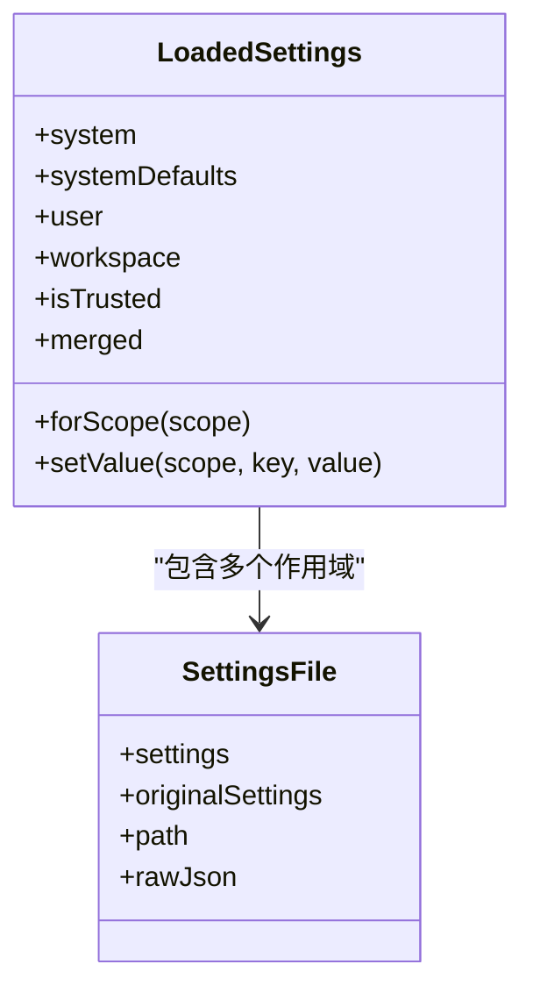
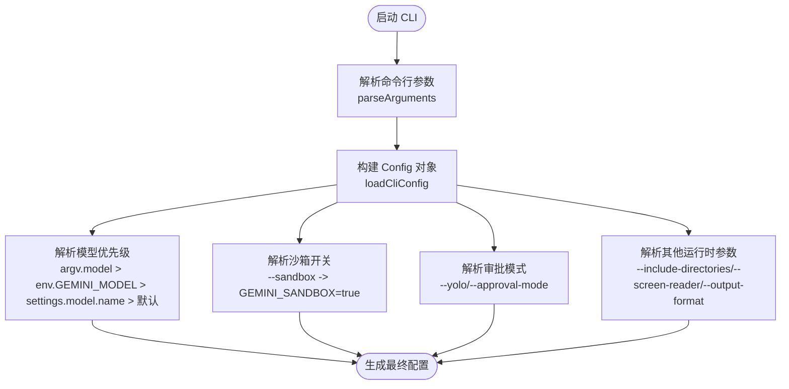
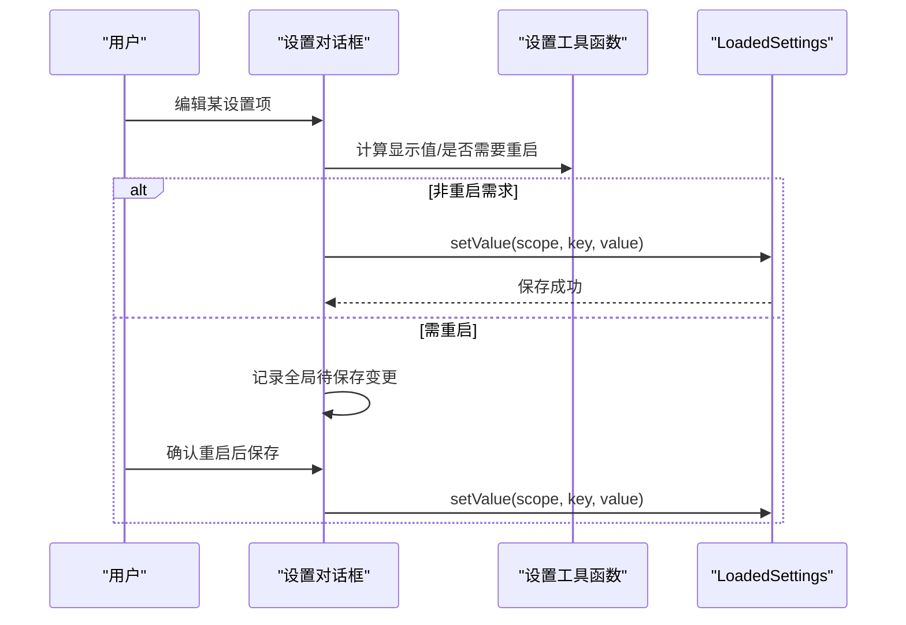
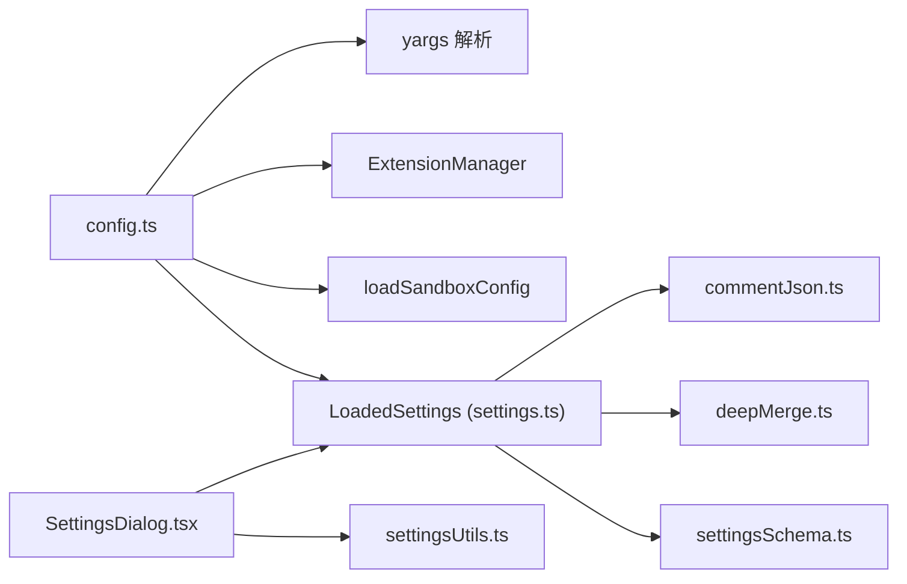

# 运行时配置

<cite>
**本文引用的文件**
- [settings.ts](file://packages/cli/src/config/settings.ts)
- [config.ts](file://packages/cli/src/config/config.ts)
- [settings.ts（扩展）](file://packages/cli/src/commands/extensions/settings.ts)
- [settingsUtils.ts](file://packages/cli/src/utils/settingsUtils.ts)
- [SettingsDialog.tsx](file://packages/cli/src/ui/components/SettingsDialog.tsx)
- [settings.schema.json](file://schemas/settings.schema.json)
- [configuration.md](file://docs/cli/configuration.md)
- [settings.test.ts](file://packages/cli/src/config/settings.test.ts)
- [config.test.ts](file://packages/cli/src/config/config.test.ts)
</cite>

## 目录
1. [简介](#简介)
2. [项目结构与范围](#项目结构与范围)
3. [核心组件](#核心组件)
4. [架构总览](#架构总览)
5. [详细组件分析](#详细组件分析)
6. [依赖关系分析](#依赖关系分析)
7. [性能与可用性考量](#性能与可用性考量)
8. [故障排查指南](#故障排查指南)
9. [结论](#结论)
10. [附录：命令参考与持久化行为](#附录命令参考与持久化行为)

## 简介
本篇文档聚焦于“运行时配置”的设计与实践，围绕以下目标展开：
- 如何在运行时动态修改配置（以 `/settings` 命令为例，涵盖查看、设置、重置等操作）
- 命令行参数（如 `--model`、`--sandbox`、`--yolo` 等）如何覆盖配置文件设置
- 快速测试与临时配置调整的建议流程
- 配置持久化行为说明（命令行参数仅对当前会话有效；`/settings` 更改通常持久化到配置文件）

## 项目结构与范围
本仓库中与“运行时配置”直接相关的核心模块包括：
- 配置加载与合并：settings.ts
- 命令行解析与运行时覆盖：config.ts
- 设置对话框与交互式修改：SettingsDialog.tsx
- 设置工具函数与持久化写入：settingsUtils.ts、settings.ts（保存逻辑）
- 扩展设置命令：commands/extensions/settings.ts
- 设置模式定义与分类：settings.schema.json
- 文档与示例：docs/cli/configuration.md

图表来源
- [config.ts](file://packages/cli/src/config/config.ts#L381-L680)
- [settings.ts](file://packages/cli/src/config/settings.ts#L410-L473)
- [settingsUtils.ts](file://packages/cli/src/utils/settingsUtils.ts#L387-L418)
- [SettingsDialog.tsx](file://packages/cli/src/ui/components/SettingsDialog.tsx#L233-L432)
- [settings.ts（扩展）](file://packages/cli/src/commands/extensions/settings.ts#L145-L159)

章节来源
- [config.ts](file://packages/cli/src/config/config.ts#L381-L680)
- [settings.ts](file://packages/cli/src/config/settings.ts#L410-L473)

## 核心组件
- 配置加载与合并（LoadedSettings）：负责从系统、系统默认、用户、工作区等多源加载并合并设置，支持信任目录下的安全合并策略。
- 命令行解析（parseArguments/loadCliConfig）：解析 CLI 参数，提供运行时覆盖能力，并将参数映射为 Config 对象。
- 设置对话框（SettingsDialog）：提供交互界面，允许用户在不同作用域（用户/工作区）内查看、编辑、保存设置。
- 设置工具函数（settingsUtils）：提供设置键校验、默认值获取、重启需求判断、显示值计算、保存逻辑等。
- 扩展设置命令（extensions/settings）：面向扩展的设置查看与设置命令，支持按作用域设置。

章节来源
- [settings.ts](file://packages/cli/src/config/settings.ts#L410-L473)
- [config.ts](file://packages/cli/src/config/config.ts#L381-L680)
- [settingsUtils.ts](file://packages/cli/src/utils/settingsUtils.ts#L303-L418)
- [SettingsDialog.tsx](file://packages/cli/src/ui/components/SettingsDialog.tsx#L233-L432)
- [settings.ts（扩展）](file://packages/cli/src/commands/extensions/settings.ts#L145-L159)

## 架构总览
下图展示了“运行时配置”的关键交互路径：命令行参数优先级高于配置文件；设置对话框与扩展设置命令通过 LoadedSettings 的 setValue 触发持久化写入；设置模式由 settings.schema.json 定义并影响 UI 行为。

图表来源
- [config.ts](file://packages/cli/src/config/config.ts#L381-L680)
- [settings.ts](file://packages/cli/src/config/settings.ts#L490-L496)
- [settingsUtils.ts](file://packages/cli/src/utils/settingsUtils.ts#L387-L418)
- [SettingsDialog.tsx](file://packages/cli/src/ui/components/SettingsDialog.tsx#L233-L432)

## 详细组件分析

### 组件一：配置加载与合并（LoadedSettings）
- 多源加载与合并顺序（信任目录安全策略）：
  - 系统默认（SystemDefaults）
  - 用户（User）
  - 工作区（Workspace，仅在受信任目录生效）
  - 系统（System）
- 支持嵌套路径的深度合并与迁移（V1→V2），并保留注释格式。
- 提供 setValue(scope, key, value) 接口，立即更新内存合并结果并持久化到对应作用域文件。

图表来源
- [settings.ts](file://packages/cli/src/config/settings.ts#L434-L496)

章节来源
- [settings.ts](file://packages/cli/src/config/settings.ts#L410-L473)
- [settings.ts](file://packages/cli/src/config/settings.ts#L490-L496)

### 组件二：命令行参数解析与运行时覆盖（parseArguments/loadCliConfig）
- 解析 CLI 参数，支持模型选择、沙箱、YOLO 模式、输出格式、扩展列表、会话控制等。
- 运行时覆盖优先级（以模型为例）：
  - argv.model > 环境变量 GEMINI_MODEL > settings.model.name > 默认模型
- 其他运行时覆盖示例：
  - --sandbox → 设置环境变量 GEMINI_SANDBOX=true
  - --yolo 或 --approval-mode=yolo → 覆盖 approvalMode 并可能触发安全限制
  - --include-directories → 合并到 includeDirectories
  - --screen-reader → 覆盖 accessibility.screenReader
  - --output-format → 覆盖 output.format

图表来源
- [config.ts](file://packages/cli/src/config/config.ts#L381-L680)

章节来源
- [config.ts](file://packages/cli/src/config/config.ts#L381-L680)
- [configuration.md](file://docs/cli/configuration.md#L555-L607)

### 组件三：设置对话框与交互式修改（SettingsDialog）
- 支持在用户/工作区作用域内浏览与编辑设置。
- 即时保存非重启需求的设置；对需要重启的设置，记录全局待保存变更并在确认后统一持久化。
- 显示值计算考虑了“是否在当前作用域设置”、“是否与默认值一致”、“是否有未保存的待定变更”。

图表来源
- [SettingsDialog.tsx](file://packages/cli/src/ui/components/SettingsDialog.tsx#L233-L432)
- [settingsUtils.ts](file://packages/cli/src/utils/settingsUtils.ts#L387-L418)
- [settings.ts](file://packages/cli/src/config/settings.ts#L490-L496)

章节来源
- [SettingsDialog.tsx](file://packages/cli/src/ui/components/SettingsDialog.tsx#L233-L432)
- [settingsUtils.ts](file://packages/cli/src/utils/settingsUtils.ts#L387-L418)

### 组件四：扩展设置命令（extensions/settings）
- 提供子命令用于查看与设置扩展的配置项，支持指定作用域（用户/工作区）。
- 通过扩展配置加载器与作用域环境变量读取，展示合并后的设置值。

章节来源
- [settings.ts（扩展）](file://packages/cli/src/commands/extensions/settings.ts#L145-L159)

### 组件五：设置模式与分类（settings.schema.json）
- 定义所有可配置项的类型、默认值、分类、是否需要重启等元数据。
- UI 层根据该模式决定显示、验证与提示（如“Requires restart”）。

章节来源
- [settings.schema.json](file://schemas/settings.schema.json#L1-L200)

## 依赖关系分析
- 配置加载依赖：
  - settings.ts 依赖 settingsSchema.ts、commentJson.ts（格式保持）、deepMerge.ts（深度合并）
  - config.ts 依赖 yargs 解析、ExtensionManager、loadSandboxConfig 等
- UI 依赖：
  - SettingsDialog.tsx 依赖 settingsUtils.ts、dialogScopeUtils.ts、keyMatchers.ts 等
- 测试覆盖：
  - settings.test.ts 覆盖 saveSettings 的目录创建、错误反馈
  - config.test.ts 覆盖冲突参数（如 --yolo 与 --approval-mode）的校验

图表来源
- [config.ts](file://packages/cli/src/config/config.ts#L381-L680)
- [settings.ts](file://packages/cli/src/config/settings.ts#L410-L473)
- [SettingsDialog.tsx](file://packages/cli/src/ui/components/SettingsDialog.tsx#L1-L120)

章节来源
- [settings.test.ts](file://packages/cli/src/config/settings.test.ts#L2372-L2420)
- [config.test.ts](file://packages/cli/src/config/config.test.ts#L356-L391)

## 性能与可用性考量
- 合并策略与迁移：V1→V2 迁移采用深度合并与路径感知策略，避免重复写入与丢失注释，提升配置维护体验。
- 作用域安全：工作区设置仅在受信任目录生效，降低误用风险。
- UI 交互：非重启需求的设置即时保存，减少等待；需重启的设置集中处理，避免频繁磁盘 IO。
- 参数解析：命令行参数解析严格校验冲突组合（如 --yolo 与 --approval-mode），防止歧义配置。

## 故障排查指南
- 保存失败或权限问题
  - 现象：保存设置时报错或无变化
  - 排查：检查目标 settings.json 所在目录是否存在、权限是否足够；查看错误反馈事件
  - 参考：保存逻辑与错误反馈
- 作用域不生效
  - 现象：在不受信任目录下工作区设置未生效
  - 排查：确认工作区信任状态；仅在受信任目录下应用工作区设置
- 冲突参数导致启动失败
  - 现象：同时使用 --yolo 与 --approval-mode 抛出错误
  - 排查：遵循参数互斥规则，使用 --approval-mode=yolo 替代
- 模型选择不符合预期
  - 现象：--model 未生效
  - 排查：确认 argv.model 是否传入；检查环境变量 GEMINI_MODEL 与 settings.model.name 的优先级

章节来源
- [settings.ts](file://packages/cli/src/config/settings.ts#L817-L845)
- [settings.test.ts](file://packages/cli/src/config/settings.test.ts#L2372-L2420)
- [config.test.ts](file://packages/cli/src/config/config.test.ts#L356-L391)
- [config.ts](file://packages/cli/src/config/config.ts#L381-L680)

## 结论
- 运行时配置以“命令行参数优先、配置文件次之”的原则工作，适合快速测试与临时调整。
- 交互式设置通过 UI 即时保存非重启需求项，需重启项在确认后统一持久化，兼顾易用性与安全性。
- 建议：日常使用优先通过 `/settings` 修改配置文件，临时调试使用命令行参数；涉及安全与稳定性（如 YOLO 模式、沙箱）时，务必谨慎并理解其影响。

## 附录：命令参考与持久化行为

### /settings 命令使用指南
- 查看扩展设置
  - 用途：列出某个扩展的所有可配置项及其当前值与作用域
  - 位置：commands/extensions/settings.ts 中的 list 子命令
- 设置扩展设置
  - 用途：在用户或工作区作用域设置扩展配置项
  - 位置：commands/extensions/settings.ts 中的 set 子命令
- 交互式设置（UI）
  - 用途：在终端 UI 中浏览、编辑、保存设置
  - 位置：SettingsDialog.tsx
  - 关键行为：
    - 非重启需求项即时保存至对应作用域
    - 需重启项标记后等待重启时统一保存
    - 显示值考虑当前作用域、默认值与待定变更

章节来源
- [settings.ts（扩展）](file://packages/cli/src/commands/extensions/settings.ts#L145-L159)
- [SettingsDialog.tsx](file://packages/cli/src/ui/components/SettingsDialog.tsx#L233-L432)

### 命令行参数覆盖配置文件的机制
- 模型选择优先级（示例）：argv.model > 环境变量 GEMINI_MODEL > settings.model.name > 默认模型
- 沙箱与 YOLO：--sandbox 设置环境变量 GEMINI_SANDBOX=true；--yolo 或 --approval-mode=yolo 影响审批模式
- 输出格式：--output-format 覆盖 settings.output.format
- 其他：--include-directories 合并 includeDirectories；--screen-reader 覆盖 accessibility.screenReader

章节来源
- [config.ts](file://packages/cli/src/config/config.ts#L381-L680)
- [configuration.md](file://docs/cli/configuration.md#L555-L607)

### 持久化行为说明
- /settings 更改通常持久化到配置文件（用户或工作区作用域）
  - 非重启需求项即时写入
  - 需重启项在确认后统一写入
- 命令行参数仅对当前会话有效，不会写入配置文件
  - 示例：--model、--sandbox、--yolo、--output-format 等

章节来源
- [settings.ts](file://packages/cli/src/config/settings.ts#L817-L845)
- [settingsUtils.ts](file://packages/cli/src/utils/settingsUtils.ts#L387-L418)
- [configuration.md](file://docs/cli/configuration.md#L555-L607)