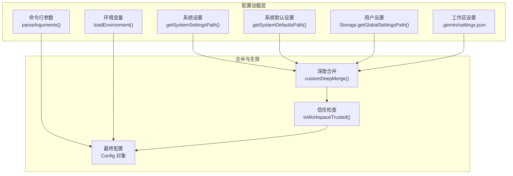
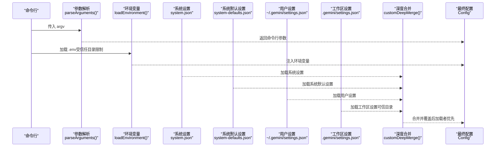
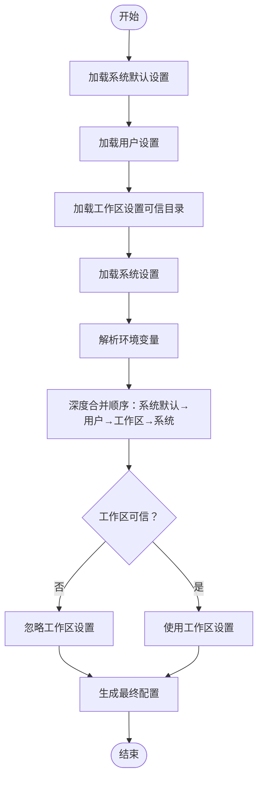
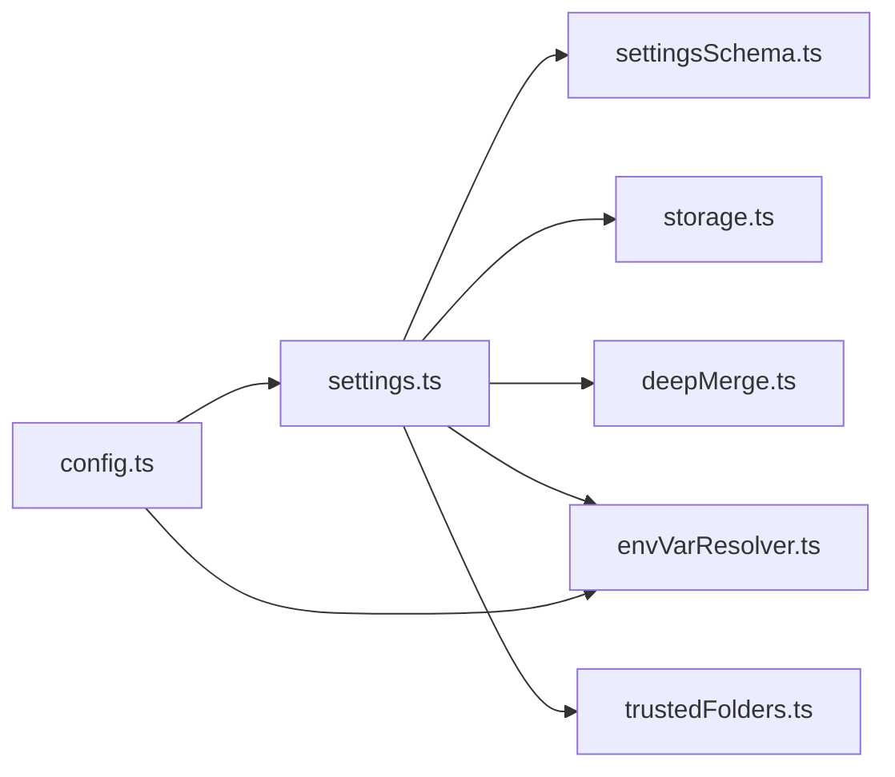

# 配置层级

<cite>
**本文引用的文件**
- [settings.ts](file://packages/cli/src/config/settings.ts)
- [settingsSchema.ts](file://packages/cli/src/config/settingsSchema.ts)
- [storage.ts](file://packages/core/src/config/storage.ts)
- [config.ts](file://packages/cli/src/config/config.ts)
- [envVarResolver.ts](file://packages/cli/src/utils/envVarResolver.ts)
- [deepMerge.ts](file://packages/cli/src/utils/deepMerge.ts)
- [settings.schema.json](file://schemas/settings.schema.json)
- [settingPaths.ts](file://packages/cli/src/config/settingPaths.ts)
- [trustedFolders.ts](file://packages/cli/src/config/trustedFolders.ts)
</cite>

## 目录
1. [简介](#简介)
2. [项目结构与配置入口](#项目结构与配置入口)
3. [核心组件与职责](#核心组件与职责)
4. [架构总览](#架构总览)
5. [详细组件分析](#详细组件分析)
6. [依赖关系分析](#依赖关系分析)
7. [性能与合并策略](#性能与合并策略)
8. [故障排查指南](#故障排查指南)
9. [结论](#结论)
10. [附录：优先级与路径对照表](#附录优先级与路径对照表)

## 简介
本文件面向系统管理员与终端用户，系统性阐述 Gemini CLI 的多层级配置体系与优先级规则。文档重点说明以下六层优先级顺序：
- 默认值（来自设置模式定义）
- 用户设置（~/.gemini/settings.json）
- 工作区设置（.gemini/settings.json）
- 系统设置（平台特定位置）
- 系统默认设置（system-defaults.json）
- 环境变量（运行时注入）
- 命令行参数（启动参数）

同时，文档解释每层的作用范围、文件路径来源、合并与覆盖机制，并给出企业环境下的集中管控建议。

## 项目结构与配置入口
- 配置加载入口位于配置模块，负责解析系统设置、用户设置、工作区设置、系统默认设置，并结合环境变量与命令行参数生成最终生效配置。
- 存储路径由核心存储类统一管理，确保跨平台一致性与可预测性。
- 设置模式与合并策略由设置模式定义与深度合并工具共同决定。

图表来源
- [settings.ts](file://packages/cli/src/config/settings.ts#L592-L789)
- [storage.ts](file://packages/core/src/config/storage.ts#L36-L71)
- [config.ts](file://packages/cli/src/config/config.ts#L381-L680)
- [envVarResolver.ts](file://packages/cli/src/utils/envVarResolver.ts#L1-L126)
- [deepMerge.ts](file://packages/cli/src/utils/deepMerge.ts#L1-L126)

章节来源
- [settings.ts](file://packages/cli/src/config/settings.ts#L592-L789)
- [storage.ts](file://packages/core/src/config/storage.ts#L36-L71)
- [config.ts](file://packages/cli/src/config/config.ts#L381-L680)

## 核心组件与职责
- 配置加载器（settings.ts）
  - 负责加载系统设置、系统默认设置、用户设置、工作区设置；解析并迁移旧版设置；应用环境变量替换；执行信任检查；计算合并后的最终设置。
- 存储路径（storage.ts）
  - 统一提供系统设置、用户设置、工作区设置的绝对路径，支持平台差异与环境变量覆盖。
- 模式与默认值（settingsSchema.ts, settings.schema.json）
  - 定义所有可用设置键、类型、默认值与合并策略，作为“默认值”来源。
- 环境变量解析（envVarResolver.ts）
  - 在设置加载后对对象进行环境变量占位符解析，保证运行时注入的变量生效。
- 深度合并（deepMerge.ts）
  - 实现按路径推导的合并策略（替换、浅合并、拼接、去重等），确保复杂对象与数组的正确合并。
- 命令行解析（config.ts）
  - 使用 yargs 解析命令行参数，提供模型名、输出格式、工具白名单、沙箱开关等运行时控制项。
- 可信目录（trustedFolders.ts）
  - 影响工作区设置是否参与合并（非可信目录下工作区设置被安全地忽略）。

章节来源
- [settings.ts](file://packages/cli/src/config/settings.ts#L1-L200)
- [settingsSchema.ts](file://packages/cli/src/config/settingsSchema.ts#L1-L120)
- [settings.schema.json](file://schemas/settings.schema.json#L1-L120)
- [envVarResolver.ts](file://packages/cli/src/utils/envVarResolver.ts#L1-L126)
- [deepMerge.ts](file://packages/cli/src/utils/deepMerge.ts#L1-L126)
- [config.ts](file://packages/cli/src/config/config.ts#L52-L120)
- [trustedFolders.ts](file://packages/cli/src/config/trustedFolders.ts#L1-L120)

## 架构总览
下图展示从输入到最终配置的全链路流程，包括优先级与覆盖关系。

图表来源
- [settings.ts](file://packages/cli/src/config/settings.ts#L592-L789)
- [config.ts](file://packages/cli/src/config/config.ts#L381-L680)
- [envVarResolver.ts](file://packages/cli/src/utils/envVarResolver.ts#L1-L126)

## 详细组件分析

### 六层优先级与覆盖规则
- 优先级顺序（从低到高，后者覆盖前者）：
  1) 系统默认设置（system-defaults.json）
  2) 用户设置（~/.gemini/settings.json）
  3) 工作区设置（.gemini/settings.json，仅在可信目录有效）
  4) 系统设置（平台特定位置）
  5) 环境变量（运行时注入，解析后生效）
  6) 命令行参数（启动参数，部分字段直接写入最终配置）
- 覆盖机制：
  - 字段级覆盖：同一键在更高优先级层出现时，完全覆盖低优先级层的值。
  - 数组与对象：
    - 默认策略为“替换”，可通过设置模式中的合并策略调整（如浅合并、拼接、去重）。
  - 可信目录影响：若当前工作区未被信任，工作区设置将不参与合并，相当于“不可见”。

章节来源
- [settings.ts](file://packages/cli/src/config/settings.ts#L409-L432)
- [settings.ts](file://packages/cli/src/config/settings.ts#L418-L431)
- [trustedFolders.ts](file://packages/cli/src/config/trustedFolders.ts#L207-L251)

### 文件路径与作用范围
- 系统默认设置（system-defaults.json）
  - 作用范围：全局系统级别，提供最低限度的默认值，供企业集中分发。
  - 路径来源：通过系统设置路径推导出同目录下的 system-defaults.json。
- 系统设置（platform-specific）
  - 作用范围：全局系统级别，用于企业集中管控与强制策略。
  - 路径来源：根据平台返回固定路径，或通过环境变量覆盖。
- 用户设置（~/.gemini/settings.json）
  - 作用范围：当前用户的个人偏好与本地配置。
  - 路径来源：核心存储类提供统一的用户目录与设置文件路径。
- 工作区设置（.gemini/settings.json）
  - 作用范围：当前项目范围内的团队共享配置。
  - 路径来源：工作区根目录下的 .gemini/settings.json。
- 环境变量（运行时）
  - 作用范围：临时覆盖单个或多个设置项，常用于 CI/CD 或容器化部署。
- 命令行参数（启动参数）
  - 作用范围：本次会话的即时控制，如模型选择、输出格式、工具白名单等。

章节来源
- [settings.ts](file://packages/cli/src/config/settings.ts#L138-L159)
- [settings.ts](file://packages/cli/src/config/settings.ts#L623-L700)
- [storage.ts](file://packages/core/src/config/storage.ts#L36-L71)
- [config.ts](file://packages/cli/src/config/config.ts#L52-L120)

### 合并与覆盖流程（代码级）
- 合并顺序（低优先级到高优先级）：
  - systemDefaults → user → workspace → system
- 合并策略：
  - 默认“替换”；可通过设置模式中的合并策略对特定路径进行定制（如浅合并、拼接、去重）。
- 环境变量解析：
  - 在设置加载完成后，对系统、系统默认、用户、工作区设置分别进行环境变量占位符解析，再进入合并阶段。
- 可信目录：
  - 若工作区未被信任，则跳过工作区设置，避免潜在风险。

图表来源
- [settings.ts](file://packages/cli/src/config/settings.ts#L409-L432)
- [settings.ts](file://packages/cli/src/config/settings.ts#L592-L789)
- [envVarResolver.ts](file://packages/cli/src/utils/envVarResolver.ts#L1-L126)
- [trustedFolders.ts](file://packages/cli/src/config/trustedFolders.ts#L207-L251)

章节来源
- [settings.ts](file://packages/cli/src/config/settings.ts#L409-L432)
- [settings.ts](file://packages/cli/src/config/settings.ts#L592-L789)
- [envVarResolver.ts](file://packages/cli/src/utils/envVarResolver.ts#L1-L126)
- [trustedFolders.ts](file://packages/cli/src/config/trustedFolders.ts#L207-L251)

### 命令行参数与环境变量的集成
- 命令行参数：
  - 通过 yargs 解析，提供模型名、输出格式、工具白名单、沙箱开关、交互模式等控制项。
  - 部分参数直接写入最终配置对象，不受设置文件覆盖。
- 环境变量：
  - 在设置加载后统一解析，支持 $VAR 与 ${VAR} 两种语法。
  - 支持排除列表（如调试相关变量），避免覆盖已存在的环境变量。

章节来源
- [config.ts](file://packages/cli/src/config/config.ts#L52-L120)
- [config.ts](file://packages/cli/src/config/config.ts#L381-L680)
- [envVarResolver.ts](file://packages/cli/src/utils/envVarResolver.ts#L1-L126)

### 设置模式与默认值
- 设置模式定义了所有可用键、类型、默认值与合并策略，是“默认值”的权威来源。
- JSON Schema 提供 IDE 自动补全与校验能力，确保配置文件结构正确。

章节来源
- [settingsSchema.ts](file://packages/cli/src/config/settingsSchema.ts#L1-L120)
- [settings.schema.json](file://schemas/settings.schema.json#L1-L120)

## 依赖关系分析
- 配置加载依赖于：
  - 存储路径（storage.ts）：提供系统设置、用户设置、工作区设置的绝对路径。
  - 深度合并（deepMerge.ts）：实现按路径推导的合并策略。
  - 环境变量解析（envVarResolver.ts）：在合并前完成变量替换。
  - 可信目录（trustedFolders.ts）：决定工作区设置是否参与合并。
  - 命令行解析（config.ts）：提供运行时控制项。

图表来源
- [settings.ts](file://packages/cli/src/config/settings.ts#L1-L120)
- [settingsSchema.ts](file://packages/cli/src/config/settingsSchema.ts#L1-L120)
- [storage.ts](file://packages/core/src/config/storage.ts#L36-L71)
- [deepMerge.ts](file://packages/cli/src/utils/deepMerge.ts#L1-L126)
- [envVarResolver.ts](file://packages/cli/src/utils/envVarResolver.ts#L1-L126)
- [trustedFolders.ts](file://packages/cli/src/config/trustedFolders.ts#L1-L120)
- [config.ts](file://packages/cli/src/config/config.ts#L381-L680)

章节来源
- [settings.ts](file://packages/cli/src/config/settings.ts#L1-L120)
- [storage.ts](file://packages/core/src/config/storage.ts#L36-L71)
- [deepMerge.ts](file://packages/cli/src/utils/deepMerge.ts#L1-L126)
- [envVarResolver.ts](file://packages/cli/src/utils/envVarResolver.ts#L1-L126)
- [trustedFolders.ts](file://packages/cli/src/config/trustedFolders.ts#L1-L120)
- [config.ts](file://packages/cli/src/config/config.ts#L381-L680)

## 性能与合并策略
- 合并复杂度：
  - 深度合并的时间复杂度与嵌套层级和键数量线性相关，但通过路径推导合并策略可减少不必要的递归。
- 策略选择：
  - 默认“替换”适合大多数场景；对于数组或对象，建议在设置模式中显式声明合并策略（如浅合并、拼接、去重），以获得更可控的行为。
- 运行时开销：
  - 环境变量解析在设置加载后进行，避免重复解析；可信目录检查仅在初始化阶段执行一次。

章节来源
- [deepMerge.ts](file://packages/cli/src/utils/deepMerge.ts#L1-L126)
- [settingsSchema.ts](file://packages/cli/src/config/settingsSchema.ts#L88-L120)

## 故障排查指南
- 常见问题与定位
  - 设置文件格式错误：加载器会在遇到无效 JSON 对象时记录错误并抛出致命配置错误，需修复对应文件。
  - 路径解析失败：系统设置与用户设置路径可能因符号链接或权限导致解析异常，应检查路径与权限。
  - 工作区设置未生效：若工作区未被信任，工作区设置会被忽略；请检查可信目录配置。
  - 环境变量未生效：确认 .env 文件存在且未被排除；检查变量名大小写与占位符语法。
  - 合并冲突：若期望数组或对象被“浅合并/拼接/去重”，请在设置模式中明确声明相应合并策略。
- 排查步骤
  - 查看加载器抛出的错误信息，定位具体文件与路径。
  - 使用设置模式中的默认值作为基准，逐层比对各层设置的实际值。
  - 在可信目录下验证工作区设置是否参与合并。

章节来源
- [settings.ts](file://packages/cli/src/config/settings.ts#L623-L700)
- [settings.ts](file://packages/cli/src/config/settings.ts#L752-L759)
- [trustedFolders.ts](file://packages/cli/src/config/trustedFolders.ts#L207-L251)
- [envVarResolver.ts](file://packages/cli/src/utils/envVarResolver.ts#L1-L126)

## 结论
Gemini CLI 的配置系统通过“系统默认设置 → 用户设置 → 工作区设置 → 系统设置 → 环境变量 → 命令行参数”的六层优先级，实现了从企业集中管控到个人定制的灵活覆盖。配合可信目录与深度合并策略，既能满足企业合规要求，又能保持良好的用户体验。建议在企业环境中优先使用系统默认设置与系统设置进行集中分发，并通过环境变量与命令行参数实现运行时微调。

## 附录：优先级与路径对照表
- 系统默认设置（system-defaults.json）
  - 作用范围：全局系统级别
  - 路径来源：系统设置路径所在目录下的 system-defaults.json
- 系统设置（platform-specific）
  - 作用范围：全局系统级别
  - 路径来源：平台特定路径或环境变量覆盖
- 用户设置（~/.gemini/settings.json）
  - 作用范围：当前用户
  - 路径来源：核心存储类提供的用户设置路径
- 工作区设置（.gemini/settings.json）
  - 作用范围：当前项目
  - 路径来源：工作区根目录下的 .gemini/settings.json
- 环境变量（运行时）
  - 作用范围：当前进程
  - 解析：在设置加载后统一解析，支持 $VAR 与 ${VAR}
- 命令行参数（启动参数）
  - 作用范围：本次会话
  - 解析：通过 yargs 解析，部分参数直接写入最终配置

章节来源
- [settings.ts](file://packages/cli/src/config/settings.ts#L138-L159)
- [settings.ts](file://packages/cli/src/config/settings.ts#L623-L700)
- [storage.ts](file://packages/core/src/config/storage.ts#L36-L71)
- [config.ts](file://packages/cli/src/config/config.ts#L52-L120)
- [envVarResolver.ts](file://packages/cli/src/utils/envVarResolver.ts#L1-L126)