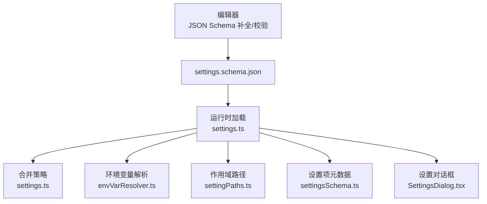
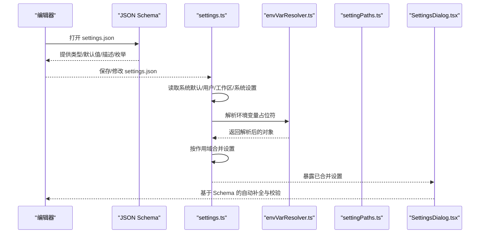
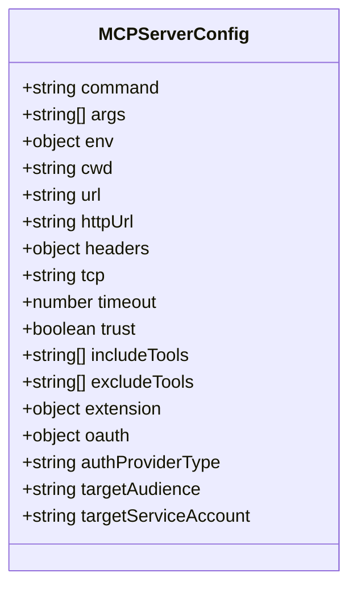
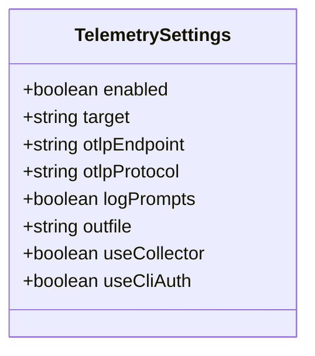
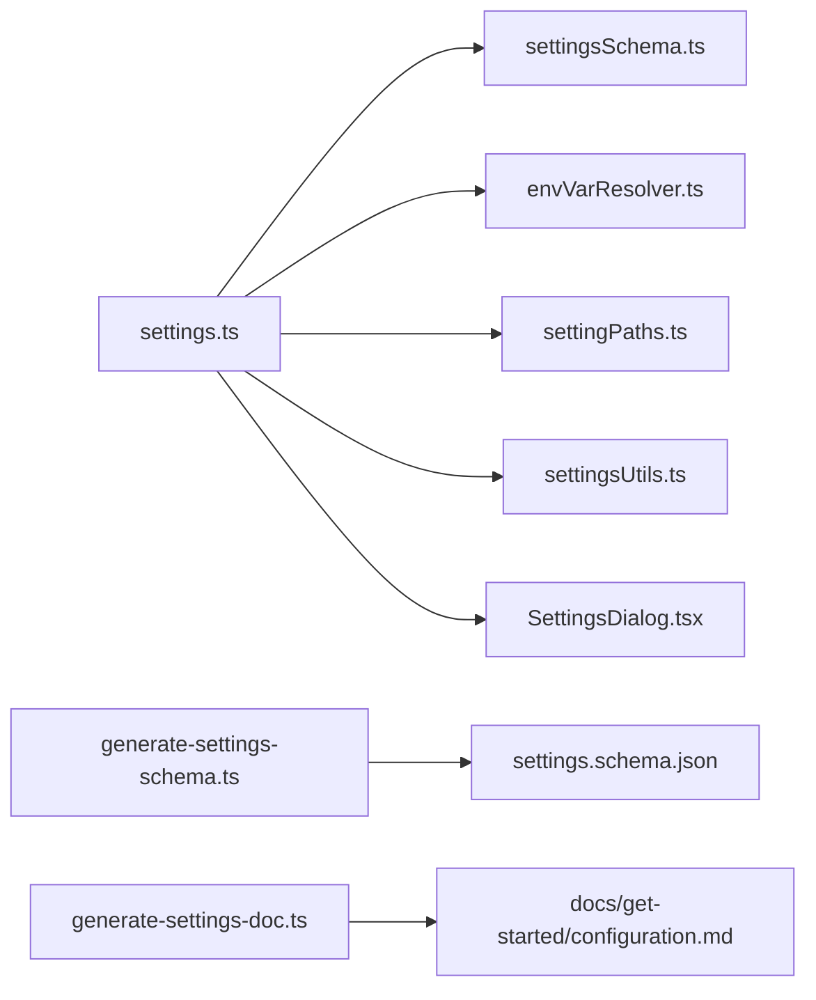

# 配置文件

<cite>
**本文引用的文件列表**
- [settings.schema.json](file://schemas/settings.schema.json)
- [settings.ts](file://packages/cli/src/config/settings.ts)
- [settingsSchema.ts](file://packages/cli/src/config/settingsSchema.ts)
- [envVarResolver.ts](file://packages/cli/src/utils/envVarResolver.ts)
- [settingPaths.ts](file://packages/cli/src/config/settingPaths.ts)
- [settingsUtils.ts](file://packages/cli/src/utils/settingsUtils.ts)
- [SettingsDialog.tsx](file://packages/cli/src/ui/components/SettingsDialog.tsx)
- [generate-settings-schema.ts](file://scripts/generate-settings-schema.ts)
- [generate-settings-doc.ts](file://scripts/generate-settings-doc.ts)
</cite>

## 目录
1. [简介](#简介)
2. [项目结构与定位](#项目结构与定位)
3. [核心组件与作用域](#核心组件与作用域)
4. [架构总览](#架构总览)
5. [详细组件解析](#详细组件解析)
6. [依赖关系分析](#依赖关系分析)
7. [性能与可靠性考量](#性能与可靠性考量)
8. [故障排查指南](#故障排查指南)
9. [结论](#结论)
10. [附录：完整配置示例与环境变量语法](#附录完整配置示例与环境变量语法)

## 简介
本文件面向使用 Gemini CLI 的用户与开发者，系统性解读 settings.json 配置文件的结构、字段含义、数据类型、默认值、有效范围与用途，并重点解析 mcpServers、model、telemetry 等复杂对象的嵌套结构。同时，说明如何通过 $VAR_NAME 语法在配置中引用环境变量，以及如何借助 JSON Schema 在编辑器中获得自动补全与校验能力。

## 项目结构与定位
- 配置文件 schema 来源于 schemas/settings.schema.json，定义了 settings.json 的结构、类型、默认值与注释信息。
- 运行时加载与合并逻辑位于 packages/cli/src/config/settings.ts，负责从多级作用域（系统默认、用户、工作区、系统）读取并合并设置，支持环境变量解析与迁移。
- 设置项的“元数据”（类型、分类、是否需重启等）由 packages/cli/src/config/settingsSchema.ts 维护，供生成器与 UI 使用。
- 编辑器内联补全与校验由 JSON Schema 提供；生成器脚本 scripts/generate-settings-schema.ts 将 TS 定义转换为 JSON Schema 并注入描述信息。

图表来源
- [settings.schema.json](file://schemas/settings.schema.json#L1-L120)
- [settings.ts](file://packages/cli/src/config/settings.ts#L596-L789)
- [settingsSchema.ts](file://packages/cli/src/config/settingsSchema.ts#L135-L200)
- [envVarResolver.ts](file://packages/cli/src/utils/envVarResolver.ts#L1-L127)
- [settingPaths.ts](file://packages/cli/src/config/settingPaths.ts#L1-L12)
- [SettingsDialog.tsx](file://packages/cli/src/ui/components/SettingsDialog.tsx#L52-L120)

章节来源
- [settings.schema.json](file://schemas/settings.schema.json#L1-L120)
- [settings.ts](file://packages/cli/src/config/settings.ts#L596-L789)
- [settingsSchema.ts](file://packages/cli/src/config/settingsSchema.ts#L135-L200)

## 核心组件与作用域
- 作用域与优先级
  - 系统默认（SystemDefaults）< 用户（User）< 工作区（Workspace）< 系统（System）
  - 仅当工作区可信时，才会合并工作区设置；否则工作区为空集参与合并
- 合并策略
  - 不同层级键采用深合并，数组与对象可按需进行替换、拼接或浅合并
- 环境变量解析
  - 支持在字符串与对象中使用 $VAR_NAME 或 ${VAR_NAME} 语法解析环境变量
  - 若未定义则保留原占位符
- 路径与别名
  - SettingPaths 提供常用设置键的稳定路径，便于跨模块引用

章节来源
- [settings.ts](file://packages/cli/src/config/settings.ts#L409-L474)
- [settings.ts](file://packages/cli/src/config/settings.ts#L596-L789)
- [envVarResolver.ts](file://packages/cli/src/utils/envVarResolver.ts#L1-L127)
- [settingPaths.ts](file://packages/cli/src/config/settingPaths.ts#L1-L12)

## 架构总览
下图展示 settings.json 的加载、解析、合并与生效流程，以及与 JSON Schema 的关系。

图表来源
- [settings.schema.json](file://schemas/settings.schema.json#L1-L120)
- [settings.ts](file://packages/cli/src/config/settings.ts#L596-L789)
- [envVarResolver.ts](file://packages/cli/src/utils/envVarResolver.ts#L1-L127)
- [SettingsDialog.tsx](file://packages/cli/src/ui/components/SettingsDialog.tsx#L52-L120)

## 详细组件解析

### settings.json 结构概览
- 顶层键分为多个命名空间：
  - mcpServers：MCP 服务器配置
  - general：通用应用设置
  - output：输出格式
  - ui：界面主题与显示控制
  - ide：IDE 集成开关
  - privacy：隐私统计开关
  - telemetry：遥测配置
  - model：模型相关参数
  - modelConfigs：模型配置别名与覆盖
  - context：上下文管理
  - tools：工具与沙箱、交互式 shell、输出截断等
  - mcp：MCP 协议相关设置
  - security：安全与认证
  - advanced：高级选项
  - experimental：实验性功能
  - extensions：扩展管理
  - hooks：钩子系统
- 每个键的类型、默认值、是否需要重启、分类与描述均来自 JSON Schema 与 TS 元数据。

章节来源
- [settings.schema.json](file://schemas/settings.schema.json#L1-L1875)
- [settingsSchema.ts](file://packages/cli/src/config/settingsSchema.ts#L135-L200)

### mcpServers（MCP 服务器配置）
- 类型：对象
- 默认值：空对象
- 有效范围：需要重启
- 用途：为每个 MCP 服务器提供启动命令、参数、工作目录、传输方式（stdio/SSE/HTTP/WebSocket）、超时、信任标记、工具白/黑名单、OAuth 与认证提供者等
- 关键字段（节选）
  - command：stdio 传输的可执行文件
  - args：命令行参数数组
  - env：进程环境变量映射
  - cwd：工作目录
  - url/httpUrl/tcp/headers：SSE/HTTP/WebSocket 传输配置
  - timeout：请求超时（毫秒）
  - trust：信任标记
  - includeTools/excludeTools：工具启用/禁用清单
  - extension：扩展元数据
  - oauth/authProviderType/targetAudience/targetServiceAccount：OAuth 认证配置
- 复杂度与性能
  - 每个服务器配置独立，解析与启动成本取决于传输方式与工具数量
  - 建议仅启用必要工具，避免 includeTools 过大
- 错误处理
  - 未定义的环境变量将保留原占位符，避免启动失败
  - 传输失败或超时会触发重试策略（由上层调用决定）

图表来源
- [settings.schema.json](file://schemas/settings.schema.json#L1496-L1599)

章节来源
- [settings.schema.json](file://schemas/settings.schema.json#L1496-L1599)

### model（模型相关设置）
- 类型：对象
- 默认值：空对象
- 有效范围：无需重启
- 用途：选择模型名称、限制会话轮次、控制工具输出摘要、上下文压缩阈值、跳过下一说话者检查等
- 关键字段（节选）
  - name：模型名称
  - maxSessionTurns：会话最大轮次（-1 表示无限制）
  - summarizeToolOutput：按工具粒度的摘要预算（tokenBudget）
  - compressionThreshold：上下文使用达到该比例时触发压缩（0.2~0.9）
  - skipNextSpeakerCheck：跳过下一说话者检查
- 性能与建议
  - 合理设置 compressionThreshold 可降低上下文膨胀风险
  - 对大输出工具（如 shell）建议配置 summarizeToolOutput 以控制令牌预算

章节来源
- [settings.schema.json](file://schemas/settings.schema.json#L390-L441)
- [settingsSchema.ts](file://packages/cli/src/config/settingsSchema.ts#L645-L714)

### telemetry（遥测配置）
- 类型：对象
- 默认值：未指定（由实现决定）
- 有效范围：需要重启
- 用途：控制遥测开关、目标（stderr/stdout/OTLP）、OTLP 端点与协议（grpc/http）、是否记录提示词、输出文件、是否转发到收集器、是否使用 CLI 认证等
- 关键字段（节选）
  - enabled：是否启用遥测
  - target：输出目标
  - otlpEndpoint/otlpProtocol：OTLP 导出端点与协议
  - logPrompts：是否记录提示词
  - outfile：输出文件路径
  - useCollector/useCliAuth：是否转发至收集器、是否使用 CLI 认证

图表来源
- [settings.schema.json](file://schemas/settings.schema.json#L1600-L1639)

章节来源
- [settings.schema.json](file://schemas/settings.schema.json#L1600-L1639)

### modelConfigs（模型配置别名与覆盖）
- 类型：对象
- 默认值：内置别名与覆盖集合
- 有效范围：无需重启
- 用途：通过别名简化模型配置，支持继承（extends），并允许自定义别名与覆盖规则
- 关键字段（节选）
  - aliases：内置别名集合（如 base、chat-base、gemini-2.5-pro 等）
  - customAliases：用户自定义别名（与内置合并/覆盖）
  - overrides/customOverrides：匹配规则驱动的覆盖（按最具体匹配生效）

章节来源
- [settings.schema.json](file://schemas/settings.schema.json#L442-L520)
- [settingsSchema.ts](file://packages/cli/src/config/settingsSchema.ts#L716-L766)

### 其他重要设置（简述）
- general：预览功能开关、首选编辑器、Vim 模式、自动更新、会话检查点、提示补全、重试网络错误、调试按键日志、会话保留策略等
- output：输出格式（text/json）
- ui：主题、自定义主题、窗口标题、状态显示、提示与横幅隐藏、底部信息、内存使用显示、行号、引用显示、全宽、备用缓冲、增量渲染、自定义俏皮话、无障碍模式等
- ide：IDE 集成开关与引导状态
- privacy：使用统计开关
- context：上下文文件名、导入格式、发现最大目录数、包含目录、扫描策略、文件过滤（gitignore/.geminiignore/递归搜索/模糊搜索）
- tools：沙箱、shell 交互、分页器、颜色、空闲超时、自动接受、核心工具白名单、排除工具、工具发现与调用命令、ripgrep、输出截断阈值与行数、消息总线集成、钩子系统
- mcp：MCP 服务器命令、允许/排除列表
- security：禁用 YOLO 模式、阻止 Git 扩展安装、文件夹信任、认证类型与外部认证
- advanced：自动配置内存、DNS 解析顺序、项目环境变量排除、Bug 报告命令模板
- experimental：代理、扩展管理、扩展热重载、模型可用性服务、JIT 上下文加载、代码库调查器
- extensions：扩展禁用列表、迁移引导工作区
- hooks：事件钩子（BeforeTool/AfterTool/BeforeAgent/AfterAgent/Notification/SessionStart/SessionEnd/PreCompress/BeforeModel/AfterModel/BeforeToolSelection）

章节来源
- [settings.schema.json](file://schemas/settings.schema.json#L120-L1875)
- [settingsSchema.ts](file://packages/cli/src/config/settingsSchema.ts#L140-L766)

## 依赖关系分析
- settings.ts 依赖
  - settingsSchema.ts：获取设置定义与默认值
  - envVarResolver.ts：解析 $VAR_NAME 与 ${VAR_NAME}
  - settingPaths.ts：提供稳定键路径
  - settingsUtils.ts：查询设置类别、是否显示在对话框、是否需要重启等
  - SettingsDialog.tsx：基于 schema 渲染设置对话框
- JSON Schema 生成链路
  - generate-settings-schema.ts：将 TS 定义转为 JSON Schema，并注入分类、是否需要重启等 Markdown 描述
  - generate-settings-doc.ts：用于生成文档页面

图表来源
- [settings.ts](file://packages/cli/src/config/settings.ts#L596-L789)
- [settingsSchema.ts](file://packages/cli/src/config/settingsSchema.ts#L135-L200)
- [envVarResolver.ts](file://packages/cli/src/utils/envVarResolver.ts#L1-L127)
- [settingPaths.ts](file://packages/cli/src/config/settingPaths.ts#L1-L12)
- [settingsUtils.ts](file://packages/cli/src/utils/settingsUtils.ts#L157-L211)
- [SettingsDialog.tsx](file://packages/cli/src/ui/components/SettingsDialog.tsx#L52-L120)
- [generate-settings-schema.ts](file://scripts/generate-settings-schema.ts#L263-L319)
- [generate-settings-doc.ts](file://scripts/generate-settings-doc.ts#L1-L53)

章节来源
- [settings.ts](file://packages/cli/src/config/settings.ts#L596-L789)
- [settingsSchema.ts](file://packages/cli/src/config/settingsSchema.ts#L135-L200)
- [generate-settings-schema.ts](file://scripts/generate-settings-schema.ts#L263-L319)
- [generate-settings-doc.ts](file://scripts/generate-settings-doc.ts#L1-L53)

## 性能与可靠性考量
- 合并策略
  - 对象采用深合并，数组可选择替换/拼接/去重合并，避免重复配置
- 环境变量解析
  - 仅在字符串与对象中解析，对布尔/数字保持原样，减少不必要的计算
- 作用域隔离
  - 工作区仅在可信时参与合并，避免不受信任项目影响全局行为
- UI 与对话框
  - 设置对话框根据 requiresRestart 动态提示重启需求，提升用户体验

章节来源
- [settings.ts](file://packages/cli/src/config/settings.ts#L409-L474)
- [settings.ts](file://packages/cli/src/config/settings.ts#L737-L759)
- [settingsUtils.ts](file://packages/cli/src/utils/settingsUtils.ts#L180-L211)

## 故障排查指南
- JSON Schema 自动补全与校验
  - 在编辑器中打开 settings.json，确保关联到 schemas/settings.schema.json，即可获得字段提示、默认值与枚举提示
- 环境变量未生效
  - 检查 $VAR_NAME 语法是否正确，确认环境变量是否存在；未定义时将保留原占位符
- 设置未生效或被覆盖
  - 检查作用域优先级：系统默认 < 用户 < 工作区 < 系统；工作区仅在可信时生效
  - 某些设置需要重启后才生效（requiresRestart: yes）
- MCP 服务器无法连接
  - 检查 command/args/url/httpUrl/tcp/headers/timeout 等字段是否正确；确认 includeTools/excludeTools 与信任标记
- 遥测未输出
  - 检查 enabled、target、otlpEndpoint/protocol、outfile、useCollector/useCliAuth 等配置

章节来源
- [settings.schema.json](file://schemas/settings.schema.json#L1-L120)
- [envVarResolver.ts](file://packages/cli/src/utils/envVarResolver.ts#L1-L127)
- [settings.ts](file://packages/cli/src/config/settings.ts#L596-L789)

## 结论
settings.json 是 Gemini CLI 的核心配置入口，其结构由 JSON Schema 严格约束，配合运行时加载与合并机制，实现了灵活、可扩展且可验证的配置体系。通过合理使用 mcpServers、model、telemetry 等关键对象，以及环境变量解析与作用域合并策略，用户可以按需定制 CLI 的行为与体验。

## 附录：完整配置示例与环境变量语法

- 环境变量语法
  - 在 settings.json 中使用 $VAR_NAME 或 ${VAR_NAME} 引用环境变量
  - 若变量未定义，将保留原占位符
  - 示例（不展示具体值，请参考以下路径）
    - 字符串中的占位符解析：[envVarResolver.ts](file://packages/cli/src/utils/envVarResolver.ts#L1-L127)
    - settings.json 加载与解析：[settings.ts](file://packages/cli/src/config/settings.ts#L596-L789)
- JSON Schema 与编辑器自动补全
  - 在编辑器中打开 settings.json，确保关联到 schemas/settings.schema.json，即可获得字段提示、默认值与枚举提示
  - 自动生成 JSON Schema 的脚本：[generate-settings-schema.ts](file://scripts/generate-settings-schema.ts#L263-L319)
  - 自动生成文档的脚本：[generate-settings-doc.ts](file://scripts/generate-settings-doc.ts#L1-L53)
- 设置项元数据与 UI 显示
  - 设置项的分类、是否需要重启、是否显示在对话框等由 settingsSchema.ts 定义
  - 设置对话框渲染与交互：[SettingsDialog.tsx](file://packages/cli/src/ui/components/SettingsDialog.tsx#L52-L120)

章节来源
- [envVarResolver.ts](file://packages/cli/src/utils/envVarResolver.ts#L1-L127)
- [settings.ts](file://packages/cli/src/config/settings.ts#L596-L789)
- [generate-settings-schema.ts](file://scripts/generate-settings-schema.ts#L263-L319)
- [generate-settings-doc.ts](file://scripts/generate-settings-doc.ts#L1-L53)
- [settingsSchema.ts](file://packages/cli/src/config/settingsSchema.ts#L135-L200)
- [SettingsDialog.tsx](file://packages/cli/src/ui/components/SettingsDialog.tsx#L52-L120)