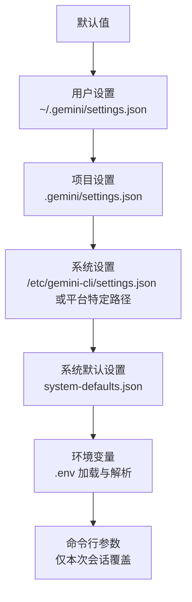
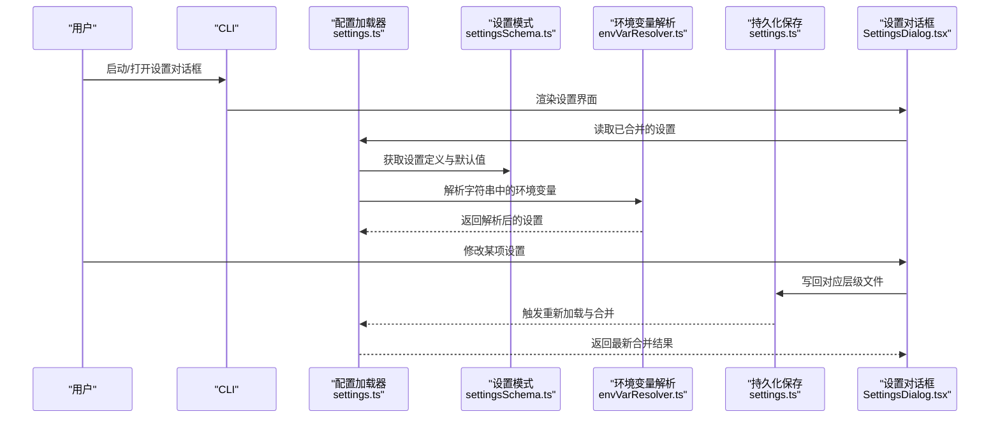
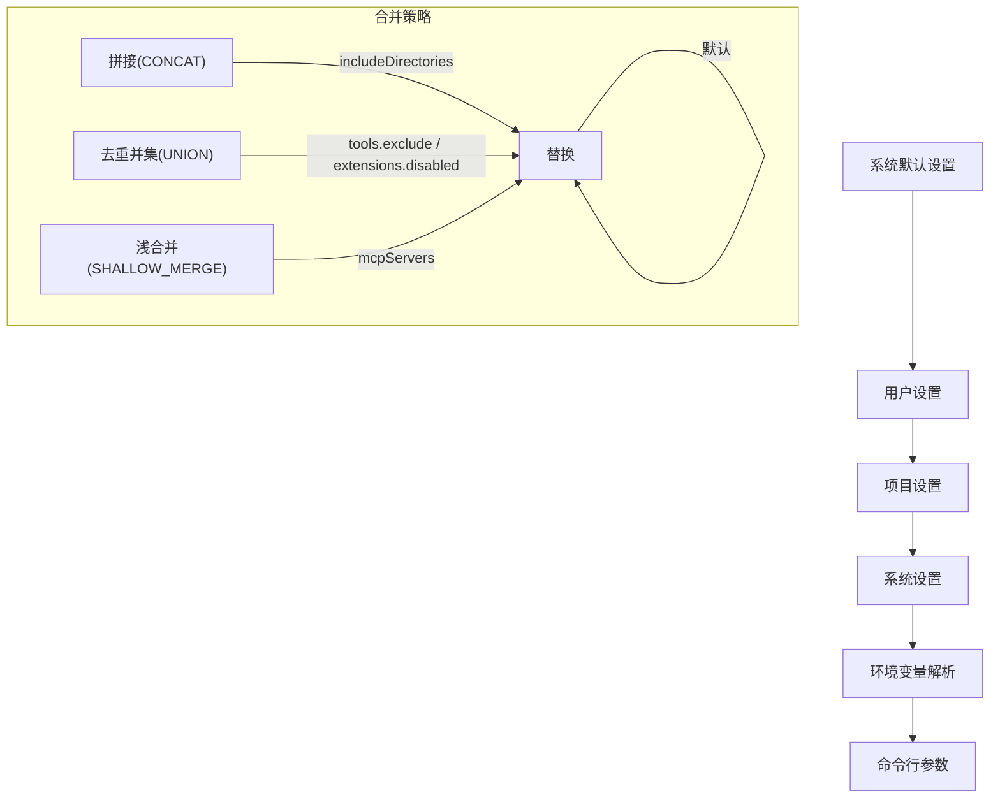
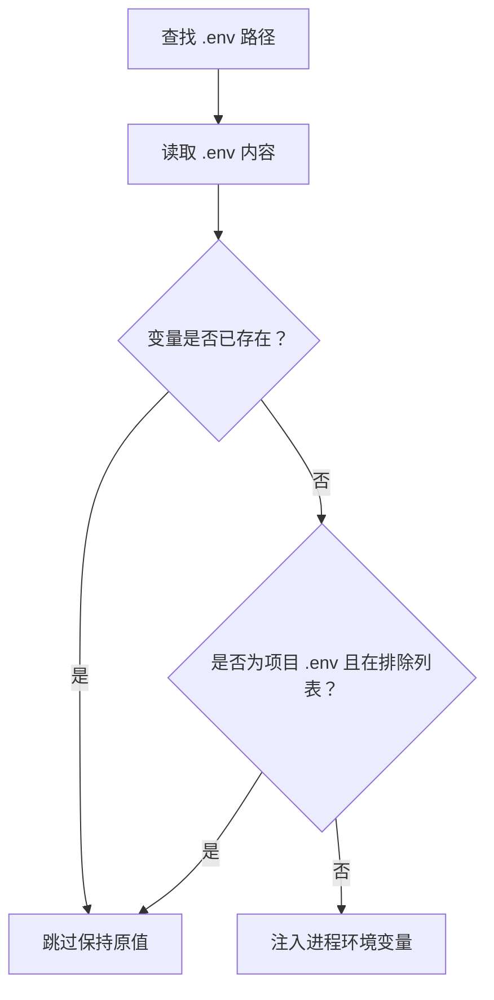
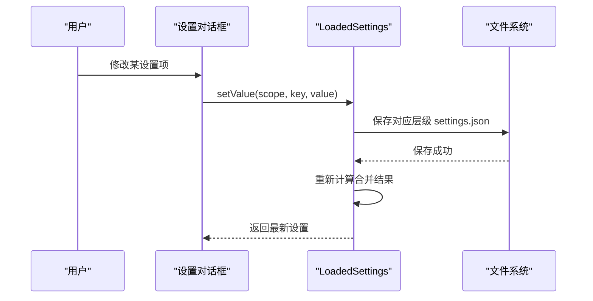
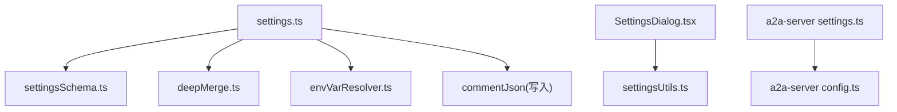

# 配置管理

<cite>
**本文引用的文件**
- [settings.ts](file://packages/cli/src/config/settings.ts)
- [settingsSchema.ts](file://packages/cli/src/config/settingsSchema.ts)
- [settings.ts](file://packages/a2a-server/src/config/settings.ts)
- [settings.ts](file://packages/a2a-server/src/config/config.ts)
- [settings.md](file://docs/cli/settings.md)
- [configuration.md](file://docs/cli/configuration.md)
- [settings.schema.json](file://schemas/settings.schema.json)
- [deepMerge.ts](file://packages/cli/src/utils/deepMerge.ts)
- [envVarResolver.ts](file://packages/cli/src/utils/envVarResolver.ts)
- [envVarResolver.test.ts](file://packages/cli/src/utils/envVarResolver.test.ts)
- [SettingsDialog.tsx](file://packages/cli/src/ui/components/SettingsDialog.tsx)
- [settingsUtils.ts](file://packages/cli/src/utils/settingsUtils.ts)
- [settingsUtils.test.ts](file://packages/cli/src/utils/settingsUtils.test.ts)
</cite>

## 目录
1. [简介](#简介)
2. [项目结构与配置层次](#项目结构与配置层次)
3. [核心组件](#核心组件)
4. [架构总览](#架构总览)
5. [详细组件分析](#详细组件分析)
6. [依赖关系分析](#依赖关系分析)
7. [性能考量](#性能考量)
8. [故障排查指南](#故障排查指南)
9. [结论](#结论)
10. [附录](#附录)

## 简介
本文件系统性阐述 Gemini CLI 的多层级配置体系，包括：
- settings.json 的结构与 JSON Schema 定义
- 用户级、项目级、系统级与系统默认级配置的合并规则与优先级
- 所有可配置项的分类与用途（模型、工具、认证、UI、隐私、遥测等）
- 环境变量如何覆盖配置文件中的字符串值
- 运行时通过 “/settings” 命令修改配置并在会话中生效与持久化的流程
- 开发者如何扩展配置系统以支持新选项

## 项目结构与配置层次
Gemini CLI 支持多层配置来源，按优先级从低到高依次为：
1) 默认值（应用内硬编码）
2) 用户设置文件（全局）
3) 项目设置文件（工作区）
4) 系统设置文件（全系统）
5) 环境变量（含 .env 文件加载）
6) 命令行参数（仅本次会话）

此外，系统还提供“系统默认设置文件”，用于企业或管理员统一下发基础策略，作为系统设置的补充来源。

图示来源
- [configuration.md](file://docs/cli/configuration.md#L1-L20)
- [settings.ts](file://packages/cli/src/config/settings.ts#L138-L149)
- [settings.ts](file://packages/cli/src/config/settings.ts#L151-L159)

章节来源
- [configuration.md](file://docs/cli/configuration.md#L1-L20)
- [settings.ts](file://packages/cli/src/config/settings.ts#L138-L159)

## 核心组件
- 配置加载与合并器：负责按优先级加载各层级配置，并执行深度合并与策略选择。
- 设置模式与默认值：通过 settingsSchema.ts 统一声明类型、默认值、类别、是否需要重启等元数据。
- 环境变量解析器：在加载配置后对字符串值进行 $VAR 或 ${VAR} 变量替换。
- 设置对话框与运行时修改：提供交互式 UI 修改设置，并持久化到对应层级文件。
- JSON Schema：为 settings.json 提供结构约束与编辑器智能提示。

章节来源
- [settings.ts](file://packages/cli/src/config/settings.ts#L409-L432)
- [settingsSchema.ts](file://packages/cli/src/config/settingsSchema.ts#L1-L120)
- [envVarResolver.ts](file://packages/cli/src/utils/envVarResolver.ts#L121-L161)
- [SettingsDialog.tsx](file://packages/cli/src/ui/components/SettingsDialog.tsx#L94-L143)
- [settings.schema.json](file://schemas/settings.schema.json#L1-L120)

## 架构总览
下图展示了配置加载、合并与运行时修改的关键流程。

图示来源
- [settings.ts](file://packages/cli/src/config/settings.ts#L596-L789)
- [settingsSchema.ts](file://packages/cli/src/config/settingsSchema.ts#L1-L120)
- [envVarResolver.ts](file://packages/cli/src/utils/envVarResolver.ts#L121-L161)
- [SettingsDialog.tsx](file://packages/cli/src/ui/components/SettingsDialog.tsx#L94-L143)
- [settings.ts](file://packages/cli/src/config/settings.ts#L817-L845)

## 详细组件分析

### 配置文件结构与 JSON Schema
- settings.json 的结构由 JSON Schema 严格定义，包含以下主要分类：
  - general：通用应用设置（预览功能、编辑器首选项、Vim 模式、自动更新、会话保留、提示补全、重试网络错误、调试按键日志等）
  - output：输出格式（text/json）
  - ui：界面主题、自定义主题、窗口标题、状态显示、提示与横幅隐藏、底部栏控制、内存使用显示、行号、引用、模型信息显示、全宽、备用缓冲、增量渲染、自定义俏皮话、无障碍设置
  - ide：IDE 集成开关与提示状态
  - privacy：隐私统计开关
  - telemetry：遥测配置（启用、目标、OTLP 端点、日志是否包含提示、文件输出、收集器转发、CLI 认证）
  - model：模型名称、最大会话轮次、工具输出摘要（按工具配置 token 预算）、上下文压缩阈值、跳过下一说话人检查
  - modelConfigs：模型配置别名与覆盖（内置与自定义）
  - context：上下文文件名、导入格式、目录扫描上限、包含目录、从包含目录加载记忆、文件过滤（尊重 .gitignore、.geminiignore、递归搜索、模糊搜索）
  - tools：沙箱、shell 工具（交互式、分页器、颜色、空闲超时）、自动接受、核心工具白名单、允许工具、排除工具、工具发现与调用命令、ripgrep、工具输出截断、消息总线集成、钩子系统
  - mcp：MCP 服务器命令、允许列表、排除列表
  - security：安全策略（禁用 YOLO、阻止 Git 扩展、文件夹信任）
  - advanced：高级设置（自动配置内存、DNS 解析顺序、项目环境变量排除、Bug 命令）
  - experimental：实验性功能（代理、扩展管理、扩展重载、可用性服务、JIT 上下文、代码库调查器）
  - extensions：扩展禁用列表、迁移提示记录
  - hooks：钩子事件（BeforeTool、AfterTool、BeforeAgent、AfterAgent、Notification、SessionStart、SessionEnd、PreCompress、BeforeModel、AfterModel、BeforeToolSelection）及禁用列表
  - 其他：如 useSmartEdit、useWriteTodos 等

- JSON Schema 与 TS 模式保持一致，确保编辑器具备智能提示与校验能力。

章节来源
- [settings.schema.json](file://schemas/settings.schema.json#L1-L120)
- [settingsSchema.ts](file://packages/cli/src/config/settingsSchema.ts#L140-L1607)
- [configuration.md](file://docs/cli/configuration.md#L58-L424)

### 配置优先级与合并策略
- 优先级顺序（从低到高）：默认值 → 用户设置 → 项目设置 → 系统设置 → 系统默认设置 → 环境变量 → 命令行参数
- 合并策略：
  - 对象深合并：默认采用覆盖策略（后者覆盖前者）
  - 数组合并策略：
    - CONCAT：拼接（如 includeDirectories）
    - UNION：去重并集（如 tools.exclude、extensions.disabled、hooks.<event>）
    - SHALLOW_MERGE：浅合并对象属性（如 mcpServers）
  - 动态属性合并：当某容器未显式声明属性而使用 additionalProperties 时，依据其 mergeStrategy 决定合并方式（例如 hooks.<event> 使用 CONCAT，hooks.disabled 使用 UNION）

图示来源
- [settings.ts](file://packages/cli/src/config/settings.ts#L409-L432)
- [deepMerge.ts](file://packages/cli/src/utils/deepMerge.ts#L24-L90)
- [settingsSchema.ts](file://packages/cli/src/config/settingsSchema.ts#L88-L120)

章节来源
- [settings.ts](file://packages/cli/src/config/settings.ts#L409-L432)
- [deepMerge.ts](file://packages/cli/src/utils/deepMerge.ts#L24-L90)
- [settingsSchema.ts](file://packages/cli/src/config/settingsSchema.ts#L88-L120)

### 环境变量覆盖与 .env 加载
- 字符串值支持 $VAR_NAME 或 ${VAR_NAME} 语法，加载时自动解析。
- .env 文件加载顺序：
  1) 当前工作目录 .env
  2) 向上搜索直到项目根（.git）或家目录
  3) 家目录 .env
- 项目 .env 中默认排除 DEBUG、DEBUG_MODE；可通过 excludedProjectEnvVars 自定义。
- 特殊处理：Cloud Shell 环境下 GOOGLE_CLOUD_PROJECT 默认值优先于 shell 环境，除非 .env 显式指定。

图示来源
- [settings.ts](file://packages/cli/src/config/settings.ts#L499-L590)
- [envVarResolver.test.ts](file://packages/cli/src/utils/envVarResolver.test.ts#L52-L283)

章节来源
- [settings.ts](file://packages/cli/src/config/settings.ts#L499-L590)
- [envVarResolver.test.ts](file://packages/cli/src/utils/envVarResolver.test.ts#L52-L283)

### 运行时修改与持久化（/settings 命令）
- /settings 打开交互式设置对话框，支持搜索、筛选与一键恢复默认。
- 修改后即时写回对应层级文件（用户/项目），并触发重新合并与刷新。
- 需要重启的设置会在 UI 中标注，避免立即生效但影响稳定性。

图示来源
- [settings.ts](file://packages/cli/src/config/settings.ts#L490-L497)
- [settings.ts](file://packages/cli/src/config/settings.ts#L817-L845)
- [SettingsDialog.tsx](file://packages/cli/src/ui/components/SettingsDialog.tsx#L706-L750)
- [settingsUtils.ts](file://packages/cli/src/utils/settingsUtils.ts#L157-L261)

章节来源
- [settings.md](file://docs/cli/settings.md#L1-L113)
- [settings.ts](file://packages/cli/src/config/settings.ts#L490-L497)
- [settings.ts](file://packages/cli/src/config/settings.ts#L817-L845)
- [SettingsDialog.tsx](file://packages/cli/src/ui/components/SettingsDialog.tsx#L706-L750)
- [settingsUtils.ts](file://packages/cli/src/utils/settingsUtils.ts#L157-L261)

### 开发者扩展指南：新增配置项
- 在 settingsSchema.ts 中添加新的 SettingDefinition，明确：
  - 类型（boolean/string/number/array/object/enum）
  - 默认值、类别、是否需要重启、描述、是否在 UI 对话框显示
  - 如需数组/映射，配置 items 或 additionalProperties，并选择合适的 mergeStrategy
- 若涉及 MCP、遥测、主题等复杂对象，参考 SETTINGS_SCHEMA_DEFINITIONS 中的共享定义（如 MCPServerConfig、TelemetrySettings、CustomTheme 等）
- 在 settings.ts 中：
  - 如需系统默认设置文件，可在 getSystemDefaultsPath() 返回的路径下提供默认值
  - 如需环境变量解析，确保字符串字段支持 $VAR 或 ${VAR}
  - 如需 UI 展示，配合 SettingsDialog.tsx 的过滤与搜索逻辑
- 文档生成：
  - 更新 docs/cli/configuration.md 与 docs/cli/settings.md 中的配置参考表与示例
  - 运行 npm run docs:settings 生成最新设置参考（见 settingsSchema.ts 注释）

章节来源
- [settingsSchema.ts](file://packages/cli/src/config/settingsSchema.ts#L1-L120)
- [settingsSchema.ts](file://packages/cli/src/config/settingsSchema.ts#L1600-L1947)
- [settings.ts](file://packages/cli/src/config/settings.ts#L138-L159)
- [configuration.md](file://docs/cli/configuration.md#L1-L20)

## 依赖关系分析
- 配置加载依赖：
  - settings.ts 依赖 settingsSchema.ts（获取默认值与元数据）、deepMerge.ts（多层合并策略）、envVarResolver.ts（变量解析）、commentJson（格式保留写入）
  - SettingsDialog.tsx 依赖 settingsUtils.ts（分类、类型、重启需求查询）
- 外部集成：
  - a2a-server 同样实现 settings.ts 的加载与环境变量解析逻辑，体现跨包一致性
  - JSON Schema 与 TS 模式双向约束，保证编辑器体验与运行时一致性

图示来源
- [settings.ts](file://packages/cli/src/config/settings.ts#L596-L789)
- [settingsSchema.ts](file://packages/cli/src/config/settingsSchema.ts#L1-L120)
- [deepMerge.ts](file://packages/cli/src/utils/deepMerge.ts#L24-L90)
- [envVarResolver.ts](file://packages/cli/src/utils/envVarResolver.ts#L121-L161)
- [SettingsDialog.tsx](file://packages/cli/src/ui/components/SettingsDialog.tsx#L94-L143)
- [settingsUtils.ts](file://packages/cli/src/utils/settingsUtils.ts#L157-L261)
- [settings.ts](file://packages/a2a-server/src/config/settings.ts#L83-L119)
- [config.ts](file://packages/a2a-server/src/config/config.ts#L161-L188)

章节来源
- [settings.ts](file://packages/cli/src/config/settings.ts#L596-L789)
- [settings.ts](file://packages/a2a-server/src/config/settings.ts#L83-L119)
- [config.ts](file://packages/a2a-server/src/config/config.ts#L161-L188)

## 性能考量
- 合并策略选择：
  - 对大数组（如 includeDirectories）使用 CONCAT，避免重复元素带来的去重成本
  - 对动态事件钩子使用 CONCAT，确保用户与工作区钩子叠加
- 环境变量解析：
  - 仅对字符串字段进行解析，避免对非字符串类型造成额外遍历
- I/O 优化：
  - 仅在设置变更时写回对应层级文件，减少磁盘写入
  - 通过格式保留写入函数，避免不必要的 JSON 重排

章节来源
- [deepMerge.ts](file://packages/cli/src/utils/deepMerge.ts#L24-L90)
- [envVarResolver.test.ts](file://packages/cli/src/utils/envVarResolver.test.ts#L52-L283)
- [settings.ts](file://packages/cli/src/config/settings.ts#L817-L845)

## 故障排查指南
- 配置文件无效：
  - 检查 JSON 结构是否为对象；若不是，加载器会记录错误并中断启动
- 合并冲突：
  - 确认数组合并策略是否符合预期（UNION/CONCAT/REPLACE）
  - 检查 additionalProperties 的 mergeStrategy 是否正确
- 环境变量未生效：
  - 确认变量名大小写与 .env 文件一致
  - 排除列表是否包含该变量；项目 .env 默认排除 DEBUG/DEBUG_MODE
  - Cloud Shell 下 GOOGLE_CLOUD_PROJECT 默认值优先，需在 .env 显式覆盖
- 设置未持久化：
  - 确认当前修改的层级文件是否存在写权限
  - 检查是否通过 /settings 对话框修改，而非直接编辑文件导致未触发重新合并

章节来源
- [settings.ts](file://packages/cli/src/config/settings.ts#L620-L709)
- [settings.ts](file://packages/cli/src/config/settings.ts#L817-L845)
- [envVarResolver.test.ts](file://packages/cli/src/utils/envVarResolver.test.ts#L52-L283)

## 结论
Gemini CLI 的配置系统通过严格的 JSON Schema、清晰的优先级与灵活的合并策略，实现了从用户到系统的多层级可控配置。结合环境变量解析与运行时设置对话框，既满足日常使用，又便于企业级统一管控。开发者可按规范扩展新配置项，确保类型安全与用户体验一致。

## 附录

### 常用配置示例（片段）
- 会话行为与工具参数示例（来自官方文档示例）
  - 示例片段路径：[configuration.md](file://docs/cli/configuration.md#L388-L424)

章节来源
- [configuration.md](file://docs/cli/configuration.md#L388-L424)