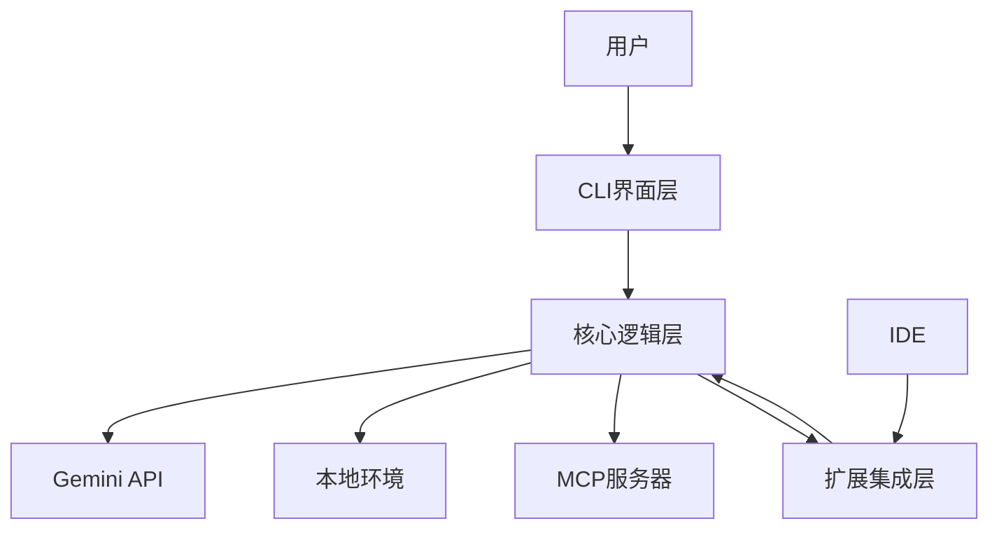
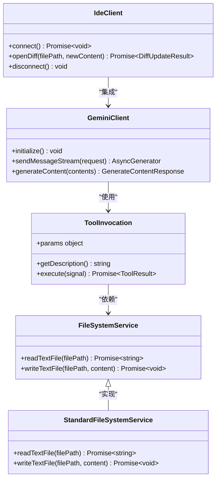
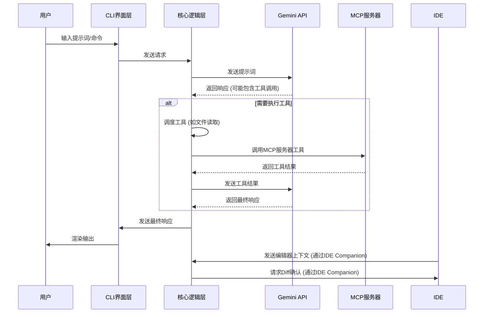

# 项目概述

<cite>
**本文档中引用的文件**   
- [README.md](file://README.md)
- [package.json](file://package.json)
- [packages/cli/package.json](file://packages/cli/package.json)
- [packages/core/package.json](file://packages/core/package.json)
- [packages/vscode-ide-companion/package.json](file://packages/vscode-ide-companion/package.json)
- [docs/architecture.md](file://docs/architecture.md)
- [packages/cli/src/gemini.tsx](file://packages/cli/src/gemini.tsx)
- [packages/core/src/index.ts](file://packages/core/src/index.ts)
- [packages/vscode-ide-companion/src/extension.ts](file://packages/vscode-ide-companion/src/extension.ts)
- [packages/cli/src/core/initializer.ts](file://packages/cli/src/core/initializer.ts)
- [packages/core/src/tools/tools.ts](file://packages/core/src/tools/tools.ts)
- [packages/core/src/services/fileSystemService.ts](file://packages/core/src/services/fileSystemService.ts)
- [packages/core/src/core/client.ts](file://packages/core/src/core/client.ts)
- [packages/cli/src/ui/AppContainer.tsx](file://packages/cli/src/ui/AppContainer.tsx)
- [packages/core/src/ide/ide-client.ts](file://packages/core/src/ide/ide-client.ts)
</cite>

## 目录
1. [引言](#引言)
2. [核心价值与定位](#核心价值与定位)
3. [整体架构](#整体架构)
4. [分层架构详解](#分层架构详解)
5. [系统上下文与数据流](#系统上下文与数据流)
6. [主要技术栈](#主要技术栈)
7. [设计目标与权衡](#设计目标与权衡)
8. [结论](#结论)

## 引言

gemini-cli 是一个开源的AI代理，旨在将Google Gemini模型的强大功能直接带入开发者的终端环境。该项目作为一个终端集成的AI助手，通过将先进的大语言模型与开发者日常的工作流紧密结合，为开发者提供了一个轻量级、高效且功能丰富的交互式开发体验。本项目的核心价值在于它打破了传统AI工具与开发环境之间的壁垒，使开发者能够在一个熟悉的命令行界面中，直接利用AI能力进行代码理解、生成、自动化任务和集成扩展。

**Section sources**
- [README.md](file://README.md)

## 核心价值与定位

gemini-cli 项目的核心价值在于其作为“终端集成AI助手”的精准定位。它不仅仅是一个简单的命令行工具，更是一个将Google Gemini模型深度融入开发者工作流的智能代理。其设计理念是为开发者提供从提示词（prompt）到模型响应的最直接路径，极大地提升了开发效率和体验。

该项目的主要优势体现在以下几个方面：
- **免费且强大的模型**：提供免费的使用额度，并接入了拥有100万token上下文窗口的Gemini 2.5 Pro模型，能够处理复杂的代码库和长篇幅的上下文。
- **内置丰富工具**：集成了Google搜索、文件操作、Shell命令执行、网络内容抓取等实用工具，使AI能够与本地环境进行交互，完成实际任务。
- **高度可扩展**：支持MCP（Model Context Protocol）协议，允许开发者通过自定义服务器扩展其功能，例如集成媒体生成、数据库查询等。
- **终端优先**：专为习惯使用命令行的开发者设计，提供了流畅的终端交互体验。
- **开源与安全**：采用Apache 2.0开源许可证，代码透明，并提供了沙箱执行等安全机制。

**Section sources**
- [README.md](file://README.md)

## 整体架构

gemini-cli 项目采用清晰的分层架构，主要由三个核心组件构成：CLI界面层、核心逻辑层和扩展集成层。这种架构设计遵循了模块化和关注点分离的原则，确保了系统的可维护性和可扩展性。

- **CLI界面层** (`packages/cli`)：负责用户交互，处理用户输入，渲染输出结果，并管理整体的用户体验。
- **核心逻辑层** (`packages/core`)：作为系统的后端，负责与Gemini API通信，管理会话状态，调度和执行各种工具，并处理核心业务逻辑。
- **扩展集成层** (`vscode-ide-companion`)：提供与IDE（如VS Code）的深度集成，允许CLI与IDE共享上下文，实现更智能的代码辅助。

这三个组件之间通过明确定义的接口进行通信，形成了一个高效协作的整体。

**Diagram sources**
- [docs/architecture.md](file://docs/architecture.md)
- [packages/cli/src/gemini.tsx](file://packages/cli/src/gemini.tsx)
- [packages/core/src/index.ts](file://packages/core/src/index.ts)
- [packages/vscode-ide-companion/src/extension.ts](file://packages/vscode-ide-companion/src/extension.ts)

## 分层架构详解

### CLI界面层

CLI界面层是用户与系统交互的前端，位于`packages/cli`目录下。它基于React和Ink库构建，提供了一个现代化的终端用户界面。该层的主要职责包括：
- **输入处理**：解析用户输入的命令和提示词。
- **状态管理**：管理会话历史、配置设置和UI状态。
- **输出渲染**：以美观的格式展示AI的响应、工具执行结果和错误信息。
- **配置管理**：加载和应用用户配置，如主题、快捷键和安全设置。

该层通过调用核心逻辑层提供的API来发起请求，并接收响应以更新UI。

**Section sources**
- [packages/cli/src/gemini.tsx](file://packages/cli/src/gemini.tsx)
- [packages/cli/src/ui/AppContainer.tsx](file://packages/cli/src/ui/AppContainer.tsx)

### 核心逻辑层

核心逻辑层是gemini-cli的“大脑”，位于`packages/core`目录下。它是一个独立的Node.js包，封装了所有与AI模型交互和工具执行相关的复杂逻辑。其关键功能包括：
- **API客户端**：与Google Gemini API进行通信，发送请求并接收响应。
- **提示词工程**：构建和管理发送给模型的提示词，包括整合对话历史和可用工具的定义。
- **工具调度**：根据模型的请求，调用相应的工具（如文件读取、Shell命令执行）。
- **状态管理**：维护会话的上下文和状态，确保对话的连贯性。

该层通过`@google/gemini-cli-core`包的形式被CLI层依赖，实现了前后端的解耦。

**Diagram sources**
- [packages/core/src/index.ts](file://packages/core/src/index.ts)
- [packages/core/src/core/client.ts](file://packages/core/src/core/client.ts)
- [packages/core/src/tools/tools.ts](file://packages/core/src/tools/tools.ts)
- [packages/core/src/services/fileSystemService.ts](file://packages/core/src/services/fileSystemService.ts)
- [packages/core/src/ide/ide-client.ts](file://packages/core/src/ide/ide-client.ts)

### 扩展集成层

扩展集成层由`vscode-ide-companion`包实现，它是一个VS Code扩展。该层的主要作用是建立一个桥梁，让CLI能够与IDE共享上下文信息。例如，当用户在VS Code中打开一个文件时，该信息可以被同步到CLI，从而使AI能够提供更精确的代码建议。反之，CLI中生成的代码修改也可以通过IDE的Diff视图进行预览和确认。

**Section sources**
- [packages/vscode-ide-companion/src/extension.ts](file://packages/vscode-ide-companion/src/extension.ts)

## 系统上下文与数据流

gemini-cli的系统上下文图清晰地展示了用户、CLI、Gemini API和MCP服务器之间的数据流。

**Diagram sources**
- [docs/architecture.md](file://docs/architecture.md)
- [packages/cli/src/gemini.tsx](file://packages/cli/src/gemini.tsx)
- [packages/core/src/core/client.ts](file://packages/core/src/core/client.ts)
- [packages/vscode-ide-companion/src/extension.ts](file://packages/vscode-ide-companion/src/extension.ts)

## 主要技术栈

gemini-cli项目采用了现代化的技术栈，确保了其高性能和可维护性：
- **TypeScript**：作为主要的编程语言，提供了强大的类型安全，减少了运行时错误。
- **React**：用于构建CLI的用户界面，利用Ink库在终端中渲染React组件。
- **Ink**：一个用于在终端中构建React UI的库，是实现丰富交互体验的关键。
- **esbuild**：作为项目的打包工具，提供了极快的构建速度。
- **Node.js**：运行时环境，要求版本20或更高。

这些技术的组合使得gemini-cli既具备了Web应用的交互性，又保持了命令行工具的轻量和高效。

**Section sources**
- [package.json](file://package.json)
- [packages/cli/package.json](file://packages/cli/package.json)
- [packages/core/package.json](file://packages/core/package.json)

## 设计目标与权衡

gemini-cli的设计目标是创建一个强大、安全且易于使用的终端AI助手。为了实现这一目标，项目在架构上做出了以下关键权衡：
- **模块化**：将CLI与Core分离，允许独立开发和测试，也为未来可能的其他前端（如GUI）奠定了基础。
- **安全性**：对于可能修改文件系统或执行Shell命令的工具，系统会要求用户明确确认，防止AI的恶意行为。
- **性能**：通过流式响应（streaming）和上下文压缩等技术，优化了与大模型交互的性能和成本。
- **可扩展性**：通过MCP协议，项目可以轻松集成第三方服务，而无需修改核心代码。

这些设计决策共同塑造了一个既强大又可靠的开发者工具。

**Section sources**
- [docs/architecture.md](file://docs/architecture.md)
- [packages/cli/src/core/initializer.ts](file://packages/cli/src/core/initializer.ts)

## 结论

gemini-cli项目成功地将Google Gemini模型与开发者的终端工作流无缝集成，创造了一个功能强大且用户友好的AI助手。其清晰的分层架构、现代化的技术栈和以开发者为中心的设计理念，使其成为提升开发效率的有力工具。通过CLI界面层、核心逻辑层和扩展集成层的协同工作，gemini-cli不仅能够理解复杂的代码库，还能自动化操作任务，并通过MCP协议无限扩展其能力。该项目为AI辅助编程工具树立了一个优秀的范例。