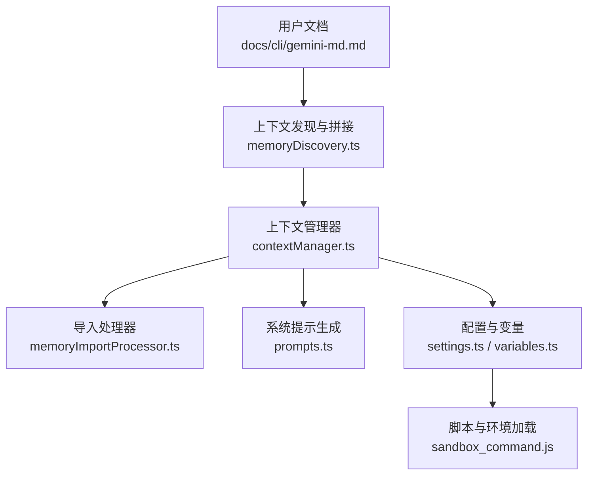
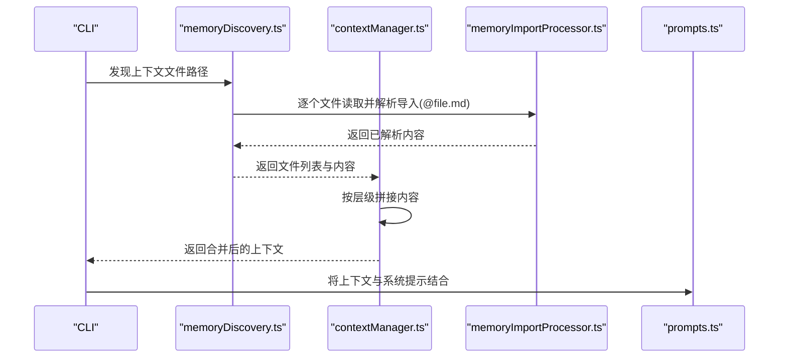
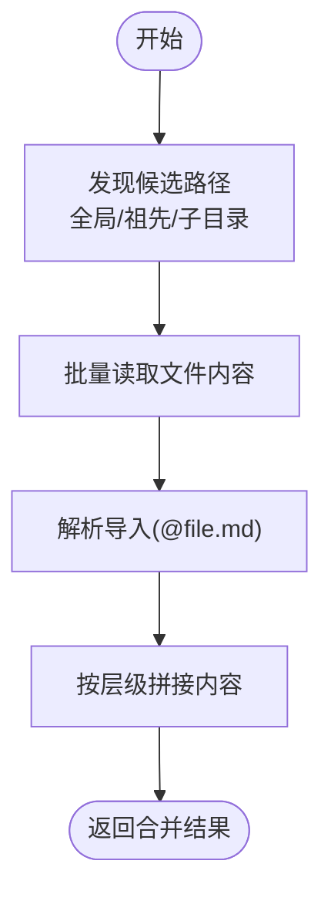
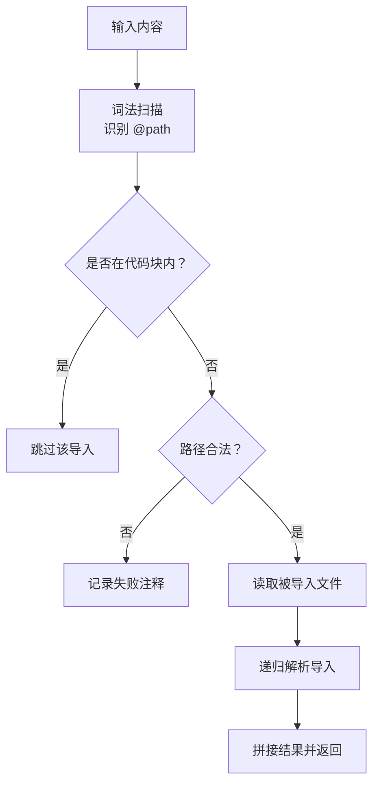
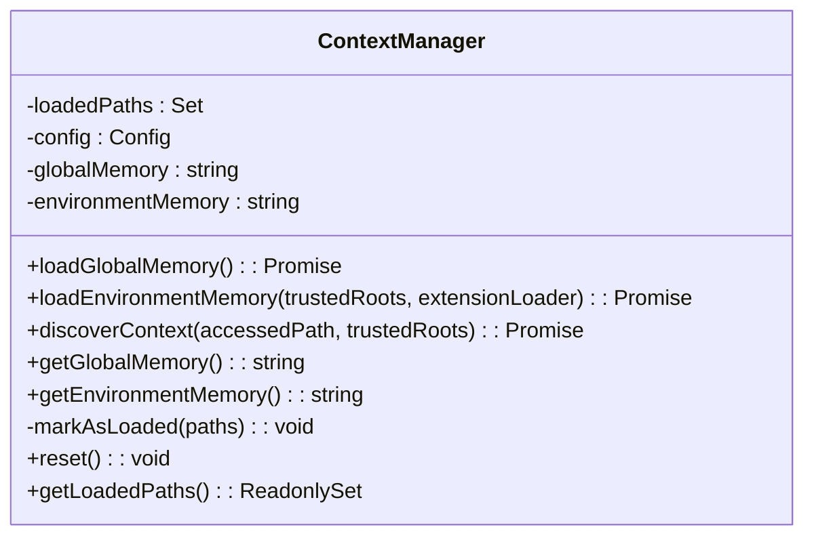
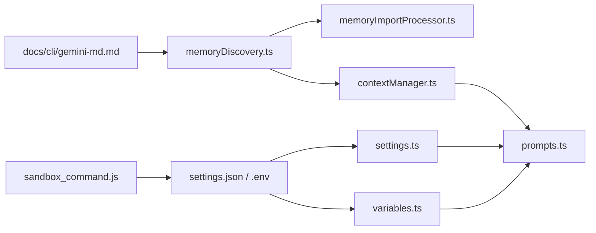

# GEMINI.md 上下文文件

<cite>
**本文引用的文件**
- [GEMINI.md](file://GEMINI.md)
- [docs/cli/gemini-md.md](file://docs/cli/gemini-md.md)
- [docs/cli/configuration.md](file://docs/cli/configuration.md)
- [docs/get-started/configuration.md](file://docs/get-started/configuration.md)
- [packages/core/src/utils/memoryDiscovery.ts](file://packages/core/src/utils/memoryDiscovery.ts)
- [packages/core/src/utils/memoryImportProcessor.ts](file://packages/core/src/utils/memoryImportProcessor.ts)
- [packages/core/src/services/contextManager.ts](file://packages/core/src/services/contextManager.ts)
- [packages/core/src/core/prompts.ts](file://packages/core/src/core/prompts.ts)
- [packages/a2a-server/src/config/settings.ts](file://packages/a2a-server/src/config/settings.ts)
- [packages/cli/src/config/extensions/variables.ts](file://packages/cli/src/config/extensions/variables.ts)
- [scripts/sandbox_command.js](file://scripts/sandbox_command.js)
- [docs/troubleshooting.md](file://docs/troubleshooting.md)
</cite>

## 目录
1. [简介](#简介)
2. [项目结构](#项目结构)
3. [核心组件](#核心组件)
4. [架构总览](#架构总览)
5. [详细组件分析](#详细组件分析)
6. [依赖关系分析](#依赖关系分析)
7. [性能考量](#性能考量)
8. [故障排除指南](#故障排除指南)
9. [结论](#结论)
10. [附录](#附录)

## 简介
GEMINI.md 是 Gemini CLI 的“上下文文件”，用于为 AI 提供项目特定的指令、知识与行为准则。通过在项目根目录、子目录以及用户全局位置放置 GEMINI.md，CLI 会按层级加载这些文件，并将它们拼接后的文本作为系统提示的一部分发送给模型，从而让 AI 的回答更贴合项目的风格、约束与需求。

本文件面向使用者与维护者，系统讲解：
- GEMINI.md 的作用与加载顺序
- 支持的 Markdown 结构与导入语法
- 变量替换与环境变量注入
- 最佳实践：如何编写有效的系统提示、组织多项目指令
- 实际用例：在不同项目间自动切换工作模式
- 配置示例与常见问题排查

## 项目结构
GEMINI.md 的使用贯穿 CLI 的多个模块：
- 文档层：提供使用说明与示例（docs/cli/gemini-md.md）
- 加载与合并：按层级发现与拼接上下文（packages/core/src/utils/memoryDiscovery.ts、packages/core/src/services/contextManager.ts）
- 导入解析：支持 @file.md 语法进行模块化拆分（packages/core/src/utils/memoryImportProcessor.ts）
- 系统提示：核心系统提示可由环境变量或文件覆盖（packages/core/src/core/prompts.ts）
- 配置与变量：settings.json 中可自定义文件名；环境变量注入（packages/a2a-server/src/config/settings.ts、packages/cli/src/config/extensions/variables.ts）
- 脚本与沙箱：脚本中对 .env 的查找与加载（scripts/sandbox_command.js）

图表来源
- [docs/cli/gemini-md.md](file://docs/cli/gemini-md.md#L1-L109)
- [packages/core/src/utils/memoryDiscovery.ts](file://packages/core/src/utils/memoryDiscovery.ts#L242-L331)
- [packages/core/src/services/contextManager.ts](file://packages/core/src/services/contextManager.ts#L1-L112)
- [packages/core/src/utils/memoryImportProcessor.ts](file://packages/core/src/utils/memoryImportProcessor.ts#L190-L396)
- [packages/core/src/core/prompts.ts](file://packages/core/src/core/prompts.ts#L80-L120)
- [packages/a2a-server/src/config/settings.ts](file://packages/a2a-server/src/config/settings.ts#L83-L130)
- [packages/cli/src/config/extensions/variables.ts](file://packages/cli/src/config/extensions/variables.ts#L1-L50)
- [scripts/sandbox_command.js](file://scripts/sandbox_command.js#L36-L89)

章节来源
- [docs/cli/gemini-md.md](file://docs/cli/gemini-md.md#L1-L109)
- [packages/core/src/utils/memoryDiscovery.ts](file://packages/core/src/utils/memoryDiscovery.ts#L242-L331)
- [packages/core/src/services/contextManager.ts](file://packages/core/src/services/contextManager.ts#L1-L112)
- [packages/core/src/utils/memoryImportProcessor.ts](file://packages/core/src/utils/memoryImportProcessor.ts#L190-L396)
- [packages/core/src/core/prompts.ts](file://packages/core/src/core/prompts.ts#L80-L120)
- [packages/a2a-server/src/config/settings.ts](file://packages/a2a-server/src/config/settings.ts#L83-L130)
- [packages/cli/src/config/extensions/variables.ts](file://packages/cli/src/config/extensions/variables.ts#L1-L50)
- [scripts/sandbox_command.js](file://scripts/sandbox_command.js#L36-L89)

## 核心组件
- 层级加载与拼接：按“全局 -> 项目根与祖先 -> 子目录”的顺序发现并拼接 GEMINI.md 内容，最终形成系统提示的一部分。
- 导入语法：支持 @file.md 语法，允许将大型上下文拆分为多个文件，支持相对与绝对路径。
- 系统提示覆盖：可通过环境变量或文件覆盖默认系统提示，便于在不同场景下切换 AI 行为。
- 配置与变量：settings.json 可自定义上下文文件名；支持环境变量注入与字符串模板替换。

章节来源
- [docs/cli/gemini-md.md](file://docs/cli/gemini-md.md#L1-L109)
- [packages/core/src/utils/memoryDiscovery.ts](file://packages/core/src/utils/memoryDiscovery.ts#L242-L331)
- [packages/core/src/utils/memoryImportProcessor.ts](file://packages/core/src/utils/memoryImportProcessor.ts#L190-L396)
- [packages/core/src/core/prompts.ts](file://packages/core/src/core/prompts.ts#L80-L120)
- [packages/a2a-server/src/config/settings.ts](file://packages/a2a-server/src/config/settings.ts#L83-L130)

## 架构总览
GEMINI.md 的工作流如下：
1. CLI 在用户家目录、当前工作目录及其祖先目录、以及子目录中发现 GEMINI.md（受忽略规则影响）。
2. 对每个发现的文件，先解析导入（@file.md），再读取内容。
3. 将所有文件内容按层级顺序拼接，并在 UI 中显示加载的文件数量。
4. 将拼接后的上下文作为系统提示的一部分发送给模型。

图表来源
- [packages/core/src/utils/memoryDiscovery.ts](file://packages/core/src/utils/memoryDiscovery.ts#L242-L331)
- [packages/core/src/utils/memoryImportProcessor.ts](file://packages/core/src/utils/memoryImportProcessor.ts#L190-L396)
- [packages/core/src/services/contextManager.ts](file://packages/core/src/services/contextManager.ts#L1-L112)
- [packages/core/src/core/prompts.ts](file://packages/core/src/core/prompts.ts#L80-L120)

## 详细组件分析

### 组件A：上下文发现与拼接（memoryDiscovery.ts）
- 发现顺序：全局 -> 项目根与祖先 -> 子目录（尊重忽略规则与最大搜索深度）。
- 并发读取：对文件读取采用并发限制，避免资源耗尽。
- 拼接格式：为每个来源添加“来自某路径”的分隔标记，便于定位来源。
- 返回结果：包含合并后的内容、文件计数与路径列表，供 UI 与系统提示使用。

图表来源
- [packages/core/src/utils/memoryDiscovery.ts](file://packages/core/src/utils/memoryDiscovery.ts#L242-L331)
- [packages/core/src/utils/memoryImportProcessor.ts](file://packages/core/src/utils/memoryImportProcessor.ts#L190-L396)

章节来源
- [packages/core/src/utils/memoryDiscovery.ts](file://packages/core/src/utils/memoryDiscovery.ts#L242-L331)

### 组件B：导入解析（memoryImportProcessor.ts）
- 语法：以 @ 开头的行内路径，支持相对与绝对路径。
- 安全：禁止 URL；校验路径必须位于允许目录范围内；防止路径穿越。
- 循环保护：跟踪已处理文件与最大深度，避免无限递归。
- 输出：支持树形与扁平两种导入树格式；在树形模式下保留导入注释与嵌套结构。

图表来源
- [packages/core/src/utils/memoryImportProcessor.ts](file://packages/core/src/utils/memoryImportProcessor.ts#L190-L396)

章节来源
- [packages/core/src/utils/memoryImportProcessor.ts](file://packages/core/src/utils/memoryImportProcessor.ts#L190-L396)

### 组件C：上下文管理器（contextManager.ts）
- 分层加载：分别加载全局、环境（含扩展）与 JIT（按需）子目录上下文。
- 拼接与去重：对已加载路径进行跟踪，避免重复；统一使用拼接函数添加来源标记。
- 接口：提供获取全局/环境上下文、按路径发现上下文、重置与查询已加载路径的方法。

图表来源
- [packages/core/src/services/contextManager.ts](file://packages/core/src/services/contextManager.ts#L1-L112)

章节来源
- [packages/core/src/services/contextManager.ts](file://packages/core/src/services/contextManager.ts#L1-L112)

### 组件D：系统提示与覆盖（prompts.ts）
- 默认系统提示：根据模型类型与预览开关生成。
- 覆盖机制：可通过环境变量指定系统提示文件路径，若启用则强制存在该文件。
- 与上下文的关系：上下文文件内容会被拼接到系统提示中，共同构成模型输入。

章节来源
- [packages/core/src/core/prompts.ts](file://packages/core/src/core/prompts.ts#L80-L120)

### 组件E：配置与变量（settings.ts、variables.ts）
- 文件名自定义：settings.json 中的 context.fileName 可指定多个候选文件名。
- 环境变量注入：settings.json 支持在对象中解析 $VAR 或 ${VAR} 形式的变量。
- 扩展变量：扩展变量支持 ${var} 模板替换，用于在扩展配置中注入动态值。

章节来源
- [docs/cli/configuration.md](file://docs/cli/configuration.md#L666-L705)
- [docs/get-started/configuration.md](file://docs/get-started/configuration.md#L1297-L1337)
- [packages/a2a-server/src/config/settings.ts](file://packages/a2a-server/src/config/settings.ts#L83-L130)
- [packages/cli/src/config/extensions/variables.ts](file://packages/cli/src/config/extensions/variables.ts#L1-L50)

### 组件F：脚本与环境加载（sandbox_command.js）
- .env 查找：优先使用项目内的 .gemini/.env，其次回退到 .env；在 CI 环境下会进行安全的环境变量保留。
- 沙箱模式：根据配置与环境变量决定沙箱行为，影响命令可用性与权限。

章节来源
- [scripts/sandbox_command.js](file://scripts/sandbox_command.js#L36-L89)

## 依赖关系分析
- 文档层依赖：docs/cli/gemini-md.md 定义了使用方式与示例，是用户理解与配置的入口。
- 核心实现依赖：memoryDiscovery.ts 依赖 memoryImportProcessor.ts 进行导入解析；contextManager.ts 负责统一拼接与去重；prompts.ts 提供系统提示覆盖能力。
- 配置依赖：settings.json 与环境变量共同决定文件名、变量注入与行为差异。
- 脚本依赖：sandbox_command.js 与 .env 的加载逻辑影响 CLI 的初始环境。

图表来源
- [docs/cli/gemini-md.md](file://docs/cli/gemini-md.md#L1-L109)
- [packages/core/src/utils/memoryDiscovery.ts](file://packages/core/src/utils/memoryDiscovery.ts#L242-L331)
- [packages/core/src/utils/memoryImportProcessor.ts](file://packages/core/src/utils/memoryImportProcessor.ts#L190-L396)
- [packages/core/src/services/contextManager.ts](file://packages/core/src/services/contextManager.ts#L1-L112)
- [packages/core/src/core/prompts.ts](file://packages/core/src/core/prompts.ts#L80-L120)
- [packages/a2a-server/src/config/settings.ts](file://packages/a2a-server/src/config/settings.ts#L83-L130)
- [packages/cli/src/config/extensions/variables.ts](file://packages/cli/src/config/extensions/variables.ts#L1-L50)
- [scripts/sandbox_command.js](file://scripts/sandbox_command.js#L36-L89)

章节来源
- [docs/cli/gemini-md.md](file://docs/cli/gemini-md.md#L1-L109)
- [packages/core/src/utils/memoryDiscovery.ts](file://packages/core/src/utils/memoryDiscovery.ts#L242-L331)
- [packages/core/src/utils/memoryImportProcessor.ts](file://packages/core/src/utils/memoryImportProcessor.ts#L190-L396)
- [packages/core/src/services/contextManager.ts](file://packages/core/src/services/contextManager.ts#L1-L112)
- [packages/core/src/core/prompts.ts](file://packages/core/src/core/prompts.ts#L80-L120)
- [packages/a2a-server/src/config/settings.ts](file://packages/a2a-server/src/config/settings.ts#L83-L130)
- [packages/cli/src/config/extensions/variables.ts](file://packages/cli/src/config/extensions/variables.ts#L1-L50)
- [scripts/sandbox_command.js](file://scripts/sandbox_command.js#L36-L89)

## 性能考量
- 并发与限流：文件读取采用并发限制，避免过多打开文件句柄导致系统资源耗尽。
- 搜索深度与范围：子目录扫描有默认深度限制，可通过配置扩大范围，但应权衡性能。
- 导入深度：导入解析有最大深度限制，防止深层递归导致性能问题。
- 拼接成本：上下文越大，拼接与传输成本越高；建议按模块拆分，减少冗余。

章节来源
- [packages/core/src/utils/memoryDiscovery.ts](file://packages/core/src/utils/memoryDiscovery.ts#L242-L331)
- [packages/core/src/utils/memoryImportProcessor.ts](file://packages/core/src/utils/memoryImportProcessor.ts#L228-L396)

## 故障排除指南
- 无法找到上下文文件：确认文件名是否符合 settings.json 中的 context.fileName；检查路径是否在允许范围内。
- 导入失败：检查 @file.md 路径是否合法且未被代码块包裹；确认路径未越界。
- 环境变量未生效：确认 .env 位置与加载顺序；在 CI 环境下注意安全变量过滤。
- 系统提示未覆盖：若启用环境变量覆盖，请确保文件存在且路径正确。
- 性能问题：减小子目录扫描深度、减少导入层级、拆分大型上下文文件。

章节来源
- [docs/troubleshooting.md](file://docs/troubleshooting.md#L1-L156)
- [packages/core/src/utils/memoryImportProcessor.ts](file://packages/core/src/utils/memoryImportProcessor.ts#L398-L414)
- [packages/a2a-server/src/config/settings.ts](file://packages/a2a-server/src/config/settings.ts#L83-L130)
- [scripts/sandbox_command.js](file://scripts/sandbox_command.js#L36-L89)

## 结论
GEMINI.md 通过层级发现、导入解析与拼接，为 AI 提供了可定制、可模块化的项目上下文。配合 settings.json 与环境变量，可在不同项目与环境中灵活切换 AI 的行为模式。遵循本文的最佳实践与排错建议，可以显著提升上下文的有效性与稳定性。

## 附录

### 格式规范与结构化指令
- 支持标准 Markdown 标题、列表、段落等。
- 建议使用清晰的标题层级组织“通用指令”“编码风格”“特定模块说明”等。
- 示例参考：项目根目录 GEMINI.md 的示例结构与内容。

章节来源
- [docs/cli/gemini-md.md](file://docs/cli/gemini-md.md#L38-L58)

### 变量替换机制
- 字符串模板：支持 ${var} 形式，用于扩展变量注入。
- 环境变量：settings.json 中的对象支持 $VAR 或 ${VAR} 注入。
- 系统提示覆盖：可通过环境变量指向系统提示文件，启用后必须存在该文件。

章节来源
- [packages/cli/src/config/extensions/variables.ts](file://packages/cli/src/config/extensions/variables.ts#L1-L50)
- [packages/a2a-server/src/config/settings.ts](file://packages/a2a-server/src/config/settings.ts#L83-L130)
- [packages/core/src/core/prompts.ts](file://packages/core/src/core/prompts.ts#L80-L120)

### 最佳实践
- 按模块拆分：将大型上下文拆分为多个文件并通过 @file.md 引入，降低耦合与复杂度。
- 明确层级优先级：通用指令放全局，项目级放根目录，局部指令放子目录，避免相互覆盖导致歧义。
- 保持简洁与可读：使用清晰标题与要点列表，突出关键约束与风格。
- 定期刷新：使用 /memory refresh 更新上下文，确保最新修改生效。

章节来源
- [docs/cli/gemini-md.md](file://docs/cli/gemini-md.md#L59-L70)
- [docs/cli/configuration.md](file://docs/cli/configuration.md#L666-L705)
- [docs/get-started/configuration.md](file://docs/get-started/configuration.md#L1297-L1337)

### 实际用例
- 多项目切换：通过不同的 GEMINI.md 文件定义不同团队的编码风格与工具偏好，AI 自动适配当前项目上下文。
- 特定模块指导：在子目录中放置针对该模块的上下文，使 AI 在生成或审查该模块代码时遵循特定规范。
- 环境差异化：结合 settings.json 与 .env，在不同环境（开发/测试/生产）下注入不同变量，实现动态上下文。

章节来源
- [docs/cli/gemini-md.md](file://docs/cli/gemini-md.md#L71-L93)
- [docs/get-started/configuration.md](file://docs/get-started/configuration.md#L1297-L1337)

### 配置示例
- 自定义上下文文件名：在 settings.json 中设置 context.fileName 为 ["AGENTS.md","CONTEXT.md","GEMINI.md"]。
- 系统提示覆盖：通过环境变量指向系统提示文件，启用后必须存在该文件。

章节来源
- [docs/cli/gemini-md.md](file://docs/cli/gemini-md.md#L94-L109)
- [packages/core/src/core/prompts.ts](file://packages/core/src/core/prompts.ts#L80-L120)