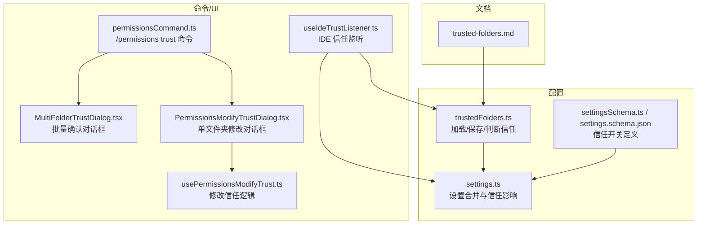
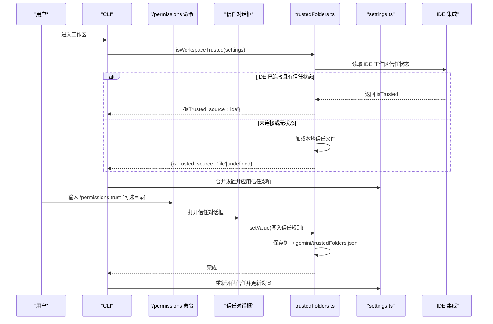
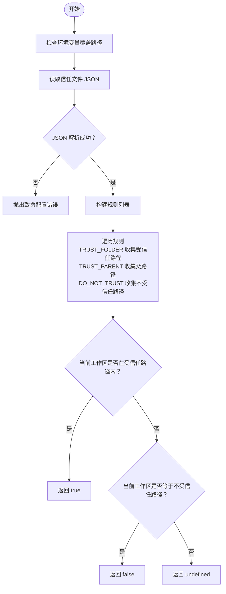
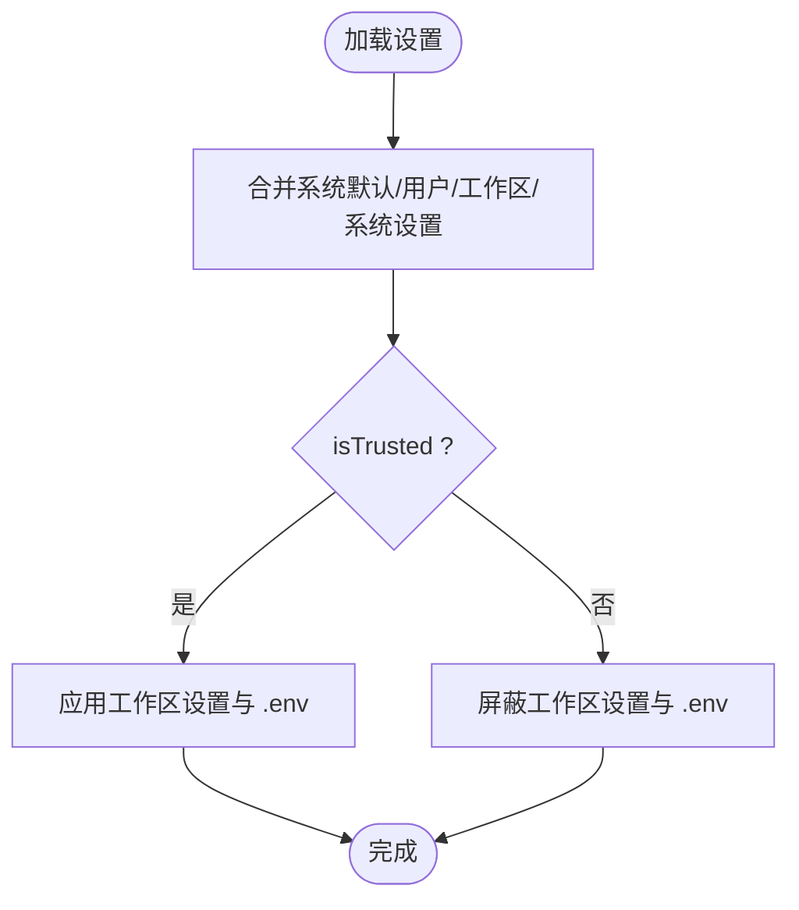
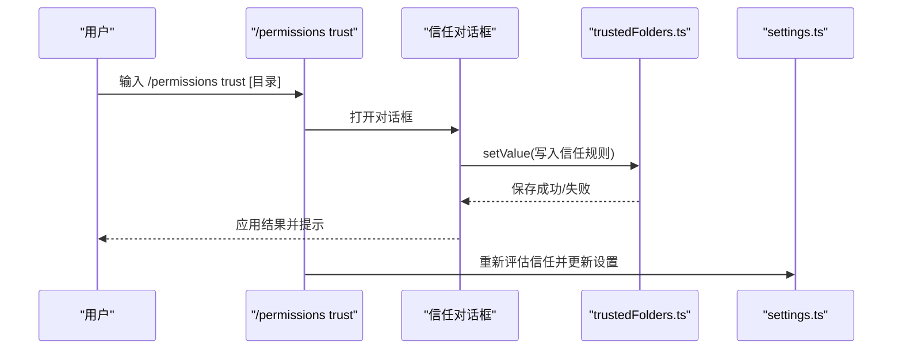
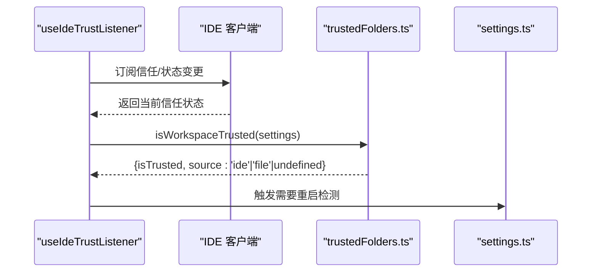
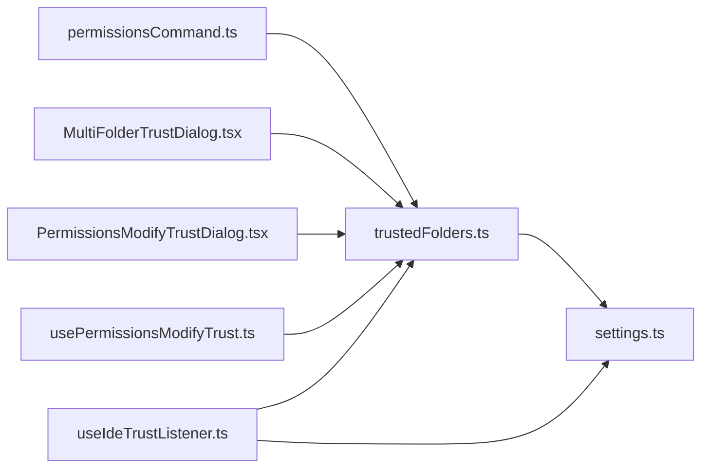

# 受信任文件夹

<cite>
**本文引用的文件**
- [trusted-folders.md](file://docs/cli/trusted-folders.md)
- [trustedFolders.ts](file://packages/cli/src/config/trustedFolders.ts)
- [trustedFolders.test.ts](file://packages/cli/src/config/trustedFolders.test.ts)
- [settings.ts](file://packages/cli/src/config/settings.ts)
- [settingsSchema.ts](file://packages/cli/src/config/settingsSchema.ts)
- [settings.schema.json](file://schemas/settings.schema.json)
- [permissionsCommand.ts](file://packages/cli/src/ui/commands/permissionsCommand.ts)
- [MultiFolderTrustDialog.tsx](file://packages/cli/src/ui/components/MultiFolderTrustDialog.tsx)
- [PermissionsModifyTrustDialog.tsx](file://packages/cli/src/ui/components/PermissionsModifyTrustDialog.tsx)
- [usePermissionsModifyTrust.ts](file://packages/cli/src/ui/hooks/usePermissionsModifyTrust.ts)
- [useIdeTrustListener.ts](file://packages/cli/src/ui/hooks/useIdeTrustListener.ts)
- [useIdeTrustListener.test.tsx](file://packages/cli/src/ui/hooks/useIdeTrustListener.test.tsx)
</cite>

## 目录
1. [简介](#简介)
2. [项目结构与定位](#项目结构与定位)
3. [核心组件](#核心组件)
4. [架构总览](#架构总览)
5. [详细组件分析](#详细组件分析)
6. [依赖关系分析](#依赖关系分析)
7. [性能与安全特性](#性能与安全特性)
8. [故障排查指南](#故障排查指南)
9. [结论](#结论)
10. [附录：配置与使用示例](#附录配置与使用示例)

## 简介
受信任文件夹是 Gemini CLI 的一项安全机制，用于限制对潜在危险项目的自动加载与执行能力。启用后，首次进入某个工作区会弹出信任对话框，允许你选择“信任当前文件夹”、“信任父级文件夹”或“不信任”。你的选择会被保存到用户级的信任规则文件中，后续该工作区将按“已信任/未信任”的状态运行受限功能（如忽略项目级设置、禁止扩展安装、禁用工具自动接受等）。

本机制通过“IDE 集成优先信号 + 本地信任文件回退”的策略，确保在连接 IDE 时以 IDE 的信任状态为准，在未连接时使用本地信任规则，从而兼顾团队协作与个人安全。

## 项目结构与定位
- 文档层：CLI 用户文档明确介绍了如何开启、工作原理、影响范围与管理方式。
- 配置层：信任规则由用户级 JSON 文件维护；支持环境变量覆盖路径；提供加载/保存/缓存逻辑。
- 命令层：提供交互式命令用于变更当前工作区的信任级别，并触发 UI 对话框。
- UI 层：提供多文件夹信任确认对话框与单文件夹信任修改对话框，以及信任状态监听钩子。
- 设置层：设置合并与加载流程中，信任状态决定是否应用工作区设置与环境变量加载等行为。

图表来源
- [trusted-folders.md](file://docs/cli/trusted-folders.md#L1-L96)
- [trustedFolders.ts](file://packages/cli/src/config/trustedFolders.ts#L1-L251)
- [settings.ts](file://packages/cli/src/config/settings.ts#L410-L475)
- [settingsSchema.ts](file://packages/cli/src/config/settingsSchema.ts#L1181-L1221)
- [settings.schema.json](file://schemas/settings.schema.json#L1185-L1214)
- [permissionsCommand.ts](file://packages/cli/src/ui/commands/permissionsCommand.ts#L1-L86)
- [MultiFolderTrustDialog.tsx](file://packages/cli/src/ui/components/MultiFolderTrustDialog.tsx#L1-L178)
- [PermissionsModifyTrustDialog.tsx](file://packages/cli/src/ui/components/PermissionsModifyTrustDialog.tsx#L83-L118)
- [usePermissionsModifyTrust.ts](file://packages/cli/src/ui/hooks/usePermissionsModifyTrust.ts#L88-L177)
- [useIdeTrustListener.ts](file://packages/cli/src/ui/hooks/useIdeTrustListener.ts#L47-L92)

章节来源
- [trusted-folders.md](file://docs/cli/trusted-folders.md#L1-L96)
- [trustedFolders.ts](file://packages/cli/src/config/trustedFolders.ts#L1-L251)
- [settings.ts](file://packages/cli/src/config/settings.ts#L410-L475)
- [settingsSchema.ts](file://packages/cli/src/config/settingsSchema.ts#L1181-L1221)
- [settings.schema.json](file://schemas/settings.schema.json#L1185-L1214)
- [permissionsCommand.ts](file://packages/cli/src/ui/commands/permissionsCommand.ts#L1-L86)
- [MultiFolderTrustDialog.tsx](file://packages/cli/src/ui/components/MultiFolderTrustDialog.tsx#L1-L178)
- [PermissionsModifyTrustDialog.tsx](file://packages/cli/src/ui/components/PermissionsModifyTrustDialog.tsx#L83-L118)
- [usePermissionsModifyTrust.ts](file://packages/cli/src/ui/hooks/usePermissionsModifyTrust.ts#L88-L177)
- [useIdeTrustListener.ts](file://packages/cli/src/ui/hooks/useIdeTrustListener.ts#L47-L92)

## 核心组件
- 受信任文件夹配置与判定
  - 用户信任规则文件路径解析与加载/保存
  - 信任级别枚举与规则转换（TRUST_FOLDER、TRUST_PARENT、DO_NOT_TRUST）
  - 路径匹配与优先级（信任优先于不信任；父级继承；规范化路径）
  - IDE 集成信任优先级与回退策略
- 设置合并与信任影响
  - 合并系统默认、用户、工作区、系统设置，并根据信任状态决定是否应用工作区设置
  - 环境变量加载仅在信任工作区时生效
- 命令与 UI
  - /permissions trust 命令入口，打开信任对话框
  - 多文件夹信任确认与单文件夹信任修改对话框
  - 修改信任时的预检与重启提示逻辑
  - IDE 信任监听与变更检测

章节来源
- [trustedFolders.ts](file://packages/cli/src/config/trustedFolders.ts#L33-L136)
- [trustedFolders.ts](file://packages/cli/src/config/trustedFolders.ts#L148-L205)
- [trustedFolders.ts](file://packages/cli/src/config/trustedFolders.ts#L207-L251)
- [settings.ts](file://packages/cli/src/config/settings.ts#L410-L475)
- [settings.ts](file://packages/cli/src/config/settings.ts#L550-L590)
- [permissionsCommand.ts](file://packages/cli/src/ui/commands/permissionsCommand.ts#L1-L86)
- [MultiFolderTrustDialog.tsx](file://packages/cli/src/ui/components/MultiFolderTrustDialog.tsx#L1-L178)
- [PermissionsModifyTrustDialog.tsx](file://packages/cli/src/ui/components/PermissionsModifyTrustDialog.tsx#L83-L118)
- [usePermissionsModifyTrust.ts](file://packages/cli/src/ui/hooks/usePermissionsModifyTrust.ts#L88-L177)
- [useIdeTrustListener.ts](file://packages/cli/src/ui/hooks/useIdeTrustListener.ts#L47-L92)

## 架构总览
下图展示了从用户输入到信任判定与设置应用的整体流程，以及 IDE 与本地配置的优先级关系。

图表来源
- [trustedFolders.ts](file://packages/cli/src/config/trustedFolders.ts#L235-L251)
- [settings.ts](file://packages/cli/src/config/settings.ts#L410-L475)
- [permissionsCommand.ts](file://packages/cli/src/ui/commands/permissionsCommand.ts#L1-L86)
- [MultiFolderTrustDialog.tsx](file://packages/cli/src/ui/components/MultiFolderTrustDialog.tsx#L1-L178)

## 详细组件分析

### 组件一：信任规则加载与判定
- 关键职责
  - 解析用户信任规则文件路径（支持环境变量覆盖）
  - 加载/保存信任规则，带错误收集与致命错误抛出
  - 判断当前工作区是否受信任，支持父级继承与路径规范化
  - 优先级：IDE 信任 > 本地信任文件 > 未确定
- 数据结构
  - TrustLevel：TRUST_FOLDER、TRUST_PARENT、DO_NOT_TRUST
  - TrustRule：{ path, trustLevel }
  - TrustResult：{ isTrusted, source }
- 复杂度
  - isPathTrusted：遍历规则 O(n)，匹配父级包含关系与精确路径
  - 缓存：全局单例缓存 LoadedTrustedFolders，避免重复 IO

图表来源
- [trustedFolders.ts](file://packages/cli/src/config/trustedFolders.ts#L148-L205)
- [trustedFolders.ts](file://packages/cli/src/config/trustedFolders.ts#L80-L119)

章节来源
- [trustedFolders.ts](file://packages/cli/src/config/trustedFolders.ts#L1-L251)
- [trustedFolders.test.ts](file://packages/cli/src/config/trustedFolders.test.ts#L82-L126)
- [trustedFolders.test.ts](file://packages/cli/src/config/trustedFolders.test.ts#L201-L329)
- [trustedFolders.test.ts](file://packages/cli/src/config/trustedFolders.test.ts#L331-L395)

### 组件二：设置合并与信任影响
- 关键职责
  - 合并系统默认、用户、工作区、系统设置，信任状态决定是否应用工作区设置
  - 仅在信任工作区时加载 .env 环境变量，避免项目级敏感配置被无意加载
- 影响范围
  - 忽略项目级 settings.json（除非信任）
  - 忽略 .env（除非信任）
  - 禁止扩展安装/更新/卸载（除非信任）
  - 禁用工具自动接受（除非信任）
  - 禁用自动内存加载（除非信任）
  - 禁用 MCP 服务器连接（除非信任）
  - 禁用自定义命令加载（除非信任）

图表来源
- [settings.ts](file://packages/cli/src/config/settings.ts#L410-L475)
- [settings.ts](file://packages/cli/src/config/settings.ts#L550-L590)
- [trusted-folders.md](file://docs/cli/trusted-folders.md#L41-L71)

章节来源
- [settings.ts](file://packages/cli/src/config/settings.ts#L410-L475)
- [settings.ts](file://packages/cli/src/config/settings.ts#L550-L590)
- [trusted-folders.md](file://docs/cli/trusted-folders.md#L41-L71)

### 组件三：命令与 UI（/permissions trust 与对话框）
- /permissions trust
  - 若无参数，默认处理当前工作区
  - 校验目标路径存在且为目录，否则返回错误消息
  - 打开信任对话框，传入目标目录
- 多文件夹信任对话框
  - 支持“是/记住为受信任”“是/记住为受信任并应用于所有”“否”
  - 写入信任规则并添加到工作区目录
- 单文件夹信任修改对话框
  - 显示当前信任级别与来源（来自父级继承或 IDE）
  - 修改时进行预检：若设为“不信任”但因父级或 IDE 仍受信任，给出警告
  - 变更可能触发需要重启以应用新信任状态

图表来源
- [permissionsCommand.ts](file://packages/cli/src/ui/commands/permissionsCommand.ts#L1-L86)
- [MultiFolderTrustDialog.tsx](file://packages/cli/src/ui/components/MultiFolderTrustDialog.tsx#L1-L178)
- [PermissionsModifyTrustDialog.tsx](file://packages/cli/src/ui/components/PermissionsModifyTrustDialog.tsx#L83-L118)
- [usePermissionsModifyTrust.ts](file://packages/cli/src/ui/hooks/usePermissionsModifyTrust.ts#L88-L177)

章节来源
- [permissionsCommand.ts](file://packages/cli/src/ui/commands/permissionsCommand.ts#L1-L86)
- [MultiFolderTrustDialog.tsx](file://packages/cli/src/ui/components/MultiFolderTrustDialog.tsx#L1-L178)
- [PermissionsModifyTrustDialog.tsx](file://packages/cli/src/ui/components/PermissionsModifyTrustDialog.tsx#L83-L118)
- [usePermissionsModifyTrust.ts](file://packages/cli/src/ui/hooks/usePermissionsModifyTrust.ts#L88-L177)

### 组件四：IDE 集成信任监听
- 当 IDE 连接时，优先采用 IDE 的工作区信任状态
- 监听 IDE 信任变化与连接状态变化，必要时触发重启提示
- 在未连接或无状态时回退到本地信任文件

图表来源
- [useIdeTrustListener.ts](file://packages/cli/src/ui/hooks/useIdeTrustListener.ts#L47-L92)
- [trustedFolders.ts](file://packages/cli/src/config/trustedFolders.ts#L235-L251)
- [useIdeTrustListener.test.tsx](file://packages/cli/src/ui/hooks/useIdeTrustListener.test.tsx#L94-L258)

章节来源
- [useIdeTrustListener.ts](file://packages/cli/src/ui/hooks/useIdeTrustListener.ts#L47-L92)
- [trustedFolders.ts](file://packages/cli/src/config/trustedFolders.ts#L235-L251)
- [useIdeTrustListener.test.tsx](file://packages/cli/src/ui/hooks/useIdeTrustListener.test.tsx#L94-L258)

## 依赖关系分析
- 模块耦合
  - trustedFolders.ts 与 settings.ts 强耦合：settings 合并时依赖 isWorkspaceTrusted 的结果
  - UI 与 trustedFolders.ts：对话框直接调用 setValue 写入信任规则
  - usePermissionsModifyTrust.ts 与 useIdeTrustListener.ts：分别负责修改与监听，共同影响信任状态
- 外部依赖
  - IDE 集成：通过 ideContextStore 获取信任状态
  - 文件系统：读写 ~/.gemini/trustedFolders.json
  - 环境变量：GEMINI_CLI_TRUSTED_FOLDERS_PATH 覆盖信任文件路径

图表来源
- [trustedFolders.ts](file://packages/cli/src/config/trustedFolders.ts#L1-L251)
- [settings.ts](file://packages/cli/src/config/settings.ts#L410-L475)
- [permissionsCommand.ts](file://packages/cli/src/ui/commands/permissionsCommand.ts#L1-L86)
- [MultiFolderTrustDialog.tsx](file://packages/cli/src/ui/components/MultiFolderTrustDialog.tsx#L1-L178)
- [PermissionsModifyTrustDialog.tsx](file://packages/cli/src/ui/components/PermissionsModifyTrustDialog.tsx#L83-L118)
- [usePermissionsModifyTrust.ts](file://packages/cli/src/ui/hooks/usePermissionsModifyTrust.ts#L88-L177)
- [useIdeTrustListener.ts](file://packages/cli/src/ui/hooks/useIdeTrustListener.ts#L47-L92)

章节来源
- [trustedFolders.ts](file://packages/cli/src/config/trustedFolders.ts#L1-L251)
- [settings.ts](file://packages/cli/src/config/settings.ts#L410-L475)
- [permissionsCommand.ts](file://packages/cli/src/ui/commands/permissionsCommand.ts#L1-L86)
- [MultiFolderTrustDialog.tsx](file://packages/cli/src/ui/components/MultiFolderTrustDialog.tsx#L1-L178)
- [PermissionsModifyTrustDialog.tsx](file://packages/cli/src/ui/components/PermissionsModifyTrustDialog.tsx#L83-L118)
- [usePermissionsModifyTrust.ts](file://packages/cli/src/ui/hooks/usePermissionsModifyTrust.ts#L88-L177)
- [useIdeTrustListener.ts](file://packages/cli/src/ui/hooks/useIdeTrustListener.ts#L47-L92)

## 性能与安全特性
- 性能
  - 受信任文件夹对象在进程内缓存，避免重复 IO
  - 判定算法线性扫描规则，通常规则数量有限，满足交互延迟要求
- 安全
  - 仅在信任工作区时加载工作区设置与 .env，降低恶意配置风险
  - 限制扩展安装/更新/卸载、工具自动接受、MCP 连接、自定义命令加载等高风险操作
  - 支持 IDE 信任优先，便于企业统一管控

[本节为通用指导，无需列出具体文件来源]

## 故障排查指南
- 无法加载信任文件
  - 症状：启动时报“配置文件无效”或“不是有效的 JSON 对象”
  - 排查：检查用户信任文件格式与注释处理；确认文件权限与编码
  - 参考
    - [trustedFolders.ts](file://packages/cli/src/config/trustedFolders.ts#L148-L205)
    - [trustedFolders.test.ts](file://packages/cli/src/config/trustedFolders.test.ts#L146-L159)
- 修改信任后未生效
  - 症状：修改为“不信任”，但功能仍可用
  - 排查：确认是否因父级信任或 IDE 信任导致仍被视为受信任；必要时在父级或 IDE 中调整
  - 参考
    - [PermissionsModifyTrustDialog.tsx](file://packages/cli/src/ui/components/PermissionsModifyTrustDialog.tsx#L83-L118)
    - [usePermissionsModifyTrust.ts](file://packages/cli/src/ui/hooks/usePermissionsModifyTrust.ts#L88-L177)
- /permissions trust 报错
  - 症状：提示“路径不存在”或“不是目录”
  - 排查：确认输入路径存在且为目录；检查家目录展开与绝对路径
  - 参考
    - [permissionsCommand.ts](file://packages/cli/src/ui/commands/permissionsCommand.ts#L1-L86)
- IDE 连接导致信任状态异常
  - 症状：切换 IDE 连接或信任状态后，CLI 行为改变
  - 排查：确认 IDE 信任监听是否正常；必要时断开重连或在 IDE 中调整信任
  - 参考
    - [useIdeTrustListener.ts](file://packages/cli/src/ui/hooks/useIdeTrustListener.ts#L47-L92)
    - [useIdeTrustListener.test.tsx](file://packages/cli/src/ui/hooks/useIdeTrustListener.test.tsx#L94-L258)

章节来源
- [trustedFolders.ts](file://packages/cli/src/config/trustedFolders.ts#L148-L205)
- [trustedFolders.test.ts](file://packages/cli/src/config/trustedFolders.test.ts#L146-L159)
- [permissionsCommand.ts](file://packages/cli/src/ui/commands/permissionsCommand.ts#L1-L86)
- [PermissionsModifyTrustDialog.tsx](file://packages/cli/src/ui/components/PermissionsModifyTrustDialog.tsx#L83-L118)
- [usePermissionsModifyTrust.ts](file://packages/cli/src/ui/hooks/usePermissionsModifyTrust.ts#L88-L177)
- [useIdeTrustListener.ts](file://packages/cli/src/ui/hooks/useIdeTrustListener.ts#L47-L92)
- [useIdeTrustListener.test.tsx](file://packages/cli/src/ui/hooks/useIdeTrustListener.test.tsx#L94-L258)

## 结论
受信任文件夹通过“IDE 优先 + 本地回退”的信任判定策略，结合设置合并与环境变量加载的条件应用，有效降低了在不受信工作区中的风险暴露面。配合命令与 UI 的交互，用户可以灵活地管理受信任目录，既保障了个人与团队协作的安全边界，又保留了必要的灵活性。

[本节为总结性内容，无需列出具体文件来源]

## 附录：配置与使用示例

### 如何开启受信任文件夹功能
- 在用户设置中启用开关
  - 路径：用户 settings.json
  - 键位：security.folderTrust.enabled
  - 默认值：false
  - 参考
    - [settingsSchema.ts](file://packages/cli/src/config/settingsSchema.ts#L1181-L1221)
    - [settings.schema.json](file://schemas/settings.schema.json#L1185-L1214)
    - [trusted-folders.md](file://docs/cli/trusted-folders.md#L13-L23)

章节来源
- [settingsSchema.ts](file://packages/cli/src/config/settingsSchema.ts#L1181-L1221)
- [settings.schema.json](file://schemas/settings.schema.json#L1185-L1214)
- [trusted-folders.md](file://docs/cli/trusted-folders.md#L13-L23)

### 如何管理受信任目录
- 使用命令打开信任对话框
  - 命令：/permissions trust [可选目录]
  - 功能：校验路径并打开信任对话框
  - 参考
    - [permissionsCommand.ts](file://packages/cli/src/ui/commands/permissionsCommand.ts#L1-L86)
- 在对话框中选择信任级别
  - “信任当前文件夹”：仅当前目录受信任
  - “信任父级文件夹”：父目录受信任，其子目录均视为受信任
  - “不信任”：当前目录不受信任
  - 参考
    - [trusted-folders.md](file://docs/cli/trusted-folders.md#L25-L39)
    - [MultiFolderTrustDialog.tsx](file://packages/cli/src/ui/components/MultiFolderTrustDialog.tsx#L1-L178)
    - [PermissionsModifyTrustDialog.tsx](file://packages/cli/src/ui/components/PermissionsModifyTrustDialog.tsx#L83-L118)

### 实际用例：团队协作中的共享项目目录
- 场景：团队将多个项目放在同一目录下，希望一次性信任整个集合
- 方案：
  - 将该共享目录标记为“信任父级文件夹”，其下所有子目录均视为受信任
  - 在 IDE 中连接后，IDE 的信任状态优先，确保企业统一策略
- 参考
  - [trusted-folders.md](file://docs/cli/trusted-folders.md#L25-L39)
  - [useIdeTrustListener.ts](file://packages/cli/src/ui/hooks/useIdeTrustListener.ts#L47-L92)

### 常见问题与解决方案
- 信任文件损坏
  - 现象：启动时报配置错误
  - 处理：修复 JSON 格式或删除文件，让系统重建
  - 参考
    - [trustedFolders.ts](file://packages/cli/src/config/trustedFolders.ts#L148-L205)
- 修改信任后功能未变化
  - 现象：设为“不信任”但功能仍可用
  - 处理：检查父级信任或 IDE 信任；必要时在父级或 IDE 中调整
  - 参考
    - [PermissionsModifyTrustDialog.tsx](file://packages/cli/src/ui/components/PermissionsModifyTrustDialog.tsx#L83-L118)
    - [usePermissionsModifyTrust.ts](file://packages/cli/src/ui/hooks/usePermissionsModifyTrust.ts#L88-L177)
- 路径错误
  - 现象：提示“路径不存在”或“不是目录”
  - 处理：确认路径存在且为目录，必要时使用绝对路径
  - 参考
    - [permissionsCommand.ts](file://packages/cli/src/ui/commands/permissionsCommand.ts#L1-L86)

章节来源
- [trustedFolders.ts](file://packages/cli/src/config/trustedFolders.ts#L148-L205)
- [permissionsCommand.ts](file://packages/cli/src/ui/commands/permissionsCommand.ts#L1-L86)
- [PermissionsModifyTrustDialog.tsx](file://packages/cli/src/ui/components/PermissionsModifyTrustDialog.tsx#L83-L118)
- [usePermissionsModifyTrust.ts](file://packages/cli/src/ui/hooks/usePermissionsModifyTrust.ts#L88-L177)