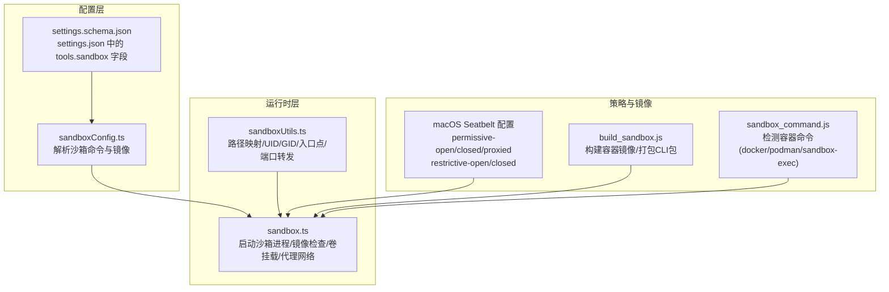
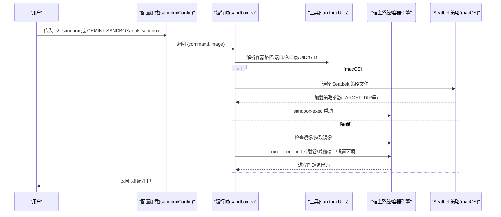
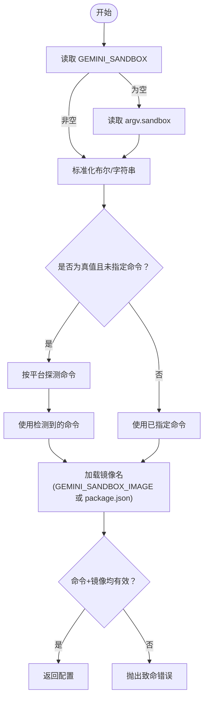
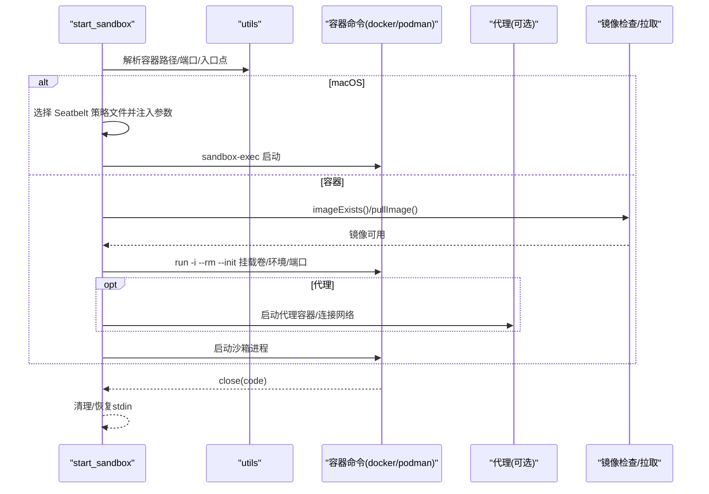
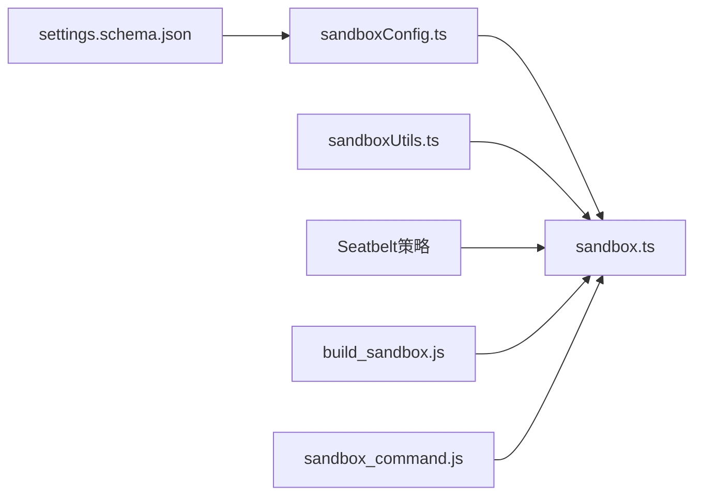

# 沙箱模式

<cite>
**本文引用的文件**
- [docs/cli/sandbox.md](file://docs/cli/sandbox.md)
- [packages/cli/src/utils/sandbox.ts](file://packages/cli/src/utils/sandbox.ts)
- [packages/cli/src/utils/sandboxUtils.ts](file://packages/cli/src/utils/sandboxUtils.ts)
- [packages/cli/src/config/sandboxConfig.ts](file://packages/cli/src/config/sandboxConfig.ts)
- [packages/cli/src/utils/sandbox-macos-permissive-open.sb](file://packages/cli/src/utils/sandbox-macos-permissive-open.sb)
- [packages/cli/src/utils/sandbox-macos-restrictive-closed.sb](file://packages/cli/src/utils/sandbox-macos-restrictive-closed.sb)
- [scripts/build_sandbox.js](file://scripts/build_sandbox.js)
- [scripts/sandbox_command.js](file://scripts/sandbox_command.js)
- [packages/cli/src/utils/sandbox.test.ts](file://packages/cli/src/utils/sandbox.test.ts)
- [packages/cli/src/config/sandboxConfig.test.ts](file://packages/cli/src/config/sandboxConfig.test.ts)
- [schemas/settings.schema.json](file://schemas/settings.schema.json)
</cite>

## 目录
1. [简介](#简介)
2. [项目结构](#项目结构)
3. [核心组件](#核心组件)
4. [架构总览](#架构总览)
5. [详细组件分析](#详细组件分析)
6. [依赖关系分析](#依赖关系分析)
7. [性能考量](#性能考量)
8. [故障排除指南](#故障排除指南)
9. [结论](#结论)
10. [附录](#附录)

## 简介
本篇文档系统性阐述 Gemini CLI 的“沙箱模式”，围绕隔离执行环境的实现机制与使用场景展开，重点说明：
- 如何通过沙箱限制工具执行权限，保护主机系统安全；
- 如何启用与配置沙箱模式，覆盖不同平台与隔离级别；
- 在测试潜在危险命令、执行不受信任代码或进行安全审计时的应用价值；
- 提供跨平台（macOS、Linux）的配置示例与实践建议；
- 评估性能影响并给出常见问题排查方法。

## 项目结构
沙箱模式由“配置加载”“运行时启动”“策略与镜像管理”三部分组成，并辅以 macOS Seatbelt 配置文件与构建脚本支持。

图表来源
- [packages/cli/src/config/sandboxConfig.ts](file://packages/cli/src/config/sandboxConfig.ts#L1-L109)
- [packages/cli/src/utils/sandboxUtils.ts](file://packages/cli/src/utils/sandboxUtils.ts#L1-L151)
- [packages/cli/src/utils/sandbox.ts](file://packages/cli/src/utils/sandbox.ts#L1-L200)
- [packages/cli/src/utils/sandbox-macos-permissive-open.sb](file://packages/cli/src/utils/sandbox-macos-permissive-open.sb#L1-L28)
- [packages/cli/src/utils/sandbox-macos-restrictive-closed.sb](file://packages/cli/src/utils/sandbox-macos-restrictive-closed.sb#L1-L93)
- [scripts/build_sandbox.js](file://scripts/build_sandbox.js#L1-L193)
- [scripts/sandbox_command.js](file://scripts/sandbox_command.js#L1-L200)
- [schemas/settings.schema.json](file://schemas/settings.schema.json#L884-L905)

章节来源
- [packages/cli/src/config/sandboxConfig.ts](file://packages/cli/src/config/sandboxConfig.ts#L1-L109)
- [packages/cli/src/utils/sandbox.ts](file://packages/cli/src/utils/sandbox.ts#L1-L200)
- [packages/cli/src/utils/sandboxUtils.ts](file://packages/cli/src/utils/sandboxUtils.ts#L1-L151)
- [docs/cli/sandbox.md](file://docs/cli/sandbox.md#L1-L172)

## 核心组件
- 沙箱配置加载器：从命令行、环境变量、settings.json 三种来源解析沙箱开关与容器命令；确定镜像名称。
- 沙箱运行时：根据平台选择 sandbox-exec 或容器命令，完成镜像存在性检查、卷挂载、网络与代理、调试端口暴露、用户 UID/GID 映射等。
- 沙箱工具函数：路径转换、端口转发、入口点拼装、默认 UID/GID 行为判定。
- macOS Seatbelt 策略：内置多档策略文件，控制写入范围、网络访问、终端能力等。
- 构建脚本：打包 CLI 包、构建容器镜像、清理中间产物。

章节来源
- [packages/cli/src/config/sandboxConfig.ts](file://packages/cli/src/config/sandboxConfig.ts#L1-L109)
- [packages/cli/src/utils/sandbox.ts](file://packages/cli/src/utils/sandbox.ts#L1-L200)
- [packages/cli/src/utils/sandboxUtils.ts](file://packages/cli/src/utils/sandboxUtils.ts#L1-L151)
- [packages/cli/src/utils/sandbox-macos-permissive-open.sb](file://packages/cli/src/utils/sandbox-macos-permissive-open.sb#L1-L28)
- [packages/cli/src/utils/sandbox-macos-restrictive-closed.sb](file://packages/cli/src/utils/sandbox-macos-restrictive-closed.sb#L1-L93)
- [scripts/build_sandbox.js](file://scripts/build_sandbox.js#L1-L193)

## 架构总览
沙箱模式的调用链路如下：

图表来源
- [packages/cli/src/config/sandboxConfig.ts](file://packages/cli/src/config/sandboxConfig.ts#L96-L109)
- [packages/cli/src/utils/sandbox.ts](file://packages/cli/src/utils/sandbox.ts#L1-L200)
- [packages/cli/src/utils/sandboxUtils.ts](file://packages/cli/src/utils/sandboxUtils.ts#L74-L151)
- [packages/cli/src/utils/sandbox-macos-permissive-open.sb](file://packages/cli/src/utils/sandbox-macos-permissive-open.sb#L1-L28)
- [packages/cli/src/utils/sandbox-macos-restrictive-closed.sb](file://packages/cli/src/utils/sandbox-macos-restrictive-closed.sb#L1-L93)

## 详细组件分析

### 组件A：沙箱配置加载（sandboxConfig）
- 优先级：命令行开关 > 环境变量 > settings.json。
- 命令选择逻辑：
  - macOS：优先 sandbox-exec；
  - 其他平台：若 sandbox=true 则要求显式安装 docker 或 podman；
  - 环境变量 GEMINI_SANDBOX 可直接指定命令。
- 镜像来源：优先 GEMINI_SANDBOX_IMAGE，否则回退到 package.json 中的 sandboxImageUri。
- 错误处理：当 sandbox=true 但未找到可用命令时抛出致命错误。

图表来源
- [packages/cli/src/config/sandboxConfig.ts](file://packages/cli/src/config/sandboxConfig.ts#L36-L109)

章节来源
- [packages/cli/src/config/sandboxConfig.ts](file://packages/cli/src/config/sandboxConfig.ts#L1-L109)
- [packages/cli/src/config/sandboxConfig.test.ts](file://packages/cli/src/config/sandboxConfig.test.ts#L1-L229)
- [schemas/settings.schema.json](file://schemas/settings.schema.json#L884-L905)

### 组件B：沙箱运行时（sandbox.ts）
- macOS Seatbelt：
  - 支持 permissive-open/closed/proxied 与 restrictive-open/closed 多档策略；
  - 通过 -D 注入 TARGET_DIR/TMP_DIR/HOME_DIR/CACHE_DIR 与最多 5 个 INCLUDE_DIR；
  - 支持 GEMINI_SANDBOX_PROXY_COMMAND 与本地 8877 端口代理，自动清理代理进程；
  - DEBUG 模式下注入 --inspect-brk。
- 容器模式（docker/podman）：
  - 镜像存在性检查，缺失则尝试拉取；
  - 自动挂载工作目录、用户设置目录、临时目录、gcloud 配置、ADC 文件；
  - 支持 SANDBOX_MOUNTS 自定义卷（绝对路径、存在性校验、只读默认）；
  - 支持 SANDBOX_FLAGS 注入容器命令参数；
  - 支持 SANDBOX_PORTS 暴露端口，DEBUG 暴露调试端口；
  - 支持 GEMINI_SANDBOX_PROXY_COMMAND 与内部网络隔离，必要时创建代理容器；
  - Linux 下可强制 UID/GID 映射，或基于发行版自动决定默认行为；
  - 通过 entrypoint 在容器内拼装 PATH/PYTHONPATH、source sandbox.bashrc、端口转发 socat、调用 gemini。
- 进程生命周期：
  - 继承 stdio，暂停/恢复 stdin；
  - 捕获错误与退出码，统一反馈。

图表来源
- [packages/cli/src/utils/sandbox.ts](file://packages/cli/src/utils/sandbox.ts#L1-L200)
- [packages/cli/src/utils/sandbox.ts](file://packages/cli/src/utils/sandbox.ts#L200-L688)
- [packages/cli/src/utils/sandboxUtils.ts](file://packages/cli/src/utils/sandboxUtils.ts#L74-L151)

章节来源
- [packages/cli/src/utils/sandbox.ts](file://packages/cli/src/utils/sandbox.ts#L1-L200)
- [packages/cli/src/utils/sandbox.ts](file://packages/cli/src/utils/sandbox.ts#L200-L688)
- [packages/cli/src/utils/sandbox.ts](file://packages/cli/src/utils/sandbox.ts#L689-L823)
- [packages/cli/src/utils/sandbox.test.ts](file://packages/cli/src/utils/sandbox.test.ts#L1-L410)

### 组件C：沙箱工具函数（sandboxUtils）
- 路径映射：Windows 下将盘符路径转换为容器内路径；
- UID/GID 默认策略：在 Debian/Ubuntu 系列默认使用当前用户 UID/GID；
- 入口点组装：根据 PATH/PYTHONPATH 动态扩展容器内环境，source sandbox.bashrc，端口转发；
- 端口暴露：解析 SANDBOX_PORTS 并在容器内建立 socat 转发；
- 镜像名解析：提取镜像短名与标签用于命名容器。

章节来源
- [packages/cli/src/utils/sandboxUtils.ts](file://packages/cli/src/utils/sandboxUtils.ts#L1-L151)

### 组件D：macOS Seatbelt 策略
- permissive-open：默认策略，限制写入范围，允许网络；
- restrictive-closed：严格限制，仅允许读取、特定 sysctl 查询、终端 ioctl、有限写入；
- 通过参数注入 TARGET_DIR/TMP_DIR/CACHE_DIR/HOME 子目录与 INCLUDE_DIR，确保工具可访问工作区与必要的缓存。

章节来源
- [packages/cli/src/utils/sandbox-macos-permissive-open.sb](file://packages/cli/src/utils/sandbox-macos-permissive-open.sb#L1-L28)
- [packages/cli/src/utils/sandbox-macos-restrictive-closed.sb](file://packages/cli/src/utils/sandbox-macos-restrictive-closed.sb#L1-L93)

### 组件E：容器镜像构建（build_sandbox.js）
- 打包 @google/gemini-cli 与 @google/gemini-cli-core；
- 使用 sandbox_command.js 探测容器命令（docker/podman/sandbox-exec），其中 sandbox-exec 场景会提示禁用容器构建；
- 支持自定义 Dockerfile 与镜像名，支持 CI 输出文件；
- 构建后清理无用镜像。

章节来源
- [scripts/build_sandbox.js](file://scripts/build_sandbox.js#L1-L193)
- [scripts/sandbox_command.js](file://scripts/sandbox_command.js#L1-L200)

## 依赖关系分析
- 配置层依赖 settings.json 的 tools.sandbox 字段与环境变量；
- 运行时层依赖工具层提供的路径/端口/入口点/UID/GID；
- macOS 场景依赖 Seatbelt 策略文件；
- 容器场景依赖 docker/podman 与镜像仓库；
- 构建脚本依赖 CLI 包与 package.json 中的 sandboxImageUri。

图表来源
- [packages/cli/src/config/sandboxConfig.ts](file://packages/cli/src/config/sandboxConfig.ts#L96-L109)
- [packages/cli/src/utils/sandbox.ts](file://packages/cli/src/utils/sandbox.ts#L1-L200)
- [packages/cli/src/utils/sandboxUtils.ts](file://packages/cli/src/utils/sandboxUtils.ts#L1-L151)
- [packages/cli/src/utils/sandbox-macos-permissive-open.sb](file://packages/cli/src/utils/sandbox-macos-permissive-open.sb#L1-L28)
- [scripts/build_sandbox.js](file://scripts/build_sandbox.js#L1-L193)
- [scripts/sandbox_command.js](file://scripts/sandbox_command.js#L1-L200)
- [schemas/settings.schema.json](file://schemas/settings.schema.json#L884-L905)

章节来源
- [packages/cli/src/config/sandboxConfig.ts](file://packages/cli/src/config/sandboxConfig.ts#L1-L109)
- [packages/cli/src/utils/sandbox.ts](file://packages/cli/src/utils/sandbox.ts#L1-L200)
- [packages/cli/src/utils/sandboxUtils.ts](file://packages/cli/src/utils/sandboxUtils.ts#L1-L151)
- [docs/cli/sandbox.md](file://docs/cli/sandbox.md#L1-L172)

## 性能考量
- 首次构建镜像：容器构建耗时主要集中在首次打包与依赖安装，后续复用镜像可显著降低等待时间；
- 镜像拉取：网络不稳定时可能多次重试，建议在企业网络中配置镜像加速；
- 卷挂载与 I/O：大量文件挂载会增加 I/O 开销，建议仅挂载必要目录；
- 端口转发：socat 转发少量端口对性能影响有限；
- macOS Seatbelt：策略文件加载开销极小，主要成本在进程启动与沙箱策略生效；
- 调试模式：开启 --inspect-brk 或调试端口暴露会引入额外资源消耗。

[本节为通用指导，不直接分析具体文件]

## 故障排除指南
- “操作不允许”
  - 可能因策略限制写入或访问受限路径；尝试更宽松的 Seatbelt 策略或添加 SANDBOX_MOUNTS；
  - 检查是否需要网络访问，必要时调整策略或代理。
- 缺少命令
  - 确认已安装 docker/podman 或 sandbox-exec；
  - 对于容器模式，确认镜像存在或允许拉取。
- 网络问题
  - 检查策略是否允许网络，或通过 GEMINI_SANDBOX_PROXY_COMMAND 配置代理；
  - 若使用代理容器，确认 8877 端口可达。
- 调试模式
  - 设置 DEBUG=1 观察沙箱内部环境变量与网络状态；
  - 使用 gemini -s -p "run shell command: env | grep SANDBOX" 检查环境；
  - 使用 gemini -s -p "run shell command: mount | grep workspace" 查看挂载点。
- Linux UID/GID
  - 默认 Debian/Ubuntu 系列会自动使用当前用户 UID/GID；如需强制映射或关闭，使用 SANDBOX_SET_UID_GID 控制。

章节来源
- [docs/cli/sandbox.md](file://docs/cli/sandbox.md#L121-L172)
- [packages/cli/src/utils/sandbox.ts](file://packages/cli/src/utils/sandbox.ts#L300-L420)
- [packages/cli/src/utils/sandboxUtils.ts](file://packages/cli/src/utils/sandboxUtils.ts#L38-L72)

## 结论
沙箱模式通过“策略约束 + 容器隔离”的组合，为 Gemini CLI 的工具执行提供了可配置、可审计的安全边界。在 macOS 上可快速启用 Seatbelt 策略，在 Linux 上可通过容器实现更强隔离。通过合理的镜像构建、挂载策略与代理配置，既能满足安全需求，又能兼顾易用性与性能。

[本节为总结性内容，不直接分析具体文件]

## 附录

### 启用与配置步骤（跨平台）
- 命令行开关：gemini -s 或 gemini --sandbox；
- 环境变量：GEMINI_SANDBOX=docker|podman|sandbox-exec；
- 配置文件：settings.json 中 tools.sandbox 设置为 true 或字符串命令；
- macOS Seatbelt 策略：SEATBELT_PROFILE=permissive-open|permissive-closed|permissive-proxied|restrictive-open|restrictive-closed；
- 容器自定义：SANDBOX_FLAGS、SANDBOX_MOUNTS、SANDBOX_PORTS、SANDBOX_ENV；
- Linux 用户映射：SANDBOX_SET_UID_GID=true/false；
- 调试：DEBUG=1，必要时 DEBUG_PORT 指定调试端口。

章节来源
- [docs/cli/sandbox.md](file://docs/cli/sandbox.md#L53-L120)
- [packages/cli/src/config/sandboxConfig.ts](file://packages/cli/src/config/sandboxConfig.ts#L36-L109)
- [packages/cli/src/utils/sandbox.ts](file://packages/cli/src/utils/sandbox.ts#L200-L688)
- [packages/cli/src/utils/sandboxUtils.ts](file://packages/cli/src/utils/sandboxUtils.ts#L74-L151)

### 不同隔离级别的选择建议
- 测试潜在危险命令：优先使用 restrictive-open/closed 策略，最小化写入与网络；
- 执行不受信任代码：容器模式 + 严格 SANDBOX_MOUNTS，避免挂载敏感目录；
- 安全审计：启用 DEBUG 模式，记录环境变量与网络访问；结合代理容器隔离外网；
- 开发联调：permissive-open，便于网络与缓存访问，但仅限受控环境。

章节来源
- [packages/cli/src/utils/sandbox-macos-permissive-open.sb](file://packages/cli/src/utils/sandbox-macos-permissive-open.sb#L1-L28)
- [packages/cli/src/utils/sandbox-macos-restrictive-closed.sb](file://packages/cli/src/utils/sandbox-macos-restrictive-closed.sb#L1-L93)
- [packages/cli/src/utils/sandbox.ts](file://packages/cli/src/utils/sandbox.ts#L300-L420)