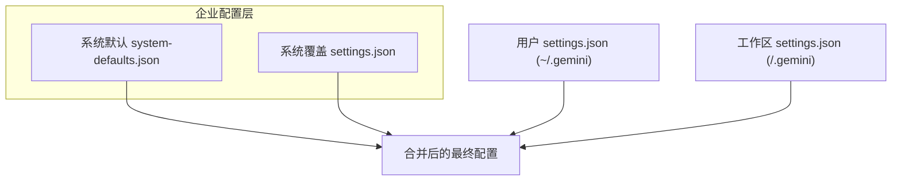
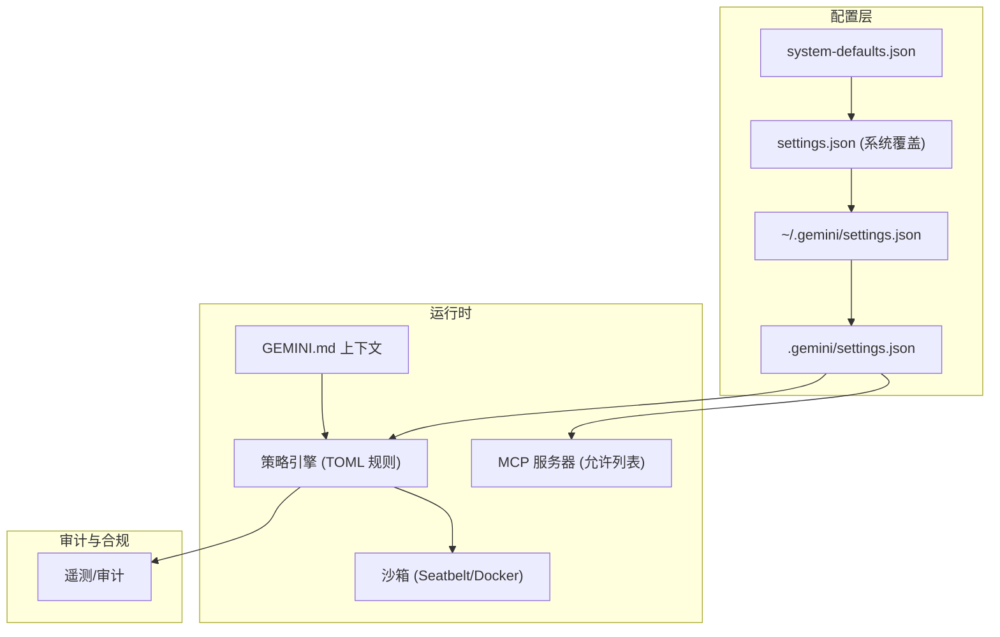
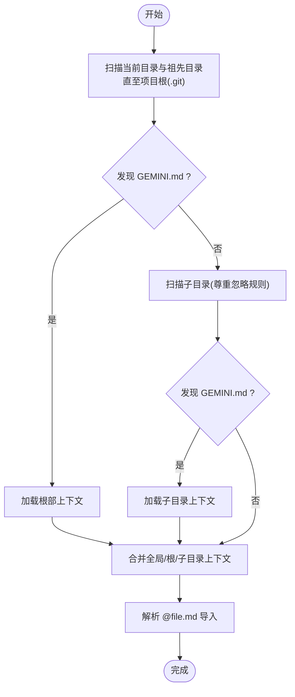
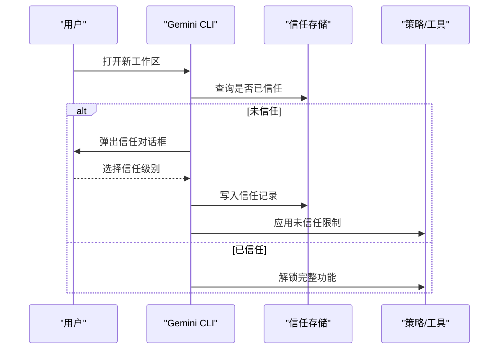
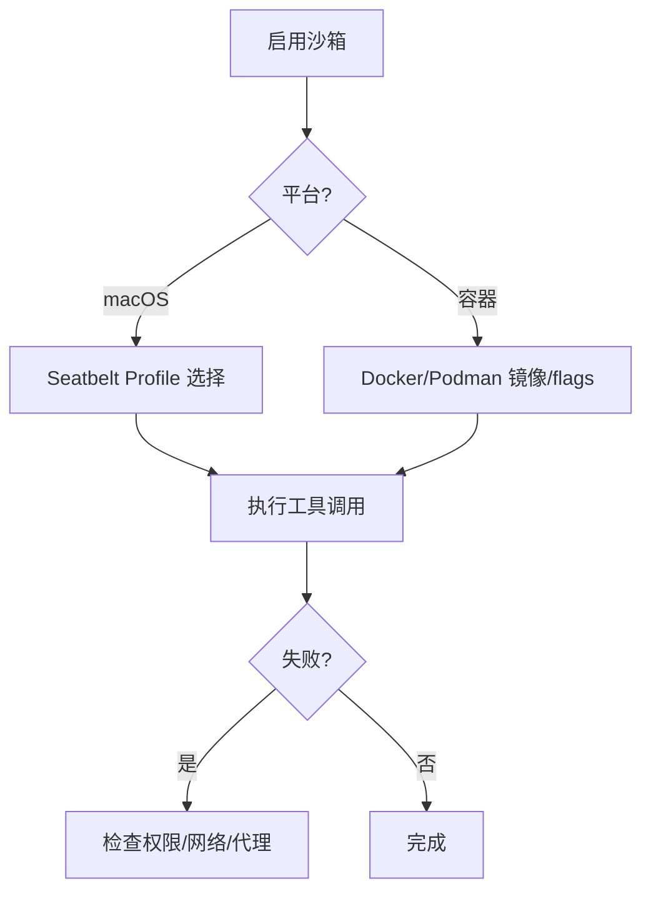
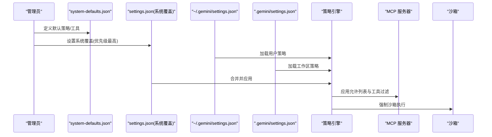
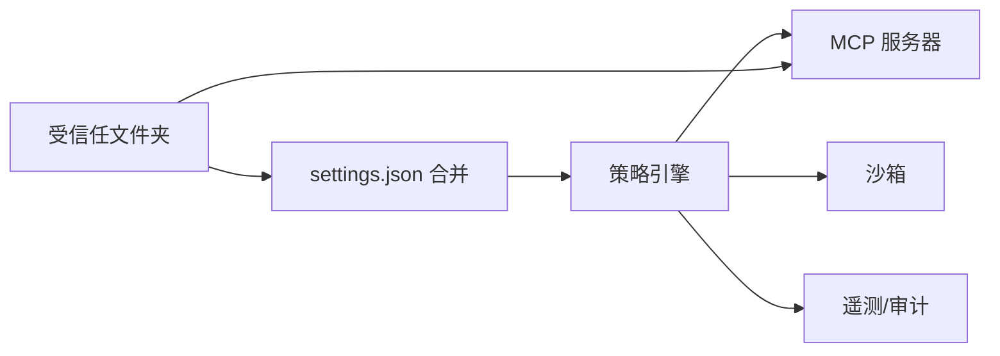

# 高级功能

<cite>
**本文引用的文件**
- [GEMINI.md](file://GEMINI.md)
- [gemini-md 文档](file://docs/cli/gemini-md.md)
- [trusted-folders 文档](file://docs/cli/trusted-folders.md)
- [sandbox 文档](file://docs/cli/sandbox.md)
- [enterprise 文档](file://docs/cli/enterprise.md)
- [policy-engine 文档](file://docs/core/policy-engine.md)
- [gemini-ignore 文档](file://docs/cli/gemini-ignore.md)
- [settings.schema.json](file://schemas/settings.schema.json)
- [toml-loader.ts](file://packages/core/src/policy/toml-loader.ts)
- [policy-engine.ts](file://packages/core/src/policy/policy-engine.ts)
</cite>

## 目录
1. [简介](#简介)
2. [项目结构与定位](#项目结构与定位)
3. [核心组件](#核心组件)
4. [架构总览](#架构总览)
5. [详细组件分析](#详细组件分析)
6. [依赖关系分析](#依赖关系分析)
7. [性能考量](#性能考量)
8. [故障排查指南](#故障排查指南)
9. [结论](#结论)
10. [附录](#附录)

## 简介
本章节面向有经验的用户与企业部署场景，系统性阐述 Gemini CLI 的高级能力：项目特定上下文注入（GEMINI.md）、受信任文件夹安全机制、沙箱隔离执行、以及企业级集中配置与策略执行、审计与合规。文档提供可操作的最佳实践、配置示例与排障建议，帮助在复杂环境中稳定、可控地使用 AI 能力。

## 项目结构与定位
- GEMINI.md 提供通用贡献与开发规范，不直接参与高级功能实现，但为理解整体工程文化提供背景。
- 企业级功能主要由 CLI 文档与核心模块共同支撑：
  - 上下文注入：通过 GEMINI.md 层次化加载与导入机制，为模型提供项目级指令与风格约束。
  - 安全与信任：受信任文件夹机制限制高风险配置与工具加载，保障工作区安全。
  - 沙箱：通过命令行开关、环境变量或设置文件控制工具执行隔离。
  - 企业配置：系统级 settings.json 合并与覆盖，结合策略引擎与 MCP 服务器管控，实现统一策略与审计。

图表来源
- [enterprise 文档](file://docs/cli/enterprise.md#L18-L158)
- [settings.schema.json](file://schemas/settings.schema.json#L1-L120)

章节来源
- [GEMINI.md](file://GEMINI.md#L1-L120)
- [enterprise 文档](file://docs/cli/enterprise.md#L18-L158)

## 核心组件
- 项目特定上下文（GEMINI.md）
  - 支持全局、项目根及祖先目录、子目录多层级加载，支持导入其他 Markdown 文件，便于模块化组织指令。
  - 可通过内存命令查看与刷新上下文内容，便于调试与验证。
- 受信任文件夹（Trusted Folders）
  - 首次进入未信任目录时弹出交互式选择，决定当前目录、父目录或不信任；结果持久化至中央信任文件，避免重复确认。
  - 未信任状态下禁用工作区设置、环境变量、扩展安装、自动接受工具、自动加载记忆、MCP 连接与自定义命令，降低风险。
- 沙箱（Sandbox）
  - 提供 macOS Seatbelt 与容器（Docker/Podman）两种隔离方式；支持命令行开关、环境变量与设置文件三种启用途径；支持自定义 profile 与 flags。
- 企业级配置与策略
  - 系统级 settings.json 合并优先级明确；策略引擎基于 TOML 规则实现细粒度工具执行控制；MCP 服务器定义与允许列表组合确保最小暴露面；可强制沙箱与代理网络策略；支持遥测与审计。

章节来源
- [gemini-md 文档](file://docs/cli/gemini-md.md#L1-L109)
- [trusted-folders 文档](file://docs/cli/trusted-folders.md#L1-L96)
- [sandbox 文档](file://docs/cli/sandbox.md#L1-L172)
- [enterprise 文档](file://docs/cli/enterprise.md#L1-L200)
- [policy-engine 文档](file://docs/core/policy-engine.md#L1-L120)

## 架构总览
下图展示企业级高级功能的交互关系：系统配置作为基线，策略引擎与 MCP 服务器在运行期生效，沙箱贯穿工具执行链路，审计与遥测贯穿全生命周期。

图表来源
- [enterprise 文档](file://docs/cli/enterprise.md#L18-L158)
- [policy-engine 文档](file://docs/core/policy-engine.md#L1-L120)
- [sandbox 文档](file://docs/cli/sandbox.md#L1-L120)
- [gemini-md 文档](file://docs/cli/gemini-md.md#L1-L70)

## 详细组件分析

### 组件A：项目特定上下文（GEMINI.md）
- 层次化加载顺序
  - 全局：用户主目录下的默认上下文文件。
  - 项目根与祖先：从当前工作目录向上扫描到项目根（含 .git 标记）。
  - 子目录：向下扫描子目录，尊重 .gitignore 与 .geminiignore。
- 导入机制
  - 使用 @file.md 语法导入其他 Markdown 文件，支持相对与绝对路径，便于拆分“通用指令”“代码风格”“角色设定”等模块。
- 命令与调试
  - /memory show 查看拼接后上下文；/memory refresh 强制重新扫描；/memory add <text> 追加到全局上下文文件。
- 自定义文件名
  - 在 settings.json 中通过 context.fileName 指定一个或多个文件名列表，实现多上下文文件协同。

图表来源
- [gemini-md 文档](file://docs/cli/gemini-md.md#L11-L71)

章节来源
- [gemini-md 文档](file://docs/cli/gemini-md.md#L1-L109)

### 组件B：受信任文件夹（Trusted Folders）
- 启用方式
  - 在用户 settings.json 中开启安全设置中的 folderTrust.enabled。
- 工作流程
  - 首次进入某目录触发信任对话框：信任当前目录、信任父目录、不信任。
  - 结果写入中央信任文件，后续无需再次确认。
- 未信任的影响
  - 忽略工作区 settings.json、忽略 .env、限制扩展管理、禁用自动接受工具、禁止自动加载记忆、禁止连接 MCP、禁止加载自定义命令。
- 管理方式
  - 在 CLI 内使用权限命令重新选择信任级别；或直接查看中央信任文件。

图表来源
- [trusted-folders 文档](file://docs/cli/trusted-folders.md#L1-L96)

章节来源
- [trusted-folders 文档](file://docs/cli/trusted-folders.md#L1-L96)

### 组件C：沙箱（Sandbox）
- 目标与收益
  - 将潜在危险操作（如 shell 命令、文件修改）与宿主系统隔离，减少误操作与数据泄露风险。
- 方法与配置
  - macOS Seatbelt：内置 profile（permissive-open/closed/proxied、restrictive-open/closed），可通过环境变量切换。
  - 容器（Docker/Podman）：跨平台隔离，支持自定义 flags 与镜像。
  - 启用方式：命令行开关、环境变量、设置文件三者按优先级生效。
- 故障排查
  - 常见问题：权限不足、缺少命令、网络不通；可检查 profile 权限、安装必要工具、校验代理。
  - 调试：使用调试模式与环境变量检查；列出挂载点验证隔离范围。

图表来源
- [sandbox 文档](file://docs/cli/sandbox.md#L1-L172)

章节来源
- [sandbox 文档](file://docs/cli/sandbox.md#L1-L172)

### 组件D：企业级集中配置与策略执行
- 配置合并与优先级
  - 系统默认 → 用户 → 工作区 → 系统覆盖；后者具有最高优先级；数组与对象类型采取合并策略。
  - 系统覆盖文件位置因平台而异，并可通过环境变量覆盖路径。
- 策略引擎（TOML）
  - 规则包含条件（工具名、参数正则、MCP 名称、前缀/正则）、决策（允许/拒绝/询问）、优先级（0–999，结合层级换算）。
  - 支持按审批模式（如 yolo、autoEdit）激活不同规则集；默认策略提供安全基线。
- MCP 服务器管控
  - 通过 allowlist 与服务器定义组合，确保仅允许经审核的服务器与工具；系统级定义优先于用户自定义同名服务器。
- 沙箱与网络
  - 强制沙箱执行工具；可为 MCP 服务器设置代理环境变量，统一出口网络策略。
- 遥测与审计
  - 可配置遥测目标与端点，建议关闭提示内容采集以保护隐私；结合审计日志追踪工具使用情况。

图表来源
- [enterprise 文档](file://docs/cli/enterprise.md#L18-L158)
- [policy-engine 文档](file://docs/core/policy-engine.md#L1-L120)
- [toml-loader.ts](file://packages/core/src/policy/toml-loader.ts#L227-L365)

章节来源
- [enterprise 文档](file://docs/cli/enterprise.md#L1-L200)
- [policy-engine 文档](file://docs/core/policy-engine.md#L1-L120)
- [toml-loader.ts](file://packages/core/src/policy/toml-loader.ts#L227-L365)

## 依赖关系分析
- 配置依赖
  - settings.json 的合并顺序决定最终行为；系统覆盖文件对全局策略具有最终裁决权。
- 策略依赖
  - 策略引擎依赖 TOML 规则文件与审批模式；规则优先级计算包含层级权重与数值权重。
- 安全依赖
  - 受信任文件夹影响工作区 settings.json 与 .env 的加载；沙箱贯穿工具执行链路；MCP 服务器需经允许列表与定义双重约束。
- 可观测性依赖
  - 遥测配置与审计日志依赖系统覆盖与策略引擎的执行结果。

图表来源
- [enterprise 文档](file://docs/cli/enterprise.md#L18-L158)
- [policy-engine 文档](file://docs/core/policy-engine.md#L1-L120)
- [trusted-folders 文档](file://docs/cli/trusted-folders.md#L1-L96)

章节来源
- [enterprise 文档](file://docs/cli/enterprise.md#L1-L200)
- [policy-engine 文档](file://docs/core/policy-engine.md#L1-L120)
- [trusted-folders 文档](file://docs/cli/trusted-folders.md#L1-L96)

## 性能考量
- 上下文加载
  - 多层级扫描与导入会增加 I/O 与文本拼接成本；建议将大型上下文拆分为模块化文件，按需加载。
- 策略引擎
  - 规则数量与正则复杂度会影响匹配性能；建议精简规则、使用前缀/正则替代复杂 argsPattern。
- 沙箱
  - 容器启动存在冷启动开销；建议复用镜像与缓存，合理设置 flags 以减少不必要的挂载与权限检查。
- 遥测
  - 遥测上报频率与批量大小应平衡可观测性与性能；建议在生产环境降低采样率或启用本地聚合。

## 故障排查指南
- 受信任文件夹
  - 症状：工作区设置未生效、无法安装扩展、工具自动接受被禁用。
  - 排查：使用权限命令重新选择信任级别；检查中央信任文件记录。
- 沙箱
  - 症状：“操作不允许”“缺少命令”“网络异常”。
  - 排查：切换更宽松 profile；为容器添加所需命令；检查代理配置；使用调试模式与环境变量输出进行诊断。
- 策略引擎
  - 症状：规则未生效或报错。
  - 排查：核对规则字段（决策、优先级、模式）；检查 TOML 语法与 schema 校验错误；确认审批模式与层级优先级。
- 上下文
  - 症状：上下文缺失或内容不正确。
  - 排查：使用内存命令查看拼接结果；检查导入路径与忽略规则；刷新上下文重新加载。

章节来源
- [trusted-folders 文档](file://docs/cli/trusted-folders.md#L41-L96)
- [sandbox 文档](file://docs/cli/sandbox.md#L120-L172)
- [policy-engine 文档](file://docs/core/policy-engine.md#L120-L249)
- [gemini-md 文档](file://docs/cli/gemini-md.md#L59-L109)

## 结论
通过 GEMINI.md 的层次化上下文注入、受信任文件夹的安全边界、沙箱的执行隔离，以及企业级集中配置与策略引擎的精细化控制，Gemini CLI 能够在复杂环境中提供一致、可控且可审计的 AI 辅助体验。建议在企业中结合系统覆盖文件、MCP 允许列表、沙箱与遥测策略，形成“最小暴露面、最大可追溯性”的安全基线。

## 附录
- 实际用例与配置示例（路径引用）
  - GEMINI.md 多层级与导入
    - 示例参考：[gemini-md 文档示例](file://docs/cli/gemini-md.md#L38-L109)
  - 受信任文件夹启用与影响
    - 启用参考：[trusted-folders 文档启用段落](file://docs/cli/trusted-folders.md#L13-L24)
    - 影响参考：[trusted-folders 文档影响段落](file://docs/cli/trusted-folders.md#L41-L71)
  - 沙箱启用与配置
    - 启用参考：[sandbox 文档启用段落](file://docs/cli/sandbox.md#L72-L80)
    - macOS profile 参考：[sandbox 文档 macOS 段落](file://docs/cli/sandbox.md#L80-L90)
    - 容器 flags 参考：[sandbox 文档自定义 flags](file://docs/cli/sandbox.md#L90-L110)
  - 企业级集中配置与策略
    - 合并与优先级参考：[enterprise 文档合并示例](file://docs/cli/enterprise.md#L36-L137)
    - 策略引擎规则参考：[policy-engine 文档规则 schema](file://docs/core/policy-engine.md#L126-L190)
    - TOML 加载与错误处理参考：[toml-loader.ts](file://packages/core/src/policy/toml-loader.ts#L227-L365)
  - 忽略文件与上下文
    - 忽略规则参考：[gemini-ignore 文档](file://docs/cli/gemini-ignore.md#L1-L72)
  - 配置项总览
    - settings.json 字段参考：[settings.schema.json（节选）](file://schemas/settings.schema.json#L1-L200)