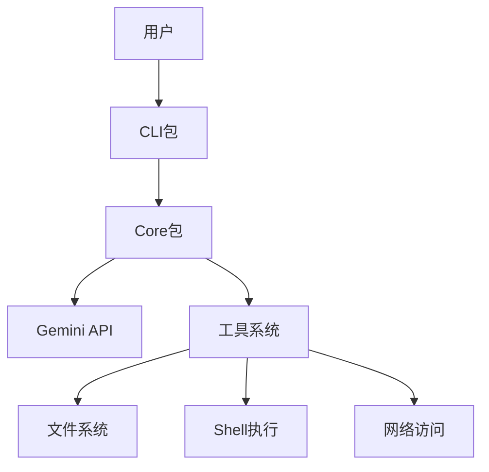

[根目录](../CLAUDE.md) > **docs**

# 文档模块

## 模块职责

文档模块负责为gemini-cli项目提供全面、结构化的用户文档、开发指南、API参考和架构说明。它是项目知识管理的主要载体，确保用户和开发者能够有效理解和使用项目。

## 入口与启动

### 文档入口结构
- **主文档**: `docs/index.md` - 项目概览和导航入口
- **快速开始**: `docs/get-started/index.md` - 新用户入门指南
- **CLI指南**: `docs/cli/index.md` - 命令行界面详细说明
- **架构文档**: `docs/architecture.md` - 系统架构和设计原理

### 文档导航系统
```markdown
# 文档层级结构
docs/
├── index.md                    # 主入口
├── get-started/              # 用户入门
├── cli/                       # CLI功能
├── core/                      # 核心系统
├── tools/                     # 工具使用
├── extensions/                # 扩展开发
├── ide-integration/           # IDE集成
└── assets/                    # 静态资源
```

## 对外接口

### 文档分类体系

#### 1. 用户指南 (get-started/)
- **安装指南**: 详细的安装步骤和环境要求
- **认证配置**: 多种认证方式配置说明
- **快速开始**: 30分钟快速上手教程
- **使用示例**: 实际使用场景和最佳实践
- **Gemini 3**: 最新模型功能介绍和使用

#### 2. CLI功能 (cli/)
- **命令参考**: 所有命令的详细说明
- **配置管理**: 系统配置和个性化设置
- **主题系统**: 界面主题和外观定制
- **高级功能**: 企业级功能和专业特性
- **交互模式**: 非交互式和脚本化使用

#### 3. 核心系统 (core/)
- **架构概述**: 系统设计和组件关系
- **工具API**: 工具系统扩展接口
- **策略引擎**: 安全和权限控制机制
- **内存管理**: Memport内存导入处理器

#### 4. 工具使用 (tools/)
- **文件系统**: 文件操作工具使用指南
- **Shell命令**: 命令行执行和自动化
- **网络功能**: Web获取和搜索工具
- **MCP服务器**: 外部工具集成
- **记忆管理**: 上下文和记忆工具

#### 5. 扩展开发 (extensions/)
- **入门指南**: 扩展开发快速开始
- **开发参考**: API文档和开发规范
- **发布流程**: 扩展发布和分发指南

#### 6. IDE集成 (ide-integration/)
- **集成概述**: 编辑器集成概念
- **VS Code**: VS Code扩展开发
- **协议规范**: IDE伴侣扩展规范

## 关键依赖与配置

### 文档基础设施
- **Markdown**: 基础文档格式，支持Mermaid图表
- **静态资源**: 图片、截图、主题预览等媒体文件
- **交叉引用**: 文档间的链接和引用系统
- **侧边栏配置**: `sidebar.json`导航结构定义

### 文档生成工具
- **自动化脚本**: 使用TypeScript脚本生成文档
- **模式验证**: JSON Schema自动生成
- **快捷键文档**: 动态生成快捷键参考
- **设置文档**: 配置选项自动文档化

### 静态资源管理
- **截图资源**: 应用界面截图和主题预览
- **图表文件**: Mermaid流程图和架构图
- **示例代码**: 代码片段和示例项目

## 核心文档内容

### 1. 用户入门指南

#### 安装和配置
```markdown
# 安装方式
npm install -g @google/gemini-cli

# 认证配置
gemini  # 启动认证流程

# 基本使用
gemini "解释这个文件的功能"
```

#### 快速上手流程
- 环境要求检查
- 安装步骤详解
- 首次认证设置
- 基本命令体验
- 配置优化建议

### 2. CLI功能详解

#### 命令系统
- **基础命令**: 基本交互和操作
- **扩展命令**: `/extensions`扩展管理
- **MCP命令**: `/mcp`服务器管理
- **设置命令**: `/settings`配置管理
- **模型命令**: `/model`模型选择

#### 高级功能
- **检查点功能**: 会话状态保存和恢复
- **沙盒模式**: 安全隔离的执行环境
- **遥测系统**: 使用监控和性能分析
- **企业功能**: 企业级部署和管理

### 3. 架构和设计

#### 系统架构


#### 设计原则
- **模块化**: 清晰的组件分离和接口定义
- **可扩展性**: 支持插件和自定义扩展
- **安全性**: 多层次的安全保护机制
- **性能**: 优化的资源使用和响应速度

### 4. 工具系统文档

#### 内置工具
- **文件操作**: 读取、写入、搜索文件
- **Shell集成**: 执行系统命令和脚本
- **网络工具**: Web获取、搜索、API调用
- **记忆管理**: 上下文保存和恢复

#### MCP集成
- **服务器连接**: 连接外部MCP服务器
- **工具发现**: 自动发现和注册工具
- **配置管理**: 服务器配置和参数设置

### 5. 开发指南

#### 扩展开发
- **项目结构**: 扩展项目组织方式
- **API使用**: 核心API和工具接口
- **测试策略**: 扩展测试和验证
- **发布流程**: 扩展打包和发布

#### 贡献指南
- **开发环境**: 本地开发环境设置
- **代码规范**: 编码标准和最佳实践
- **测试要求**: 测试覆盖和质量保证
- **提交流程**: Pull Request流程和审查

## 文档特色功能

### 1. 交互式图表
- **架构图**: Mermaid格式的系统架构图
- **流程图**: 用户交互和系统流程图
- **组件图**: 模块关系和依赖图表

### 2. 实用示例
- **代码示例**: 实际可用的代码片段
- **配置示例**: 各种场景的配置文件
- **使用场景**: 真实世界的使用案例

### 3. 参考文档
- **命令参考**: 完整的命令参数和选项
- **API文档**: 接口定义和使用方法
- **配置选项**: 所有配置项的详细说明

### 4. 故障排除
- **常见问题**: FAQ和解决方案
- **调试指南**: 问题诊断和调试方法
- **性能优化**: 性能调优建议

## 文档质量保证

### 内容验证
- **准确性检查**: 确保文档与代码同步
- **完整性审查**: 覆盖所有重要功能
- **可用性测试**: 确保文档可读性和实用性

### 自动化维护
- **代码生成**: 从代码自动生成文档
- **链接检查**: 验证内部链接的有效性
- **格式验证**: 确保Markdown格式正确

## 本地化和可访问性

### 多语言支持
- **主要语言**: 英文文档为主
- **国际化准备**: 支持未来多语言扩展
- **文化适配**: 考虑不同用户的使用习惯

### 可访问性
- **屏幕阅读器**: 支持辅助技术
- **键盘导航**: 完整的键盘操作支持
- **语义化标记**: 正确的HTML语义结构

## 文档使用统计

- **总文档数量**: 28个主要文档文件
- **截图资源**: 15个界面截图和主题预览
- **代码示例**: 50+个实际代码示例
- **配置示例**: 30+个配置文件示例

## 变更记录 (Changelog)

**2025-11-24**: 文档模块完整分析完成
- 完成28个文档文件的系统性扫描和分类
- 详细分析6大文档领域：用户指南、CLI功能、核心系统、工具使用、扩展开发、IDE集成
- 理解完整的文档体系架构和内容组织方式
- 识别文档特色功能：交互式图表、实用示例、参考文档、故障排除
- 分析文档质量保证和本地化策略