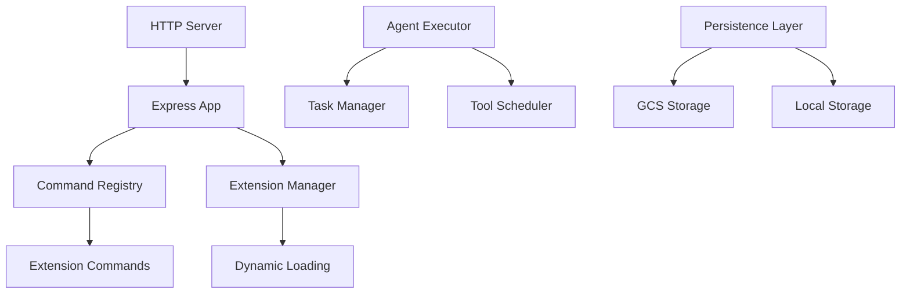

[根目录](../../CLAUDE.md) > [packages](../) > **a2a-server**

# A2A Server 模块文档

## 变更记录 (Changelog)

**2025-11-24**: 首次模块文档生成，基于HTTP服务器和代理系统分析

## 模块职责

A2A (Agent-to-Agent) Server 模块提供 HTTP API 服务，支持代理间的通信和任务执行。主要职责包括：

- 🌐 **HTTP API 服务**: RESTful API 接口和请求处理
- 🤖 **代理执行器**: 任务执行和代理生命周期管理
- 📝 **命令注册**: 代理命令的注册和调用机制
- 🔌 **扩展管理**: 动态加载和管理扩展功能
- 💾 **持久化支持**: 任务状态和数据的持久化存储
- 📊 **日志记录**: 结构化日志和监控支持

## 入口与启动

### 📍 主要入口文件

**服务入口**: `packages/a2a-server/index.ts`
- 简单的导出文件，将主要实现委托给 `src/index.ts`

**核心实现**: `packages/a2a-server/src/index.ts`
- 导出所有公共API和服务
- 模块组织和接口暴露

### 🚀 服务器启动流程



**服务器启动**: `packages/a2a-server/src/http/server.ts`
- Express HTTP 服务器配置
- 中间件和路由设置
- 错误处理和日志记录

## 对外接口

### 🌐 HTTP API 接口

**应用路由**: `packages/a2a-server/src/http/app.ts`
- 主要的 Express 路由定义
- 中间件配置
- 请求预处理和响应后处理

**API 端点**: `packages/a2a-server/src/http/endpoints.ts`
- 具体的 API 端点实现
- 请求验证和响应格式化
- 错误处理

**典型端点结构**:
```typescript
// GET /health
// GET /tasks
// POST /tasks
// GET /tasks/:id
// DELETE /tasks/:id
// POST /extensions/install
// POST /extensions/uninstall
```

### 🤖 代理系统

**代理执行器**: `packages/a2a-server/src/agent/executor.ts`
- 任务执行逻辑
- 代理生命周期管理
- 错误恢复机制

**任务管理**: `packages/a2a-server/src/agent/task.ts`
- 任务状态跟踪
- 任务队列管理
- 结果收集和处理

**命令注册**: `packages/a2a-server/src/commands/command-registry.ts`
- 命令注册和发现
- 参数验证
- 执行结果处理

### 🔌 扩展管理

**扩展管理器**: `packages/a2a-server/src/commands/extensions.ts`
- 动态扩展加载
- 依赖管理
- 生命周期控制

**配置系统**:
- `packages/a2a-server/src/config/config.ts`: 服务配置
- `packages/a2a-server/src/config/extension.ts`: 扩展配置
- `packages/a2a-server/src/config/settings.ts`: 设置管理

## 关键依赖与配置

### 📦 核心依赖

**Web 框架**:
- `express`: 5.1.0+ - HTTP 服务器框架
- `@a2a-js/sdk`: 0.3.2+ - A2A 协议 SDK

**存储**:
- `@google/cloud/storage`: Google Cloud 存储
- `fs-extra`: 文件系统操作扩展

**工具**:
- `tar`: 归档文件处理
- `uuid`: 唯一标识符生成
- `winston`: 日志记录

**内部依赖**:
- `@google/gemini-cli-core`: Gemini CLI 核心功能

### ⚙️ 配置系统

**服务配置**:
```typescript
interface ServerConfig {
  // 服务器端口
  port: number;
  // 主机地址
  host: string;
  // 日志级别
  logLevel: string;
  // 存储配置
  storage: StorageConfig;
}
```

**扩展配置**:
```typescript
interface ExtensionConfig {
  // 扩展名称
  name: string;
  // 版本
  version: string;
  // 入口文件
  entry: string;
  // 依赖关系
  dependencies: string[];
}
```

## 数据模型

### 📊 代理系统数据结构

**任务定义**:
```typescript
interface Task {
  id: string;
  name: string;
  description: string;
  status: TaskStatus;
  parameters: Record<string, any>;
  result?: any;
  error?: string;
  createdAt: Date;
  updatedAt: Date;
}
```

**扩展定义**:
```typescript
interface Extension {
  name: string;
  version: string;
  enabled: boolean;
  commands: Command[];
  config: Record<string, any>;
}
```

**命令定义**:
```typescript
interface Command {
  name: string;
  description: string;
  parameters: z.ZodSchema;
  handler: (params: any) => Promise<any>;
}
```

### 💾 持久化模型

**GCS 存储**: `packages/a2a-server/src/persistence/gcs.ts`
- Google Cloud Storage 集成
- 文件上传和下载
- 大文件处理

**请求存储**: `packages/a2a-server/src/http/requestStorage.ts`
- HTTP 请求数据临时存储
- 会话管理
- 缓存策略

## 测试与质量

### 🧪 测试结构

**单元测试**: 使用 Vitest
- `packages/a2a-server/src/**/*.test.ts`
- 重点测试 HTTP 端点、代理执行、扩展管理

**集成测试**:
- HTTP API 集成测试
- 扩展加载测试
- 持久化层测试

**测试工具**:
- `supertest`: HTTP 测试
- `@types/supertest`: TypeScript 支持

### 📊 质量保证

**API 验证**:
- 请求参数验证
- 响应格式标准化
- 错误码规范化

**性能监控**:
- 请求响应时间
- 资源使用情况
- 错误率统计

## 常见问题 (FAQ)

### ❓ 如何添加新的 API 端点？

在 `packages/a2a-server/src/http/endpoints.ts` 中添加新的路由处理函数，并确保遵循 RESTful 设计原则。

### ❓ 如何注册新的代理命令？

实现 `Command` 接口，通过 `CommandRegistry` 注册命令，确保正确的参数验证和错误处理。

### ❓ 如何配置存储后端？

在配置文件中设置存储参数，支持 Google Cloud Storage 和本地文件系统两种模式。

## 相关文件清单

### 📁 关键目录结构

```
packages/a2a-server/src/
├── agent/                 # 代理系统
│   ├── executor.ts       # 代理执行器
│   └── task.ts           # 任务管理
├── commands/              # 命令系统
│   ├── command-registry.ts # 命令注册
│   └── extensions.ts     # 扩展管理
├── config/               # 配置管理
├── http/                 # HTTP 服务
│   ├── app.ts           # Express 应用
│   ├── endpoints.ts     # API 端点
│   ├── server.ts        # 服务器启动
│   └── requestStorage.ts # 请求存储
├── persistence/          # 持久化层
│   └── gcs.ts           # GCS 存储
└── utils/               # 工具函数
    ├── executor_utils.ts # 执行器工具
    └── logger.ts        # 日志工具
```

### 📄 重要文件

- `index.ts` - 主导出文件
- `http/server.ts` - HTTP 服务器
- `agent/executor.ts` - 代理执行器
- `commands/command-registry.ts` - 命令注册
- `persistence/gcs.ts` - GCS 存储

## 变更记录 (Changelog)

**2025-11-24**:
- 初始化模块文档
- 基于 HTTP 服务器架构分析
- 识别代理系统和扩展管理功能