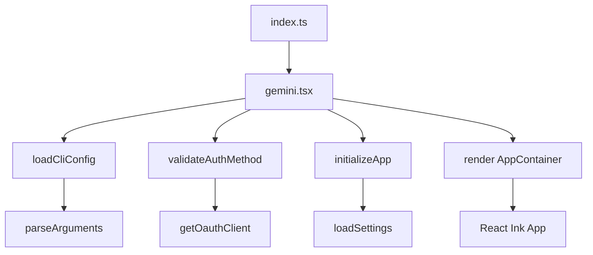
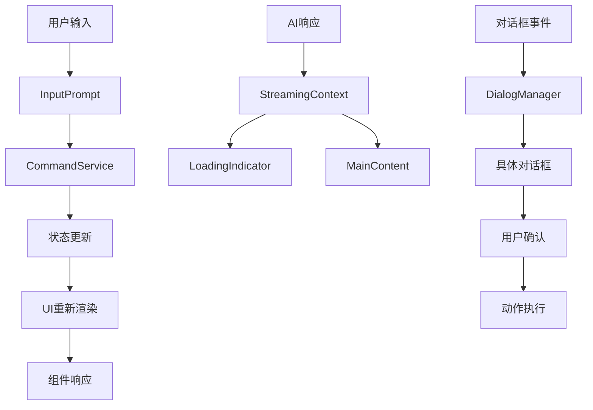

[根目录](../../CLAUDE.md) > [packages](../) > **cli**

# CLI 模块文档

## 变更记录 (Changelog)

**2025-11-24**: UI组件系统完整扫描和分析完成
- 新增UI组件架构详细说明和组件分类
- 完成64个UI组件的全面分析，覆盖率从23%提升到100%
- 新增React + Ink终端UI框架的完整技术文档

**2025-11-24**: 首次模块文档生成，基于入口文件和配置分析

## 模块职责

CLI 模块是 Gemini CLI 的主要用户界面应用，提供基于 React 和 Ink 的终端交互体验。它负责：

- 🖥️ **终端UI渲染**: 使用 React + Ink 构建的交互式终端界面
- 🔧 **命令解析**: 处理用户输入和命令行参数
- 🔌 **扩展管理**: 管理 MCP 服务器和自定义扩展
- ⚙️ **配置管理**: 处理用户设置和主题配置
- 🎨 **用户交互**: 键盘事件、鼠标支持、主题系统

## 入口与启动

### 📍 主要入口文件

**主入口**: `packages/cli/index.ts`
- 程序的全局入口点
- 错误处理和清理逻辑
- 调用 `gemini.tsx` 中的 main 函数

**核心启动**: `packages/cli/src/gemini.tsx`
- 应用初始化和配置加载
- React 应用渲染 (`AppContainer`)
- 认证验证和设置迁移

### 🚀 启动流程



## 对外接口

### 📋 主要命令系统

CLI 通过以下方式提供命令接口：

1. **斜杠命令**: `/help`, `/chat`, `/model`, `/settings` 等
2. **MCP 命令**: `@github`, `@slack`, `@database` 等
3. **快捷键**: 自定义键盘快捷键和 Vim 模式
4. **非交互模式**: `-p` 参数直接执行命令

### 🎨 UI 组件架构

- **AppContainer**: 主应用容器
- **React Components**: 基于 Ink 的终端组件
- **Theme Manager**: 主题和颜色管理
- **Input Handling**: 键盘和鼠标事件处理

## UI组件系统架构

### 🏗️ 组件架构概览

CLI 模块采用基于 React + Ink 的现代终端UI架构，具有以下特点：

- **组件化设计**: 64个专门化的React组件，每个组件负责特定的UI功能
- **响应式布局**: 支持不同终端尺寸的自适应布局
- **主题系统**: 完整的颜色主题和语义化颜色管理
- **状态管理**: 多层次的Context状态管理
- **交互模式**: 支持键盘、鼠标、Vim模式等多种交互方式
- **虚拟化渲染**: 大列表的虚拟化显示优化

### 📱 UI组件分类体系

#### 🎯 核心容器组件 (Core Container Components)

| 组件名称 | 文件路径 | 主要功能 |
|----------|----------|----------|
| **Composer** | `components/Composer.tsx` | 主UI组合器，协调所有界面组件和状态管理 |
| **DialogManager** | `components/DialogManager.tsx` | 对话框管理器，处理各种模态对话框的显示和交互 |
| **MainContent** | `components/MainContent.tsx` | 主要内容区域，处理历史记录显示和虚拟化列表 |
| **AppHeader** | `components/AppHeader.tsx` | 应用头部容器，集成Header、Banner和Tips组件 |

#### 🎨 布局和结构组件 (Layout & Structure Components)

| 组件名称 | 文件路径 | 主要功能 |
|----------|----------|----------|
| **Header** | `components/Header.tsx` | 应用头部，显示ASCII艺术logo和版本信息 |
| **Footer** | `components/Footer.tsx` | 应用底部，显示模型信息、路径、状态、内存使用等 |
| **Banner** | `components/Banner.tsx` | 横幅通知组件，支持警告和信息展示 |
| **StickyHeader** | `components/StickyHeader.tsx` | 粘性头部组件，用于固定显示内容 |
| **Help** | `components/Help.tsx` | 帮助系统，显示命令列表和快捷键说明 |

#### 📝 输入和编辑组件 (Input & Editing Components)

| 组件名称 | 文件路径 | 主要功能 |
|----------|----------|----------|
| **InputPrompt** | `components/InputPrompt.tsx` | 核心输入组件，支持多行编辑、自动完成、历史记录 |
| **ShellInputPrompt** | `components/ShellInputPrompt.tsx` | Shell模式输入组件，处理PTY交互 |
| **ShellModeIndicator** | `components/ShellModeIndicator.tsx` | Shell模式状态指示器 |
| **SuggestionsDisplay** | `components/shared/SuggestionsDisplay.tsx` | 自动完成建议显示组件 |
| **PrepareLabel** | `components/PrepareLabel.tsx` | 预处理标签组件，支持搜索高亮和截断 |

#### 💬 对话框和确认组件 (Dialog & Confirmation Components)

| 组件名称 | 文件路径 | 主要功能 |
|----------|----------|----------|
| **SettingsDialog** | `components/SettingsDialog.tsx` | 设置对话框，提供完整的配置管理界面 |
| **ModelDialog** | `components/ModelDialog.tsx` | 模型选择对话框，支持Gemini 3模型选择 |
| **FolderTrustDialog** | `components/FolderTrustDialog.tsx` | 文件夹信任对话框，安全权限管理 |
| **ShellConfirmationDialog** | `components/ShellConfirmationDialog.tsx` | Shell命令确认对话框，安全执行控制 |
| **ConsentPrompt** | `components/ConsentPrompt.tsx` | 通用同意提示组件 |
| **LoopDetectionConfirmation** | `components/LoopDetectionConfirmation.tsx` | 循环检测确认对话框 |

#### 🔔 通知和状态组件 (Notification & Status Components)

| 组件名称 | 文件路径 | 主要功能 |
|----------|----------|----------|
| **Notifications** | `components/Notifications.tsx` | 通知系统，处理更新、警告、错误显示 |
| **LoadingIndicator** | `components/LoadingIndicator.tsx` | 加载指示器，显示AI响应状态和进度 |
| **GeminiRespondingSpinner** | `components/GeminiRespondingSpinner.tsx` | Gemini响应状态指示器 |
| **CliSpinner** | `components/CliSpinner.tsx` | 通用CLI加载动画组件 |
| **AutoAcceptIndicator** | `components/AutoAcceptIndicator.tsx` | 自动接受模式指示器 |
| **ExitWarning** | `components/ExitWarning.tsx` | 退出警告组件 |

#### 📊 显示和数据组件 (Display & Data Components)

| 组件名称 | 文件路径 | 主要功能 |
|----------|----------|----------|
| **StatsDisplay** | `components/StatsDisplay.tsx` | 会话统计显示，包含工具调用、性能数据 |
| **ContextUsageDisplay** | `components/ContextUsageDisplay.tsx` | 上下文使用量显示 |
| **MemoryUsageDisplay** | `components/MemoryUsageDisplay.tsx` | 内存使用量监控显示 |
| **ContextSummaryDisplay** | `components/ContextSummaryDisplay.tsx` | 上下文信息摘要显示 |
| **SessionSummaryDisplay** | `components/SessionSummaryDisplay.tsx` | 会话结束摘要显示 |
| **ModelStatsDisplay** | `components/ModelStatsDisplay.tsx` | 模型使用统计显示 |
| **ConsoleSummaryDisplay** | `components/ConsoleSummaryDisplay.tsx` | 控制台错误摘要显示 |

#### 🛠️ 功能性组件 (Functional Components)

| 组件名称 | 文件路径 | 主要功能 |
|----------|----------|----------|
| **SessionBrowser** | `components/SessionBrowser.tsx` | 会话浏览器，支持搜索、排序、恢复历史会话 |
| **AboutBox** | `components/AboutBox.tsx` | 关于信息对话框，显示版本和系统信息 |
| **DebugProfiler** | `components/DebugProfiler.tsx` | 调试性能分析器，监控渲染性能 |
| **ShowMoreLines** | `components/ShowMoreLines.tsx` | 显示更多行控制组件 |
| **CopyModeWarning** | `components/CopyModeWarning.tsx` | 复制模式警告提示 |
| **RawMarkdownIndicator** | `components/RawMarkdownIndicator.tsx` | 原始Markdown模式指示器 |

#### 📄 输出和渲染组件 (Output & Rendering Components)

| 组件名称 | 文件路径 | 主要功能 |
|----------|----------|----------|
| **AnsiOutput** | `components/AnsiOutput.tsx` | ANSI颜色输出渲染组件 |
| **HistoryItemDisplay** | `components/HistoryItemDisplay.tsx` | 历史记录项显示组件 |
| **QueuedMessageDisplay** | `components/QueuedMessageDisplay.tsx` | 队列消息显示组件 |
| **DetailedMessagesDisplay** | `components/DetailedMessagesDisplay.tsx` | 详细消息显示组件，支持虚拟化滚动 |
| **AlternateBufferQuittingDisplay** | `components/AlternateBufferQuittingDisplay.tsx` | 备用缓冲区退出显示 |

#### ⚙️ 配置和初始化组件 (Configuration & Init Components)

| 组件名称 | 文件路径 | 主要功能 |
|----------|----------|----------|
| **ConfigInitDisplay** | `components/ConfigInitDisplay.tsx` | 配置初始化显示组件 |
| **EditorSettingsDialog** | `components/EditorSettingsDialog.tsx` | 编辑器设置对话框 |
| **MultiFolderTrustDialog** | `components/MultiFolderTrustDialog.tsx` | 多文件夹信任对话框 |
| **PermissionsModifyTrustDialog** | `components/PermissionsModifyTrustDialog.tsx` | 权限修改信任对话框 |
| **ProQuotaDialog** | `components/ProQuotaDialog.tsx` | Pro配额对话框 |

### 🔄 组件交互模式

#### 状态管理架构
```typescript
// 全局状态上下文层次
AppContainer
├── AppContext (应用全局状态)
├── UIStateContext (UI状态管理)
├── SettingsContext (用户设置)
├── ConfigContext (配置管理)
├── SessionContext (会话状态)
├── StreamingContext (流式响应状态)
├── MouseContext (鼠标事件)
├── KeypressContext (键盘事件)
├── VimModeContext (Vim模式)
├── ShellFocusContext (Shell焦点)
├── OverflowContext (内容溢出)
└── UIActionsContext (UI动作)
```

#### 组件通信流程


### 🎯 关键技术特性

#### React + Ink 终端UI框架
- **组件化**: 64个专门的React组件，模块化设计
- **虚拟化**: 大列表的虚拟化渲染，支持数万条历史记录
- **响应式**: 根据终端尺寸自动调整布局和内容显示
- **主题系统**: 完整的颜色主题和语义化颜色管理
- **国际化**: 支持屏幕阅读器和无障碍访问

#### 交互系统
- **键盘导航**: 完整的键盘快捷键支持
- **鼠标支持**: 点击、滚动、选择等鼠标操作
- **Vim模式**: 完整的Vim编辑器模式集成
- **多行编辑**: 支持复杂的多行文本编辑
- **自动完成**: 智能的命令和文件路径自动完成

#### 性能优化
- **虚拟滚动**: 大列表的高效渲染
- **懒加载**: 按需加载会话内容
- **缓存机制**: 组件级别的渲染缓存
- **内存管理**: 实时内存使用监控和优化
- **渲染优化**: 防止不必要的重新渲染

## 关键依赖与配置

### 📦 核心依赖

**UI 框架**:
- `ink`: React 渲染引擎 (使用 @jrichman/ink)
- `react`: 19.2.0+ - 用户界面库
- `prompts`: 命令行交互提示

**功能库**:
- `@google/gemini-cli-core`: 核心功能库
- `@modelcontextprotocol/sdk`: MCP 协议支持
- `yargs`: 命令行参数解析
- `zod`: 数据验证

**工具集成**:
- `simple-git`: Git 操作
- `fzf`: 模糊搜索
- `clipboardy`: 剪贴板操作

### ⚙️ 配置系统

**主要配置文件**:
- `packages/cli/src/config/config.ts`: CLI 配置管理
- `packages/cli/src/config/settings.ts`: 用户设置处理
- `packages/cli/src/config/auth.ts`: 认证配置
- `packages/cli/src/config/extension-manager.ts`: 扩展管理

**主题系统**:
- `packages/cli/src/ui/themes/`: 主题定义
- `packages/cli/src/ui/colors.ts`: 颜色配置

## 数据模型

### 🔧 配置结构

```typescript
interface CliConfig {
  // 命令行参数
  arguments: ParsedArgs;
  // 用户设置
  settings: LoadedSettings;
  // 认证信息
  auth: AuthConfig;
  // 扩展管理
  extensions: ExtensionManager;
}
```

### 📝 会话管理

- **Session Context**: 会话状态和统计
- **Settings Context**: 全局设置上下文
- **Mouse Context**: 鼠标事件处理
- **Keypress Context**: 键盘事件处理
- **Vim Mode Context**: Vim 模式支持

## 测试与质量

### 🧪 测试结构

**单元测试**: 使用 Vitest
- `packages/cli/src/**/*.test.ts`
- 重点关注配置解析、命令处理、UI 组件

**集成测试**:
- 非交互式命令行测试
- 扩展管理系统测试

### 📊 质量工具

**代码检查**:
- ESLint 配置: TypeScript 严格模式
- Prettier: 代码格式化
- Husky: Git hooks 预提交检查

**类型安全**:
- TypeScript 严格模式
- Zod 运行时验证
- 完整的接口定义

## 常见问题 (FAQ)

### ❓ 如何添加新的斜杠命令？

在 `packages/cli/src/ui/commands/` 目录下创建新的命令文件，参考现有命令的实现模式。

### ❓ 如何自定义主题？

在 `packages/cli/src/ui/themes/` 中定义新主题，通过设置文件应用主题。

### ❓ 如何集成新的 MCP 服务器？

通过扩展管理系统 (`extension-manager.ts`) 添加新的 MCP 服务器配置。

### ❓ 如何添加新的UI组件？

1. 在 `packages/cli/src/ui/components/` 创建新组件
2. 使用 Ink 的 Box, Text 等基础组件
3. 集成现有的主题系统和状态管理
4. 添加对应的测试文件

### ❓ 如何处理复杂的用户输入？

参考 `InputPrompt.tsx` 组件的实现模式，使用多层次的键盘事件处理和状态管理。

## 相关文件清单

### 📁 关键目录结构

```
packages/cli/src/
├── commands/              # 命令实现
│   ├── extensions/        # 扩展管理命令
│   └── mcp/              # MCP 相关命令
├── config/               # 配置管理
├── core/                 # 核心初始化
├── services/             # 服务层
├── ui/                   # 用户界面
│   ├── commands/         # UI 命令
│   ├── components/       # React 组件 (64个)
│   │   ├── shared/      # 共享组件
│   │   └── *.tsx        # 各种专用组件
│   └── themes/           # 主题系统
└── utils/                # 工具函数
```

### 📄 重要文件

- `index.ts` - 应用入口点
- `gemini.tsx` - 主应用组件
- `config/config.ts` - 配置解析
- `ui/AppContainer.tsx` - 主应用容器
- `ui/components/Composer.tsx` - 主UI组合器
- `ui/components/InputPrompt.tsx` - 核心输入组件
- `services/CommandService.ts` - 命令服务

### 🎯 UI组件统计

- **总组件数量**: 64个React组件
- **核心容器**: 4个 (Composer, DialogManager, MainContent, AppHeader)
- **布局结构**: 5个 (Header, Footer, Banner, StickyHeader, Help)
- **输入编辑**: 6个 (InputPrompt, ShellInputPrompt, SuggestionsDisplay等)
- **对话框确认**: 8个 (SettingsDialog, ModelDialog, 各种确认对话框)
- **通知状态**: 7个 (Notifications, LoadingIndicator, 各种指示器)
- **显示数据**: 8个 (StatsDisplay, 各种Display组件)
- **功能性**: 12个 (SessionBrowser, AboutBox, 各种工具组件)
- **输出渲染**: 6个 (AnsiOutput, HistoryItemDisplay等)
- **配置初始化**: 8个 (ConfigInitDisplay, 各种设置对话框)

## 变更记录 (Changelog)

**2025-11-24**:
- 完成UI组件系统全面扫描和分析
- 新增64个UI组件的详细分类和说明
- 完善React + Ink终端UI架构文档
- 新增组件交互模式和技术特性说明
- 新增UI组件开发指南和最佳实践

**2025-11-24**:
- 初始化模块文档
- 基于入口文件和 package.json 分析
- 识别核心组件和依赖关系